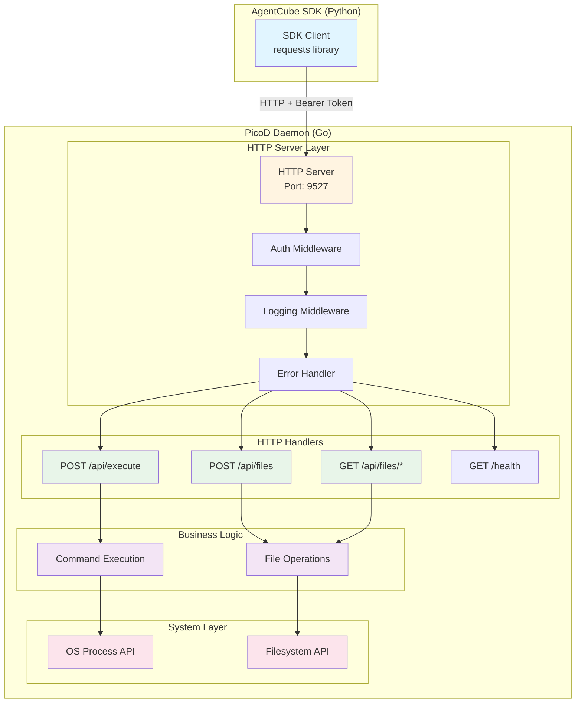
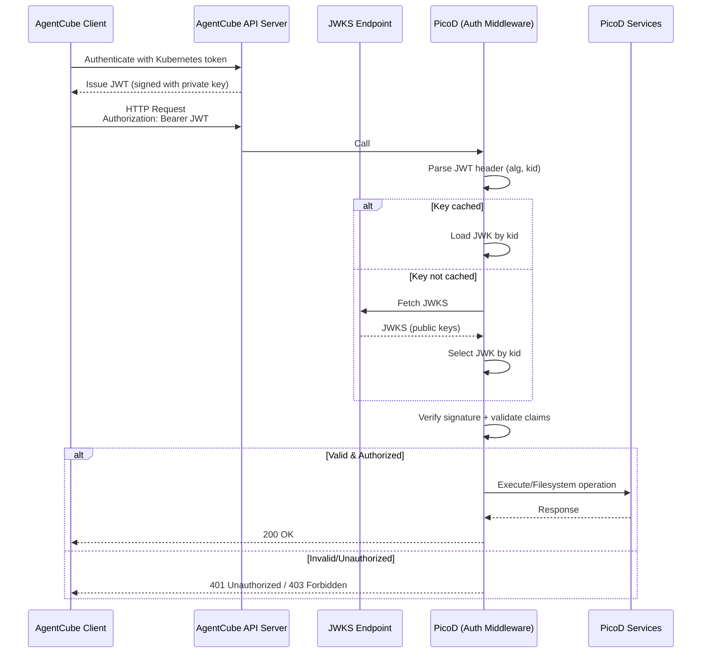
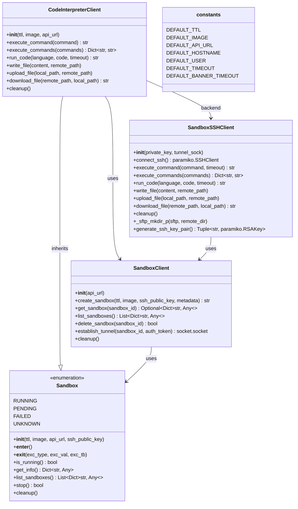
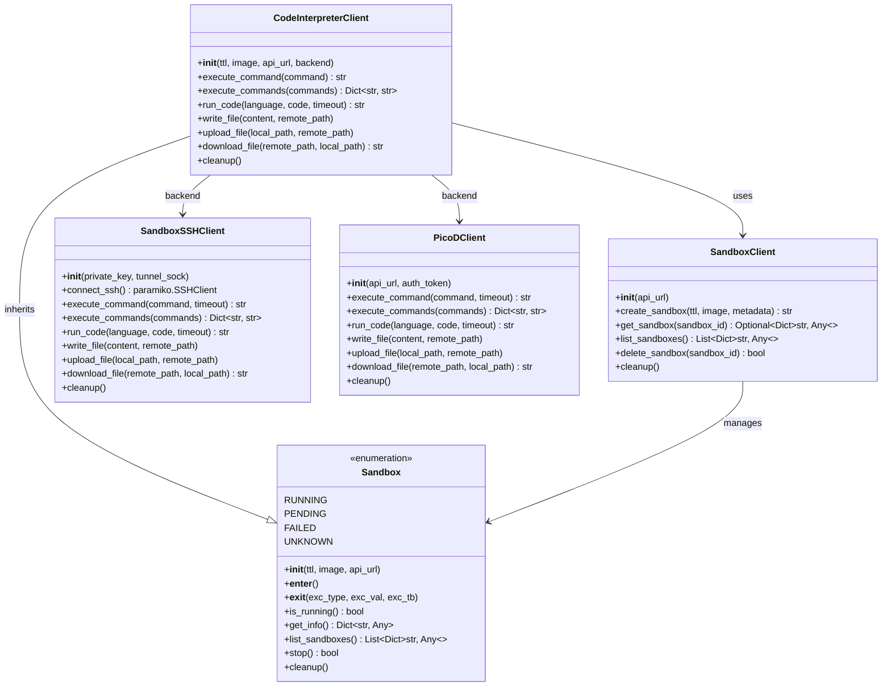

# PicoD Design Document

Author: VanderChen, Layne Peng, WangXu
## Motivation

The current AgentCube sandbox implementation relies on SSH (via `ssh_client.py`) for remote code execution, and file transfer. While SSH offers strong authentication and encryption, it introduces several drawbacks:

- **Protocol Overhead**: SSH requires complex handshakes, key management, and persistent sessions, which add unnecessary weight in lightweight sandbox environments.
- **Limited Flexibility**: The rigid nature of the SSH protocol makes it difficult to implement custom authentication schemes or optimize for specialized workflows.

To overcome these limitations, we propose **PicoD** (Pico Daemon) — a lightweight, RESTful service daemon. PicoD delivers essential sandbox capabilities with minimal overhead, while maintaining security through simple, token-based authentication.

### Design Goals

PicoD is designed as a **stateless daemon** that processes each request independently. Its guiding principles are:

- **Lightweight**: Minimal resource footprint, optimized for containerized sandbox environments.
- **Simple Protocol:** RESTful HTTP APIs with JSON payloads that are easy to integrate, debug, and test
- **Secure**: Token-based authentication, eliminating the need for preconfigured users or SSH keys.
- **No Lifecycle Management**: Sandbox lifecycle (creation, deletion, monitoring) remains the responsibility of the AgentCube control plane. PicoD focuses solely on request handling.
- **Single-Request Processing**: Each API call (Execute, ReadFile, WriteFile) is handled independently, without shared state.
- **No Session Management**: No persistent connections or session tracking; every request is authenticated via metadata.
- **Ephemeral Operation**: PicoD runs only for the lifetime of the sandbox container and does not track lifecycle events.

## Use Case

PicoD enables AI agents to interact with sandboxed environments through the AgentCube SDK. The following example demonstrates a complete workflow using multiple PicoD APIs:

### Machine Learning Workflow

An AI agent performs a complete machine learning workflow - uploading data, installing dependencies, training a model, and downloading results:

```python

from agentcube import CodeInterpreterClient

# Create a CodeInterpreterClient instance
code_interpreter = CodeInterpreterClient(
    ttl=3600,  # Time-to-live in seconds
    image="sandbox:latest",  # Container image to use
)

try:
    # Step 1: Upload dependencies file (WriteFile API)
    code_interpreter.write_file(
        content="pandas\nnumpy\nscikit-learn\nmatplotlib",
        remote_path="/workspace/requirements.txt"
    )

    # Step 2: Install dependencies (Execute API)
    code_interpreter.execute_command("pip install -r /workspace/requirements.txt")

    # Step 3: Upload training data (WriteFile API)
    code_interpreter.upload_file(
        local_path="./data/train.csv",
        remote_path="/workspace/train.csv"
    )

    # Step 4: Train model (Execute API)
    training_code = """
    import pandas as pd
    from sklearn.linear_model import LinearRegression
    import pickle

    df = pd.read_csv('/workspace/train.csv')
    X, y = df[['feature1', 'feature2']], df['target']

    model = LinearRegression().fit(X, y)
    pickle.dump(model, open('/workspace/model.pkl', 'wb'))
    print(f'Model R² score: {model.score(X, y):.4f}')
    """
    result = code_interpreter.run_code("python", training_code)

    print(result)

    # Step 5: Download trained model (ReadFile API)
    code_interpreter.download_file(
        remote_path="/workspace/model.pkl",
        local_path="./models/model.pkl"
    )

    print("Workflow completed successfully!")

finally:
    code_interpreter.stop()

```

**API Calls Flow**:

1. **POST /api/files**: Upload requirements.txt via multipart/form-data or JSON base64
2. **POST /api/execute**: Install dependencies via pip command
3. **POST /api/files**: Upload training data CSV file
4. **POST /api/execute**: Run Python training code that processes data and trains model
5. **GET /api/files/{path}**: Download trained model

All operations use standard HTTP requests with token authentication in Authorization header.

## Design Principles

PicoD follows REST API best practices for simplicity and broad compatibility:

### Architecture Patterns

- **RESTful Design**: Resource-oriented architecture with standard HTTP methods
- **JSON Payloads**: Human-readable request/response format
- **Stateless**: Each request contains all necessary information
- **Token Authentication**: Simple bearer token in Authorization header
- **Standard HTTP Status Codes**: 200 OK, 400 Bad Request, 401 Unauthorized, 404 Not Found, 500 Internal Server Error

### Core API Endpoints

1. **POST /api/execute** - Execute commands
2. **POST /api/files** - Upload files
3. **GET /api/files/{path}** - Download files
4. **GET /health** - Health check endpoint

## PicoD Architecture

### High-Level Design

#### System Architecture
  


  
### Component Breakdown

#### 1. HTTP Server Layer (Go Implementation)

- **Framework**: Gin (lightweight HTTP web framework)
- **Port**: Configurable (default: 9527)
- **Middleware Stack**:
    - Token authentication middleware
    - Request ID generation and logging
    - Error handling and recovery
    - CORS support (optional)
    - Metrics collection

#### 2. REST API Endpoints
  
**Command Execution**

- `POST /api/execute` - Execute command and return output (replaces `execute_command()`)
    - Request: JSON with command, timeout, env vars
    - Response: JSON with stdout, stderr, exit_code

**File Operations**

- `POST /api/files` - Upload file (replaces `write_file()` and `upload_file()`)
    - Request: multipart/form-data or JSON with base64 content
    - Response: JSON with file info
- `GET /api/files/{path}` - Download file (replaces `download_file()`)
    - Request: File path in URL
    - Response: File content with appropriate Content-Type

**Health Check**

- `GET /health` - Server health status
    - Response: JSON with status and uptime

#### 3. Authentication & Authorization

To ensure secure communication between clients and PicoD, we adopt a JWT + JWKS-based authentication model. This approach eliminates the need for pre-injecting keys into warm sandboxes, which is incompatible with the warm pool strategy used by AgentCube.

- **JWT (JSON Web Token):** Clients sign requests with a short-lived JWT using their private key.

- **JWKS (JSON Web Key Set):** PicoD validates the JWT signature against public keys published at a JWKS URL configured in each sandbox.

- **Authorization:** Claims within the JWT (e.g., sub, aud, scope) determine which operations the client is permitted to perform.

This design ensures that pre-heated sandboxes can securely accept requests from dynamically assigned clients without requiring pre-injected secrets.



- **Client Authentication with API Server**
    
    - The client first authenticates against the AgentCube API Server using its Kubernetes token.
    - The API Server issues a JWT signed with the client’s private key.
        
- **Client Request to PicoD**
    
    - The client sends an HTTP request to PicoD with the JWT in the `Authorization: Bearer <JWT>` header.
    - The request targets one of PicoD’s REST endpoints (`/api/execute`, `/api/files`, etc.).
        
- **JWT Parsing in PicoD**
    
    - PicoD extracts the JWT header and claims.
    - The `kid` (Key ID) is used to identify which public key should be used for verification.
        
- **JWKS Lookup**
    
    - PicoD checks its local JWKS cache for the key.
    - If not found, PicoD fetches the JWKS document from the configured JWKS URL.
    - The JWKS contains one or more public keys; PicoD selects the correct one based on `kid`.
        
- **Signature Verification & Claim Validation**
    
    - PicoD verifies the JWT signature using the selected public key.
    - Claims are validated:
        - `iss` must match the trusted API Server.
        - `aud` must equal `picod`.
        - `exp` and `iat` must be valid.
        - `jti` checked for replay protection.
            
- **Authorization Enforcement**
    
    - PicoD inspects claims like `scope` or `roles` to determine allowed operations.
    - Example: `scope=execute` permits `/api/execute`; `scope=files:read` permits file downloads.
    - If claims don’t authorize the request, PicoD returns `403 Forbidden`.
        
- **Response Handling**
    
    - If valid and authorized, PicoD forwards the request to the appropriate service (Filesystem or Process).
    - The service executes the operation and returns a response.
    - PicoD sends back `200 OK` with the result.
    - If invalid, send back `401 Unauthorization` or `403 Forbindden`.

### Alternative Approaches Considered

1. **Pre-injected Key Pairs (Cloud-Init, Environment Variables, Secret Mounts)**
    
    - **Pros:** Simple to implement; widely used in VM/container setups.
    - **Cons:** Incompatible with warm pools (keys must be injected before sandbox assignment); insecure if environment variables are exposed; poor rotation support.
        
2. **Static Shared Secret (Environment Variable or Config File)**
    
    - **Pros:** Very simple; no external dependency.
    - **Cons:** Weak security; no rotation; risk of leakage; unsuitable for multi-tenant environments.
        
3. **Mutual TLS (mTLS)**
    
    - **Pros:** Strong authentication; proven in production.
    - **Cons:** Requires certificate distribution and management; heavy for lightweight sandboxes; not flexible for dynamic warm pools.
#### 4. Core Capabilities
PicoD provides a lightweight REST API that replaces traditional SSH‑based operations with secure, stateless HTTP endpoints. The two primary capabilities are code execution and file transfer, exposed via JSON or multipart requests.

###### Code Execution

- **Endpoint: POST /api/execute**
- **Request Body (JSON):**

 ```json
 {
  "command": "echo 'Hello World'",
  "timeout": 30,
  "working_dir": "/workspace",
  "env": {
    "VAR1": "value1",
    "VAR2": "value2"
  }
}

 ```

 - **Successful Response (JSON):**

```json
 {
  "stdout": "Hello World\n",
  "stderr": "",
  "exit_code": 0,
  "duration": 0.12
}

```
- **Error Response (401/400/500):**
- ref: RFC 7807 Problem Details
```
{
  "type": "https://example.com/errors/unauthorized",
  "title": "Unauthorized",
  "status": 401,
  "detail": "Invalid token"
}

```

##### File Transfer

Provides endpoints for uploading and downloading files.
**Upload File**:

- **Endpoint**: `POST /api/files`
- **Option 1: Multipart Form Data** (recommended for binary files)

```http
POST /api/files HTTP/1.1
Content-Type: multipart/form-data; boundary=----WebKitFormBoundary
Authorization: Bearer <token>

------WebKitFormBoundary
Content-Disposition: form-data; name="path"

/workspace/test.txt
------WebKitFormBoundary
Content-Disposition: form-data; name="file"; filename="test.txt"
Content-Type: text/plain

[file content]
------WebKitFormBoundary
Content-Disposition: form-data; name="mode"

0644
------WebKitFormBoundary--

```

- **Option 2: JSON with Base64** (for text files or API convenience)

```json
{
  "path": "/workspace/test.txt",
  "content": "SGVsbG8gV29ybGQ=",
  "mode": "0644"
}
```
- **Response**:
```json
{
  "path": "/workspace/test.txt",
  "size": 1024,
  "mode": "0644",
  "modified": "2025-11-18T10:30:00Z"
}
```

**Download File**:

- **Endpoint**: `GET /api/files/{path}`
- **Request**:

```http
GET /api/files/workspace/test.txt HTTP/1.1
Authorization: Bearer <token>
```

- **Response**:

```http
HTTP/1.1 200 OK
Content-Type: text/plain
Content-Length: 1024
Content-Disposition: attachment; filename="test.txt"

[file content]
```

For binary files, appropriate `Content-Type` is set (e.g., `application/octet-stream`, `image/png`). `Content-Disposition` is always included to ensure correct filename handling.


## Contribute to AgentCube

### Client Side

The client side of AgentCube provides the SDK and utilities that developers use to interact with sandbox environments. This layer abstracts away the complexity of sandbox lifecycle management, command execution, and file transfer, offering a clean Python interface.

#### Current Structure



#### New Alternative: PicodClient

To modernize the client side and align with PicoD’s RESTful design, we introduce **PicoDClient** as an alternative to `SandboxSSHClient`. While `SandboxSSHClient` uses SSH tunnels and SFTP for communication, `PicoDClient` interacts directly with PicoD via HTTP + JWT authentication.



## Security Considerations

Because PicoD runs as a daemon inside sandbox environments, security is a critical design priority. The following measures ensure that execution and file operations remain isolated, authenticated, and controlled.

**Token Management**  

- JWT required for all requests  
- Short-lived tokens validated via JWKS  
- Stateless, no token storage  

**File Access Control**  

- Path sanitization prevents directory traversal  
- Restricted to sandbox workspace only  
- Enforced by OS-level permissions  

**Logging & Auditing**  

- Centralized logging and audit handled by AgentCube APIServer  

**Update & Patch Management**  

- Minimal attack surface  
- Immutable, signed builds  
- Regular updates recommended

## Future Enhancements

PicoD is designed with extensibility in mind. Potential improvements include:

1. **WebSocket Support**  
   Real-time bidirectional communication for interactive shells and streaming output.

2. **Compression**  
   Gzip or similar compression for efficient file transfers.

3. **Multiplexing**  
   Support for multiple operations over a single connection to reduce overhead.

4. **Metrics Export**  
   Prometheus-compatible endpoint for monitoring and observability.

5. **Plugin System**  
   Custom handlers for domain-specific operations, enabling extensibility.

## Conclusion

PicoD offers a lightweight, efficient alternative to SSH for sandbox management in AgentCube. By using RESTful HTTP APIs with JSON payloads and token-based authentication, it reduces resource overhead while maintaining strong security and functionality. The design emphasizes:

- **Easy Integration**: Works with any HTTP client (curl, Postman, requests, axios, etc.)  
- **Human Readability**: JSON responses are simple to debug and understand  
- **Broad Compatibility**: Accessible from browsers, mobile apps, and all programming languages  

This approach ensures seamless integration with AgentCube infrastructure and provides a clear migration path from the current SSH-based implementation, enabling secure, scalable, and future-ready sandbox operations.
