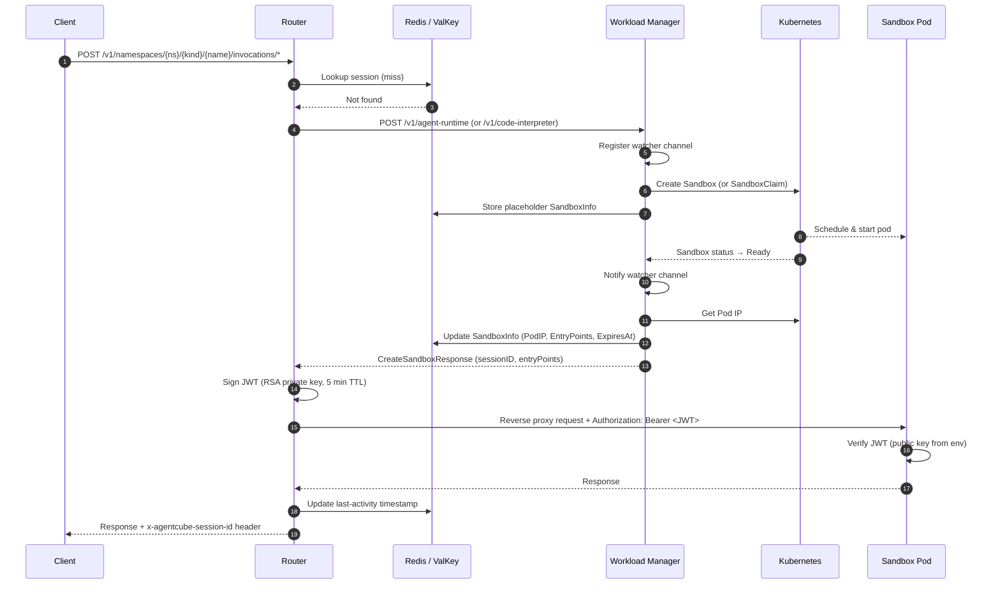
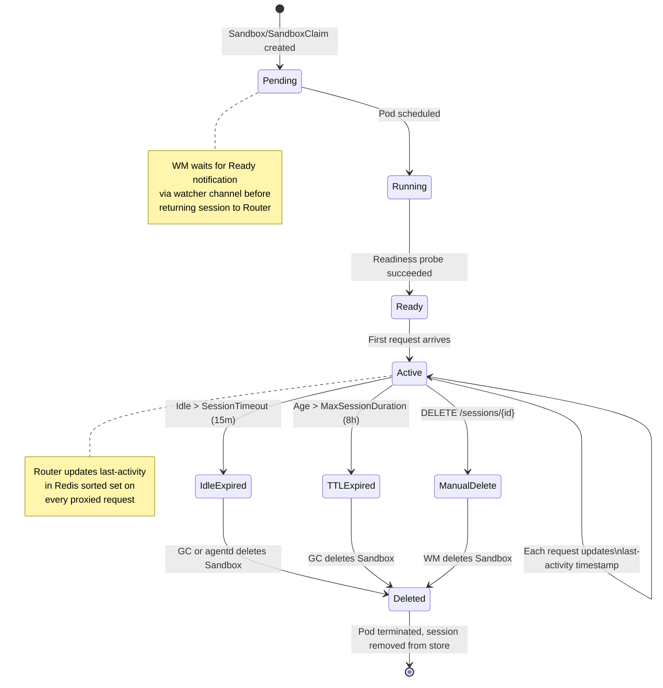

# AgentCube Architecture

> A Kubernetes-native platform that treats AI agents, code interpreters, MCP servers, and other AI tool runtimes (browser-use, computer-use, etc.) as first-class, serverless workloads with microVM-based sandbox isolation.

---

## System Overview

AgentCube provides isolated, on-demand execution environments for a variety of AI workloads—including agent runtimes, code interpreters, MCP servers, browser-use agents, and computer-use agents. Each client session maps 1:1 to a dedicated microVM sandbox pod, ensuring strong isolation for untrusted LLM-generated code and tool invocations. The system supports warm pools for low-latency cold starts and automatic garbage collection for idle or expired sessions.

The platform's two core abstractions—**AgentRuntime** and **CodeInterpreter**—are generic enough to host any tool that runs as an HTTP service inside a sandbox. MCP servers, browser-use tools, and computer-use tools are all deployed as AgentRuntime or CodeInterpreter workloads with appropriate container images and entry-point configurations.

```
┌──────────────────────────────────────────────────────────────────────────┐
│                            CLIENT / SDK                                  │
│          Python SDK, HTTP clients, LangChain, MCP clients                │
├────────────────────────────────┬─────────────────────────────────────────┤
│        DATA PLANE              │         CONTROL PLANE                   │
│  ┌──────────────────────┐      │  ┌──────────────────────────────────┐   │
│  │     Router           │      │  │    Workload Manager              │   │
│  │  • Session manager   │      │  │  • HTTP API (create/delete)      │   │
│  │  • JWT signing       │      │  │  • SandboxReconciler             │   │
│  │  • Reverse proxy     │      │  │  • CodeInterpreterReconciler     │   │
│  │  • Concurrency ctrl  │      │  │  • Garbage Collector (15s poll)  │   │
│  └──────────────────────┘      │  ├──────────────────────────────────┤   │
│                                │  │    agentd                        │   │
│                                │  │  • Session expiry reconciler     │   │
│                                │  └──────────────────────────────────┘   │
├────────────────────────────────┴─────────────────────────────────────────┤
│                         SESSION STORE                                    │
│            Redis / ValKey (session metadata, expiry indices)             │
├──────────────────────────────────────────────────────────────────────────┤
│                        KUBERNETES API                                    │
│  AgentRuntime · CodeInterpreter · Sandbox · SandboxClaim                 │
│  SandboxTemplate · SandboxWarmPool                                       │
├──────────────────────────────────────────────────────────────────────────┤
│                    RUNTIME SANDBOXES (microVM Pods)                      │
│  ┌────────────────┐ ┌──────────────┐ ┌───────────┐ ┌──────────────────┐  │
│  │ Agent Runtime  │ │ Code         │ │ MCP       │ │ Browser-Use /    │  │
│  │ (custom agents)│ │ Interpreter  │ │ Server    │ │ Computer-Use     │  │
│  └────────────────┘ └──────────────┘ └───────────┘ └──────────────────┘  │
│              PicoD daemon — code execution & file transfer               │
└──────────────────────────────────────────────────────────────────────────┘
```

---

## Components

### 1. Router (Data Plane)

**Binary**: `cmd/router` | **Package**: `pkg/router`

The Router is the entry point for all client traffic. It runs a Gin HTTP server that manages sessions, signs JWTs, and reverse-proxies requests to sandbox pods. It is responsible for routing invocations for AgentRuntime, CodeInterpreter, and MCP tool workloads—all of which share the same session and proxy infrastructure.

**Responsibilities**:
- Extract/generate `x-agentcube-session-id` from request headers
- Look up session → sandbox mapping in Redis/ValKey
- On cache miss, call Workload Manager to provision a new sandbox
- Match request paths to sandbox entry points (path-based routing)
- Sign short-lived JWT tokens (RSA, 5 min TTL) for sandbox authentication
- Reverse-proxy requests to sandbox pod IP (agent runtimes, code interpreters, MCP servers, browser-use, etc.)
- Update `last-activity` timestamp in store (before and after proxy)
- Enforce concurrency limits (default: 1000 concurrent requests)

**API Routes**:
```
POST /v1/namespaces/{ns}/agent-runtimes/{name}/invocations/*
POST /v1/namespaces/{ns}/code-interpreters/{name}/invocations/*
```

**Error Responses**: `400` invalid session | `429` concurrency limit | `502` sandbox unreachable | `504` timeout

---

### 2. Workload Manager (Control Plane)

**Binary**: `cmd/workload-manager` | **Package**: `pkg/workloadmanager`

The Workload Manager is the control plane responsible for sandbox lifecycle management, including provisioning, status tracking, and cleanup.

**Sub-components**:

| Component | File | Role |
|-----------|------|------|
| HTTP API Server | `server.go` | Receives create/delete requests from Router |
| Handlers | `handlers.go` | Orchestrates sandbox creation/deletion workflow |
| Workload Builder | `workload_builder.go` | Builds Sandbox/SandboxClaim specs from CRD templates |
| SandboxReconciler | `sandbox_controller.go` | Watches Sandbox Ready state, notifies waiting handlers |
| CodeInterpreterReconciler | `codeinterpreter_controller.go` | Manages SandboxTemplate and SandboxWarmPool resources |
| Garbage Collector | `garbage_collection.go` | Deletes expired and idle sandboxes every 15 seconds |

**API Endpoints**:
```
POST   /v1/agent-runtime                      → Create sandbox for AgentRuntime
POST   /v1/code-interpreter                   → Create sandbox for CodeInterpreter
DELETE /v1/agent-runtime/sessions/{id}         → Delete sandbox by session
DELETE /v1/code-interpreter/sessions/{id}      → Delete sandbox by session
```

**Watcher Pattern**: Handlers register a watcher channel *before* creating the Sandbox CR. The SandboxReconciler sends a notification on that channel when the Sandbox reaches `Ready` state. This eliminates the race condition of missing state transitions.

---

### 3. PicoD (Sandbox Daemon)

**Binary**: `cmd/picod` | **Package**: `pkg/picod`

A lightweight HTTP daemon running inside every sandbox pod. It exposes APIs for command execution and file management.

**API Endpoints**:
```
POST   /api/execute        → Execute command (with timeout, env, working dir)
POST   /api/files          → Upload file (multipart or base64 JSON)
GET    /api/files           → List files in directory
GET    /api/files/{path}    → Download file
GET    /health              → Health check (no auth required)
```

**Security**: JWT verification using RSA public key injected via `PICOD_AUTH_PUBLIC_KEY` env var. Max body: 32 MB (enforced via `MaxBytesReader` middleware). Path traversal protection via `sanitizePath()`.

---

### 4. agentd (Session Expiry Reconciler)

**Binary**: `cmd/agentd` | **Package**: `pkg/agentd`

A standalone controller that provides defense-in-depth session cleanup. It reconciles Sandbox CRDs by reading the `last-activity-time` annotation and deleting sandboxes that have been idle beyond the timeout threshold.

**Difference from Workload Manager GC**: agentd operates purely on Kubernetes annotations (no Redis dependency), providing a fallback cleanup mechanism independent of the session store.

---

### 5. Session Store

**Package**: `pkg/store`

Distributed session state backed by Redis or ValKey. Provides the `Store` interface used by both Router and Workload Manager.

**Data Model**:
```
session:{sessionID}        → SandboxInfo (JSON)     # session metadata
session:expiry             → Sorted Set              # score = ExpiresAt timestamp
session:last_activity      → Sorted Set              # score = LastActivityAt timestamp
```

**Interface**:
```go
type Store interface {
    GetSandboxBySessionID(ctx, sessionID) (*SandboxInfo, error)
    StoreSandbox(ctx, sandbox) error
    UpdateSandbox(ctx, sandbox) error
    DeleteSandboxBySessionID(ctx, sessionID) error
    ListExpiredSandboxes(ctx, before, limit) ([]*SandboxInfo, error)
    ListInactiveSandboxes(ctx, before, limit) ([]*SandboxInfo, error)
    UpdateSessionLastActivity(ctx, sessionID, timestamp) error
}
```

**Provider Selection**: Environment variable `STORE_TYPE` → `"redis"` (default) or `"valkey"`. Singleton pattern via `store.Storage()`.

---

## CRD Hierarchy

AgentCube defines two CRDs and relies on four external CRDs from the `agent-sandbox` project:

| CRD | API Group | Defined By | Purpose |
|-----|-----------|------------|---------|
| **AgentRuntime** | `runtime.agentcube.io/v1alpha1` | AgentCube | User-facing agent runtime definition |
| **CodeInterpreter** | `runtime.agentcube.io/v1alpha1` | AgentCube | Code execution environment with warm pool support |
| **Sandbox** | `agents.x-k8s.io/v1alpha1` | agent-sandbox | Individual sandbox pod instance |
| **SandboxClaim** | `extensions.agents.x-k8s.io/v1alpha1` | agent-sandbox | Request to adopt a pod from warm pool |
| **SandboxTemplate** | `extensions.agents.x-k8s.io/v1alpha1` | agent-sandbox | Reusable pod spec for warm pools |
| **SandboxWarmPool** | `extensions.agents.x-k8s.io/v1alpha1` | agent-sandbox | Pool of pre-created sandbox pods |

**Relationships**:
- `AgentRuntime` → creates `Sandbox` directly
- `CodeInterpreter` with `WarmPoolSize > 0` → `CodeInterpreterReconciler` ensures `SandboxTemplate` + `SandboxWarmPool` → on request, creates `SandboxClaim` (adopted from pool)
- `CodeInterpreter` with `WarmPoolSize = 0` → creates `Sandbox` directly

> **Note**: MCP servers, browser-use agents, and computer-use agents are deployed using the existing `AgentRuntime` or `CodeInterpreter` CRDs. The CRD's `Template` field allows specifying any container image and entry-point path, making the abstraction generic enough to host arbitrary HTTP-based tool runtimes inside a sandbox.

---

## Key Flows

### New Session Request



### Garbage Collection (3 independent paths)

1. **Workload Manager GC (Store-based)**: Polls Redis every 15s → `ListExpiredSandboxes()` and `ListInactiveSandboxes()` → deletes Sandbox/SandboxClaim from K8s + removes session from store
2. **agentd (Annotation-based)**: Reconciles Sandbox CRDs → reads `last-activity-time` annotation → deletes expired sandboxes directly from K8s
3. **Manual**: Client calls `DELETE /v1/{kind}/sessions/{id}` → Router forwards to WM → WM deletes from K8s + store

---

## Sandbox State Machine



**Timeouts**:
- `SessionTimeout`: Idle timeout, default **15 minutes**
- `MaxSessionDuration`: Absolute TTL, default **8 hours**

---

## Warm Pool Mechanism

For `CodeInterpreter` workloads, warm pools eliminate cold-start latency:

1. User sets `WarmPoolSize: N` in `CodeInterpreter` spec
2. `CodeInterpreterReconciler` ensures a `SandboxTemplate` and `SandboxWarmPool` exist
3. The agent-sandbox controller pre-creates `N` pods in standby
4. On client request, WM creates a `SandboxClaim` → pool assigns a ready pod instantly
5. Pool auto-replenishes to maintain `N` ready pods

`AgentRuntime` workloads do **not** support warm pools — each request creates a fresh `Sandbox` CRD.

---

## Authentication Architecture (Plain Auth)

```
Phase 1 — Bootstrap:
  Router generates RSA-2048 key pair → stores in K8s Secret

Phase 2 — Provisioning:
  Workload Manager reads public key from Secret (cached)
  → injects as PICOD_AUTH_PUBLIC_KEY env var into sandbox pods

Phase 3 — Runtime:
  Router signs JWT (5 min TTL) with private key
  → sends in Authorization header with proxied request
  PicoD verifies JWT signature using public key from env
```

**JWT Claims**: `session_id`, `sandbox_id`, `exp` (expiration), `iat` (issued at)

---

## Binary / Entry Point Summary

| Binary | Entry Point | Build Target | Role |
|--------|-------------|--------------|------|
| `workload-manager` | `cmd/workload-manager/main.go` | `make build` | Control plane: API server + reconcilers + GC |
| `router` | `cmd/router/main.go` | `make build-router` | Data plane: session routing + JWT + reverse proxy |
| `picod` | `cmd/picod/main.go` | `make build-picod` | In-sandbox daemon: execute + files |
| `agentd` | `cmd/agentd/main.go` | `make build-agentd` | Standalone session expiry cleanup |

`agentd` and `workload-manager` use `controller-runtime` for Kubernetes integration. Signal handling varies by binary: `router` uses `signal.NotifyContext()`, `agentd` uses `ctrl.SetupSignalHandler()`, `workload-manager` uses `signal.Notify`, `picod` has no signal handling.

---

## Package Dependency Map

```
cmd/router          → pkg/router         → pkg/store, pkg/common/types, pkg/api
cmd/workload-manager → pkg/workloadmanager → pkg/store, pkg/common/types, pkg/api, pkg/apis/runtime/v1alpha1
cmd/picod           → pkg/picod          → (standalone, no internal deps)
cmd/agentd          → pkg/agentd         → pkg/apis/runtime/v1alpha1

pkg/store           → Redis / ValKey client libraries
pkg/apis/runtime    → controller-runtime, agent-sandbox CRD types
client-go/          → Generated typed clients, informers, listers for CRDs
```

---

## Configuration Reference

### Router
| Flag / Env Var | Default | Description |
|----------------|---------|-------------|
| `--port` / `PORT` | `8080` | Listen port |
| `WORKLOAD_MANAGER_ADDR` | (required) | Workload Manager service address (env var) |
| `--max-concurrent-requests` | `1000` | Concurrency limit |
| `--enable-tls` | `false` | Enable TLS termination |
| `--tls-cert` | `""` | TLS certificate file path |
| `--tls-key` | `""` | TLS key file path |
| `--debug` | `false` | Enable debug mode |

### Workload Manager
| Env Var | Default | Description |
|---------|---------|-------------|
| `PORT` | `8080` | Listen port |
| `RUNTIME_CLASS_NAME` | `kuasar-vmm` | Default RuntimeClassName for pods |
| `ENABLE_TLS` | `false` | Enable TLS |
| `ENABLE_AUTH` | `false` | Enable K8s auth forwarding |

### PicoD
| Env Var | Default | Description |
|---------|---------|-------------|
| `PORT` | `8080` | Listen port |
| `WORKSPACE` | current directory | Working directory for file operations |
| `PICOD_AUTH_PUBLIC_KEY` | (injected) | PEM-encoded RSA public key for JWT verification |

### Session Store
| Env Var | Default | Description |
|---------|---------|-------------|
| `STORE_TYPE` | `redis` | `redis` or `valkey` |
| `REDIS_ADDR` / `VALKEY_ADDR` | (required) | Store address |
| `REDIS_PASSWORD` / `VALKEY_PASSWORD` | (required) | Store password |

---

## Supported Workload Types

AgentCube's sandbox infrastructure is workload-agnostic. Any HTTP-based tool that fits in a container can run inside a microVM sandbox. The table below lists the primary workload types the platform is designed to host:

| Workload Type | CRD Used | Description | Example |
|---------------|----------|-------------|--------|
| **Custom AI Agent** | `AgentRuntime` | Conversational or tool-using agent with arbitrary logic, volume mounts, and credential access | LangChain agent, AutoGPT |
| **Code Interpreter** | `CodeInterpreter` | Secure REPL / notebook execution with stricter filesystem controls and optional warm pool | Jupyter kernel, Python REPL |
| **MCP Server** | `AgentRuntime` | Model Context Protocol server exposing tools that LLMs can invoke via the MCP standard | Custom MCP tool server |
| **Browser-Use** | `AgentRuntime` or `CodeInterpreter` | Headless browser automation for web scraping, form filling, and web-based tool invocation | Playwright-based browsing agent |
| **Computer-Use** | `AgentRuntime` | Desktop / OS-level automation agent with GUI interaction capabilities | Anthropic computer-use agent |

All workload types share the same session lifecycle, JWT authentication, garbage collection, and reverse-proxy infrastructure. The `Template` field in each CRD allows specifying the container image, command, ports, and resource limits appropriate for the workload.

---

## Design Principles

1. **1:1 Session-Sandbox Mapping**: Every session gets a dedicated, isolated microVM sandbox — no session multiplexing
2. **Watcher-Before-Create**: Register status watchers before creating resources to avoid race conditions
3. **Defense-in-Depth Cleanup**: Multiple independent GC mechanisms (store-based + annotation-based + manual) ensure no sandbox leaks
4. **Warm Pool Pre-warming**: Optional pre-created pods for latency-sensitive workloads (CodeInterpreter)
5. **Stateless Data Plane**: Router is stateless — all session state lives in Redis/ValKey, enabling horizontal scaling
6. **Minimal Trust Surface**: Short-lived JWTs (5 min), RSA asymmetric signing, no persistent credentials in pods
7. **Workload-Agnostic Sandboxes**: The same CRD abstractions (AgentRuntime, CodeInterpreter) host any HTTP-based tool — MCP servers, browser-use agents, computer-use agents — without requiring new CRDs per tool type
