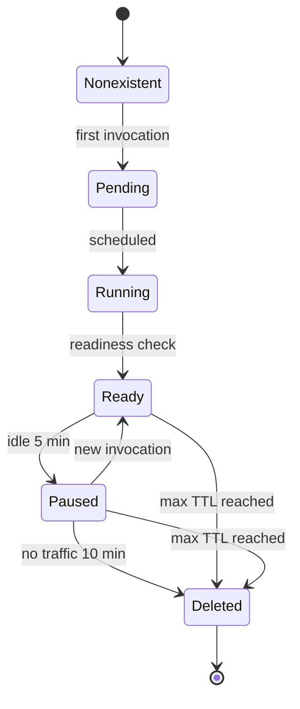

# Architecture Overview

AgentCube is designed with a **Split-Plane Architecture** that separates the heavy lifting of resource management from the high-frequency data traffic of agent interactions.

## The Split-Plane Design

By decoupling the Control Plane from the Data Plane, AgentCube ensures that scheduling overhead doesn't bottleneck agent response times.

### 1. Control Plane (Workload Manager)

The Control Plane is responsible for the "heavy" operations that happen at the beginning and end of an agent's lifecycle:

- **Sandbox Provisioning**: Creating and deleting Kubernetes pods/microVMs.
- **Warm Pool Management**: maintaining a set of "ready-to-go" sandboxes to eliminate cold-start latency.
- **Garbage Collection**: Automatically reclaiming resources from idle or expired sessions.

### 2. Data Plane (AgentCube Router)

The Data Plane handles every interaction between your application and the running agent:

- **Authentication & Authorization**: Validating requests using JWT and session keys.
- **Dynamic Routing**: Mapping incoming requests to the correct sandbox based on Session IDs.
- **Protocol Proxying**: Forwarding HTTP or custom protocol traffic to the agent runtime.

---

## Core Concepts

### Session

A **Session** represents the lifetime of an agent interaction. In AgentCube, every session is isolated to its own sandbox. This ensures that:

- One user's code cannot access another user's data.
- Context is preserved across multiple turns of a conversation.

### Sandbox

A **Sandbox** is the physical execution environment (a secure microVM or hardened container) where the code actually runs. AgentCube maintains a 1:1 mapping between a Session and a Sandbox.

---

## Sandbox Lifecycle

Every sandbox undergoes a structured lifecycle to ensure resource efficiency and fast response times:

1. **Lazy Creation**: Sandboxes are created only when the first request for a session arrives.
2. **Hibernation**: To save resources, sandboxes transition to a `Paused` state after 5 minutes of inactivity.
3. **Auto-Cleanup**: Sandboxes are permanently deleted after 10 minutes of being paused or when their maximum Time-to-Live (TTL) is reached.

---

### AgentRuntime vs. CodeInterpreter

AgentCube provides two primary resource types:

- **AgentRuntime**: Optimized for long-running, conversational agents that may need complex volume mounts or external credentials.
- **CodeInterpreter**: Optimized for short-lived, purely computational tasks (like the "Python Code Interpreter" in ChatGPT). It leverages aggressive warm-pooling for near-instant execution.

---

## Technical Stack

- **Orchestration**: Kubernetes
- **Scheduler**: [Volcano](https://volcano.sh) (for optimized AI workload placement)
- **State Store**: Redis / Valkey (for cross-replica session synchronization)
- **Security**: RSA-2048 Asymmetric Encryption & JWT

---

## Design Proposal

The architectural decisions and motivation behind AgentCube are detailed in the official **[AgentCube Design Proposal](https://github.com/volcano-sh/agentcube/blob/main/docs/design/agentcube-proposal.md)**.
