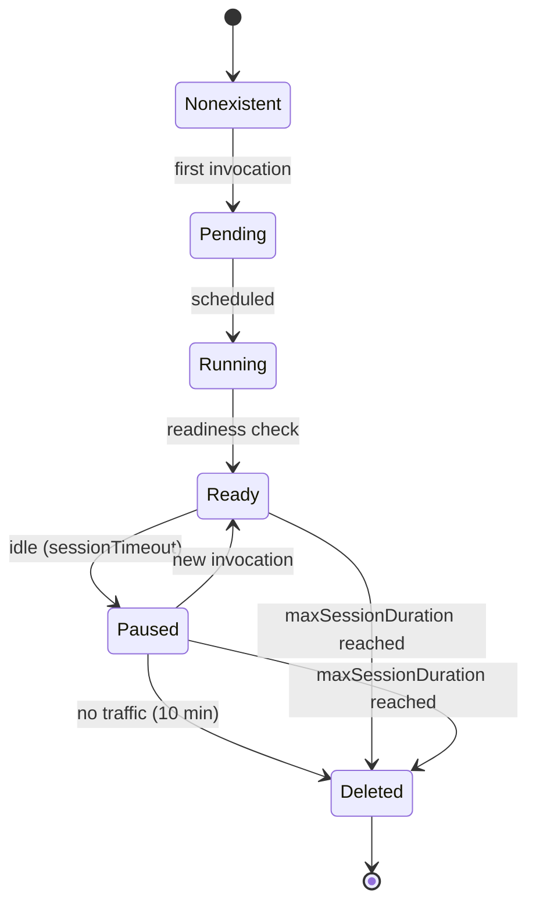
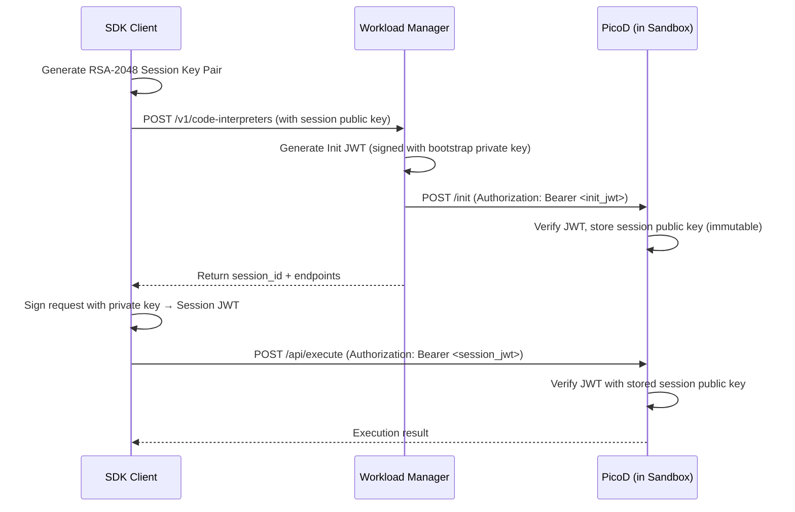

# Features

This page covers what AgentCube actually does under the hood — from how it keeps sandboxes warm to how it signs code execution requests.

---

## 1. Extreme Low-Latency Scheduling

Traditional Kubernetes scheduling introduces cold-start delays that are unacceptable for interactive AI Agents. AgentCube solves this with:

### Warm Pool Management

The `CodeInterpreter` resource supports a `warmPoolSize` field that maintains a configurable number of pre-warmed, ready-to-use sandbox Pods. When a new session is requested, an already-running Pod is adopted immediately — eliminating image-pull, container-startup, and scheduler delays.

```yaml
apiVersion: runtime.agentcube.volcano.sh/v1alpha1
kind: CodeInterpreter
metadata:
  name: my-interpreter
spec:
  warmPoolSize: 3 # Always keep 3 hot sandboxes ready
  template:
    image: ghcr.io/volcano-sh/picod:latest
```

When a warm Pod is consumed, the pool controller automatically creates a replacement to maintain the desired size.

### Volcano Integration

AgentCube integrates with the [Volcano](https://volcano.sh) scheduler (`vc-agent-scheduler`) for optimized AI workload placement. Volcano provides gang scheduling, priority-based placement, and bin-packing capabilities tuned for heterogeneous resources including CPUs and GPUs.

---

## 2. Stateful Lifecycle Management

AI agents are often idle for extended periods but must resume within milliseconds of the next user interaction. AgentCube implements a smart sleep/resume mechanism:

### Sandbox State Machine

Every sandbox transitions through a structured lifecycle:



- **Lazy creation**: Sandboxes are provisioned on the first request for a session (`Nonexistent → Pending`).
- **Hibernation**: After `sessionTimeout` (default: `15m`) of inactivity, a sandbox moves to `Paused`, freeing CPU and memory while keeping the filesystem and network identity intact.
- **Fast resume**: The next request within the pause window restores the sandbox to `Ready` immediately — the session picks up exactly where it left off.
- **Auto-cleanup**: Sandboxes are permanently deleted after 10 minutes in `Paused`, or when `maxSessionDuration` is reached.

### Configurable Timeouts

Both `AgentRuntime` and `CodeInterpreter` resources allow you to control the idle and maximum lifetime:

| Field                | Default | Description                                                 |
| -------------------- | ------- | ----------------------------------------------------------- |
| `sessionTimeout`     | `15m`   | Duration of inactivity before a sandbox is paused           |
| `maxSessionDuration` | `8h`    | Maximum total lifetime of a sandbox, regardless of activity |

---

## 3. High-Density Resource Utilization

AgentCube is designed to pack as many agent sessions as possible on available cluster hardware, without allowing noisy-neighbor interference.

### Strict Resource Limits

Every sandbox runs within CPU and Memory limits enforced at the cgroup/hardware level. You define these limits directly in the CRD template:

```yaml
spec:
  template:
    resources:
      limits:
        cpu: "500m"
        memory: "512Mi"
      requests:
        cpu: "100m"
        memory: "128Mi"
```

### Isolation Levels

AgentCube supports two isolation models:

- **Hardened Containers**: Standard Kubernetes pods with restrictive security contexts (no root, no privilege escalation, read-only root filesystem).
- **MicroVM isolation**: Using Kubernetes RuntimeClass (e.g., Kata Containers, Kuasar) for hardware-level isolation. Configure via `runtimeClassName` in the `CodeInterpreterSandboxTemplate`.

```yaml
spec:
  template:
    runtimeClassName: kata-qemu # hardware-level VM isolation
```

---

## 4. Two First-Class Workload Types

AgentCube provides two distinct Custom Resource Definitions (CRDs) to cover different AI workload patterns:

### AgentRuntime

Optimized for **long-running, conversational AI agents** that:

- Engage in multi-turn conversations.
- May need complex volume mounts or external service credentials.
- Handle diverse, custom protocol traffic on configurable port paths.

```yaml
apiVersion: runtime.agentcube.volcano.sh/v1alpha1
kind: AgentRuntime
metadata:
  name: my-conversational-agent
spec:
  targetPort:
    - pathPrefix: "/"
      port: 8080
      protocol: "HTTP"
  podTemplate:
    spec:
      containers:
        - name: agent
          image: my-registry/my-agent:latest
  sessionTimeout: "30m"
  maxSessionDuration: "4h"
```

### CodeInterpreter

Optimized for **short-lived, purely computational tasks** — think "Python Code Interpreter" — with:

- Stricter security defaults (no hostPath, restricted capabilities).
- Aggressive warm-pooling for near-instant execution.
- Built-in asymmetric authentication via PicoD.

```yaml
apiVersion: runtime.agentcube.volcano.sh/v1alpha1
kind: CodeInterpreter
metadata:
  name: my-code-runner
spec:
  warmPoolSize: 2
  template:
    image: ghcr.io/volcano-sh/picod:latest
  sessionTimeout: "15m"
  maxSessionDuration: "8h"
```

---

## 5. Secure Asymmetric Code Signing

Security is a first-class concern. AgentCube ensures that **only the requesting client** can execute code in **their** sandbox using a split-key model:

### How It Works



1. **Client-Side Key Generation**: The SDK generates a temporary RSA-2048 key pair locally.
2. **Public Key Injection**: The public key is sent to the Workload Manager, which injects it into the sandbox via a one-time `/init` call.
3. **Immutable Binding**: Once set, the public key is made immutable inside the sandbox (via `chattr +i` on Linux). No one — not even a compromised Router — can change it.
4. **Per-Request Signing**: Every API call (execute, file upload/download) is signed by the client's private key as a short-lived JWT.
5. **On-Box Verification**: PicoD validates every request signature using the stored public key.

:::info
The **private key never leaves your client machine**. Even if the AgentCube Router or Workload Manager is compromised, an attacker cannot execute code in your running sandbox.
:::

---

## 6. Command-Style API

AgentCube exposes a synchronous, imperative API experience through the Router, giving a "command" feel rather than traditional asynchronous Kubernetes interactions.

### Router Invocation Endpoints

Clients interact with agents through stable, URL-addressable endpoints:

```
POST /v1/namespaces/{namespace}/agent-runtimes/{name}/invocations/*path
POST /v1/namespaces/{namespace}/code-interpreters/{name}/invocations/*path
```

- **New session**: Omit the `x-agentcube-session-id` header — a sandbox is automatically provisioned and the new session ID is returned in the response header.
- **Existing session**: Include `x-agentcube-session-id` to resume your running session.

---

## 7. Pluggable Authentication

AgentCube supports multiple authentication modes to fit your organization's security posture:

### PicoD Authentication (Default)

The default mode for `CodeInterpreter`, using the asymmetric RSA split-key model described above.

### External JWT / OIDC Authentication

The Router can validate externally issued JWT tokens from any OIDC-compliant provider (Keycloak, Okta, Auth0, Dex). Configure via Helm values:

```yaml
router:
  jwt:
    issuerUrl: "http://keycloak.agentcube-system.svc:8080/realms/agentcube"
    audience: "agentcube-api"
    roleClaim: "realm_access.roles"
    requiredRole: "sandbox:invoke"
```

### Internal mTLS with SPIRE

For zero-trust deployments, AgentCube supports [SPIRE](https://spiffe.io/docs/latest/spire-about/spire-concepts/) for automatic workload identity and mTLS between all components. Enable via:

```yaml
spire:
  enabled: true
  trustDomain: "cluster.local"
```

---

## 8. High Availability

The AgentCube Router is designed as a **stateless** component. All session metadata is persisted in Redis (or Valkey), enabling:

- Multiple Router replicas to serve traffic without coordination.
- Transparent failover if a Router pod is restarted.
- Horizontal scaling to handle high request volumes.
