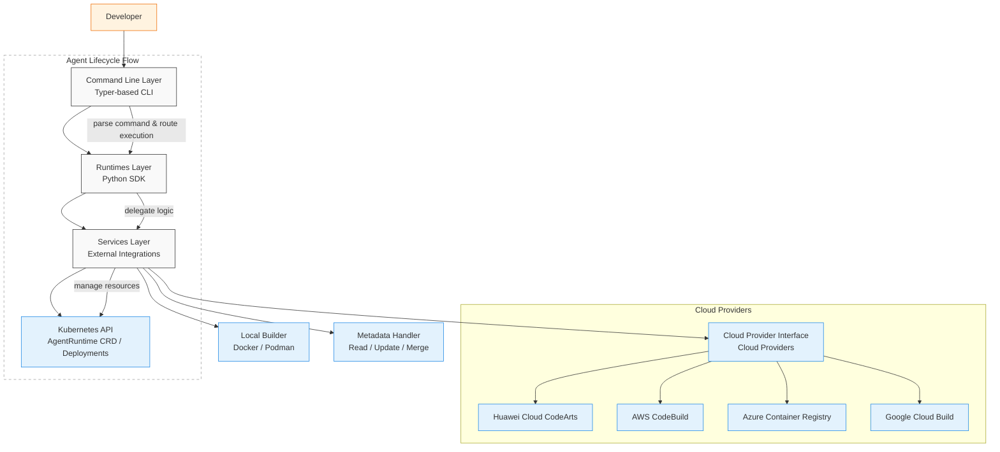
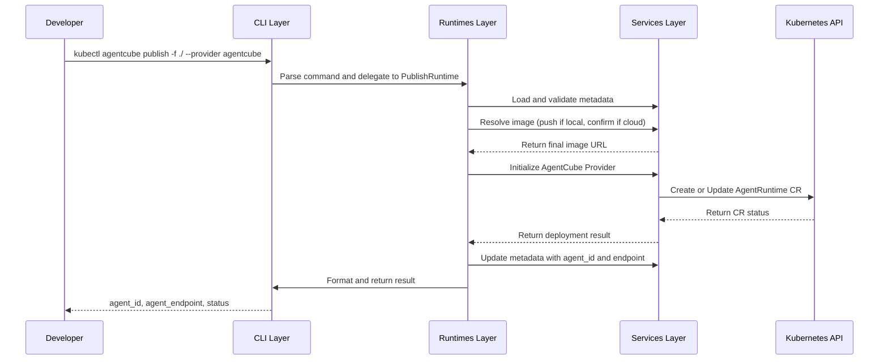

# AgentCube CLI Design
Author: Layne Peng
# Motivation
Modern AI agent frameworks are increasingly complex, often involving a multi-stage development lifecycle—from initial coding and local testing to cloud deployment and public publishing. This complexity introduces friction for developers who must manage configurations, dependencies, runtime environments, and deployment targets across heterogeneous platforms.

To streamline this process, we propose a dedicated Command Line Interface (CLI) that provides:
- Lightweight orchestration of agent development workflow, including initialization, packaging, building, testing, and publishing;
- Extensible architecture supporting local environments, Kubernetes clusters, and multi-cloud build and deployment targets;
- Python SDK bindings for programmatic access to CLI functionality, enabling integration into CI workflows and continuous development pipelines.

This CLI will serve as a foundational tool enabling:
- Rapid prototyping and local iteration of agents
- Seamless transitions from development to staging and production environments powered by AgentCube
- Native integration with Kubernetes clusters and cloud services for scalable deployment
- Version control and reproducibility of agent configurations and runtime environments

By abstracting away operational overhead and providing a consistent interface, the CLI lowers the barrier to entry for agent development on AgentCube. It empowers developers to focus on innovation rather than infrastructure, fosters best practices, and accelerates collaboration across the open-source community.
## Use Case 1: Kickstart Agent Development and Publish to AgentCube
A developer wants to create a new agent from scratch and publish it to AgentCube for public access or team collaboration. The CLI supports agents built with any framework, offering a standardized workflow for packaging, building, and publishing. 

After completing development, the CLI enables the following steps:
1. `kubectl agentcube pack -f ./` Packages the agent source code and runtime metadata into a structured workspace directory, preparing it for image creation
2. `kubectl agentcube build -f ./` Builds a container image from the workspace, compatible with AgentCube’s Kubernetes-based runtime environment
3. `kubectl agentcube publish -f ./` Publishes the built agent image to AgentCube, making it available for invocation, sharing, and collaboration

## Use Case 2: Check Published Agent Status
After publishing an agent to AgentCube, a developer may want to verify that the agent is fully registered and ready for use. The CLI provides a simple status check command:

```kubectl agentcube status -f ./```

This command queries the provider (AgentCube or Kubernetes) for the current state of the agent associated with the workspace. It returns key information such as the agent ID, endpoint URL, latest version, and log reference. This helps ensure the agent is correctly deployed and ready for invocation.

## Use Case 3: Invoke published Agent
After publishing an agent to AgentCube, a developer may want to invoke it for testing purposes or integrate it into other system components. The CLI provides a simple and consistent interface to trigger agent execution using the local workspace directory and a structured payload:

```kubectl agentcube invoke -f ./ --payload '{"prompt": "what is the weather today in Shanghai?"}'```

# Scope
In Scope:
* support agent packaging and workspace generation
* support agent image build for Kubernetes runtime
* support agent publishing to AgentCube
* support agent invocation via CLI
* support Python SDK for CI/CD integration
# Design Detail
### 1. Pack, Build and Publish 
**Step 0:** The developer creates the agent application using any preferred framework and defines the required runtime metadata. The agent must expose an HTTP interface to support standardized invocation. The metadata should include:
1. **Agent name** – unique identifier for the agent
2. **Entrypoint command** – entrypoint command to launch the agent
3. **Port** – network port exposed by the agent
4. **Endpoint URI** – HTTP endpoint for agent invocation
5. **Region to deploy** – required only when publishing to public cloud targets
6. **observability_enabled** – flag to enable metrics and logging integration
7. **build_mode** – specifies build context: `local` or `cloud`

**Step 1:** The developer runs the `kubectl agentcube pack -f ./` command to package the agent application into a standardized workspace. This workspace includes the source code and runtime metadata required for building and deployment. 

The `kubectl agentcube pack` command supports options that mirror the fields defined in the metadata configuration file. Its behavior follows these rules:
- If no options are provided beyond `-f`, the CLI expects a valid metadata config file to be present in the specified workspace directory
- Any options explicitly passed via the `kubectl agentcube pack` command take precedence over values defined in the metadata config file.
- The CLI can validate and update the metadata config file based on the provided options, ensuring consistency and completeness.

**Step 1.1** Validate Source Structure and Metadata Configuration
The `kubectl agentcube pack` command is processed by the **pack** service, which performs a series of validation checks to ensure the agent workspace is correctly structured and compatible with downstream build and deployment steps.

The validation includes:
1. **Language Compatibility**
	 Verifies that the development language matches the value specified in the metadata configuration file.
	- For **Python**: supports either source code or pre-built `.whl` (wheel) packages
	- For **Java**: supports `.jar` or `.war` artifacts
2. **Dependency Definition** 
	 Ensures that all required dependencies are properly declared and available for packaging.
    - For **Python**: checks for a valid `requirements.txt` file
    - For **Java**: checks for a valid `pom.xml` file

**Step 1.2** Build Mode Selection
Based on the `build_mode` specified in the metadata configuration file, the CLI supports two build strategies: **local** and **cloud**. Each mode determines how the agent image is constructed and where the build process is executed.

**Step 1.2.1** Local mode
In local mode, the CLI generates a Dockerfile tailored to the agent’s runtime requirements. This process includes:
- Downloading a predefined Dockerfile template based on the agent’s language and framework
- Replacing template placeholders with values from the metadata configuration file (e.g., entrypoint command, exposed port)

**Step 1.2.2** Cloud mode
In cloud mode, the CLI prepares the agent workspace for remote build services such as **Huawei Cloud CodeArts** or other supported platforms. This includes:
- Packaging the workspace and metadata into a cloud-compatible format
- Setting up required roles, permissions, and credentials for the cloud build service

**Step 2:**  After packaging the agent workspace, the developer initiates the build process using: 

```kubectl agentcube build -f ./```

This command triggers the image build based on the workspace contents and metadata configuration. The CLI supports an optional `-p` flag to specify a **custom proxy**, which is particularly useful for environments with restricted network access or internal mirrors.
- For **Python agents**, the proxy is applied to `pip` commands during dependency installation   
- For **Java agents**, the proxy is applied to `mvn` (Maven) commands during build resolution

**Step 2.1** Build Service Validation
The `kubectl agentcube build` command is handled by the **Build** service, which performs a series of validation checks to ensure the build process can succeed in both **local** and **cloud** modes.

Key validations include:
- **Workspace integrity**: Verifies that the agent workspace is correctly structured and includes all required files (e.g., source code, metadata, dependencies).
- **Metadata consistency**: Confirms that runtime metadata matches the expected format and values needed for image generation.
- **Build mode compatibility**:
    - For **local builds**, the system checks whether Docker or Podman is installed and accessible on the developer’s machine.    
    - For **cloud builds**, the service validates credentials, roles, and connectivity to the configured cloud build provider.

**Step 2.1.1** Local Build
In local build mode, the CLI invokes the local container runtime (Docker or Podman) to build the agent image. The image is tagged using the agent name defined in the metadata configuration file, ensuring traceability and consistency.

**Step 2.1.2** Cloud Build
Currently, cloud build mode is a placeholder and falls back to local build logic in the MVP. Future versions will support remote build services.

**Step 3** Once the agent image is successfully built, the developer can publish it using:

```kubectl agentcube publish -f ./ --provider agentcube```

This command initiates the publishing process. Depending on the `--provider` (default: `agentcube`), it either deploys an **AgentRuntime CR** to a Kubernetes cluster (for AgentCube) or creates standard **Deployment and Service** resources (for standard K8s).

The process generally involves:

**Step 3.1**: Update Metadata & Resolve Image
The CLI reads the metadata, resolves the final image URL (pushing to a registry if in local build mode), and updates the metadata file.

- **Image Repository URL and Credentials**
    - **Local build mode**: The developer must provide the image repository URL (`--image-url`) and credentials (`--image-username`, `--image-password`) if pushing is required.
    - **Cloud build mode**: The image is assumed to be in the cloud repository.

**Step 3.2**: Tag and Push the Agent Image (Local Mode)
- The CLI logs into the specified image repository using provided credentials.
- The image is pushed to the repository.
- The final image URL is recorded.

**Step 3.3** Deploy to Kubernetes
The CLI interacts with the Kubernetes cluster defined in the local kubeconfig:
- **Provider: agentcube**: Deploys or updates an `AgentRuntime` Custom Resource (CR). This relies on the AgentCube operator being present in the cluster.
- **Provider: k8s**: Deploys a standard Kubernetes `Deployment` and `Service` (NodePort).

**Step 3.4** Await Deployment Status
The CLI monitors the deployment status (readiness probes, pod status) until the agent is ready or a timeout occurs.

**Step 3.5** Merge Result into Metadata Configuration
The CLI updates `agent_metadata.yaml` with the deployment results:
- **agent_id** – The deployment name or CR name.
- **agent_endpoint** – The service URL or endpoint.
- **k8s_deployment** – Details about the Kubernetes resources. 
### Check Status
In the same workspace, developers can use the following command to check the status of a published agent: 

```kubectl agentcube status```

This command queries the provider (Kubernetes) for the current state of the agent associated with the workspace. The output includes:
- **Agent ID** – Unique identifier (e.g., K8s deployment name)
- **Agent Name** – Human-readable name of the agent
- **Agent Endpoint** – URL for invoking the agent
- **Status** – Current status (e.g., deployed, ready, error)
- **Version** – The published version
- **Kubernetes Details** – Namespace, NodePort, replicas, and pod status

This status check helps developers verify successful publication, retrieve invocation details, and confirm versioning—all without leaving the local development environment.
### Invocation
Developers can invoke a published agent either from the current workspace or by specifying the workspace directory using the `-f` option. The invocation is performed via:

```kubectl agentcube invoke --payload {"prompt": "What is the weather today in Shanghai?"}```

This command initiates an HTTP POST request to the agent’s endpoint. The payload structure depends on the agent’s design and is passed directly to the agent application as the HTTP body.

The CLI also supports basic HTTP options:
- **Header** – Custom HTTP headers (e.g., authorization, content-type)
- **Payload** – JSON-formatted input passed to the agent’s entrypoint method

#### **Invocation Workflow**

**Step 1: Load Metadata Configuration** The CLI reads the metadata configuration file to retrieve:
- Agent endpoint URL
- Deployment region
- Latest version
- Authorization and authentication details

**Step 2: Build HTTP Request** Construct the HTTP POST request using:
- Endpoint URL from metadata
- Payload provided via CLI
- Optional headers (e.g., `Authorization`, `Content-Type`)

**Step 3: Send Request to Agent Endpoint** The CLI sends the HTTP request directly to the agent's endpoint (resolved from metadata).

**Step 4: Await Agent Response** The agent processes the payload via its entrypoint method and returns a response.

**Step 5: Return Result to Developer** The CLI receives the response and displays the result to the developer in the terminal.

## Implementation

### Overview



The AgentCube CLI is organized into three modular layers, each responsible for a distinct aspect of functionality and extensibility:
#### **1. Command Line Layer**

- Built using the `typer` library, a modern CLI framework for Python.
- Defines the CLI interface and command syntax (`kubectl agentcube pack`, `kubectl agentcube build`, etc.).
- Parses user input and routes commands to the corresponding runtime logic.
- Provides help messages, argument validation, and interactive UX.

#### **2. Runtimes Layer**

- Implements the business logic for each CLI subcommand.
- Each runtime class corresponds to a specific command (e.g., `PackRuntime`, `BuildRuntime`, `PublishRuntime`).
- Exposed as a **Python SDK**, enabling developers to integrate AgentCube workflows into CI/CD pipelines or custom automation scripts.
- Acts as the bridge between CLI input and operational services.

#### **3. Services Layer**

- Interfaces with external systems such as:
  - **Kubernetes API** for deploying AgentRuntime CRs (AgentCube) or standard Deployments (K8s)
  - **Cloud providers** (e.g., Huawei Cloud CodeArts) for remote builds and image hosting
  - **Local container runtimes** (Docker, Podman) for image creation and tagging
  - **Metadata handler** for retrieving, updating, and merging data into the agent’s metadata configuration file
- Provides low-level utilities for HTTP requests, authentication, file I/O, and cloud SDK integration.
- Designed for extensibility to support future platforms and runtime environments.

### Metadata Configuration File

AgentCube CLI relies on a standardized metadata configuration file named `agent_metadata.yaml`, located in the agent workspace. This file defines the agent’s identity, runtime behavior, build strategy, and deployment settings. It is referenced by all core CLI commands (`pack`, `build`, `publish`, `status`, `invoke`) to ensure consistency and traceability across the agent lifecycle.

#### Sample Structure

```YAML
# agent_metadata.yaml

agent_name: weather-agent
description: Provides weather forecasts based on user queries
language: python
entrypoint: python main.py
port: 8080

build_mode: local
region: cn-east-1

version: v1.0.0

registry_url: registry.example.com/weather-agent
readiness_probe_path: /health
readiness_probe_port: 8080

# AgentCube specific configuration
router_url: http://router.agentcube.svc
workload_manager_url: http://workload-manager.agentcube.svc

image:
  repository_url: registry.example.com/weather-agent
  tag: v1.0.0
  endpoint: https://registry.example.com/weather-agent:v1.0.0

auth:
  type: bearer
  token: YOUR_AUTH_TOKEN

requirements_file: requirements.txt
```

#### Key Fields

|Field|Description|
|---|---|
|`agent_name`|Unique name identifying the agent|
|`description`|Human-readable summary of the agent’s purpose|
|`language`|Programming language used (`python`, `java`, etc.)|
|`entrypoint`|Command to launch the agent|
|`port`|Port exposed by the agent runtime|
|`build_mode`|Build strategy: `local` or `cloud`|
|`region`|Deployment region|
|`version`|Semantic version string for publishing|
|`registry_url`|Target registry for pushing the image|
|`readiness_probe_path`|HTTP path for K8s readiness probe|
|`readiness_probe_port`|Port for K8s readiness probe|
|`router_url`|URL for the AgentCube Router (required for AgentCube provider)|
|`workload_manager_url`|URL for the AgentCube Workload Manager (required for AgentCube provider)|
|`image.repository_url`|Container registry where the agent image is stored|
|`image.tag`|Image tag used for versioning|
|`image.endpoint`|Full URL to the deployed image|
|`auth`|Authentication configuration for invoking the agent (reserved for future use)|
|`requirements_file`|Python dependency file used during packaging and build|
|`session_id`|Session ID for maintaining conversation context (managed by CLI)|

This configuration file is automatically validated and updated by the CLI during packaging, building, and publishing. It serves as the single source of truth for agent metadata throughout the development and deployment lifecycle.

### AgentCube CLI Subcommand API Design

#### `kubectl agentcube pack`

**Purpose**
Packages the agent application into a standardized workspace, including source code and runtime metadata, preparing it for build and deployment.

**Behavior Overview**
  - If only `-f` is provided, the CLI expects a valid metadata config file `agent_metadata.yaml` in the workspace.
  - Options passed via CLI override values in the metadata file.
  - The CLI validates and updates the metadata file to ensure consistency.
  - The packaged workspace is prepared for either local or cloud build.

**Command Syntax**
```shell
kubectl agentcube pack -f <workspace_path> [OPTIONS]
```

**Required Argument**

| Option              | Type  | Description                                                                      |
| ------------------- | ----- | -------------------------------------------------------------------------------- |
| `-f`, `--workspace` | `str` | Path to the agent workspace directory containing source code and metadata config |

**Optional Parameters**

| Option             | Type   | Description                                                        |
| ------------------ | ------ | ------------------------------------------------------------------ |
| `--agent-name`     | `str`  | Override the agent name defined in metadata                        |
| `--language`       | `str`  | Override the language defined in metadata (`python`, `java`, etc.) |
| `--entrypoint`     | `str`  | Override the entrypoint command for the agent                      |
| `--port`           | `int`  | Port to expose in the Dockerfile                                   |
| `--build-mode`     | `str`  | Build strategy: `local` or `cloud`                                 |
| `--description`    | `str`  | Agent description                                                  |
| `--output`         | `str`  | Path to save the packaged workspace (default: overwrite in place)  |
| `--verbose`        | `bool` | Enable detailed logging output                                     |

**Validation Logic (Pack Service)**

**Language Compatibility**

| Language | Supported Formats             |
| -------- | ----------------------------- |
| Python   | Source code or `.whl` package |
| Java     | `.jar` or `.war` artifacts    |

**Dependency Definition**

| Language | Required File      |
| -------- | ------------------ |
| Python   | `requirements.txt` |
| Java     | `pom.xml`          |

**Build Mode Handling**

**Local Mode**
- Generates Dockerfile from language-specific template
- Injects metadata values (entrypoint, port, etc.)

**Cloud Mode**
- Prepares cloud-compatible archive 
- Configures credentials and permissions for remote build
- Generates Dockerfile from language-specific template
- Injects metadata values (entrypoint, port, etc.)

#### `kubectl agentcube build`

**Purpose** Builds the agent image based on the packaged workspace and metadata configuration, preparing it for deployment in either local or cloud environments.

**Behavior Overview**
- If only `-f` is provided, the CLI reads metadata from the workspace and builds the image accordingly.
- The CLI supports a `-p` option to specify a custom proxy for dependency resolution.
- The build process supports both local and cloud modes, determined by the metadata configuration.
- The image is tagged using the agent name defined in the metadata file.

**Command Syntax**

```shell
kubectl agentcube build -f <workspace_path> [OPTIONS]
```

**Required Argument**

| Option              | Type  | Description                                                                      |
| ------------------- | ----- | -------------------------------------------------------------------------------- |
| `-f`, `--workspace` | `str` | Path to the agent workspace directory containing source code and metadata config |

**Optional Parameters**

| Option             | Type   | Description                                                          |
| ------------------ | ------ | -------------------------------------------------------------------- |
| `--proxy`, `-p`    | `str`  | Custom proxy URL for dependency resolution (applies to pip or Maven) |
| `--cloud-provider` | `str`  | Cloud provider name (e.g., `huawei`) if using cloud build mode       |
| `--output`         | `str`  | Path to save the built image or build logs (optional)                |
| `--verbose`        | `bool` | Enable detailed logging output                                       |

**Validation Logic (Build Service)**

**Workspace Integrity**

|Check|Description|
|---|---|
|Directory structure|Ensures required files (source, metadata, dependencies) are present|

**Metadata Consistency**

| Check            | Description                                                          |
| ---------------- | -------------------------------------------------------------------- |
| Runtime metadata | Confirms metadata fields are valid and complete for image generation |

**Build Mode Compatibility**

|Mode|Validation|
|---|---|
|Local|Verifies Docker or Podman is installed and accessible|
|Cloud|Validates credentials, roles, and connectivity to the configured provider|

**Local Build**
- Invokes Docker or Podman to build the image locally.
- Tags the image using the agent name from metadata.
- Uses proxy settings (if provided) for dependency installation.

**Cloud Build**
- TBD

#### `kubectl agentcube publish`

**Purpose** Publishes the agent image to AgentCube, registering it for invocation, collaboration, and public or team access.

**Behavior Overview**
- The CLI reads metadata from the workspace and prepares the agent for publishing.
- Behavior depends on the build mode (`local` or `cloud`).
- In local mode, image credentials must be provided; in cloud mode, image location is auto-resolved.
- The CLI updates the metadata configuration file with deployment details and registration results.

**Sequence Diagram**



**Command Syntax**
```
kubectl agentcube publish -f <workspace_path> [OPTIONS]
```

**Required Argument**

|Option|Type|Description|
|---|---|---|
|`-f`, `--workspace`|`str`|Path to the agent workspace directory containing source code and metadata config|

**Optional Parameters**

| Option             | Type   | Description                                                    |
| ------------------ | ------ | -------------------------------------------------------------- |
| `--version`        | `str`  | Semantic version string (e.g., `v1.0.0`)                       |
| `--image-url`      | `str`  | Image registry URL (required in local build mode)            |
| `--image-username` | `str`  | Username for image registry (required in local build mode)   |
| `--image-password` | `str`  | Password for image registry (required in local build mode)   |
| `--description`    | `str`  | Agent description                                              |
| `--region`         | `str`  | Deployment region                                              |
| `--cloud-provider` | `str`  | Cloud provider name (e.g., `huawei`) if using cloud build mode |
| `--provider`       | `str`  | Target provider: `agentcube` (default) or `k8s`                |
| `--node-port`      | `int`  | Specific NodePort (30000-32767) for K8s deployment             |
| `--replicas`       | `int`  | Number of replicas for K8s deployment (default: 1)             |
| `--namespace`      | `str`  | Kubernetes namespace for deployment                            |
| `--verbose`        | `bool` | Enable detailed logging output                                 |

**Metadata Update Logic**

| Field         | Description                                           |
| ------------- | ----------------------------------------------------- |
| `version`     | Used for version tracking and rollback                |
| `image.repository_url`   | Required for deployment and invocation     |
| `build_mode`  | Confirmed or updated based on current publish context |
| `region`      | Deployment region                                     |
| `description` | Agent description                                     |
| `tags`        | Optional metadata tags                                |

**Image Push Logic**

**Local Build Mode**
- Tags image using specified version (e.g., `my-agent:v1.0.0`)
- Logs into image repository using provided credentials
- Pushes image and retrieves final image URL
- Updates metadata configuration file with image location

**Cloud Build Mode**
- Image already present in cloud repository
- Verifies image location and updates metadata configuration file

**Agent Deployment Logic (AgentCube Provider)**
- Initializes `AgentCubeProvider` with K8s config
- Deploys or updates an `AgentRuntime` Custom Resource (CR) in the cluster
- Sets `readinessProbe` using path and port from metadata
- Injects environment variables for `ROUTER_URL` and `WORKLOADMANAGER_URL`

**Deployment Result Handling**

|Field|Description|
|---|---|
|`agent_id`|Deployment name (CR name)|
|`agent_endpoint`|Fully qualified HTTP endpoint for invoking the agent (resolved from router or service)|
|`status`|Deployment status (e.g., deployed)|

**Metadata Merge After Response**
- Updates metadata file with `agent_id` and `agent_endpoint`
- Ensures workspace is complete and ready for future operations
#### `kubectl agentcube status`

**Purpose** 
Retrieves the current status of the agent associated with the workspace by querying AgentCube. This includes metadata, endpoint, version, and log reference.

**Behavior Overview**
- The CLI reads the metadata configuration file from the workspace.
- It extracts the agent identifier and queries AgentCube for the latest status.
- The response includes agent details such as ID, name, endpoint, version, and log location.
- This helps developers verify successful publication and retrieve invocation details without leaving the local environment.

**Command Syntax**
```
kubectl agentcube status -f <workspace_path> [OPTIONS]
```

**Required Argument**

| Option              | Type  | Description                                                      |
| ------------------- | ----- | ---------------------------------------------------------------- |
| `-f`, `--workspace` | `str` | Path to the agent workspace directory containing metadata config |

**Optional Parameters**

|Option|Type|Description|
|---|---|---|
|`--provider`|`str`|Target provider: `agentcube` (default) or `k8s`|
|`--verbose`|`bool`|Enable detailed logging output|

**Agent Status Output**

| Field            | Description                                                 |
| ---------------- | ----------------------------------------------------------- |
| `agent_id`       | Unique identifier assigned by AgentCube                     |
| `agent_name`     | Human-readable name of the agent                            |
| `agent_endpoint` | Fully qualified URL for invoking the agent                  |
| `latest_version` | Most recently published version of the agent                |
| `log_location`   | Reference to runtime logs (not streamed in initial release) |

#### `kubectl agentcube invoke`

**Purpose** Sends a request to a published agent via AgentCube, allowing developers to invoke the agent’s entrypoint method with a custom payload and optional headers.

**Behavior Overview**
- The CLI reads the metadata configuration file to retrieve endpoint, region, version, and authentication details.
- It constructs an HTTP POST request using the provided payload and optional headers.
- The request is sent to AgentCube, which routes it to the correct agent instance.
- The agent processes the payload and returns a response.
- The CLI displays the result to the developer in the terminal.

**Command Syntax**

```shell
kubectl agentcube invoke [OPTIONS]
```

**Optional Parameters**

|Option|Type|Description|
|---|---|---|
|`-f`, `--workspace`|`str`|Path to the agent workspace directory (if not invoking from current directory)|
|`--payload`|`str`|JSON-formatted input passed to the agent’s entrypoint method|
|`--header`|`list`|Custom HTTP headers (e.g., 'Authorization: Bearer token'). Can be specified multiple times.|
|`--provider`|`str`|Target provider: `agentcube` (default) or `k8s`|
|`--verbose`|`bool`|Enable detailed logging output|

**Invocation Workflow**

**Step 1: Load Metadata Configuration**
- Retrieve agent endpoint URL
- Retrieve deployment region
- Retrieve latest version
- Retrieve authorization and authentication details
- Retrieve Session ID (if conversation context exists)

**Step 2: Build HTTP Request**
- **Resolve Endpoint**: 
    - For `AgentRuntime` provider: Constructs URL path `/v1/namespaces/{namespace}/agent-runtimes/{name}/invocations/` appended to the base router URL.
    - For `K8s` provider: Uses the service endpoint directly.
- Include payload from CLI
- Attach optional headers
- **Session Management**: Automatically injects `X-Agentcube-Session-Id` header if a session ID is stored in metadata.

**Step 3: Send Request to AgentCube**
- AgentCube routes the request to the correct agent instance

**Step 4: Await Agent Response**

- Agent processes the payload and returns a response
- **Capture Session ID**: If response contains `X-Agentcube-Session-Id` header, it is saved to metadata for subsequent invocations.

**Step 5: Return Result to Developer**
- CLI displays the response in the terminal