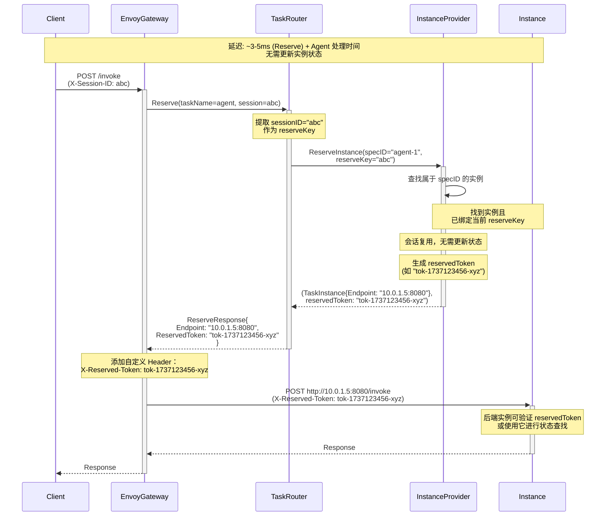
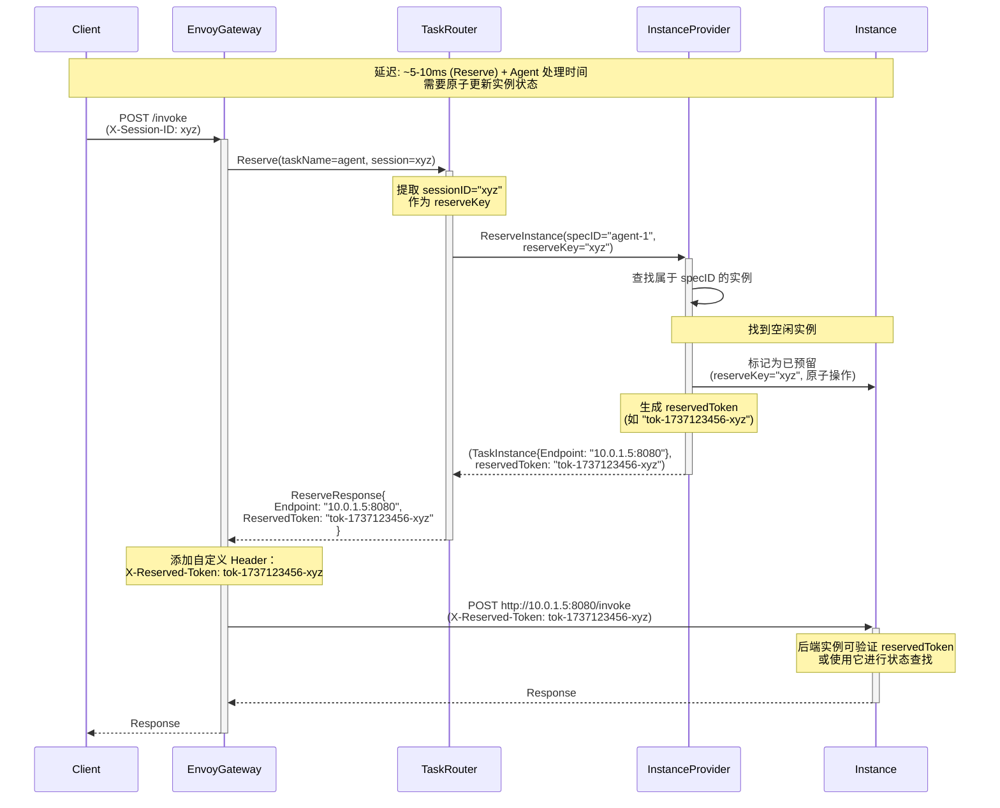
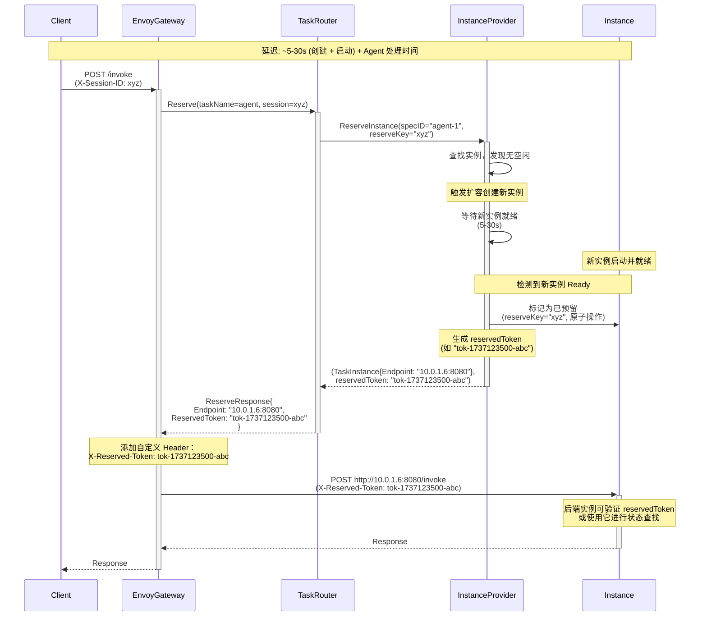
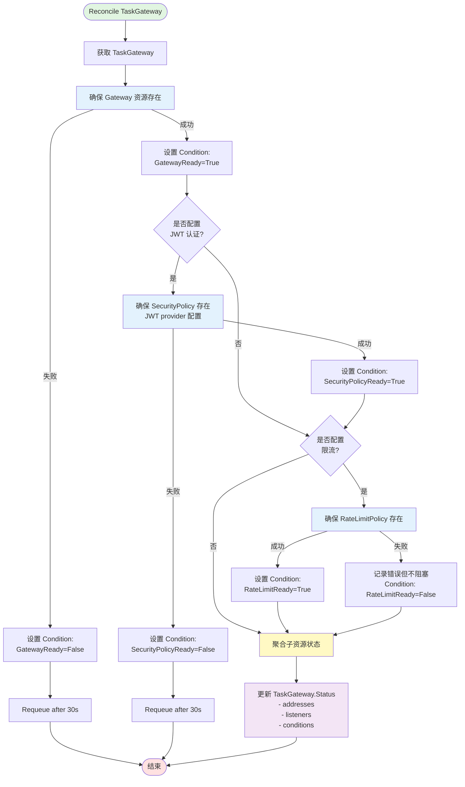
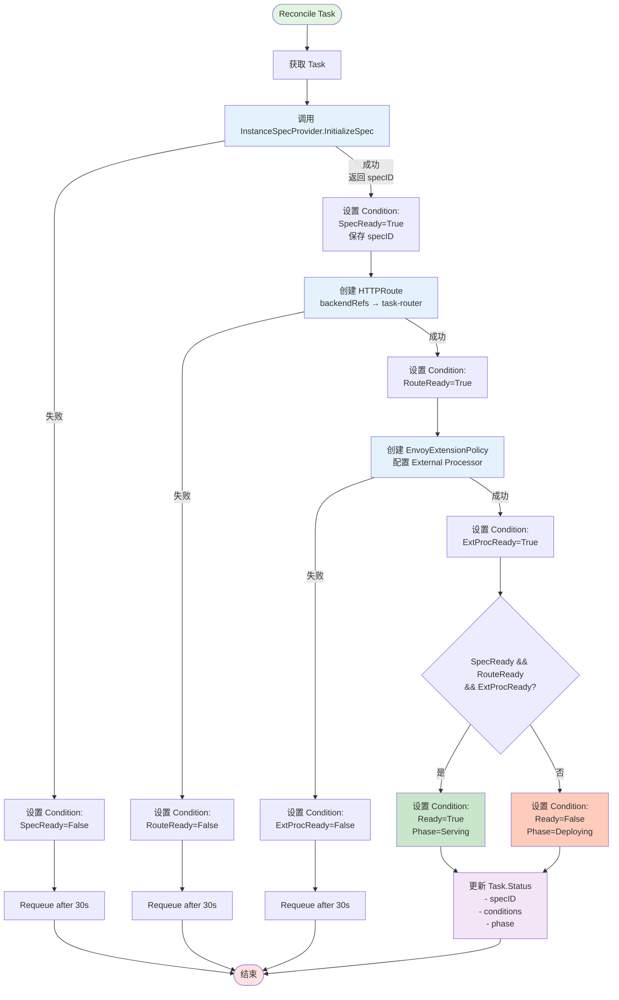
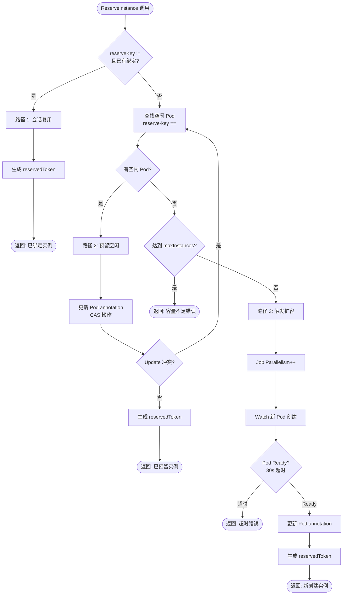
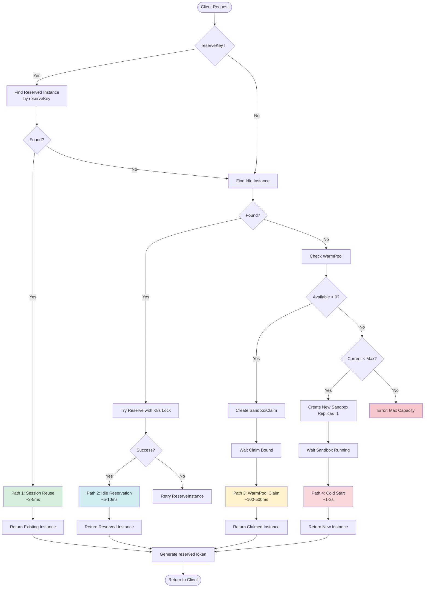

# AgentCube Task: Kubernetes 原生 AI Agent 任务管理系统

---

## Summary

当前 Kubernetes 生态缺乏针对 AI Agent 工作负载的原生任务管理能力。Agent 应用具有长时间有状态会话、复杂路由需求（会话亲和性、按需冷启动）、细粒度生命周期管理（休眠/恢复）以及多协议支持（HTTP/MCP/A2A）等独特特征，现有部署模式（Deployment + Service、Knative）无法充分满足这些需求。

本提案提出创建 AgentCube Task 作为 Kubernetes 原生的 Agent 任务管理系统，提供：
- **声明式 CRD**（Task、TaskGateway）用于 Agent 部署抽象
- **智能路由**（Oneshot/BySession）和会话持久性管理
- **弹性伸缩**（OnDemand 零实例冷启动）
- **多部署模式**（Pod/Sandbox/Code Bundle）
- **多协议网关**（HTTP/MCP/A2A）

AgentCube Task 专注于任务层，设计为可与现有调度系统（如 Volcano）和基础设施层集成，填补 Kubernetes 在 Agent 工作负载管理方面的空白。

## Motivation

### 为什么需要 AgentCube Task

随着 LLM 技术的成熟，基于 Agent 的应用正在快速增长。然而，Agent 工作负载与传统云原生应用有本质区别：

1. **会话状态管理**：Agent 需要在多轮交互中维护对话上下文、内存状态和任务进度，要求会话感知路由到同一实例
2. **资源利用率低**：Agent 工作负载呈现间歇性活动模式，常驻部署造成 60-80% 的资源浪费
3. **冷启动要求高**：用户期望即使从零扩容也有亚秒级响应，需要快速实例激活机制
4. **多协议支持**：需要原生支持 HTTP、MCP（Model Context Protocol）、A2A（Agent-to-Agent）等协议
5. **安全隔离需求**：不可信代码执行需要 MicroVM 级别隔离（Kata、Firecracker）

现有解决方案的局限：
- **Kubernetes Deployment + Service**：无按需冷启动、无会话亲和性、无 Agent 协议支持
- **Knative Serving**：主要针对无状态 FaaS 场景，会话保持支持有限
- **Istio/Envoy Gateway**：需要大量自定义配置，无生命周期管理能力
- **云厂商 Serverless**：供应商锁定，无法本地部署，缺乏 Agent 特定功能

### Goals

- 定义 Kubernetes 原生的 Agent 任务抽象（Task CRD、TaskGateway CRD）
- 实现双路由策略（Oneshot 无状态、BySession 有状态）和灵活的会话标识提取
- 实现 OnDemand 零实例冷启动，通过 K8s 乐观锁保证并发安全
- 支持多部署模式（Pod、Sandbox、Code Bundle），通过可插拔 InstanceProvider 接口实现
- 集成 EnvoyGateway 实现多协议网关（HTTP/MCP/A2A）
- 提供双层接口设计（InstanceSpecProvider 控制平面、InstanceProvider 数据平面）

### Non-Goals

- **Agent 框架实现**：不实现 Agent 逻辑或推理（使用 LangChain、CrewAI 等）
- **模型服务**：不提供 LLM 推理能力（使用 vLLM、TGI 等）
- **深度调度算法**：不实现装箱、GPU 时间切片等（委托给 Volcano 或 K8s 调度器）
- **应用级功能**：不实现对话管理、任务编排、提示工程等（由 Agent 框架处理）
- **非 Kubernetes 平台**：不支持 Docker Swarm、Nomad 等其他编排器

## Proposal

### Terminology

- **Task**：一个 AI Agent 应用的声明式配置，包括部署方式、路由策略、伸缩策略
- **Instance**：Task 的一个运行实例（Pod/Sandbox/Container）
- **reserveKey**：实例预留的抽象键（如 sessionID），用于标识预留归属
- **reservedToken**：预留令牌（Reservation Token），由 InstanceProvider 在 Reserve 阶段生成，作为 HTTP Header（X-Reserved-Token）传递给后端实例。用于：
  - 请求认证：后端验证请求来自合法的 Reserve 操作
  - 状态共享：在 Reserve 和 Invoke 两阶段间传递信息
  - 二次路由：支持通过 Function Proxy 进行再路由
  - 格式：任意字符串，建议包含时间戳和随机数（如 `tok-1234567890-abc123`）
- **specID**：Task 配置标识符，格式为 `taskName-generation`
- **Reserve**：数据平面同步操作，为请求预留或创建实例
- **OnDemand**：按需创建实例的伸缩模式，实现零实例冷启动
- **BySession**：基于会话标识的有状态路由策略，保证同一会话路由到同一实例
- **Oneshot**：无状态的单次请求路由策略，请求可路由到任意实例
- **InstanceProvider**：数据平面接口，负责实例预留和统计查询（ReserveInstance、GetInstanceStatistics）
- **InstanceSpecProvider**：控制平面接口，负责配置初始化和资源创建（InitializeSpec、UpdateSpec）
- **TaskRouter**：路由决策组件，作为 Envoy External Processor 运行，调用 InstanceProvider

### User Stories

#### Story 1：作为开发者，我希望部署对话式 Agent 并自动处理会话路由

我开发了一个客服 Agent，需要在多轮对话中保持上下文。我希望：
- 用户的所有请求自动路由到同一实例
- 实例空闲时自动回收以节省资源
- 新用户到来时自动创建新实例

**期望行为**：
```yaml
apiVersion: agentcube.io/v1alpha1
kind: Task
metadata:
  name: customer-support-agent
spec:
  deployment:
    type: pod
    podTemplate: {...}
  routing:
    routePolicy: BySession
    sessionIdentifier:
      extractors:
        - type: httpHeader
          name: X-Session-ID
  scaling:
    scalingMode: OnDemand
    minInstances: 0
    instanceLifecycle:
      idleTimeout: 300s
```

系统自动处理：
- 从请求头提取 `X-Session-ID`
- 相同 Session ID 路由到相同实例
- 空闲 5 分钟后自动回收实例
- 新会话到来时自动创建实例

#### Story 2：作为多租户平台提供方，我希望为不可信 Agent 提供安全隔离

我运行一个多租户平台，用户可以上传 Agent 代码执行。我需要：
- MicroVM 级别的安全隔离
- 快速冷启动（< 5s）
- 资源限制和配额管理

**期望行为**：
```yaml
apiVersion: agentcube.io/v1alpha1
kind: Task
spec:
  deployment:
    type: sandbox
    sandbox:
      podTemplate:
        spec:
          runtimeClassName: kata-containers
          containers:
            - name: agent
              image: my-agent:v1.0
              resources:
                requests:
                  cpu: "2000m"
                  memory: "4Gi"
  scaling:
    scalingMode: OnDemand
    minInstances: 3  # WarmPool size for fast allocation
```

系统提供：
- 基于 Kata/Firecracker 的 MicroVM 隔离
- 与 Volcano 预热池集成实现快速启动
- 自动资源回收和配额管理

#### Story 3：作为 AI 工程师，我希望快速部署无需构建镜像的实验性 Agent

我在开发 Agent 原型，频繁修改代码。我希望：
- 无需构建容器镜像
- 直接上传代码片段即可运行
- 支持常见 Task（Python、Node.js）

**期望行为**：
```yaml
apiVersion: agentcube.io/v1alpha1
kind: Task
spec:
  deployment:
    type: code-bundle
    codeBundle:
      zipUrl: "https://bucket/agent-code.zip"
      entrypoint: "main.py"
      codeRuntime:
        name: "python3.11"
```

系统自动：
- 下载代码片段
- 在 Python Task 容器中执行
- 提供与 Pod 模式相同的路由和伸缩能力


#### Story 4：作为平台管理员，我希望集成企业 SSO 保护 Agent 访问

我需要将 Agent 平台集成到公司的统一认证系统中。我希望：
- 所有 Agent 请求都经过 JWT 认证
- 自动从 Token 提取用户信息（user_id、email、租户 ID）
- 将用户信息传递给 Agent 实例用于日志和审计
- 支持多个 Identity Provider（如 Auth0、Keycloak）

**期望行为**：
```yaml
apiVersion: agentcube.io/v1alpha1
kind: TaskGateway
metadata:
  name: enterprise-gateway
spec:
  listeners:
    - name: https
      protocol: HTTPS
      port: 443
      tls:
        mode: Terminate
        certificateRefs:
          - name: company-tls-cert

  authentication:
    jwt:
      providers:
        - name: auth0
          issuer: https://company.auth0.com/
          audiences:
            - https://api.company.com
          remoteJWKS:
            uri: https://company.auth0.com/.well-known/jwks.json
          claimToHeaders:
            - claim: sub
              header: X-User-ID
            - claim: email
              header: X-User-Email
            - claim: tenant_id
              header: X-Tenant-ID

  rateLimiting:
    global:
      requestsPerUnit: 1000
      unit: Second
```

系统自动处理：
- 验证 JWT 签名和有效期
- 拒绝未认证或过期的请求（返回 401）
- 将 `sub`、`email`、`tenant_id` claims 转换为 HTTP Headers
- Agent 实例通过 Headers 获取用户信息，无需额外认证逻辑

#### Story 5：作为 Serverless 平台提供方，我希望支持 Function Proxy 架构实现节点级负载均衡

我运行一个大规模 Serverless 平台，每个节点部署了统一的 Function Proxy，实际的 Function 实例通过 Unix Socket 或本地 HTTP 与 Proxy 通信。我需要：

- TaskRouter 将请求路由到节点（而非具体 Function 实例）
- Function Proxy 根据 reservedToken 再次路由到实际的 Function 实例
- Reserve 阶段预分配 Function 实例并准备资源（如加载代码、初始化环境）
- Invoke 阶段通过 reservedToken 快速定位已准备好的实例

**期望行为**：

```yaml
apiVersion: agentcube.io/v1alpha1
kind: Task
metadata:
  name: serverless-function
spec:
  deployment:
    type: pod
    podTemplate:
      spec:
        containers:
          - name: function-proxy
            image: "registry.io/function-proxy:v2.0"
            # Proxy 监听 8080，管理本地 Function 实例

  routing:
    routePolicy: BySession
    sessionIdentifier:
      extractors:
        - type: httpHeader
          name: X-Session-ID

  scaling:
    scalingMode: OnDemand
    minInstances: 3  # 保持 3 个节点常驻
    maxInstances: 100
```

**数据流**：

Reserve 阶段：
```
Client → TaskRouter → InstanceProvider
  → 返回: Endpoint="node-2:8080", ReservedToken="tok-1737123456-fn5"
```

Invoke 阶段：
```
EnvoyGateway → Function Proxy (node-2:8080)
Headers:
  X-Session-ID: user-123
  X-Reserved-Token: tok-1737123456-fn5  ← 关键

Function Proxy 内部：
  - 解析 reservedToken: "tok-1737123456-fn5"
  - 查找预分配的 Function Instance 5（已在 Reserve 阶段准备好）
  - 通过 Unix Socket 转发请求到 Instance 5
```

系统提供：
- reservedToken 作为 Reserve-Invoke 两阶段的桥梁
- Function Proxy 可在 Reserve 阶段预启动实例、预加载代码
- Invoke 阶段通过 reservedToken 直接定位，避免重复初始化
- 支持节点级负载均衡 + 实例级精确路由


### Risks and Mitigations

#### Risk 1：OnDemand 冷启动延迟影响用户体验

**描述**：Pod 冷启动通常需要 5-30s，可能超过用户期望。

**缓解措施**：
1. 支持 `minInstances > 0` 预留实例
2. 与 Volcano 预热池集成，降低冷启动到 < 5s
3. 支持 Sandbox 快照/恢复机制
4. 提供冷启动指标和告警

#### Risk 2：多副本 TaskRouter 并发扩容冲突

**描述**：多个 Router 副本同时检测到无可用实例，可能并发调用 InstanceProvider.ReserveInstance()，导致重复扩容。

**缓解措施**：
1. **K8s 乐观锁机制**：InstanceProvider 通过 Job.Spec.Parallelism 更新实现扩容
   - 更新 Job 时使用 ResourceVersion 乐观锁
   - 更新冲突时自动重试，K8s 保证最终一致性
2. **Provider 内部串行化**：InstanceProvider.ReserveInstance() 内部使用 sync.Mutex 保护扩容逻辑
3. **幂等性设计**：多次调用 ReserveInstance() 不会创建重复实例，只会增加 Parallelism 一次

#### Risk 3：会话亲和性预留冲突

**描述**：多个 Router 副本同时处理同一会话的请求，可能尝试预留不同实例。

**缓解措施**：
1. 使用 Pod annotation 作为唯一真实数据源（reserve-key 字段）
2. K8s 乐观锁保证同一 Pod 只能被一个会话预留
3. 预留冲突时自动重试，Provider 确保返回相同会话已预留的实例

## Design Details

### 系统架构

```
┌─────────────────────────────────────────────────────┐
│  应用层                                             │
│  (Agent 框架: LangChain, CrewAI, AutoGPT)          │
└─────────────────────┬───────────────────────────────┘
                      │
┌─────────────────────▼───────────────────────────────┐
│  AgentCube 任务层 (本项目)                        │
│  ┌──────────────────────────────────────────────┐  │
│  │  Task CRD: 部署 + 路由配置                │  │
│  │  TaskGateway: 流量入口 + 认证             │  │
│  └──────────────────────────────────────────────┘  │
│  ┌────────────────────┬────────────────────────┐  │
│  │ TaskController     │ TaskRouter             │  │
│  │ (控制平面)          │ (数据平面)              │  │
│  │ ↓                  │ ↓                      │  │
│  │ InstanceSpecProvider│ InstanceProvider         │  │
│  │ - InitializeSpec   │ - ReserveInstance        │  │
│  │ - UpdateSpec       │ - GetInstanceStatistics  │  │
│  └────────────────────┴────────────────────────┘  │
└─────────────────────┬───────────────────────────────┘
                      │
┌─────────────────────▼───────────────────────────────┐
│  调度层（可选集成）                                  │
│  (Volcano: Agent 感知调度、预热池)                  │
│  (Kubernetes 默认调度器)                            │
└─────────────────────┬───────────────────────────────┘
                      │
┌─────────────────────▼───────────────────────────────┐
│  基础设施层                                          │
│  (Kubernetes: Pod, Job, CRI-O, Containerd)         │
│  (Sandbox: Kata Containers, Firecracker, gVisor)   │
└─────────────────────────────────────────────────────┘
```

### 新增 API

#### Task CRD

定义单个 Agent 的部署、路由和生命周期配置。

**核心字段结构**：

| 字段层级 | 字段名 | 类型 | 必填 | 默认值 | 说明 |
|---------|--------|------|------|--------|------|
| **spec** | - | TaskSpec | ✓ | - | Task 期望状态 |
| spec.**deployment** | - | DeploymentSpec | ✓ | - | 部署配置 |
| spec.deployment.**type** | - | string | ✓ | - | `pod` / `sandbox` / `code-bundle` |
| spec.deployment.**podTemplate** | - | PodTemplateSpec | - | - | Pod 部署模板 (⚠️ Experimental) |
| spec.deployment.**sandbox** | - | SandboxSpec | - | - | Sandbox 部署配置 (✅ Production) |
| spec.deployment.**codeBundle** | - | CodeBundleSpec | - | - | Code Bundle 配置 |
| **spec.scaling** | - | ScalingSpec | - | - | 伸缩策略 |
| spec.scaling.**scalingMode** | - | string | - | `None` | `OnDemand` / `None` |
| spec.scaling.**minInstances** | - | int32 | - | `0` | 最小实例数 (≥0) |
| spec.scaling.**maxInstances** | - | int32 | - | `10` | 最大实例数 (≥1) |
| spec.scaling.**instanceLifecycle** | - | InstanceLifecycleSpec | - | - | 实例生命周期策略 |
| spec.scaling.instanceLifecycle.**reusePolicy** | - | string | - | `Never` | `Never` / `Always` |
| spec.scaling.instanceLifecycle.**idleTimeout** | - | Duration | - | `300s` | 空闲超时时间 |
| spec.scaling.instanceLifecycle.**ttl** | - | Duration | - | `3600s` | 实例最大存活时间 |
| **spec.routing** | - | RoutingSpec | ✓ | - | 路由策略 |
| spec.routing.**gatewayRefs** | - | []string | ✓ | - | 引用的 TaskGateway 名称 |
| spec.routing.**routePolicy** | - | string | ✓ | - | `Oneshot` / `BySession` |
| spec.routing.**sessionIdentifier** | - | SessionIdentifierSpec | - | - | 会话 ID 提取配置 (BySession 必需) |
| spec.routing.**reserveTimeout** | - | Duration | - | `30s` | Reserve 操作超时时间 |
| **spec.requestHandling** | - | RequestHandlingSpec | - | - | 请求处理配置 |
| spec.requestHandling.**backend** | - | BackendSpec | ✓ | - | 后端配置 |
| spec.requestHandling.backend.**port** | - | int32 | ✓ | `8080` | 后端端口 (1-65535) |

**部署类型详细字段**：

**SandboxSpec** (推荐用于生产环境)：

| 字段名 | 类型 | 必填 | 默认值 | 说明 |
|--------|------|------|--------|------|
| **podTemplate** | PodTemplateSpec | - | - | Sandbox 的 Pod 模板，包含 runtimeClassName |
| **volumeClaimTemplates** | []PersistentVolumeClaim | - | - | 持久化存储声明 |
| **shutdownTime** | Duration | - | `30s` | 优雅关闭超时时间 |

**SessionIdentifierSpec** (BySession 路由策略)：

| 字段名 | 类型 | 必填 | 说明 |
|--------|------|------|------|
| **extractors** | []SessionExtractor | ✓ | 会话 ID 提取器列表 |
| extractors.**type** | string | ✓ | `httpHeader` / `pathVar` / `queryParam` |
| extractors.**name** | string | ✓ | 提取字段名称 |
| extractors.**path** | string | - | 路径模板 (仅 pathVar 类型) |

**TaskStatus** 字段：

| 字段名 | 类型 | 说明 |
|--------|------|------|
| **specID** | string | 配置标识符 (格式: `taskName-generation`) |
| **phase** | string | 当前阶段: `Pending` / `Deploying` / `Serving` / `Failed` |
| **conditions** | []Condition | 标准 K8s Condition (Ready, SpecReady, RouteReady, ExtProcReady) |
| **instances** | InstanceStatistics | 实例统计信息 (仅用于监控展示) |
| **routeStatus** | RouteStatusSummary | HTTPRoute 状态摘要 |
| **observedGeneration** | int64 | 观测到的 Generation |

**完整的 Go 类型定义请参见 `api/v1alpha1/task_types.go`。**

**示例 YAML**：

```yaml
apiVersion: agentcube.io/v1alpha1
kind: Task
metadata:
  name: customer-support-agent
  namespace: production
spec:
  # 部署配置
  deployment:
    type: pod
    podTemplate:
      spec:
        containers:
          - name: agent
            image: "registry.io/agents/customer-support:v1.2.0"

  # 伸缩配置
  scaling:
    scalingMode: OnDemand
    minInstances: 0
    maxInstances: 50
    instanceLifecycle:
      reusePolicy: Never
      idleTimeout: 300s
      ttl: 3600s

  # 路由配置
  routing:
    gatewayRefs:
      - agent-gateway
    routePolicy: BySession
    sessionIdentifier:
      extractors:
        - type: httpHeader
          name: X-Session-ID
        - type: pathVar
          path: /{sessionID}/invoke
          name: sessionID
        - type: queryParam
          name: sessionID
        - type: httpHeader
          name: X-USER-ID
    reserveTimeout: 30s

  # 请求处理配置
  requestHandling:
    backend:
      port: 8080
    timeout:
      http:
        request: 300s
    circuitBreaker:
      maxParallelRequests: 100

status:
  phase: Serving
  conditions:
    - type: SpecReady
      status: "True"
      reason: SpecInitialized
    - type: Ready
      status: "True"
      reason: AllComponentsReady
    - type: RouteReady
      status: "True"
      reason: GatewayConfigured
```

#### TaskGateway CRD

定义统一的流量入口和安全策略。

**核心字段结构**：

| 字段层级 | 字段名 | 类型 | 必填 | 默认值 | 说明 |
|---------|--------|------|------|--------|------|
| **spec** | - | TaskGatewaySpec | ✓ | - | 网关期望状态 |
| spec.**listeners** | - | []ListenerSpec | ✓ | - | 监听器配置列表 |
| spec.**authentication** | - | AuthenticationSpec | - | - | 认证配置 |
| spec.**cors** | - | CORSSpec | - | - | 跨域配置 |

**ListenerSpec 详细字段**：

| 字段名 | 类型 | 必填 | 枚举值/范围 | 说明 |
|--------|------|------|------------|------|
| **name** | string | ✓ | - | 监听器名称 |
| **protocol** | string | ✓ | `HTTP` / `HTTPS` / `WebSocket` | 协议类型 |
| **port** | int32 | ✓ | 1-65535 | 监听端口 |
| **tls** | TLSSpec | - | - | TLS 配置 (protocol=HTTPS 时必填) |

**AuthenticationSpec 详细字段**：

| 字段名 | 类型 | 必填 | 说明 |
|--------|------|------|------|
| **jwt** | JWTSpec | - | JWT 认证配置 |
| **extAuth** | ExtAuthSpec | - | 外部认证配置 (gRPC/HTTP) |

**JWTSpec.Providers[] 详细字段**：

| 字段名 | 类型 | 必填 | 说明 |
|--------|------|------|------|
| **name** | string | ✓ | 提供者名称 |
| **issuer** | string | ✓ | JWT 签发者 (iss claim) |
| **audiences** | []string | ✓ | 受众列表 (aud claim) |
| **remoteJWKS** | RemoteJWKSSpec | ✓ | 远程 JWKS 配置 |
| **claimToHeaders** | []ClaimMapping | - | 将 JWT Claims 提取到 HTTP Headers |

**ClaimMapping 字段**：

| 字段名 | 类型 | 必填 | 说明 | 示例 |
|--------|------|------|------|------|
| **claim** | string | ✓ | JWT Claim 名称 | `sub`, `email` |
| **header** | string | ✓ | HTTP Header 名称 | `X-User-ID`, `X-User-Email` |

**Status 字段**：

| 字段名 | 类型 | 说明 |
|--------|------|------|
| **conditions** | []Condition | 标准 K8s Condition (Ready, GatewayReady, SecurityPolicyReady) |
| **addresses** | []GatewayAddress | Gateway 分配的地址列表 (从 Gateway.Status 聚合) |
| **listeners** | []ListenerStatus | 监听器状态列表 (从 Gateway.Status 聚合) |
| **observedGeneration** | int64 | 观测到的 Generation |

**完整的 Go 类型定义请参见 `api/v1alpha1/taskgateway_types.go`。**

**示例 YAML**：

```yaml
apiVersion: agentcube.io/v1alpha1
kind: TaskGateway
metadata:
  name: agent-gateway
  namespace: production
spec:
  listeners:
    - name: https
      protocol: HTTPS
      port: 443
      tls:
        mode: Terminate
        certificateRefs:
          - name: agent-cert

  authentication:
    jwt:
      providers:
        - name: auth0
          issuer: https://auth.example.com/
          audiences:
            - https://api.example.com
          remoteJWKS:
            uri: https://auth.example.com/.well-known/jwks.json
          claimToHeaders:
            - claim: sub
              header: x-user-id
            - claim: email
              header: x-user-email

  cors:
    allowOrigins: ["*"]
    allowMethods: [GET, POST]
```

### 数据平面流程

#### Reserve 操作的双阶段模型

```
阶段 1: Reserve（由 TaskRouter 处理）
  客户端请求 → EnvoyGateway → TaskRouter
      ↓
  查找/预留实例 → 返回实例端点

阶段 2: Invoke（由 Envoy 直接转发）
  EnvoyGateway → 实例
      ↓
  处理请求 → 返回响应
```

**控制平面与数据平面分离**：

```
控制平面（Task 创建时）：
  TaskController → InstanceSpecProvider.InitializeSpec()
      ↓
  创建 Spec 资源 (PodProvider: Job, SandboxProvider: WarmPool)
      ↓
  返回 specID

数据平面（每次请求时）：
  TaskRouter → InstanceProvider.ReserveInstance(specID, reserveKey)
      ↓
  查询/预留实例（通过 annotation 更新）
      ↓
  返回 TaskInstance{Endpoint, Status}
```

**最快路径（会话复用 - BySession 模式）**：



**快速路径（首次分配空闲实例）**：



**慢速路径（OnDemand 扩容）**：



**路径对比**：

| 路径类型 | 触发条件 | 延迟 | 是否更新实例状态 | 典型场景 |
|---------|---------|------|-----------------|---------|
| 最快路径 | 实例已绑定当前 reserveKey | ~3-5ms | ❌ 否 | BySession 模式的会话复用 |
| 快速路径 | 存在空闲实例 | ~5-10ms | ✅ 是（原子操作） | BySession 首次分配 / Oneshot 模式 |
| 慢速路径 | 无空闲实例 | ~5-30s | ✅ 是 | OnDemand 冷启动 |

**并发安全保证**：
- 实例状态更新必须通过原子操作完成
- 原子操作失败时 InstanceProvider 自动重试，选择其他实例
- 无需外部分布式锁，简化架构
- 具体原子操作机制由各 InstanceProvider 实现（见各 Provider 章节）

### TaskRouter 实现细节

TaskRouter 作为 Envoy External Processor 运行，核心职责是：
1. **提取会话标识**：从 HTTP Header/QueryParam 提取 sessionID，转换为 reserveKey
2. **调用 InstanceProvider**：通过 `ReserveInstance()` 获取或等待实例
3. **返回端点信息**：将实例 Endpoint 返回给 EnvoyGateway

**核心逻辑**：

```go
// TaskRouter 核心结构
type TaskRouter struct {
	instanceProvider InstanceProvider
	taskCache        *TaskCache  // 缓存 Task CRD 配置
}

// Reserve 是 External Processor 的主入口
func (r *TaskRouter) Reserve(ctx context.Context, req *ReserveRequest) (*ReserveResponse, error) {
	// 1. 查找 Task 配置
	task, err := r.taskCache.Get(ctx, req.TaskName)
	if err != nil {
		return nil, fmt.Errorf("task not found: %w", err)
	}

	// 2. 提取 reserveKey（基于路由策略）
	reserveKey := r.extractReserveKey(req, task)

	// 3. 生成 specID
	specID := fmt.Sprintf("%s-%d", task.Name, task.Generation)

	// 4. 调用 Provider 预留实例
	//    - Provider 内部处理查找/扩容/等待逻辑
	//    - Provider 内部使用 K8s 乐观锁保证并发安全
	//    - Provider 生成 reservedToken 并返回
	instance, reservedToken, err := r.instanceProvider.ReserveInstance(ctx, specID, reserveKey)
	if err != nil {
		return nil, fmt.Errorf("reserve instance failed: %w", err)
	}

	// 5. 返回实例端点和预留令牌
	//    - Endpoint: 后端实例的访问地址
	//    - ReservedToken: 预留令牌，将作为 X-Reserved-Token Header 传递给后端
	return &ReserveResponse{
		Endpoint:      instance.Endpoint.String(),
		InstanceID:    instance.ID,
		ReservedToken: reservedToken, // ← 新增字段
	}, nil
}

// extractReserveKey 根据路由策略提取预留键
func (r *TaskRouter) extractReserveKey(req *ReserveRequest, task *Task) string {
	switch task.Spec.Routing.RoutePolicy {
	case RoutePolicyOneshot:
		// Oneshot 模式：每次请求随机分配，reserveKey 为空
		return ""

	case RoutePolicyBySession:
		// BySession 模式：提取 sessionID 作为 reserveKey
		for _, extractor := range task.Spec.Routing.SessionIdentifier.Extractors {
			if extractor.Type == ExtractorTypeHTTPHeader {
				if value := req.Headers[extractor.Name]; value != "" {
					return value  // 例如: X-Session-ID: user-123
				}
			}
			if extractor.Type == ExtractorTypeQueryParam {
				if value := req.QueryParams[extractor.Name]; value != "" {
					return value
				}
			}
		}
		// 未找到 sessionID，回退到 Oneshot 行为
		return ""

	default:
		return ""
	}
}
```

**关键设计决策**：

1. **简化架构**：
   - TaskRouter 不再直接操作 K8s API
   - 不再需要分布式锁（由 Provider 内部通过 K8s 乐观锁保证）
   - 不再需要 Watch 机制（由 Provider 内部处理）

2. **reserveKey 抽象**：
   - TaskRouter 层面提取业务标识（sessionID/tenantID）
   - 传递给 Provider 时统一为 reserveKey
   - Provider 层面无需理解业务语义，只需保证 "相同 key → 相同实例"

3. **性能优化**：
   - TaskCache 缓存 Task CRD，避免每次请求查询 API Server
   - Provider 使用 Pod Label 索引，避免全量扫描
   - Reserve 操作延迟：快速路径 < 10ms，慢速路径 5-30s

### 控制平面资源管理

TaskController 负责管理 TaskGateway 和 Task CRD 的子资源创建、状态同步和自动修复。本节描述控制平面的核心流程和设计。

#### 资源拓扑关系

AgentCube 使用 Kubernetes OwnerReference 机制管理资源层级关系：

```
TaskGateway (CRD)
  ├─ ownerReferences ──> Gateway (Gateway API)
  │                       - listeners, addresses, tls
  │
  ├─ ownerReferences ──> SecurityPolicy (EnvoyGateway, 可选)
  │                       - JWT 认证配置
  │
  └─ ownerReferences ──> RateLimitPolicy (EnvoyGateway, 可选)
                          - 全局/per-route 限流配置


Task (CRD)
  ├─ ownerReferences ──> HTTPRoute (Gateway API)
  │                       - 路由规则
  │                       - backendRefs 指向 task-router Service
  │
  ├─ ownerReferences ──> EnvoyExtensionPolicy (EnvoyGateway)
  │                       - External Processor 配置
  │                       - 指向 task-router extProc 端口
  │
  └─ (间接管理)          Job (由 InstanceSpecProvider 创建)
                          - 由 PodTaskProvider.InitializeSpec() 创建
                          - OwnerReference 指向 Task
                          - Controller 通过 GetSpecStatus() 查询状态
```

**OwnerReference 特性**：
- 级联删除：删除 TaskGateway/Task 时自动删除所有子资源
- 自动修复：子资源被意外删除时，Controller 自动重建
- 状态回填：Informer 监听子资源变化，立即更新父资源 Status

---

#### TaskGateway Controller

**控制循环流程**：



**伪代码实现**：

```go
func (c *TaskGatewayController) Reconcile(ctx context.Context, req ctrl.Request) (ctrl.Result, error) {
	// 1. 获取 TaskGateway
	tgw := &TaskGateway{}
	if err := c.Get(ctx, req.NamespacedName, tgw); err != nil {
		return ctrl.Result{}, client.IgnoreNotFound(err)
	}

	// 2. 确保 Gateway 资源
	gateway, err := c.ensureGateway(ctx, tgw)
	if err != nil {
		c.setCondition(tgw, "GatewayReady", metav1.ConditionFalse, "CreationFailed", err.Error())
		return ctrl.Result{RequeueAfter: 30 * time.Second}, err
	}
	c.setCondition(tgw, "GatewayReady", metav1.ConditionTrue, "GatewayCreated", "")

	// 3. 确保 SecurityPolicy (如果配置了 JWT)
	if tgw.Spec.Authentication != nil && tgw.Spec.Authentication.JWT != nil {
		if err := c.ensureSecurityPolicy(ctx, tgw); err != nil {
			c.setCondition(tgw, "SecurityPolicyReady", metav1.ConditionFalse, "CreationFailed", err.Error())
			return ctrl.Result{RequeueAfter: 30 * time.Second}, err
		}
		c.setCondition(tgw, "SecurityPolicyReady", metav1.ConditionTrue, "PolicyCreated", "")
	}

	// 4. 确保 RateLimitPolicy (如果配置了限流)
	if tgw.Spec.RateLimiting != nil {
		if err := c.ensureRateLimitPolicy(ctx, tgw); err != nil {
			// 记录错误但不阻塞整体就绪
			c.setCondition(tgw, "RateLimitReady", metav1.ConditionFalse, "CreationFailed", err.Error())
		} else {
			c.setCondition(tgw, "RateLimitReady", metav1.ConditionTrue, "PolicyCreated", "")
		}
	}

	// 5. 聚合状态
	c.aggregateStatus(ctx, tgw, gateway)

	// 6. 更新 Status
	if err := c.Status().Update(ctx, tgw); err != nil {
		return ctrl.Result{}, err
	}

	return ctrl.Result{}, nil
}

func (c *TaskGatewayController) ensureGateway(ctx context.Context, tgw *TaskGateway) (*gwapiv1.Gateway, error) {
	gateway := &gwapiv1.Gateway{
		ObjectMeta: metav1.ObjectMeta{
			Name:      tgw.Name,
			Namespace: tgw.Namespace,
			OwnerReferences: []metav1.OwnerReference{
				*metav1.NewControllerRef(tgw, TaskGatewayGVK),
			},
		},
		Spec: gwapiv1.GatewaySpec{
			GatewayClassName: "envoy-gateway",
			Listeners:        c.buildListeners(tgw.Spec.Listeners),
		},
	}

	// CreateOrUpdate 幂等操作
	return gateway, c.CreateOrUpdate(ctx, gateway)
}
```

**Status 字段定义**：

TaskGatewayStatus 的完整定义参见 [新增 API](#taskgateway-crd) 部分。此处列出关键字段说明：

- `Conditions`：标准 K8s Condition（Ready, GatewayReady, SecurityPolicyReady）
- `Addresses`：Gateway 分配的地址列表（从 Gateway.Status.Addresses 聚合）
- `Listeners`：监听器状态列表（从 Gateway.Status.Listeners 聚合）
- `ObservedGeneration`：观测到的 Generation

**状态同步机制**：

```go
// 使用 Informer 监听子资源变化，立即触发父资源 Reconcile
func (c *TaskGatewayController) SetupWithManager(mgr ctrl.Manager) error {
	return ctrl.NewControllerManagedBy(mgr).
		For(&TaskGateway{}).
		Owns(&gwapiv1.Gateway{}).          // 监听 Gateway 变化
		Owns(&SecurityPolicy{}).           // 监听 SecurityPolicy 变化
		Owns(&RateLimitPolicy{}).          // 监听 RateLimitPolicy 变化
		WithEventFilter(resourceVersionChangedPredicate()). // 过滤无意义的事件
		Complete(c)
}

// 子资源状态变化时触发 Reconcile
// 例如：Gateway.Status.Addresses 更新 → TaskGateway Reconcile → 回填 TaskGateway.Status.Addresses
```

---

#### Task Controller

**控制循环流程**：



**伪代码实现**：

```go
func (c *TaskController) Reconcile(ctx context.Context, req ctrl.Request) (ctrl.Result, error) {
	// 1. 获取 Task
	task := &Task{}
	if err := c.Get(ctx, req.NamespacedName, task); err != nil {
		return ctrl.Result{}, client.IgnoreNotFound(err)
	}

	// 2. 调用 InstanceSpecProvider 初始化配置
	specID, err := c.instanceSpecProvider.InitializeSpec(ctx, task)
	if err != nil {
		c.setCondition(task, "SpecReady", metav1.ConditionFalse, "InitializeFailed", err.Error())
		return ctrl.Result{RequeueAfter: 30 * time.Second}, err
	}
	task.Status.SpecID = specID
	c.setCondition(task, "SpecReady", metav1.ConditionTrue, "SpecInitialized", "")

	// 3. 确保 HTTPRoute
	if err := c.ensureHTTPRoute(ctx, task); err != nil {
		c.setCondition(task, "RouteReady", metav1.ConditionFalse, "CreationFailed", err.Error())
		return ctrl.Result{RequeueAfter: 30 * time.Second}, err
	}
	c.setCondition(task, "RouteReady", metav1.ConditionTrue, "RouteCreated", "")

	// 4. 确保 EnvoyExtensionPolicy
	if err := c.ensureEnvoyExtensionPolicy(ctx, task); err != nil {
		c.setCondition(task, "ExtProcReady", metav1.ConditionFalse, "CreationFailed", err.Error())
		return ctrl.Result{RequeueAfter: 30 * time.Second}, err
	}
	c.setCondition(task, "ExtProcReady", metav1.ConditionTrue, "ExtProcConfigured", "")

	// 5. 聚合整体 Ready 状态（仅基于配置是否就绪）
	if c.allConditionsTrue(task, []string{"SpecReady", "RouteReady", "ExtProcReady"}) {
		c.setCondition(task, "Ready", metav1.ConditionTrue, "TaskReady", "All components ready")
		task.Status.Phase = TaskPhaseServing
	} else {
		c.setCondition(task, "Ready", metav1.ConditionFalse, "NotReady", "Waiting for components")
		task.Status.Phase = TaskPhaseDeploying
	}

	// 6. 更新 Status
	if err := c.Status().Update(ctx, task); err != nil {
		return ctrl.Result{}, err
	}

	return ctrl.Result{}, nil
}

func (c *TaskController) ensureHTTPRoute(ctx context.Context, task *Task) error {
	route := &gwapiv1.HTTPRoute{
		ObjectMeta: metav1.ObjectMeta{
			Name:      task.Name,
			Namespace: task.Namespace,
			OwnerReferences: []metav1.OwnerReference{
				*metav1.NewControllerRef(task, TaskGVK),
			},
		},
		Spec: gwapiv1.HTTPRouteSpec{
			ParentRefs: c.buildParentRefs(task.Spec.Routing.GatewayRefs),
			Rules: []gwapiv1.HTTPRouteRule{
				{
					Matches: c.buildMatches(task.Spec.Routing),
					BackendRefs: []gwapiv1.HTTPBackendRef{
						{
							BackendRef: gwapiv1.BackendRef{
								BackendObjectReference: gwapiv1.BackendObjectReference{
									Name: "task-router",
									Port: ptr.To(gwapiv1.PortNumber(9001)),
								},
							},
						},
					},
				},
			},
		},
	}

	return c.CreateOrUpdate(ctx, route)
}
```

**Status 字段定义**：

TaskStatus 的完整定义参见 [新增 API](#task-crd) 部分。此处列出关键字段说明：

- `Conditions`：标准 K8s Condition（Ready, SpecReady, RouteReady, ExtProcReady）
- `SpecID`：配置标识符（格式: `taskName-generation`）
- `Instances`：实例统计（Total, Ready, Reserved, Idle）
- `RouteStatus`：HTTPRoute 状态摘要
- `Phase`：高层阶段抽象（Pending, Deploying, Serving, Failed）
- `ObservedGeneration`：观测到的 Generation

**状态同步机制**：

```go
// 使用 Informer 监听子资源和 Job 变化
func (c *TaskController) SetupWithManager(mgr ctrl.Manager) error {
	return ctrl.NewControllerManagedBy(mgr).
		For(&Task{}).
		Owns(&gwapiv1.HTTPRoute{}).          // 监听 HTTPRoute 变化
		Owns(&EnvoyExtensionPolicy{}).       // 监听 EnvoyExtensionPolicy 变化
		Watches(
			&batchv1.Job{},                  // 监听 Job 变化
			handler.EnqueueRequestsFromMapFunc(c.findTaskForJob),
			builder.WithPredicates(jobStatusChangedPredicate()),
		).
		WithEventFilter(resourceVersionChangedPredicate()).
		Complete(c)
}

// findTaskForJob 从 Job 找到对应的 Task
func (c *TaskController) findTaskForJob(ctx context.Context, obj client.Object) []reconcile.Request {
	job := obj.(*batchv1.Job)

	// 通过 OwnerReference 查找 Task
	for _, ref := range job.GetOwnerReferences() {
		if ref.Kind == "Task" && ref.APIVersion == "agentcube.io/v1alpha1" {
			return []reconcile.Request{
				{NamespacedName: types.NamespacedName{
					Namespace: job.Namespace,
					Name:      ref.Name,
				}},
			}
		}
	}
	return nil
}
```

---

#### 自动修复机制

Controller 通过 OwnerReference 和 Informer 实现自动修复：

**场景 1：子资源被意外删除**

```
1. 管理员执行：kubectl delete httpRoute my-task
2. Informer 检测到删除事件
3. 触发 Task Reconcile
4. ensureHTTPRoute() 检测到资源不存在
5. 自动重建 HTTPRoute
6. 更新 Task.Status.Conditions
```

**场景 2：子资源被手动修改**

```
1. 管理员执行：kubectl edit httpRoute my-task（修改 backendRefs）
2. Informer 检测到更新事件
3. 触发 Task Reconcile
4. ensureHTTPRoute() 对比期望状态和实际状态
5. 如果不一致，执行更新操作（恢复为期望配置）
6. 记录修复事件到 Event API
```

**场景 3：配置漂移检测**

```go
// 周期性 Reconcile（默认 10 分钟）
func (c *TaskController) SetupWithManager(mgr ctrl.Manager) error {
	return ctrl.NewControllerManagedBy(mgr).
		// ...
		WithOptions(controller.Options{
			MaxConcurrentReconciles: 5,
			ReconcileTimeout:        60 * time.Second,
		}).
		Complete(c)
}

// Controller Runtime 自动执行周期性 Reconcile，检测并修复配置漂移
```

**修复日志和事件**：

```go
// 记录修复事件
c.recorder.Event(task, corev1.EventTypeWarning, "ResourceRecreated",
	"HTTPRoute was deleted, automatically recreated")

// 记录到 Task.Status.Conditions
c.setCondition(task, "RouteReady", metav1.ConditionTrue, "AutoRepaired",
	"HTTPRoute was recreated after deletion")
```

---

#### Condition 规范

遵循 Kubernetes 标准 `metav1.Condition` 规范：

**TaskGateway Conditions**：

| Type | Status | Reason | 说明 |
|------|--------|--------|------|
| Ready | True | AllComponentsReady | 整体就绪 |
| Ready | False | ComponentsNotReady | 至少一个子资源未就绪 |
| GatewayReady | True | GatewayCreated | Gateway 资源已创建且就绪 |
| GatewayReady | False | CreationFailed | Gateway 创建失败 |
| SecurityPolicyReady | True | PolicyCreated | JWT 认证配置已应用 |
| SecurityPolicyReady | False | CreationFailed | SecurityPolicy 创建失败 |

**Task Conditions**：

| Type | Status | Reason | 说明 |
|------|--------|--------|------|
| Ready | True | TaskReady | 整体就绪（Spec + Route + ExtProc） |
| Ready | False | NotReady | 至少一个组件未就绪 |
| SpecReady | True | SpecInitialized | Job 创建成功 |
| SpecReady | False | InitializeFailed | InitializeSpec 失败 |
| RouteReady | True | RouteCreated | HTTPRoute 创建成功 |
| RouteReady | False | CreationFailed | HTTPRoute 创建失败 |
| RouteReady | True | AutoRepaired | HTTPRoute 被自动修复 |
| ExtProcReady | True | ExtProcConfigured | EnvoyExtensionPolicy 创建成功 |
| ExtProcReady | False | CreationFailed | EnvoyExtensionPolicy 创建失败 |

**Condition 字段示例**：

```yaml
status:
  conditions:
    - type: Ready
      status: "True"
      lastTransitionTime: "2025-01-19T10:00:00Z"
      reason: TaskReady
      message: "All components ready"
      observedGeneration: 2

    - type: SpecReady
      status: "True"
      lastTransitionTime: "2025-01-19T09:59:50Z"
      reason: SpecInitialized
      message: "Job my-task-2 created successfully"
      observedGeneration: 2

    - type: RouteReady
      status: "True"
      lastTransitionTime: "2025-01-19T09:59:55Z"
      reason: AutoRepaired
      message: "HTTPRoute was recreated after deletion"
      observedGeneration: 2
```

---

### InstanceProvider 接口设计

为了提升性能并简化架构，AgentCube 将实例管理分为**控制平面**和**数据平面**两层接口：

- **InstanceSpecProvider**：控制平面接口，由 **TaskController** 调用，负责配置验证和子资源创建
- **InstanceProvider**：数据平面接口，由 **TaskRouter** 调用，负责快速实例预留和信息查询

这种分离设计带来以下优势：
1. **性能优化**：配置预验证，避免数据平面重复解析模板
2. **职责清晰**：控制平面负责资源编排，数据平面负责快速分配
3. **扩展性强**：新部署模式只需实现两个接口
4. **架构简化**：Registry 能力内嵌到 Provider，避免双重状态管理

#### 术语映射表

AgentCube 设计中使用抽象的 **Instance** 概念，不同的 Provider 实现使用不同的底层资源：

| 抽象概念 | PodTaskProvider 实现 | SandboxTaskProvider 实现 | 说明 |
|---------|-------------------|----------------------|-----|
| **Instance** | Pod | Sandbox | 单个 Agent 运行实例 |
| **Spec Resource** | Job | SandboxWarmPool | 管理 Instance 集合的资源 |
| **Scale Up** | Increase Job.Spec.Parallelism | Create new Sandbox | 扩容操作 |
| **Scale Down** | Decrease Job.Spec.Parallelism | Set Sandbox.Spec.Replicas=0 | 缩容操作 |
| **Reserve** | Update Pod Annotation | Update Sandbox Annotation | 预留实例给特定会话 |
| **Lifecycle Management** | Delete expired Pod | Graceful Sandbox shutdown | 生命周期回收 |

**部署类型定位**：
- **Pod 类型** (`deployment.type: pod`)：⚠️ Experimental - 用于早期 MVP 原型和实现论证，不推荐生产使用
- **Sandbox 类型** (`deployment.type: sandbox`)：✅ Production Recommended - AgentCube 的主要负载类型，提供 MicroVM 级隔离

#### 核心数据结构

```go
// TaskInstance 表示一个运行中的 Task 实例
type TaskInstance struct {
	ID         string
	SpecID     string        // 关联的配置 ID
	Status     InstanceStatus
	Endpoint   Endpoint
	ReserveKey string        // 预留键（如 sessionID），空表示未预留
	CreatedAt  time.Time
	LastActive time.Time
}

type Endpoint struct {
	Host string
	Port int32
}

type InstanceStatus string

const (
	InstancePending     InstanceStatus = "Pending"      // 等待创建
	InstanceCreating    InstanceStatus = "Creating"     // 正在启动
	InstanceReady       InstanceStatus = "Ready"        // 就绪但未预留（空闲）
	InstanceActive      InstanceStatus = "Active"       // 已预留且正在处理请求
	InstanceTerminating InstanceStatus = "Terminating"  // 正在终止
	InstanceTerminated  InstanceStatus = "Terminated"   // 已终止
)
```

#### InstanceSpecProvider 接口（控制平面）

由 **TaskController** 在 Task CR 创建/更新/删除时调用，负责验证配置并创建子资源（如 Job、Deployment）。

```go
// InstanceSpecProvider 控制平面接口
type InstanceSpecProvider interface {
	// InitializeSpec 验证 Task 配置并创建子资源（如 Kubernetes Job）
	// 返回 specID 用于后续实例发放
	InitializeSpec(ctx context.Context, task *Task) (specID string, err error)

	// UpdateSpec 更新配置（如 scaling 参数变化）
	UpdateSpec(ctx context.Context, specID string, task *Task) error

	// ReleaseSpec 删除子资源
	ReleaseSpec(ctx context.Context, specID string) error

	// GetSpecStatus 获取配置状态（当前实例数、可用数）
	GetSpecStatus(ctx context.Context, specID string) (*SpecStatus, error)
}

type SpecStatus struct {
	SpecID         string
	DesiredCount   int32 // 期望实例数
	AvailableCount int32 // 可用实例数
	ReservedCount  int32 // 已预留实例数
}
```

**使用场景**：
```go
// TaskController 在 Reconcile 循环中调用
func (c *TaskController) reconcileTask(ctx context.Context, task *Task) error {
	specID, err := c.specProvider.InitializeSpec(ctx, task)
	if err != nil {
		return err
	}

	// 更新 Task.Status
	task.Status.SpecID = specID
	task.Status.Phase = TaskPhaseDeploying

	return c.updateStatus(ctx, task)
}
```

#### InstanceProvider 接口（数据平面）

由 **TaskRouter** 在处理用户请求时调用，负责快速预留或创建实例。

```go
// InstanceProvider 数据平面接口
type InstanceProvider interface {
	// ReserveInstance 预留或创建实例
	//
	// 参数：
	//   - specID: 配置标识符（格式: taskName-generation）
	//   - reserveKey: 预留键（如 sessionID），相同 key 路由到相同实例
	//                 reserveKey="" 表示不绑定，任意选择可用实例（Oneshot 模式）
	//
	// 返回值：
	//   - inst: 预留的实例信息（包含 Endpoint、ID、Status 等）
	//   - reservedToken: 预留令牌（Reservation Token），任意字符串
	//                    - TaskRouter 将通过 HTTP Header (X-Reserved-Token) 传递给后端实例
	//                    - 后端实例可用于请求认证、状态共享或二次路由
	//                    - 建议格式：包含随机数和时间戳，如 "tok-{timestamp}-{random}"
	//                    - 生命周期：从 Reserve 调用到后端处理完请求
	//   - err: 错误信息
	//
	// 行为：
	// 1. 查找已绑定该 reserveKey 的实例，若存在则直接返回
	// 2. 查找空闲实例并预留（通过 K8s annotation 实现）
	// 3. 若无空闲实例，自动 scale up（增加 Job parallelism）
	// 4. 等待新实例 Ready 并预留
	// 5. 生成 reservedToken 并返回（实现可自定义生成策略）
	ReserveInstance(ctx context.Context, specID, reserveKey string) (inst *TaskInstance, reservedToken string, err error)

	// GetInstanceStatistics 获取实例统计信息（用于监控和 Status 更新）
	// 相比返回完整实例列表，只返回聚合统计数据，性能更优
	GetInstanceStatistics(ctx context.Context, specID string) (*InstanceStatistics, error)
}

// InstanceStatistics 实例统计信息
type InstanceStatistics struct {
	SpecID   string
	Total    int32 // 总实例数（包括所有状态）
	Ready    int32 // Ready 状态实例数（可接受新会话）
	Active   int32 // Active 状态实例数（已预留，正在处理请求）
	Idle     int32 // Idle 状态实例数（Ready 但距离上次活动 > idleTimeout/2）
	Creating int32 // Creating 状态实例数（正在启动中）
}
```

**使用场景**：
```go
// TaskRouter 在 Reserve 操作中调用
func (r *TaskRouter) Reserve(ctx context.Context, req *ReserveRequest) (*ReserveResponse, error) {
	// 提取 reserveKey（如 sessionID）
	reserveKey := req.SessionID

	// 预留实例
	instance, reservedToken, err := r.instanceProvider.ReserveInstance(ctx, req.SpecID, reserveKey)
	if err != nil {
		return nil, err
	}

	return &ReserveResponse{
		Endpoint:      instance.Endpoint,
		InstanceID:    instance.ID,
		ReservedToken: reservedToken, // ← 传递给 EnvoyGateway
	}, nil
}
```

**设计要点**：

1. **reserveKey 抽象层次**：
   - Router 层理解业务语义（session/tenant/priority）
   - Provider 层只关心"相同 key 路由到同一实例"
   - 扩展性：未来可支持 `tenant:alice:priority:high` 等复杂策略

2. **Registry 内嵌**：
   - Provider 内部管理实例注册（通过 Pod annotation）
   - 避免 Registry 和 Provider 双重状态管理

3. **生命周期自治**：
   - Provider 内部实现 TTL/IdleTimeout 回收
   - 无需暴露 ReleaseInstance 接口

4. **并发安全**：
   - 利用 K8s 乐观锁（annotation update 冲突检测）
   - 无需额外分布式锁

### PodTaskProvider 实现

PodTaskProvider 是基于 Kubernetes **Job** 的 InstanceProvider 实现，适用于 `reusePolicy=Never` 的短生命周期 Task。

**设计特点**：
- 使用 **不指定 completions 的 Job** 管理 Pod 生命周期
- 通过调整 `Job.Spec.Parallelism` 实现动态伸缩
- Pod 处理完请求后主动退出（`RestartPolicy=Never`），Job 自动创建新 Pod 补充
- 利用 Pod annotation 实现实例预留和 Registry 功能

#### 实现映射表

PodTaskProvider 将抽象的 InstanceProvider 接口映射到 Kubernetes 原生资源和机制：

| 抽象操作 | Kubernetes 实现方式 | 并发安全机制 | 说明 |
|---------|-------------------|-------------|------|
| **查找属于 specID 的实例** | List Pods with label `agentcube.io/spec-id=<specID>` | - | 使用 Label Selector 索引 |
| **查找已绑定实例** | 过滤 `Pod.Annotations["agentcube.io/reserve-key"] == reserveKey` | - | 会话复用路径 |
| **查找空闲实例** | 过滤 `reserve-key=="" && PodReady` | - | 首次分配路径 |
| **标记为已预留（原子操作）** | Update `Pod.Annotations["agentcube.io/reserve-key"]` | K8s 乐观锁（ResourceVersion） | CAS 语义，冲突时自动重试 |
| **触发扩容创建新实例** | 增加 `Job.Spec.Parallelism` | Update 冲突检测 | 轻量级，无需创建/删除 Job |
| **等待新实例就绪** | Watch Pod events，过滤 `PodReady` | - | 事件驱动，避免轮询 |
| **获取实例端点** | 读取 `Pod.Status.PodIP` + 固定端口 8080 | - | Pod IP 作为 Endpoint.Host |
| **回收超时实例** | Delete Pod（触发 TTL/IdleTimeout） | - | Job 自动补充新 Pod |
| **缩容** | 减少 `Job.Spec.Parallelism` | - | 配合 Pod 删除生效 |

**关键设计选择**：

1. **使用 Pod annotation 而非独立 Registry**
   - ✅ 优势：减少外部依赖，利用 K8s 原生机制，数据与资源绑定
   - ⚠️ 限制：annotation 更新会触发 Pod watch events，可能增加 API Server 负载

2. **利用 K8s 乐观锁保证并发安全**
   - ResourceVersion 冲突检测提供 CAS 语义
   - 无需外部分布式锁（如 etcd lease、Redis SETNX）
   - 多个 TaskRouter 并发预留同一 Pod 时，只有一个成功

3. **Job Parallelism 控制扩缩容**
   - 轻量级：只更新 Job 字段，无需创建/删除 Job
   - Job Controller 自动管理 Pod 数量
   - 适配 `reusePolicy=Never` 的短生命周期场景

#### 控制平面实现（InstanceSpecProvider）

```go
type PodTaskProvider struct {
	client kubernetes.Interface
}

// InitializeSpec 创建 Kubernetes Job 作为子资源
func (p *PodTaskProvider) InitializeSpec(ctx context.Context, task *Task) (string, error) {
	specID := fmt.Sprintf("%s-%d", task.Name, task.Generation)

	job := &batchv1.Job{
		ObjectMeta: metav1.ObjectMeta{
			Name:      specID,
			Namespace: task.Namespace,
			OwnerReferences: []metav1.OwnerReference{
				*metav1.NewControllerRef(task, schema.GroupVersionKind{
					Group:   "agentcube.io",
					Version: "v1alpha1",
					Kind:    "Task",
				}),
			},
			Labels: map[string]string{
				"agentcube.io/task":    task.Name,
				"agentcube.io/spec-id": specID,
			},
		},
		Spec: batchv1.JobSpec{
			// 不指定 Completions，Job 不会自动终止
			Completions: nil,

			// Parallelism 控制并发 Pod 数
			Parallelism: &task.Spec.Scaling.MinInstances,

			// 失败不重试
			BackoffLimit: ptr.To(int32(0)),

			Template: corev1.PodTemplateSpec{
				ObjectMeta: metav1.ObjectMeta{
					Labels: map[string]string{
						"agentcube.io/spec-id": specID,
					},
					Annotations: map[string]string{
						"agentcube.io/reserve-key": "",  // 初始未预留
						"agentcube.io/last-active":  "",
					},
				},
				Spec: task.Spec.Deployment.PodTemplate.Spec,
			},
		},
	}

	// 强制 RestartPolicy=Never（Pod 退出后不重启）
	job.Spec.Template.Spec.RestartPolicy = corev1.RestartPolicyNever

	_, err := p.client.BatchV1().Jobs(task.Namespace).Create(ctx, job, metav1.CreateOptions{})
	return specID, err
}

// UpdateSpec 更新 Job 配置（如 scaling 参数）
func (p *PodTaskProvider) UpdateSpec(ctx context.Context, specID string, task *Task) error {
	job, err := p.getJob(ctx, specID)
	if err != nil {
		return err
	}

	// 只更新 Parallelism（期望 Pod 数）
	job.Spec.Parallelism = &task.Spec.Scaling.MinInstances

	_, err = p.client.BatchV1().Jobs(job.Namespace).Update(ctx, job, metav1.UpdateOptions{})
	return err
}

// ReleaseSpec 删除 Job（级联删除所有 Pod）
func (p *PodTaskProvider) ReleaseSpec(ctx context.Context, specID string) error {
	return p.client.BatchV1().Jobs("").Delete(ctx, specID, metav1.DeleteOptions{
		PropagationPolicy: ptr.To(metav1.DeletePropagationForeground),
	})
}

// GetSpecStatus 获取 Job 状态
func (p *PodTaskProvider) GetSpecStatus(ctx context.Context, specID string) (*SpecStatus, error) {
	job, err := p.getJob(ctx, specID)
	if err != nil {
		return nil, err
	}

	pods, err := p.listPods(ctx, specID)
	if err != nil {
		return nil, err
	}

	var available, reserved int32
	for _, pod := range pods {
		if isPodReady(&pod) {
			available++
			if pod.Annotations["agentcube.io/reserve-key"] != "" {
				reserved++
			}
		}
	}

	return &SpecStatus{
		SpecID:         specID,
		DesiredCount:   *job.Spec.Parallelism,
		AvailableCount: available,
		ReservedCount:  reserved,
	}, nil
}
```

#### 数据平面实现（InstanceProvider）

**ReserveInstance 决策流程**：



**关键实现细节**：

1. **generateReservedToken()**：生成格式为 `tok-{timestamp}-{random}` 的预留令牌
2. **findReservedPod()**：查找已绑定 reserveKey 的 Pod（最快路径）
3. **findIdlePods()**：查找 `reserve-key=""` 且 Ready 的 Pod（快速路径）
4. **tryReservePod()**：利用 K8s 乐观锁更新 Pod annotation，处理并发冲突
5. **scaleUp()**：增加 `Job.Spec.Parallelism`，触发新 Pod 创建（慢速路径）
6. **waitAndReservePod()**：Watch Pod 事件，等待新实例就绪并预留
7. **GetInstanceStatistics()**：聚合实例统计信息（Total/Active/Ready/Idle/Creating）

完整的函数实现代码见 [附录 B: PodTaskProvider 完整实现代码](#附录-b-podtaskprovider-完整实现代码)。

#### 生命周期自动管理

PodTaskProvider 启动后台 Goroutine，每 30 秒执行以下自动管理任务：

1. **reclaimExpiredInstances()**：回收超时实例
   - 检查 **TTL**（从创建时算起）：超期则删除 Pod
   - 检查 **IdleTimeout**（从 `last-active` 算起）：空闲超时则删除 Pod
   - 通过 annotation `agentcube.io/last-active` 跟踪最后活跃时间

2. **autoScaleDown()**：自动缩容
   - 统计空闲 Pod 数量（`reserve-key=""` 且 Ready）
   - 策略：空闲 Pod 超过 3 个 且 当前并发数 > `minInstances`，则 `Job.Parallelism--`
   - 避免资源浪费

详细实现代码见 [附录 B: PodTaskProvider 完整实现代码](#附录-b-podtaskprovider-完整实现代码)。

**关键特性总结**：

1. **OnDemand 弹性伸缩**：
   - 无空闲 Pod 时自动 scale up（增加 `Job.Spec.Parallelism`）
   - 空闲 Pod 过多时自动 scale down
   - 轻量：只更新 Job 字段，不创建/删除 Job

2. **并发安全**：
   - 利用 K8s 乐观锁（Pod annotation update 冲突检测）
   - 多个 TaskRouter 并发预留同一 Pod 时，只有一个成功
   - 多个 TaskRouter 并发 scale up 时，通过 Job update 冲突检测避免重复

3. **生命周期自治**：
   - 后台 GC 自动回收超时实例（TTL/IdleTimeout）
   - 无需外部触发，Provider 自主管理

4. **扩展性**：
   - 未来可添加 `SandboxTaskProvider`、`CodeBundleTaskProvider`
   - 实现相同的 `InstanceSpecProvider` 和 `InstanceProvider` 接口
   - 架构一致，易于维护

### SandboxTaskProvider 实现

SandboxTaskProvider 集成 [agent-sandbox](https://github.com/kubernetes-sigs/agent-sandbox) 项目，为 AI Agent 工作负载提供 MicroVM 级别的安全隔离部署。agent-sandbox 是 Kubernetes SIG 孵化项目，专门设计用于 AI Agent 运行时的沙箱化执行。

#### agent-sandbox 项目概述

agent-sandbox 提供以下核心 CRD：

1. **Sandbox**：单例工作负载资源（Replicas: 0 或 1）
   - 提供稳定的 hostname 和网络身份
   - 支持持久化存储（VolumeClaimTemplates）
   - 支持 MicroVM 运行时（Kata Containers、Firecracker、gVisor）
   - 支持优雅关闭（ShutdownTime）

2. **SandboxWarmPool**：预热池资源
   - 维护预启动的 Sandbox 实例池
   - 支持快速分配，减少冷启动延迟
   - 自动补充池中的可用实例

3. **SandboxClaim**：声明式获取 Sandbox
   - 类似 PVC/PV 的绑定模型
   - 可从 WarmPool 获取预热实例
   - 可动态创建新实例

#### 设计目标

1. **强隔离**：每个 Agent 实例运行在独立的 MicroVM 中，提供内核级安全隔离
2. **快速启动**：利用 SandboxWarmPool 预热机制，实现亚秒级实例分配
3. **单例管理**：每个 Sandbox 是独立的单例资源，与 PodTaskProvider 的 Job 批量管理模式不同
4. **接口一致**：实现相同的 `InstanceSpecProvider` 和 `InstanceProvider` 接口

#### 实现映射表

SandboxTaskProvider 将抽象的 InstanceProvider 接口映射到 agent-sandbox 项目的 CRD 资源：

| 抽象操作 | agent-sandbox 实现方式 | 并发安全机制 | 说明 |
|---------|----------------------|-------------|------|
| **查找属于 specID 的实例** | List Sandboxes with label `agentcube.io/spec-id=<specID>` | - | 使用 Label Selector 索引 |
| **查找已绑定实例** | 过滤 `Sandbox.Annotations["agentcube.io/reserve-key"] == reserveKey` | - | 会话复用路径 |
| **查找空闲实例** | 过滤 `reserve-key=="" && Sandbox.Status.Phase==Running` | - | 首次分配路径 |
| **标记为已预留（原子操作）** | Update `Sandbox.Annotations["agentcube.io/reserve-key"]` | K8s 乐观锁（ResourceVersion） | CAS 语义，冲突时自动重试 |
| **触发扩容创建新实例（快速）** | Create SandboxClaim 从 WarmPool 获取 | SandboxClaim 绑定机制 | 亚秒级分配（~100-500ms） |
| **触发扩容创建新实例（慢速）** | Create Sandbox 直接创建 | - | 冷启动（~1-3s，取决于 runtime） |
| **等待新实例就绪** | Watch Sandbox events，过滤 `Phase==Running` | - | 事件驱动，避免轮询 |
| **获取实例端点** | 读取 `Sandbox.Status.Network.IP` + 固定端口 8080 | - | Sandbox IP 作为 Endpoint.Host |
| **回收超时实例** | 调用 Sandbox shutdown，触发优雅关闭 | - | 遵守 ShutdownTime 配置 |
| **缩容** | Delete Sandbox（不触发 WarmPool 补充） | - | 单例删除，精确控制 |

**关键设计选择**：

1. **使用 SandboxWarmPool 加速冷启动**
   - ✅ 优势：预热实例池，实现亚秒级分配（~100-500ms）
   - ✅ 优势：WarmPool 自动补充，保持池大小稳定
   - ⚠️ 成本：预热实例持续占用资源（CPU/内存）

2. **单例 Sandbox vs 批量 Job 管理**
   - 每个 Sandbox 是独立的 CR，有自己的生命周期
   - 适配 `reusePolicy=Always` 的长生命周期场景
   - 扩容时创建新 Sandbox，而非更新 Parallelism

3. **双路径扩容策略**
   - **路径 1（快速）**：通过 SandboxClaim 从 WarmPool 获取 → ~100-500ms
   - **路径 2（慢速）**：直接创建 Sandbox（WarmPool 耗尽时） → ~1-3s
   - TaskRouter 优先尝试快速路径，失败后降级到慢速路径

4. **优雅关闭机制**
   - Sandbox 支持 ShutdownTime 配置（如 30s）
   - 允许 Agent 保存状态、完成当前请求
   - 相比 Pod 的 TerminationGracePeriod 更适合有状态 Agent

#### 架构概要

```
┌─────────────────────────────────────────────────────────────────────┐
│                          AgentCube                                  │
│  ┌──────────────────────────────────────────────────────────────┐  │
│  │              SandboxTaskProvider                              │  │
│  │  ┌─────────────────────┐  ┌────────────────────────────────┐ │  │
│  │  │ InstanceSpecProvider │  │      InstanceProvider          │ │  │
│  │  │                     │  │                                │ │  │
│  │  │ InitializeSpec()    │  │ ReserveInstance()              │ │  │
│  │  │  └─Create WarmPool  │  │  └─Claim from WarmPool         │ │  │
│  │  │ UpdateSpec()        │  │  └─Or create new Sandbox       │ │  │
│  │  │  └─Update WarmPool  │  │ GetInstanceStatistics()        │ │  │
│  │  │ ReleaseSpec()       │  │  └─Query Sandbox states        │ │  │
│  │  │  └─Delete WarmPool  │  │                                │ │  │
│  │  └─────────────────────┘  └────────────────────────────────┘ │  │
│  └──────────────────────────────────────────────────────────────┘  │
└────────────────────────────────┬────────────────────────────────────┘
                                 │
                                 ▼
┌─────────────────────────────────────────────────────────────────────┐
│                       agent-sandbox                                 │
│  ┌─────────────────┐  ┌─────────────────┐  ┌─────────────────────┐ │
│  │ SandboxWarmPool │  │  SandboxClaim   │  │      Sandbox        │ │
│  │                 │  │                 │  │                     │ │
│  │ poolSize: 5     │──│ poolRef: ...    │──│ podTemplate: ...    │ │
│  │ template: ...   │  │ sandboxRef: ... │  │ replicas: 0|1       │ │
│  │ status:         │  │ status:         │  │ status:             │ │
│  │   available: 3  │  │   bound: true   │  │   phase: Running    │ │
│  │   creating: 2   │  │   sandboxName:  │  │   podIP: 10.0.1.5   │ │
│  └─────────────────┘  └─────────────────┘  └─────────────────────┘ │
└─────────────────────────────────────────────────────────────────────┘
```

#### 控制平面实现（InstanceSpecProvider）

```go
type SandboxTaskProvider struct {
	client        kubernetes.Interface
	sandboxClient sandboxclient.Interface  // agent-sandbox client
}

// InitializeSpec 创建 SandboxWarmPool 作为子资源
func (p *SandboxTaskProvider) InitializeSpec(ctx context.Context, task *Task) (string, error) {
	specID := fmt.Sprintf("%s-%d", task.Name, task.Generation)
	sandboxTemplate := task.Spec.Deployment.SandboxTemplate

	// 1. 构建 Sandbox PodTemplate
	podTemplate := corev1.PodTemplateSpec{
		ObjectMeta: metav1.ObjectMeta{
			Labels: map[string]string{
				"agentcube.io/task":    task.Name,
				"agentcube.io/spec-id": specID,
			},
			Annotations: map[string]string{
				"agentcube.io/reserve-key": "",   // 初始未预留
				"agentcube.io/last-active":  "",
			},
		},
		Spec: corev1.PodSpec{
			// 设置运行时类（Kata/Firecracker/gVisor）
			RuntimeClassName: ptr.To(sandboxTemplate.Runtime),
			Containers: []corev1.Container{
				{
					Name:  "agent",
					Image: sandboxTemplate.Image,
					Resources: corev1.ResourceRequirements{
						Requests: corev1.ResourceList{
							corev1.ResourceCPU:    resource.MustParse(sandboxTemplate.Resources.CPU),
							corev1.ResourceMemory: resource.MustParse(sandboxTemplate.Resources.Memory),
						},
						Limits: corev1.ResourceList{
							corev1.ResourceCPU:    resource.MustParse(sandboxTemplate.Resources.CPU),
							corev1.ResourceMemory: resource.MustParse(sandboxTemplate.Resources.Memory),
						},
					},
					Ports: []corev1.ContainerPort{
						{ContainerPort: task.Spec.RequestHandling.Backend.Port},
					},
				},
			},
		},
	}

	// 2. 创建 SandboxWarmPool（用于预热实例）
	warmPool := &sandboxv1alpha1.SandboxWarmPool{
		ObjectMeta: metav1.ObjectMeta{
			Name:      specID,
			Namespace: task.Namespace,
			OwnerReferences: []metav1.OwnerReference{
				*metav1.NewControllerRef(task, schema.GroupVersionKind{
					Group:   "agentcube.io",
					Version: "v1alpha1",
					Kind:    "Task",
				}),
			},
			Labels: map[string]string{
				"agentcube.io/task":    task.Name,
				"agentcube.io/spec-id": specID,
			},
		},
		Spec: sandboxv1alpha1.SandboxWarmPoolSpec{
			// 池大小：MinInstances 用于预热
			PoolSize: *task.Spec.Scaling.MinInstances,

			// Sandbox 模板
			Template: sandboxv1alpha1.SandboxTemplateSpec{
				ObjectMeta: metav1.ObjectMeta{
					Labels: podTemplate.Labels,
					Annotations: podTemplate.Annotations,
				},
				Spec: sandboxv1alpha1.SandboxSpec{
					PodTemplate: podTemplate,
					// 优雅关闭超时
					ShutdownTime: &metav1.Duration{Duration: 30 * time.Second},
				},
			},
		},
	}

	_, err := p.sandboxClient.AgentV1alpha1().SandboxWarmPools(task.Namespace).Create(ctx, warmPool, metav1.CreateOptions{})
	return specID, err
}

// UpdateSpec 更新 SandboxWarmPool 配置
func (p *SandboxTaskProvider) UpdateSpec(ctx context.Context, specID string, task *Task) error {
	warmPool, err := p.getWarmPool(ctx, specID)
	if err != nil {
		return err
	}

	// 更新池大小
	warmPool.Spec.PoolSize = *task.Spec.Scaling.MinInstances

	_, err = p.sandboxClient.AgentV1alpha1().SandboxWarmPools(warmPool.Namespace).Update(ctx, warmPool, metav1.UpdateOptions{})
	return err
}

// ReleaseSpec 删除 SandboxWarmPool（级联删除所有 Sandbox 和 SandboxClaim）
func (p *SandboxTaskProvider) ReleaseSpec(ctx context.Context, specID string) error {
	// 1. 删除 WarmPool（会级联删除池中的 Sandbox）
	if err := p.sandboxClient.AgentV1alpha1().SandboxWarmPools("").Delete(ctx, specID, metav1.DeleteOptions{
		PropagationPolicy: ptr.To(metav1.DeletePropagationForeground),
	}); err != nil && !errors.IsNotFound(err) {
		return err
	}

	// 2. 删除所有关联的 SandboxClaim
	claims, err := p.listSandboxClaims(ctx, specID)
	if err != nil {
		return err
	}
	for _, claim := range claims {
		p.sandboxClient.AgentV1alpha1().SandboxClaims(claim.Namespace).Delete(ctx, claim.Name, metav1.DeleteOptions{})
	}

	return nil
}

// GetSpecStatus 获取 WarmPool 状态
func (p *SandboxTaskProvider) GetSpecStatus(ctx context.Context, specID string) (*SpecStatus, error) {
	warmPool, err := p.getWarmPool(ctx, specID)
	if err != nil {
		return nil, err
	}

	// 统计已分配的 Sandbox
	sandboxes, err := p.listSandboxes(ctx, specID)
	if err != nil {
		return nil, err
	}

	var available, reserved int32
	for _, sb := range sandboxes {
		if sb.Status.Phase == sandboxv1alpha1.SandboxRunning {
			available++
			if sb.Annotations["agentcube.io/reserve-key"] != "" {
				reserved++
			}
		}
	}

	return &SpecStatus{
		SpecID:         specID,
		DesiredCount:   warmPool.Spec.PoolSize,
		AvailableCount: available + warmPool.Status.Available,
		ReservedCount:  reserved,
	}, nil
}
```

#### 数据平面实现（InstanceProvider）

**ReserveInstance 请求路径分析**：



**请求路径性能对比**：

| 路径 | 触发条件 | 延迟 | 说明 |
|-----|---------|-----|-----|
| **Path 1: Session Reuse** | reserveKey 已绑定实例 | ~3-5ms | 最快路径，查找 annotation |
| **Path 2: Idle Reservation** | 存在空闲 Running Sandbox | ~5-10ms | K8s 乐观锁 + annotation 更新 |
| **Path 3: WarmPool Claim** | WarmPool 有可用实例 | ~100-500ms | 创建 SandboxClaim + 等待绑定 |
| **Path 4: Cold Start** | 需要创建新 Sandbox | ~1-3s | 创建 + 等待 MicroVM 启动 |

**关键实现步骤**：

```go
// ReserveInstance 预留或创建 Sandbox 实例
func (p *SandboxTaskProvider) ReserveInstance(ctx context.Context, specID, reserveKey string) (*TaskInstance, string, error) {
	// Path 1: 查找已绑定该 reserveKey 的 Sandbox（会话复用）
	if reserveKey != "" {
		if instance := p.findReservedSandbox(ctx, specID, reserveKey); instance != nil {
			return instance, generateReservedToken(), nil
		}
	}

	// Path 2: 查找空闲 Sandbox 并尝试预留（利用 K8s 乐观锁）
	if idleSandboxes, _ := p.findIdleSandboxes(ctx, specID); len(idleSandboxes) > 0 {
		if instance, err := p.tryReserveSandbox(ctx, idleSandboxes[0], reserveKey); err == nil {
			return instance, generateReservedToken(), nil
		} else if errors.IsConflict(err) {
			return p.ReserveInstance(ctx, specID, reserveKey) // Retry
		}
	}

	// Path 3: 从 WarmPool 获取预热实例
	if instance, err := p.claimFromWarmPool(ctx, specID, reserveKey); err == nil {
		return instance, generateReservedToken(), nil
	}

	// Path 4: 创建新 Sandbox 并等待就绪
	if err := p.checkScaleLimit(ctx, specID); err != nil {
		return nil, "", err
	}
	instance, err := p.createAndWaitSandbox(ctx, specID, reserveKey, 30*time.Second)
	if err != nil {
		return nil, "", err
	}
	return instance, generateReservedToken(), nil
}
```

**完整的辅助方法实现请参见 [附录 A](#附录-a-sandboxtaskprovider-完整实现代码)。**

#### 生命周期自动管理

SandboxTaskProvider 内部启动后台 Goroutine 自动管理实例生命周期：

**管理策略**：
- **TTL 回收**：检查实例从创建起的总存活时间，超过 TTL 触发优雅关闭
- **IdleTimeout 回收**：检查空闲实例（`reserve-key == ""`）的最后活跃时间，超时触发优雅关闭
- **优雅关闭**：设置 `Sandbox.Spec.Replicas=0`，等待 `shutdownTime` 后终止

**实施方式**：
```go
// RunLifecycleManager 启动生命周期管理器（后台运行）
func (p *SandboxTaskProvider) RunLifecycleManager(ctx context.Context) {
	ticker := time.NewTicker(30 * time.Second)
	defer ticker.Stop()

	for {
		select {
		case <-ctx.Done():
			return
		case <-ticker.C:
			p.reclaimExpiredSandboxes(ctx)  // 详细实现见附录
		}
	}
}
```

#### PodTaskProvider vs SandboxTaskProvider 对比

| 特性 | PodTaskProvider | SandboxTaskProvider |
|------|----------------|---------------------|
| **底层资源** | Kubernetes Job + Pod | agent-sandbox Sandbox CRD |
| **扩缩容模型** | 调整 Job.Spec.Parallelism | 创建/删除独立 Sandbox 实例 |
| **预热机制** | 无（依赖 Job 自动创建） | SandboxWarmPool 预热池 |
| **实例模型** | 批量管理（Job 管理多个 Pod） | 单例管理（每个 Sandbox 独立） |
| **隔离级别** | 容器隔离（共享内核） | MicroVM 隔离（独立内核） |
| **启动时间** | 1-5 秒 | WarmPool: <1 秒 / 冷启动: 1-3 秒 |
| **资源开销** | ~100MB 内存 | ~125MB 内存（含 MicroVM） |
| **安全性** | 中等 | 高（内核级隔离） |
| **适用场景** | 可信代码执行 | 不可信代码执行、多租户隔离 |
| **优雅关闭** | Pod termination | Sandbox ShutdownTime |

#### 配置示例

完整配置示例请参考 `config/samples/task_sandbox.yaml`：

```yaml
apiVersion: agentcube.io/v1alpha1
kind: Task
metadata:
  name: code-interpreter-agent
spec:
  deployment:
    type: sandbox
    sandbox:
      # Pod template with runtime configuration
      podTemplate:
        spec:
          runtimeClassName: kata-containers  # or firecracker, gvisor
          containers:
            - name: agent
              image: "registry.io/agents/code-interpreter:v1.0"
              ports:
                - containerPort: 8080
              resources:
                requests:
                  cpu: "1000m"
                  memory: "2Gi"
                limits:
                  cpu: "2000m"
                  memory: "4Gi"

      # Persistent storage for agent state
      volumeClaimTemplates:
        - metadata:
            name: agent-data
          spec:
            accessModes: ["ReadWriteOnce"]
            resources:
              requests:
                storage: 10Gi

      # Graceful shutdown timeout
      shutdownTime: 30s

  routing:
    gatewayRefs: [agent-gateway]
    routePolicy: BySession
    sessionIdentifier:
      extractors:
        - type: httpHeader
          name: X-User-ID

  scaling:
    scalingMode: OnDemand
    minInstances: 3   # WarmPool size (auto-configured)
    maxInstances: 50
    instanceLifecycle:
      reusePolicy: Always
      ttl: 3600s
      idleTimeout: 300s
```

#### 实施计划

- **v0.4 (2025 Q3)**：实现 SandboxTaskProvider 基础功能
  - 集成 agent-sandbox Sandbox CRD
  - 实现 InstanceSpecProvider（WarmPool 管理）
  - 实现 InstanceProvider（Sandbox 预留和创建）
  - 添加 E2E 测试

- **v0.5 (2025 Q4)**：完善 Sandbox 支持
  - 优化 SandboxClaim 绑定流程
  - 支持多运行时（Kata、Firecracker、gVisor）
  - WarmPool 动态调整策略

- **v0.6 (2025 Q4)**：生产优化
  - 监控和诊断工具
  - 性能基准测试
  - 文档和最佳实践

### 组件变更

#### 新增组件

1. **task-controller**（控制平面）：
   - Watch Task 和 TaskGateway CRD
   - 调用 **InstanceSpecProvider.InitializeSpec()** 创建 Job/Deployment
   - 调用 **InstanceSpecProvider.UpdateSpec()** 处理 Task 配置变更
   - 创建 Gateway、HTTPRoute、EnvoyExtensionPolicy 资源
   - 更新 CRD Status

2. **task-router**（数据平面）：
   - 作为 Envoy External Processor 运行
   - 实现 Reserve gRPC API（envoy.service.ext_proc.v3.ExternalProcessor）
   - 从请求提取 sessionID，转换为 reserveKey
   - 调用 **InstanceProvider.ReserveInstance()** 获取实例端点
   - 缓存 Task CRD 配置，避免频繁查询 API Server

3. **Provider 内部 Lifecycle Manager**（嵌入式）：
   - 由 Provider 实现内部启动，无需独立组件
   - 后台 goroutine 定期扫描 Pod 注解
   - 自动处理 TTL 和 IdleTimeout 策略
   - 自动执行 Pod 删除和 Job Parallelism 调整

**架构简化**：
- 移除独立的 task-instance-controller 组件
- Registry 功能内嵌到 Provider 实现（使用 Pod annotations）
- 生命周期管理由 Provider 自治，减少组件间通信

#### 与 EnvoyGateway 集成

```yaml
apiVersion: gateway.envoyproxy.io/v1alpha1
kind: EnvoyExtensionPolicy
metadata:
  name: agent-runtime-policy
spec:
  targetRef:
    group: gateway.networking.k8s.io
    kind: HTTPRoute
    name: agent-route
  extProc:
    - backendRefs:
        - name: task-router
          port: 9002
      processingMode:
        requestHeaderMode: SEND
        responseHeaderMode: SKIP
        requestBodyMode: NONE
        responseBodyMode: NONE
```

#### TaskRouter 与 EnvoyGateway 的 External Processor 集成

TaskRouter 实现 Envoy External Processor v3 API，通过 gRPC 与 EnvoyGateway 通信。

**gRPC 服务定义**（envoy.service.ext_proc.v3.ExternalProcessor）：

```go
// TaskRouter 实现的 gRPC 服务
func (s *TaskRouterServer) Process(stream extproc.ExternalProcessor_ProcessServer) error {
	for {
		req, err := stream.Recv()
		if err != nil {
			return err
		}

		// 处理请求头阶段
		if reqHeaders := req.GetRequestHeaders(); reqHeaders != nil {
			// 1. 从请求头中提取路由信息
			taskName := extractTaskName(reqHeaders.Headers)
			sessionID := extractSessionID(reqHeaders.Headers)

			// 2. 调用 Reserve 逻辑
			instance, reservedToken, err := s.router.ReserveInstance(ctx, taskName, sessionID)
			if err != nil {
				return s.sendErrorResponse(stream, err)
			}

			// 3. 构造响应：修改请求头并重写目标地址
			resp := &extproc.ProcessingResponse{
				Response: &extproc.ProcessingResponse_RequestHeaders{
					RequestHeaders: &extproc.HeadersResponse{
						Response: &extproc.CommonResponse{
							// 添加自定义 Header：X-Reserved-Token
							HeaderMutation: &corev3.HeaderMutation{
								SetHeaders: []*corev3.HeaderValueOption{
									{
										Header: &corev3.HeaderValue{
											Key:   "X-Reserved-Token",
											Value: reservedToken,  // ← 传递 reservedToken
										},
									},
								},
							},
							// 修改请求目标为实例 Endpoint
							ClearRouteCache: true,
						},
						// 覆盖上游地址
						OverrideHost: &extproc.HostOverride{
							Host: instance.Endpoint.Host,
							Port: uint32(instance.Endpoint.Port),
						},
					},
				},
			}

			if err := stream.Send(resp); err != nil {
				return err
			}
		}
	}
}
```

**关键点**：

1. **HeaderMutation**：通过 `SetHeaders` 添加 `X-Reserved-Token` Header
2. **OverrideHost**：动态修改请求目标为预留的实例 Endpoint
3. **ClearRouteCache**：清除 Envoy 的路由缓存，确保使用新的目标地址

**最终到达后端实例的请求**：

```http
POST /invoke HTTP/1.1
Host: 10.0.1.5:8080
X-Session-ID: abc
X-Reserved-Token: tok-1737123456-xyz  ← 新增的 Header
Content-Type: application/json

{request body}
```

**后端实例使用 reservedToken 的示例**：

```python
# Python Flask 示例
@app.route('/invoke', methods=['POST'])
def invoke():
    reserved_token = request.headers.get('X-Reserved-Token')
    session_id = request.headers.get('X-Session-ID')

    # 1. 可选：验证 reservedToken（防止重放攻击）
    if not validate_reserved_token(reserved_token):
        return {'error': 'Invalid reservation'}, 403

    # 2. 使用 reservedToken 查找 Reserve 阶段准备的数据
    context = get_reserve_context(reserved_token)

    # 3. 处理请求
    result = process_request(request.json, context)

    return {'result': result}
```

### 测试计划

#### 单元测试

**控制平面**：
- InstanceSpecProvider 接口实现（PodTaskProvider）
  - InitializeSpec() 创建 Job 和 ConfigMap
  - UpdateSpec() 处理配置变更
  - ReleaseSpec() 清理资源
- Task CRD 协调逻辑
- TaskGateway CRD 协调逻辑

**数据平面**：
- InstanceProvider 接口实现（PodTaskProvider）
  - ReserveInstance() 预留逻辑
  - GetInstanceStatistics() 统计逻辑
  - 并发预留冲突处理（K8s 乐观锁）
- TaskRouter Reserve 逻辑
  - reserveKey 提取（HTTP Header、Query Param）
  - 路由策略判断（Oneshot、BySession）

**生命周期管理**：
- Lifecycle Manager 定期扫描
- TTL 过期检测
- IdleTimeout 空闲检测
- 动态扩缩容（Job Parallelism 调整）

#### 集成测试

- Task CRD 创建 → Job 创建
- TaskGateway CRD 创建 → HTTPRoute 创建
- EnvoyGateway 集成 → EnvoyExtensionPolicy 生效
- Volcano PodGroup 集成（可选）

#### E2E 测试

1. **Oneshot 路由测试**：
   - 创建 Oneshot Task
   - 发送多个请求
   - 验证请求分散到不同实例

2. **BySession 路由测试**：
   - 创建 BySession Task
   - 发送带会话 ID 的请求
   - 验证同一会话路由到同一实例
   - 验证 Pod annotation reserve-key 正确更新

3. **OnDemand 冷启动测试**：
   - 创建 OnDemand Task（minInstances=0）
   - 发送请求触发冷启动
   - 验证 Job Parallelism 增加
   - 验证新 Pod 创建和就绪
   - 验证后续请求复用实例

4. **实例生命周期测试**：
   - 验证 IdleTimeout 回收（Pod 删除 + Parallelism 减少）
   - 验证 TTL 回收
   - 验证实例复用策略（reusePolicy=Never）

5. **并发预留测试**：
   - 多个请求同时预留同一实例
   - 验证 K8s 乐观锁保证只有一个成功
   - 验证失败请求自动重试，选择其他 Pod

6. **并发扩容测试**：
   - 多个请求同时触发扩容
   - 验证 Job Parallelism 正确增加（无重复）
   - 验证所有请求最终获得实例

## 替代方案 (Alternatives)

### 替代方案 1：基于 Knative Serving 扩展

**方案描述**：在 Knative Serving 基础上增加 Agent 特定功能。

**优点**：
- 复用 Knative 成熟的 Serverless 能力
- 社区支持良好

**缺点**：
- Knative 架构复杂，扩展成本高
- 会话管理需要大量定制
- 多部署模式（Sandbox、Code Bundle）不在 Knative 范围
- 与 Knative 的设计理念存在冲突

**决策**：不采用。AgentCube 专注于 Agent 特定需求，独立实现更灵活。

### 替代方案 2：纯 Envoy 配置方案

**方案描述**：不引入 CRD，纯粹通过 Envoy 配置实现路由和会话管理。

**优点**：
- 无需额外组件
- 学习成本低

**缺点**：
- 无法实现 OnDemand 冷启动（需要外部控制平面）
- 会话管理逻辑复杂，难以维护
- 缺乏生命周期管理能力
- 不符合 Kubernetes 声明式理念

**决策**：不采用。需要 Kubernetes 原生抽象来管理复杂生命周期。

### 替代方案 3：基于 CRD + Operator，但使用 Istio

**方案描述**：使用 Istio VirtualService 实现路由，而非 EnvoyGateway。

**优点**：
- Istio 功能更强大

**缺点**：
- Istio 过于重量级，大多数功能用不上
- EnvoyGateway 更轻量，更符合 Gateway API 标准
- Istio External Processor 支持不如 EnvoyGateway 成熟

**决策**：采用 EnvoyGateway，但保持与 Istio 的兼容性（可选集成）。

## 安全考虑（Security Considerations）

### reservedToken 安全机制

**潜在风险**：

1. **重放攻击**：攻击者截获 reservedToken，伪造请求发送到后端实例
2. **令牌泄露**：reservedToken 通过 HTTP Header 传递，可能被日志记录或中间代理捕获
3. **时序攻击**：攻击者猜测 reservedToken 格式，尝试暴力破解

**推荐防护措施**：

#### 1. 后端实例验证（可选）

后端实例可选择性验证 reservedToken 的合法性：

```go
type ReserveValidator struct {
	activeReservations sync.Map  // map[reservedToken]struct{ CreatedAt time.Time; Used bool }
}

func (v *ReserveValidator) ValidateAndConsume(reservedToken string) error {
	val, exists := v.activeReservations.Load(reservedToken)
	if !exists {
		return fmt.Errorf("invalid or expired reservation")
	}

	reservation := val.(struct{ CreatedAt time.Time; Used bool })

	// 检查是否已使用（防止重放）
	if reservation.Used {
		return fmt.Errorf("reservation already used")
	}

	// 检查是否过期（Reserve 后 30 秒内必须 Invoke）
	if time.Since(reservation.CreatedAt) > 30*time.Second {
		v.activeReservations.Delete(reservedToken)
		return fmt.Errorf("reservation expired")
	}

	// 标记为已使用
	reservation.Used = true
	v.activeReservations.Store(reservedToken, reservation)

	return nil
}
```

**限制**：需要后端实例在 Reserve 阶段通知或记录 reservedToken，增加复杂度。

#### 2. 基于签名的 reservedToken（增强安全性）

InstanceProvider 可生成包含签名的 reservedToken：

```go
// 生成带 HMAC 签名的 reservedToken
func generateSignedReservedToken(instanceID string, secretKey []byte) string {
	timestamp := time.Now().Unix()
	payload := fmt.Sprintf("%s:%d", instanceID, timestamp)

	h := hmac.New(sha256.New, secretKey)
	h.Write([]byte(payload))
	signature := base64.URLEncoding.EncodeToString(h.Sum(nil))

	// 格式: {payload}.{signature}
	return fmt.Sprintf("%s.%s", base64.URLEncoding.EncodeToString([]byte(payload)), signature)
}
```

#### 3. HTTPS/TLS 传输加密

- 强制使用 HTTPS 传输，防止 reservedToken 在传输中被截获
- TaskGateway 配置 TLS Terminate

```yaml
spec:
  listeners:
    - name: https
      protocol: HTTPS
      port: 443
      tls:
        mode: Terminate
        certificateRefs:
          - name: agent-tls-cert
```

#### 4. 短期有效性（Time-to-Live）

- reservedToken 包含时间戳，后端实例可验证有效期（如 30 秒）
- 减少重放攻击窗口

#### 5. 日志脱敏

- 后端实例记录日志时，脱敏 `X-Reserved-Token` Header
- 避免令牌泄露到日志系统

**实施建议**：

| 场景 | 推荐方案 | 安全级别 |
|------|---------|---------|
| 内部可信网络 | 简单随机 ID（无签名） | 低 |
| 多租户平台（不可信代码） | 签名 + 时间戳 + HTTPS | 高 |
| Function Proxy 架构 | 签名 + 一次性使用验证 | 中高 |
| 公网暴露服务 | 签名 + 时间戳 + HTTPS + JWT 集成 | 最高 |

**默认实现**：AgentCube v0.1 使用简单随机 ID，Provider 接口允许用户自定义生成策略。

## 实施计划 (Implementation Plan)

TBD.

---

## 附录 (Appendices)

### 附录 A: PodTaskProvider 完整实现代码

本附录包含 PodTaskProvider 的完整实现代码，供开发者参考。主文档中已展示关键流程和设计思路。

#### ReserveInstance 辅助方法实现

```go
// generateReservedToken 生成预留令牌
// 格式: tok-{timestamp}-{random}
// 示例: "tok-1737123456-a1b2c3d4"
func generateReservedToken() string {
	timestamp := time.Now().Unix()
	randomBytes := make([]byte, 4)
	rand.Read(randomBytes)
	randomStr := hex.EncodeToString(randomBytes)
	return fmt.Sprintf("tok-%d-%s", timestamp, randomStr)
}

// findReservedPod 查找已绑定 reserveKey 的 Pod
func (p *PodTaskProvider) findReservedPod(ctx context.Context, specID, reserveKey string) *TaskInstance {
	pods, err := p.listPods(ctx, specID)
	if err != nil {
		return nil
	}

	for _, pod := range pods {
		if pod.Annotations["agentcube.io/reserve-key"] == reserveKey && isPodReady(&pod) {
			return podToTaskInstance(&pod, specID)
		}
	}

	return nil
}

// findIdlePods 查找空闲（未预留）的 Ready Pod
func (p *PodTaskProvider) findIdlePods(ctx context.Context, specID string) ([]corev1.Pod, error) {
	pods, err := p.listPods(ctx, specID)
	if err != nil {
		return nil, err
	}

	var idle []corev1.Pod
	for _, pod := range pods {
		if isPodReady(&pod) && pod.Annotations["agentcube.io/reserve-key"] == "" {
			idle = append(idle, pod)
		}
	}

	return idle, nil
}

// tryReservePod 尝试预留 Pod（利用 K8s 乐观锁）
func (p *PodTaskProvider) tryReservePod(ctx context.Context, pod corev1.Pod, reserveKey string) (*TaskInstance, error) {
	// 更新 annotation（K8s 乐观锁保证并发安全）
	pod.Annotations["agentcube.io/reserve-key"] = reserveKey
	pod.Annotations["agentcube.io/last-active"] = time.Now().Format(time.RFC3339)

	updated, err := p.client.CoreV1().Pods(pod.Namespace).Update(ctx, &pod, metav1.UpdateOptions{})
	if err != nil {
		return nil, err // errors.IsConflict(err) 表示冲突
	}

	return podToTaskInstance(updated, pod.Labels["agentcube.io/spec-id"]), nil
}

// scaleUp 增加 Job 并发数
func (p *PodTaskProvider) scaleUp(ctx context.Context, specID string) error {
	job, err := p.getJob(ctx, specID)
	if err != nil {
		return err
	}

	// 获取 Task 配置检查 maxInstances
	task, err := p.getTaskBySpecID(ctx, specID)
	if err != nil {
		return err
	}

	currentParallelism := *job.Spec.Parallelism
	if currentParallelism >= task.Spec.Scaling.MaxInstances {
		return fmt.Errorf("max capacity reached: %d", task.Spec.Scaling.MaxInstances)
	}

	// 增加并发数
	*job.Spec.Parallelism = currentParallelism + 1

	_, err = p.client.BatchV1().Jobs(job.Namespace).Update(ctx, job, metav1.UpdateOptions{})
	if errors.IsConflict(err) {
		// 冲突说明其他 TaskRouter 已经 scale up，无需重试
		return nil
	}

	return err
}

// waitAndReservePod 等待新 Pod Ready 并预留
func (p *PodTaskProvider) waitAndReservePod(ctx context.Context, specID, reserveKey string, timeout time.Duration) (*TaskInstance, error) {
	ctx, cancel := context.WithTimeout(ctx, timeout)
	defer cancel()

	// 使用 Watch 机制等待新 Pod Ready
	watcher, err := p.client.CoreV1().Pods("").Watch(ctx, metav1.ListOptions{
		LabelSelector: fmt.Sprintf("agentcube.io/spec-id=%s", specID),
	})
	if err != nil {
		return nil, err
	}
	defer watcher.Stop()

	for {
		select {
		case <-ctx.Done():
			return nil, fmt.Errorf("wait pod ready timeout: %w", ctx.Err())
		case event := <-watcher.ResultChan():
			pod := event.Object.(*corev1.Pod)
			if isPodReady(pod) && pod.Annotations["agentcube.io/reserve-key"] == "" {
				// 发现新 Ready Pod，尝试预留
				instance, err := p.tryReservePod(ctx, *pod, reserveKey)
				if err == nil {
					return instance, nil
				}
				// 冲突则继续等待下一个 Pod
			}
		}
	}
}

// GetInstanceStatistics 获取实例统计信息
func (p *PodTaskProvider) GetInstanceStatistics(ctx context.Context, specID string) (*InstanceStatistics, error) {
	pods, err := p.listPods(ctx, specID)
	if err != nil {
		return nil, err
	}

	stats := &InstanceStatistics{
		SpecID: specID,
	}

	for _, pod := range pods {
		stats.Total++

		if isPodReady(&pod) {
			reserveKey := pod.Annotations["agentcube.io/reserve-key"]
			if reserveKey != "" {
				stats.Active++
			} else {
				stats.Ready++

				// 检查是否为 Idle 状态
				lastActiveStr := pod.Annotations["agentcube.io/last-active"]
				if lastActiveStr != "" {
					lastActive, _ := time.Parse(time.RFC3339, lastActiveStr)
					// 假设从 Task 中获取 idleTimeout，这里简化为固定值
					if time.Since(lastActive) > 150*time.Second {  // idleTimeout/2
						stats.Idle++
					}
				}
			}
		} else if pod.Status.Phase == corev1.PodPending || pod.Status.Phase == corev1.PodRunning {
			stats.Creating++
		}
	}

	return stats, nil
}

// listPods 列出属于 specID 的所有 Pod
func (p *PodTaskProvider) listPods(ctx context.Context, specID string) ([]corev1.Pod, error) {
	podList, err := p.client.CoreV1().Pods("").List(ctx, metav1.ListOptions{
		LabelSelector: fmt.Sprintf("agentcube.io/spec-id=%s", specID),
	})
	if err != nil {
		return nil, err
	}
	return podList.Items, nil
}

// getJob 获取 Job 对象
func (p *PodTaskProvider) getJob(ctx context.Context, specID string) (*batchv1.Job, error) {
	return p.client.BatchV1().Jobs("").Get(ctx, specID, metav1.GetOptions{})
}

// podToTaskInstance 将 Pod 转换为 TaskInstance
func podToTaskInstance(pod *corev1.Pod, specID string) *TaskInstance {
	lastActive, _ := time.Parse(time.RFC3339, pod.Annotations["agentcube.io/last-active"])

	return &TaskInstance{
		ID:         string(pod.UID),
		SpecID:     specID,
		Status:     podStatusToInstanceStatus(pod),
		Endpoint:   Endpoint{Host: pod.Status.PodIP, Port: 8080},
		ReserveKey: pod.Annotations["agentcube.io/reserve-key"],
		CreatedAt:  pod.CreationTimestamp.Time,
		LastActive: lastActive,
	}
}

// isPodReady 检查 Pod 是否 Ready
func isPodReady(pod *corev1.Pod) bool {
	for _, cond := range pod.Status.Conditions {
		if cond.Type == corev1.PodReady && cond.Status == corev1.ConditionTrue {
			return true
		}
	}
	return false
}

// podStatusToInstanceStatus 将 Pod 状态转换为 InstanceStatus
func podStatusToInstanceStatus(pod *corev1.Pod) InstanceStatus {
	if isPodReady(pod) {
		if pod.Annotations["agentcube.io/reserve-key"] != "" {
			return InstanceActive
		}
		return InstanceReady
	}
	return InstanceCreating
}
```

#### 生命周期管理实现

```go
// RunLifecycleManager 启动生命周期管理器（后台运行）
func (p *PodTaskProvider) RunLifecycleManager(ctx context.Context) {
	ticker := time.NewTicker(30 * time.Second)
	defer ticker.Stop()

	for {
		select {
		case <-ctx.Done():
			return
		case <-ticker.C:
			p.reclaimExpiredInstances(ctx)
			p.autoScaleDown(ctx)
		}
	}
}

// reclaimExpiredInstances 回收超时实例
func (p *PodTaskProvider) reclaimExpiredInstances(ctx context.Context) {
	pods, err := p.client.CoreV1().Pods("").List(ctx, metav1.ListOptions{
		LabelSelector: "agentcube.io/spec-id",
	})
	if err != nil {
		// 记录错误但继续执行（避免单次失败影响整个生命周期管理）
		log.Errorf("Failed to list pods for reclaim: %v", err)
		return
	}

	for _, pod := range pods.Items {
		specID := pod.Labels["agentcube.io/spec-id"]
		task, err := p.getTaskBySpecID(ctx, specID)
		if err != nil {
			continue
		}

		lifecycle := task.Spec.Scaling.InstanceLifecycle

		// 检查 TTL（从创建时算起）
		if lifecycle.TTL != nil {
			age := time.Since(pod.CreationTimestamp.Time)
			if age > lifecycle.TTL.Duration {
				p.client.CoreV1().Pods(pod.Namespace).Delete(ctx, pod.Name, metav1.DeleteOptions{})
				continue
			}
		}

		// 检查 IdleTimeout（从最后活跃时间算起）
		if lifecycle.IdleTimeout != nil {
			lastActiveStr := pod.Annotations["agentcube.io/last-active"]
			if lastActiveStr != "" {
				lastActive, _ := time.Parse(time.RFC3339, lastActiveStr)
				idle := time.Since(lastActive)
				if idle > lifecycle.IdleTimeout.Duration {
					p.client.CoreV1().Pods(pod.Namespace).Delete(ctx, pod.Name, metav1.DeleteOptions{})
				}
			}
		}
	}
}

// autoScaleDown 自动缩容（空闲 Pod 过多时）
func (p *PodTaskProvider) autoScaleDown(ctx context.Context) {
	jobs, err := p.client.BatchV1().Jobs("").List(ctx, metav1.ListOptions{
		LabelSelector: "agentcube.io/spec-id",
	})
	if err != nil {
		log.Errorf("Failed to list jobs for auto scale down: %v", err)
		return
	}

	for _, job := range jobs.Items {
		specID := job.Labels["agentcube.io/spec-id"]
		task, err := p.getTaskBySpecID(ctx, specID)
		if err != nil {
			continue
		}

		// 统计空闲 Pod 数
		idleCount := p.countIdlePods(ctx, specID)
		currentParallelism := *job.Spec.Parallelism

		// 策略：空闲 Pod 超过 3 个，且当前并发数 > minInstances，则 scale down
		if idleCount > 3 && currentParallelism > task.Spec.Scaling.MinInstances {
			*job.Spec.Parallelism = currentParallelism - 1
			p.client.BatchV1().Jobs(job.Namespace).Update(ctx, &job, metav1.UpdateOptions{})
		}
	}
}

// countIdlePods 统计空闲 Pod 数量
func (p *PodTaskProvider) countIdlePods(ctx context.Context, specID string) int32 {
	pods, err := p.listPods(ctx, specID)
	if err != nil {
		log.Errorf("Failed to list pods for counting idle: %v", err)
		return 0
	}

	var count int32
	for _, pod := range pods {
		if isPodReady(&pod) && pod.Annotations["agentcube.io/reserve-key"] == "" {
			count++
		}
	}
	return count
}
```

### 附录 B: SandboxTaskProvider 完整实现代码

本附录包含 SandboxTaskProvider 的完整实现代码，供开发者参考。主文档中已展示关键流程和设计思路。

#### 辅助方法实现

以下是 `ReserveInstance` 调用的辅助方法完整实现：

```go
// findReservedSandbox 查找已绑定 reserveKey 的 Sandbox
func (p *SandboxTaskProvider) findReservedSandbox(ctx context.Context, specID, reserveKey string) *TaskInstance {
	sandboxes, err := p.listSandboxes(ctx, specID)
	if err != nil {
		return nil
	}

	for _, sb := range sandboxes {
		if sb.Annotations["agentcube.io/reserve-key"] == reserveKey &&
		   sb.Status.Phase == sandboxv1alpha1.SandboxRunning {
			return sandboxToTaskInstance(&sb, specID)
		}
	}

	return nil
}

// findIdleSandboxes 查找空闲（未预留）的 Running Sandbox
func (p *SandboxTaskProvider) findIdleSandboxes(ctx context.Context, specID string) ([]sandboxv1alpha1.Sandbox, error) {
	sandboxes, err := p.listSandboxes(ctx, specID)
	if err != nil {
		return nil, err
	}

	var idle []sandboxv1alpha1.Sandbox
	for _, sb := range sandboxes {
		if sb.Status.Phase == sandboxv1alpha1.SandboxRunning &&
		   sb.Annotations["agentcube.io/reserve-key"] == "" {
			idle = append(idle, sb)
		}
	}

	return idle, nil
}

// tryReserveSandbox 尝试预留 Sandbox（利用 K8s 乐观锁）
func (p *SandboxTaskProvider) tryReserveSandbox(ctx context.Context, sb sandboxv1alpha1.Sandbox, reserveKey string) (*TaskInstance, error) {
	// 更新 annotation（K8s 乐观锁保证并发安全）
	if sb.Annotations == nil {
		sb.Annotations = make(map[string]string)
	}
	sb.Annotations["agentcube.io/reserve-key"] = reserveKey
	sb.Annotations["agentcube.io/last-active"] = time.Now().Format(time.RFC3339)

	updated, err := p.sandboxClient.AgentV1alpha1().Sandboxes(sb.Namespace).Update(ctx, &sb, metav1.UpdateOptions{})
	if err != nil {
		return nil, err // errors.IsConflict(err) 表示冲突
	}

	return sandboxToTaskInstance(updated, sb.Labels["agentcube.io/spec-id"]), nil
}

// claimFromWarmPool 从 WarmPool 获取预热的 Sandbox
func (p *SandboxTaskProvider) claimFromWarmPool(ctx context.Context, specID, reserveKey string) (*TaskInstance, error) {
	warmPool, err := p.getWarmPool(ctx, specID)
	if err != nil {
		return nil, err
	}

	// 检查 WarmPool 是否有可用实例
	if warmPool.Status.Available <= 0 {
		return nil, fmt.Errorf("no available sandbox in warm pool")
	}

	// 创建 SandboxClaim 从 WarmPool 获取 Sandbox
	claim := &sandboxv1alpha1.SandboxClaim{
		ObjectMeta: metav1.ObjectMeta{
			GenerateName: fmt.Sprintf("%s-claim-", specID),
			Namespace:    warmPool.Namespace,
			Labels: map[string]string{
				"agentcube.io/spec-id": specID,
			},
			Annotations: map[string]string{
				"agentcube.io/reserve-key": reserveKey,
				"agentcube.io/last-active":  time.Now().Format(time.RFC3339),
			},
		},
		Spec: sandboxv1alpha1.SandboxClaimSpec{
			// 引用 WarmPool
			PoolRef: &sandboxv1alpha1.SandboxWarmPoolReference{
				Name: specID,
			},
		},
	}

	created, err := p.sandboxClient.AgentV1alpha1().SandboxClaims(warmPool.Namespace).Create(ctx, claim, metav1.CreateOptions{})
	if err != nil {
		return nil, err
	}

	// 等待 Claim 绑定完成
	return p.waitClaimBound(ctx, created, 10*time.Second)
}

// waitClaimBound 等待 SandboxClaim 绑定并返回 Sandbox 信息
func (p *SandboxTaskProvider) waitClaimBound(ctx context.Context, claim *sandboxv1alpha1.SandboxClaim, timeout time.Duration) (*TaskInstance, error) {
	ctx, cancel := context.WithTimeout(ctx, timeout)
	defer cancel()

	watcher, err := p.sandboxClient.AgentV1alpha1().SandboxClaims(claim.Namespace).Watch(ctx, metav1.ListOptions{
		FieldSelector: fmt.Sprintf("metadata.name=%s", claim.Name),
	})
	if err != nil {
		return nil, err
	}
	defer watcher.Stop()

	for {
		select {
		case <-ctx.Done():
			return nil, fmt.Errorf("wait sandbox claim bound timeout: %w", ctx.Err())
		case event := <-watcher.ResultChan():
			updatedClaim := event.Object.(*sandboxv1alpha1.SandboxClaim)
			if updatedClaim.Status.Phase == sandboxv1alpha1.ClaimBound &&
			   updatedClaim.Status.SandboxRef != nil {
				// Claim 已绑定，获取 Sandbox
				sb, err := p.sandboxClient.AgentV1alpha1().Sandboxes(claim.Namespace).Get(ctx,
					updatedClaim.Status.SandboxRef.Name, metav1.GetOptions{})
				if err != nil {
					return nil, err
				}
				return sandboxToTaskInstance(sb, claim.Labels["agentcube.io/spec-id"]), nil
			}
		}
	}
}

// createAndWaitSandbox 直接创建新 Sandbox 并等待就绪
func (p *SandboxTaskProvider) createAndWaitSandbox(ctx context.Context, specID, reserveKey string, timeout time.Duration) (*TaskInstance, error) {
	warmPool, err := p.getWarmPool(ctx, specID)
	if err != nil {
		return nil, err
	}

	// 基于 WarmPool 模板创建新 Sandbox
	sandbox := &sandboxv1alpha1.Sandbox{
		ObjectMeta: metav1.ObjectMeta{
			GenerateName: fmt.Sprintf("%s-", specID),
			Namespace:    warmPool.Namespace,
			Labels:       warmPool.Spec.Template.Labels,
			Annotations: map[string]string{
				"agentcube.io/reserve-key": reserveKey,
				"agentcube.io/last-active":  time.Now().Format(time.RFC3339),
			},
		},
		Spec: warmPool.Spec.Template.Spec,
	}
	// 设置 Replicas=1 启动 Sandbox
	sandbox.Spec.Replicas = ptr.To(int32(1))

	created, err := p.sandboxClient.AgentV1alpha1().Sandboxes(warmPool.Namespace).Create(ctx, sandbox, metav1.CreateOptions{})
	if err != nil {
		return nil, err
	}

	// 等待 Sandbox Running
	return p.waitSandboxRunning(ctx, created, timeout)
}

// waitSandboxRunning 等待 Sandbox 进入 Running 状态
func (p *SandboxTaskProvider) waitSandboxRunning(ctx context.Context, sb *sandboxv1alpha1.Sandbox, timeout time.Duration) (*TaskInstance, error) {
	ctx, cancel := context.WithTimeout(ctx, timeout)
	defer cancel()

	watcher, err := p.sandboxClient.AgentV1alpha1().Sandboxes(sb.Namespace).Watch(ctx, metav1.ListOptions{
		FieldSelector: fmt.Sprintf("metadata.name=%s", sb.Name),
	})
	if err != nil {
		return nil, err
	}
	defer watcher.Stop()

	for {
		select {
		case <-ctx.Done():
			return nil, fmt.Errorf("wait sandbox running timeout: %w", ctx.Err())
		case event := <-watcher.ResultChan():
			updatedSb := event.Object.(*sandboxv1alpha1.Sandbox)
			if updatedSb.Status.Phase == sandboxv1alpha1.SandboxRunning {
				return sandboxToTaskInstance(updatedSb, sb.Labels["agentcube.io/spec-id"]), nil
			}
		}
	}
}

// GetInstanceStatistics 获取实例统计信息
func (p *SandboxTaskProvider) GetInstanceStatistics(ctx context.Context, specID string) (*InstanceStatistics, error) {
	sandboxes, err := p.listSandboxes(ctx, specID)
	if err != nil {
		return nil, err
	}

	warmPool, _ := p.getWarmPool(ctx, specID)

	stats := &InstanceStatistics{
		SpecID: specID,
	}

	for _, sb := range sandboxes {
		stats.Total++

		switch sb.Status.Phase {
		case sandboxv1alpha1.SandboxRunning:
			reserveKey := sb.Annotations["agentcube.io/reserve-key"]
			if reserveKey != "" {
				stats.Active++
			} else {
				stats.Ready++
				// 检查是否为 Idle 状态
				lastActiveStr := sb.Annotations["agentcube.io/last-active"]
				if lastActiveStr != "" {
					lastActive, _ := time.Parse(time.RFC3339, lastActiveStr)
					if time.Since(lastActive) > 150*time.Second {
						stats.Idle++
					}
				}
			}
		case sandboxv1alpha1.SandboxPending:
			stats.Creating++
		}
	}

	// 加上 WarmPool 中未分配的数量
	if warmPool != nil {
		stats.Ready += warmPool.Status.Available
		stats.Creating += warmPool.Status.Creating
	}

	return stats, nil
}

// listSandboxes 列出所有属于指定 specID 的 Sandbox
func (p *SandboxTaskProvider) listSandboxes(ctx context.Context, specID string) ([]sandboxv1alpha1.Sandbox, error) {
	list, err := p.sandboxClient.AgentV1alpha1().Sandboxes("").List(ctx, metav1.ListOptions{
		LabelSelector: fmt.Sprintf("agentcube.io/spec-id=%s", specID),
	})
	if err != nil {
		return nil, err
	}
	return list.Items, nil
}

// getWarmPool 获取指定 specID 的 WarmPool
func (p *SandboxTaskProvider) getWarmPool(ctx context.Context, specID string) (*sandboxv1alpha1.SandboxWarmPool, error) {
	return p.sandboxClient.AgentV1alpha1().SandboxWarmPools("").Get(ctx, specID, metav1.GetOptions{})
}

// sandboxToTaskInstance 将 Sandbox 转换为 TaskInstance
func sandboxToTaskInstance(sb *sandboxv1alpha1.Sandbox, specID string) *TaskInstance {
	lastActive, _ := time.Parse(time.RFC3339, sb.Annotations["agentcube.io/last-active"])

	return &TaskInstance{
		ID:         string(sb.UID),
		SpecID:     specID,
		Status:     sandboxStatusToInstanceStatus(sb),
		Endpoint:   Endpoint{Host: sb.Status.PodIP, Port: 8080},
		ReserveKey: sb.Annotations["agentcube.io/reserve-key"],
		CreatedAt:  sb.CreationTimestamp.Time,
		LastActive: lastActive,
	}
}

// sandboxStatusToInstanceStatus 将 Sandbox 状态转换为 Instance 状态
func sandboxStatusToInstanceStatus(sb *sandboxv1alpha1.Sandbox) InstanceStatus {
	switch sb.Status.Phase {
	case sandboxv1alpha1.SandboxRunning:
		if sb.Annotations["agentcube.io/reserve-key"] != "" {
			return InstanceActive
		}
		return InstanceReady
	case sandboxv1alpha1.SandboxPending:
		return InstanceCreating
	default:
		return InstanceCreating
	}
}
```

#### 生命周期管理实现

```go
// RunLifecycleManager 启动生命周期管理器（后台运行）
func (p *SandboxTaskProvider) RunLifecycleManager(ctx context.Context) {
	ticker := time.NewTicker(30 * time.Second)
	defer ticker.Stop()

	for {
		select {
		case <-ctx.Done():
			return
		case <-ticker.C:
			p.reclaimExpiredSandboxes(ctx)
		}
	}
}

// reclaimExpiredSandboxes 回收超时的 Sandbox 实例
func (p *SandboxTaskProvider) reclaimExpiredSandboxes(ctx context.Context) {
	sandboxes, _ := p.sandboxClient.AgentV1alpha1().Sandboxes("").List(ctx, metav1.ListOptions{
		LabelSelector: "agentcube.io/spec-id",
	})

	for _, sb := range sandboxes.Items {
		specID := sb.Labels["agentcube.io/spec-id"]
		task, err := p.getTaskBySpecID(ctx, specID)
		if err != nil {
			continue
		}

		lifecycle := task.Spec.Scaling.InstanceLifecycle

		// 检查 TTL（从创建时算起）
		if lifecycle.TTL != nil {
			age := time.Since(sb.CreationTimestamp.Time)
			if age > lifecycle.TTL.Duration {
				// 触发优雅关闭
				p.shutdownSandbox(ctx, &sb)
				continue
			}
		}

		// 检查 IdleTimeout（从最后活跃时间算起）
		if lifecycle.IdleTimeout != nil && sb.Annotations["agentcube.io/reserve-key"] == "" {
			lastActiveStr := sb.Annotations["agentcube.io/last-active"]
			if lastActiveStr != "" {
				lastActive, _ := time.Parse(time.RFC3339, lastActiveStr)
				idle := time.Since(lastActive)
				if idle > lifecycle.IdleTimeout.Duration {
					p.shutdownSandbox(ctx, &sb)
				}
			}
		}
	}
}

// shutdownSandbox 优雅关闭 Sandbox
func (p *SandboxTaskProvider) shutdownSandbox(ctx context.Context, sb *sandboxv1alpha1.Sandbox) {
	// 设置 Replicas=0 触发优雅关闭（会等待 ShutdownTime）
	sb.Spec.Replicas = ptr.To(int32(0))
	p.sandboxClient.AgentV1alpha1().Sandboxes(sb.Namespace).Update(ctx, sb, metav1.UpdateOptions{})
}
```

---

**提案版本**：v1.0
**状态**：草案（Draft）
**最后更新**：2025-11-22