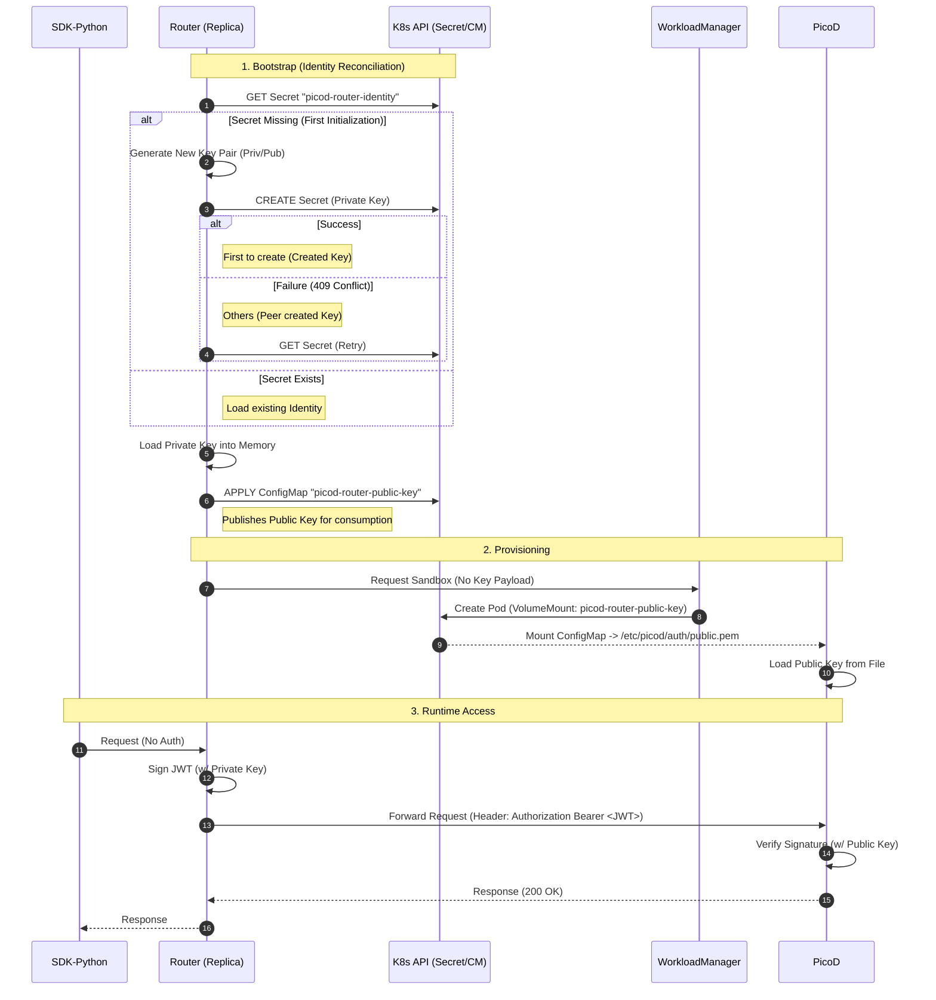

# Picod Plain Authentication Design

Author: Layne Peng

## Motivation

Currently, AgentCube’s `picod` daemon enforces authentication and authorization using a client self-signed key-pair mechanism. This design binds a specific client (agent) directly to a `picod` instance, ensuring a secure, one-to-one relationship. Details of this existing implementation can be found in the [PicoD Authentication & Authorization Design](https://github.com/volcano-sh/agentcube/blob/main/docs/design/picod-proposal.md#3-authentication--authorization).

However, emerging use cases require a more flexible architecture where the client's authentication and authorization are offloaded to an upstream Router or Gateway. In this scenario, the Router is responsible for:
*   Allocating the appropriate built-in service (PicoD) to the user.
*   Managing the security of connections between clients (agents) and the service.

The existing self-signed key-pair model is incompatible with this centralized management flow, as it bypasses the Router's ability to mediate access. To address this, we propose a new **Plain Authentication** mechanism for `picod`. This design enables the Router/Gateway to manage credentials and connection security, simplifying the client-side workflow while maintaining robust access control.
## Use Cases

### Gateway-Managed Sandbox Access

A user requests a sandbox environment using the AgentCube Python SDK. The Router receives this request and validates the user's identity (authorization logic is handled upstream). Upon successful validation, the Router selects and allocates an available PicoD instance. It records the mapping between the specific Session ID and the requesting client. The Router then returns the connection credentials to the client, enabling the Python SDK to establish a direct connection with the PicoD instance using the plain authentication mechanism.

## Design Details

### Architecture Overview

To ensure **High Availability (HA)** across multiple Router replicas and enforce the principle of **Least Privilege**, this design implements a **Shared Identity Model** backed by Kubernetes primitives.

1. **Shared Authority (Router)**:
    
    - All Router replicas share a single cryptographic identity to function as a unified Certificate Authority (CA).
    - **Private Key Storage**: Stored in a Kubernetes Secret (picod-router-identity). This is restricted to the Router namespace/service account.
    - **Public Key Distribution**: Published to a Kubernetes ConfigMap (picod-router-public-key). This is accessible by the WorkloadManager and PicoD instances.
        
2. **Decoupled Provisioning (WorkloadManager)**:
    
    - The WorkloadManager is relieved of cryptographic payload management.
    - It provisions sandboxes by projecting the public identity ConfigMap into the picod container via standard Kubernetes Volume Mounts.
        
3. **Local Verification (PicoD)**:
    
    - picod instances trust the Router by loading the mounted Public Key from the local filesystem at startup.
        

### Workflow Description

The authentication lifecycle is divided into three phases: **Bootstrap**, **Provisioning**, and **Runtime Access**.

#### 1. Bootstrap Phase (Concurrency Control)

Upon startup, every Router replica executes an **Atomic Initialization Routine** to resolve the shared identity. This logic handles race conditions using Kubernetes' optimistic locking capabilities:

1. **Identity Acquisition**: The Router attempts to retrieve the picod-router-identity Secret.
    
    - If Missing: The Router generates a new RSA/ECDSA key pair in memory and attempts to **CREATE** the Secret.
    - Concurrency Handling: If the creation fails with 409 Conflict (implying another replica initialized it simultaneously), the Router discards its generated key and fetches the existing Secret created by the peer.
        
2. **Public Key Publication**: Once the Private Key is successfully loaded, the Router reconciles the picod-router-public-key ConfigMap. It ensures the Public Key in the ConfigMap matches the Private Key in memory.

#### 2. Provisioning Phase

- The **Router** sends a sandbox allocation request to the **WorkloadManager**. Crucially, this request **does not** contain key data.
- The **WorkloadManager** constructs the Pod specification. It includes a volumeMount that projects the picod-router-public-key ConfigMap to a standard path (e.g., /etc/picod/auth/public.pem).
- **PicoD** starts, reads the public key file, and initializes its JWT verifier.

#### 3. Runtime Access Phase

- The **SDK** sends a request to the Router.
- The **Router** validates the request and signs a JSON Web Token (JWT) using the shared Private Key.
- The request is forwarded to **PicoD** with the JWT in the Authorization header.
- **PicoD** verifies the signature using the locally mounted Public Key and processes the request.

### Sequence Diagram

The following diagram illustrates the initialization race condition handling and the resulting authentication flow.



## Data Structures & Configuration

### 1. Kubernetes Resources

The Router manages two primary resources in the installation namespace (e.g., agentcube-system).

**A. Identity Secret (Private)**

- **Name**: picod-router-identity
- **Type**: Opaque
- **Purpose**: Stores the private key shared among Router replicas.


```yaml
apiVersion: v1
kind: Secret
metadata:
  name: picod-router-identity
  namespace: agentcube-system
data:
  # Base64 encoded PKCS#8 Private Key (RSA or ECDSA)
  private.pem: <base64-encoded-key>
```

**B. Identity ConfigMap (Public)**

- **Name**: picod-router-public-key
- **Purpose**: Stores the public key mounted into PicoD instances.

codeYaml

```
apiVersion: v1
kind: ConfigMap
metadata:
  name: picod-router-public-key
  namespace: agentcube-system
data:
  # Plain text Public Key (PEM format)
  public.pem: |
    -----BEGIN PUBLIC KEY-----
    ...
    -----END PUBLIC KEY-----
```

### 2. JWT Token Spec

The Router signs tokens using the standard JWT (RFC 7519) format.

**Header:**
- alg: RS256 (or ES256)
- typ: JWT

**Payload (Claims):**

```json
{
  "iss": "agentcube-router",        // Issuer: Fixed identifier for the Router
  "iat": 1716239000,                // Issued At: Unix timestamp
  "exp": 1716242600,                // Expiration: e.g., +1 hour
  "sub": "client-session-id",       // Subject: Identifies the client/session
  "aud": "picod-service"            // Audience: Intended recipient
}
```

### 3. PicoD Configuration

PicoD will support new flags to enable this mode:

- --auth-mode=plain: Enables the Plain Auth provider.
- --auth-public-key-file: Specifies the path to the trusted key (default: /etc/picod/auth/public.pem).
## Scope & Constraints

### In Scope
1. **Router Identity Management**: Implementation of the "Bootstrap" logic to atomically create/load keys from Kubernetes.    
2. **JWT Implementation**: Signing logic in Router and verification logic in PicoD.
3. **WorkloadManager Updates**: Modifying the Pod Spec generation to include the picod-router-public-key volume mount.
### Out of Scope

1. **Key Rotation**: For this initial version, the key pair is static. If rotation is needed, an administrator must manually delete the Secret/ConfigMap and restart the Routers. Automatic key rotation is deferred to a future release.
2. **Token Revocation**: There is no mechanism to revoke a specific JWT before it expires. Security relies on short expiration intervals.
3. **Fine-Grained RBAC**: Authorization is binary (valid/invalid). Granular permissions within the sandbox (e.g., "read-only access") are not part of this proposal.