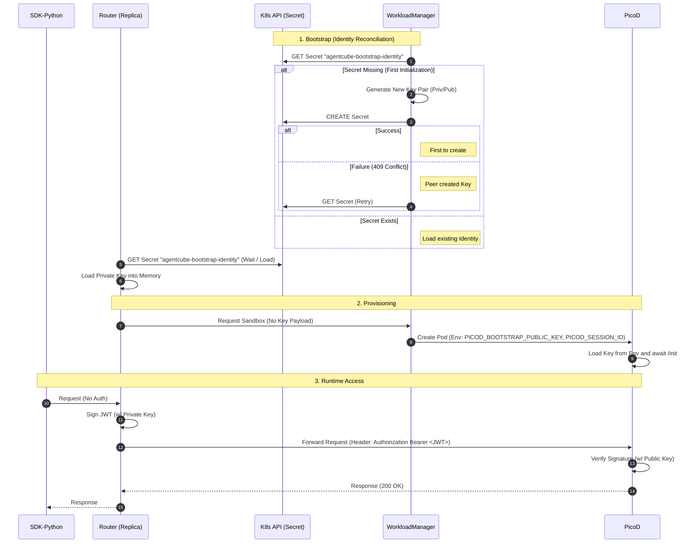

# Picod Plain Authentication Design

Author: Layne Peng

## Motivation

Currently, AgentCube’s `picod` daemon enforces authentication and authorization using a client self-signed key-pair mechanism. This design binds a specific client (agent) directly to a `picod` instance, ensuring a secure, one-to-one relationship. Details of this existing implementation can be found in the [PicoD Authentication & Authorization Design](https://github.com/volcano-sh/agentcube/blob/main/docs/design/picod-proposal.md#3-authentication--authorization).

However, emerging use cases require a more flexible architecture where the client's authentication and authorization are offloaded to an upstream Router or Gateway. In this scenario, the Router is responsible for:
*   Allocating the appropriate built-in service (PicoD) to the user.
*   Managing the security of connections between clients (agents) and the service.

The existing self-signed key-pair model is incompatible with this centralized management flow, as it bypasses the Router's ability to mediate access. To address this, we propose a new **Plain Authentication** mechanism for `picod`. This design enables the Router/Gateway to manage credentials and connection security, simplifying the client-side workflow while maintaining robust access control.

> [!WARNING]
> **Migration Note (Two-Stage Secure Initialization)**
>
> The flow described in this document was updated by PR #352 to address cross-sandbox token replay vulnerabilities. The original `PICOD_AUTH_PUBLIC_KEY` environment variable has been renamed to `PICOD_BOOTSTRAP_PUBLIC_KEY` (formerly `PICOD_AUTH_PUBLIC_KEY`).
>
> While `PICOD_AUTH_PUBLIC_KEY` is still supported as a fallback for backwards compatibility, deployments should migrate to `PICOD_BOOTSTRAP_PUBLIC_KEY`. Under the new model, this key is only used to verify the bootstrap payload during the `/init` handshake, which establishes a unique session keypair for subsequent requests.

## Use Cases

### Gateway-Managed Sandbox Access

A user requests a sandbox environment using the AgentCube Python SDK. The Router receives this request and validates the user's identity (authorization logic is handled upstream). Upon successful validation, the Router selects and allocates an available PicoD instance. It records the mapping between the specific Session ID and the requesting client. The Router then returns the connection credentials to the client, enabling the Python SDK to establish a direct connection with the PicoD instance using the plain authentication mechanism.

## Design Details

### Architecture Overview

To ensure **High Availability (HA)** across multiple Router replicas and enforce the principle of **Least Privilege**, this design implements a **Shared Identity Model** backed by Kubernetes primitives.

1. **Shared Authority (Router & WorkloadManager)**:
    
    - All Router and WorkloadManager replicas share a single cryptographic identity to function as a unified Token Issuer.
    - **Identity Storage**: Stored in a Kubernetes Secret (`agentcube-bootstrap-identity`). The Secret is accessible only by the Router and WorkloadManager components.
    - **Bootstrap Keys**: The Secret contains the RSA private key (`bootstrap-private.pem`) and the public key (`bootstrap-public.pem`) used only during the initial bootstrap handshake.
    - **Per-Session Keys**: During the `/init` handshake, the Router generates a unique ECDSA key pair for the sandbox session. The Router stores the per-session ECDSA private key in the central KV store (Redis/Valkey), while the sandbox PicoD instance holds the ECDSA public key in memory for verification of subsequent request JWTs.
        
2. **Decoupled Provisioning (WorkloadManager)**:
    
    - It provisions sandboxes by injecting the Public Key into the picod container as an Environment Variable (`PICOD_BOOTSTRAP_PUBLIC_KEY`).
        
3. **Local Verification (PicoD)**:
    
    - `picod` instances trust the Router by loading the Public Key directly from the environment variable at startup.
        

### Workflow Description

The authentication lifecycle is divided into three phases: **Bootstrap**, **Provisioning**, and **Runtime Access**.

#### 1. Bootstrap Phase (Concurrency Control)

Upon startup, the WorkloadManager (or Router) executes an **Atomic Initialization Routine** to resolve the shared identity. This logic handles race conditions using Kubernetes' optimistic locking capabilities:

1. **Identity Acquisition**: The WorkloadManager (or Router) attempts to retrieve the `agentcube-bootstrap-identity` Secret.
    
    - If Missing: The component generates a new RSA key pair and attempts to **CREATE** the Secret.
    - Concurrency Handling: If the creation fails with `409 Conflict` (implying another replica initialized it simultaneously), the component discards its generated key and fetches the existing Secret created by the peer.
        
2. **Identity Loading**: Once the Secret is successfully loaded, the Router reads the keys into memory, and the WorkloadManager retrieves the public key for injection.

#### 2. Provisioning Phase

- The **Router** sends a sandbox allocation request to the **WorkloadManager**. Crucially, this request **does not** contain key data.
- The **WorkloadManager** constructs the Pod specification. It retrieves the public key from the `agentcube-bootstrap-identity` Secret and injects it directly as the value of the environment variable `PICOD_BOOTSTRAP_PUBLIC_KEY`. It also injects `PICOD_SESSION_ID` for defense-in-depth token validation.
- **PicoD** starts, reads the key from the **environment**, and waits for the `/init` handshake which establishes the per-session ECDSA keypair.

#### 3. Runtime Access Phase

- The **SDK** sends a request to the Router.
- The **Router** validates the request and signs a JSON Web Token (JWT) using the shared Private Key.
- The request is forwarded to **PicoD** with the JWT in the Authorization header.
- **PicoD** verifies the signature using the locally mounted Public Key and processes the request.

### Sequence Diagram

The following diagram illustrates the initialization race condition handling and the resulting authentication flow.


```mermaid
sequenceDiagram
    autonumber
    participant SDK as SDK-Python
    participant Router as Router (Replica)
    participant K8s as K8s API (Secret)
    participant WM as WorkloadManager
    participant PicoD as PicoD

    Note over WM, K8s: 1. Bootstrap (Identity Reconciliation)
    WM->>K8s: GET Secret "agentcube-bootstrap-identity"
    
    alt Secret Missing (First Initialization)
        WM->>WM: Generate New Key Pair (Priv/Pub)
        WM->>K8s: CREATE Secret
        
        alt Success
            Note right of WM: First to create
        else Failure (409 Conflict)
            Note right of WM: Peer created Key
            WM->>K8s: GET Secret (Retry)
        end
    else Secret Exists
        Note right of WM: Load existing Identity
    end

    Router->>K8s: GET Secret "agentcube-bootstrap-identity" (Wait / Load)
    Router->>Router: Load Private Key into Memory

    Note over Router, PicoD: 2. Provisioning
    Router->>WM: Request Sandbox (No Key Payload)
    WM->>PicoD: Create Pod (Env: PICOD_BOOTSTRAP_PUBLIC_KEY, PICOD_SESSION_ID)
    PicoD->>PicoD: Load Key from Env and await /init

    Note over SDK, PicoD: 3. Runtime Access
    SDK->>Router: Request (No Auth)
    Router->>Router: Sign JWT (w/ Private Key)
    Router->>PicoD: Forward Request (Header: Authorization Bearer <JWT>)
    PicoD->>PicoD: Verify Signature (w/ Public Key)
    PicoD-->>Router: Response (200 OK)
    Router-->>SDK: Response
```

## Data Structures & Configuration

### 1. Kubernetes Resources

The components manage the identity Secret in the installation namespace.

**Identity Secret**

- **Name**: `agentcube-bootstrap-identity`
- **Type**: `Opaque`
- **Purpose**: Stores the bootstrap RSA keypair shared among components.

```yaml
apiVersion: v1
kind: Secret
metadata:
  name: agentcube-bootstrap-identity
  namespace: agentcube-system
data:
  # Base64 encoded RSA Private Key
  bootstrap-private.pem: <base64-encoded-key>
  # Base64 encoded RSA Public Key
  bootstrap-public.pem: <base64-encoded-key>
```

**Per-Session Private Key Storage**
- The dynamic, per-session ECDSA private key is stored in the central KV store (Redis/Valkey) under the key `session:private_key:<sessionID>`. It is encrypted at rest using an AES key derived from the bootstrap RSA private key.

### 2. WorkloadManager Pod Spec

When creating the picod Pod, the WorkloadManager injects the key as follows:

```yaml
apiVersion: v1
kind: Pod
spec:
  containers:
    - name: picod
      env:
        - name: PICOD_BOOTSTRAP_PUBLIC_KEY
          value: "-----BEGIN PUBLIC KEY-----\n...\n-----END PUBLIC KEY-----"
        - name: PICOD_SESSION_ID
          value: "<dynamic-uuid-per-sandbox>"
```
  
### 3. PicoD Configuration
The existing CLI flags for authentication are deprecated.

* Environment Variable: picod requires `PICOD_BOOTSTRAP_PUBLIC_KEY` to be set. `PICOD_SESSION_ID` is also strongly recommended to prevent cross-sandbox token replays.
* Behavior: If the environment variable is present, `picod` initializes the Plain Auth provider. If missing, it fails to start.

### 4. JWT Token Spec

The Router signs tokens using the standard JWT (RFC 7519) format.

**Header:**
- alg: RS256 (or ES256)
- typ: JWT

**Payload (Claims):**

```json
{
  "iss": "agentcube-router",        // Issuer: Fixed identifier for the Router
  "iat": 1716239000,                // Issued At: Unix timestamp
  "exp": 1716242600,                // Expiration: e.g., +1 hour
  "sub": "<dynamic-uuid-per-sandbox>", // Subject: Identifies the client/session
  "aud": "picod-service"            // Audience: Intended recipient
}
```

## Scope & Constraints

### In Scope

1. **Router Identity Management**: Implementation of the "Bootstrap" logic to atomically create/load keys from Kubernetes.
2. **JWT Implementation**: Signing logic in Router and verification logic in PicoD.
3. **WorkloadManager Updates**: Modifying the Pod Spec generation to include the `PICOD_AUTH_PUBLIC_KEY` environment variable.

### Out of Scope

1. **Key Rotation**: For this initial version, the key pair is static. If rotation is needed, an administrator must manually delete the Secret/ConfigMap and restart the Routers. Automatic key rotation is deferred to a future release.
2. **Token Revocation**: There is no mechanism to revoke a specific JWT before it expires. Security relies on short expiration intervals.
3. **Fine-Grained RBAC**: Authorization is binary (valid/invalid). Granular permissions within the sandbox (e.g., "read-only access") are not part of this proposal.
