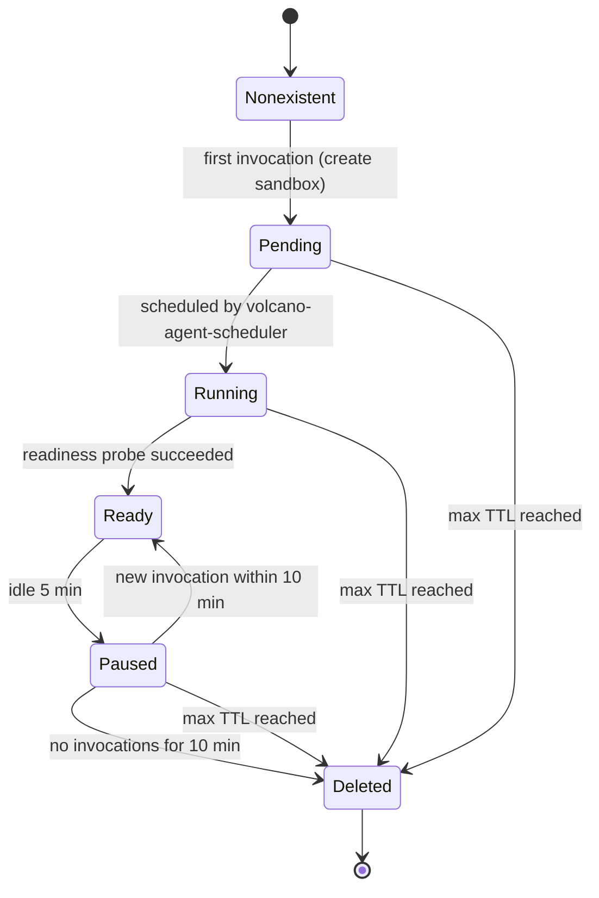
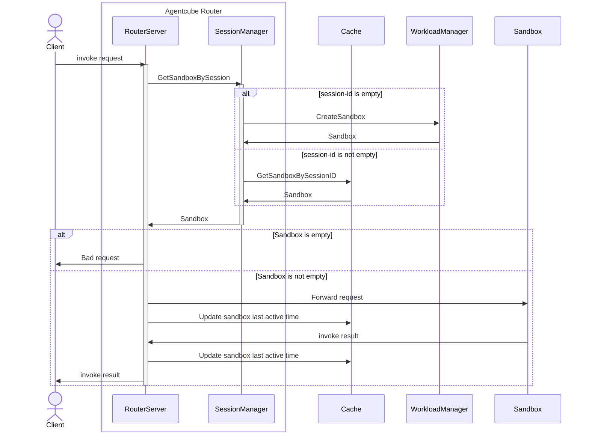
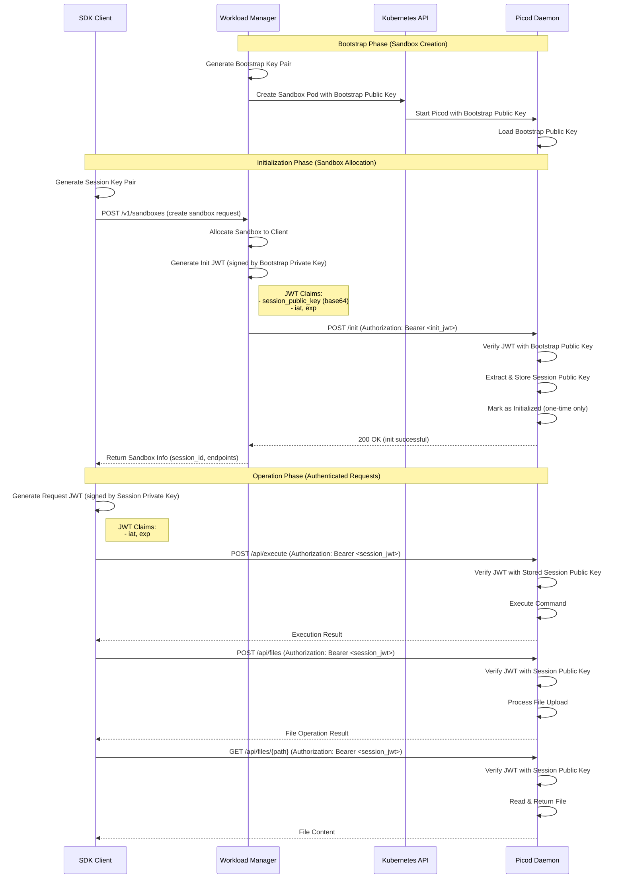

# AgentCube Design Proposal

## Motivation

The rise of AI agents and code interpreters is changing how applications are built and operated. Instead of static services, we now have dynamic, tool-using agents that need to spin up quickly, run short-lived tasks, and interact with GPUs, data stores, and external APIs. However, most Kubernetes-based platforms today are still optimized for long-running microservices—not for ephemeral, high-churn agent workloads.

This creates several gaps:

- Slow cold starts: Spinning up full pods or full stacks for every agent session leads to noticeable latency, making interactive agents feel sluggish and expensive to run at scale.
- Ad-hoc runtimes: Agent runtimes and code interpreters are often embedded directly into applications or wired via bespoke scripts, making them hard to manage, secure, or update across teams.
- Inefficient resource usage: Lightweight, bursty agent workloads end up consuming heavyweight infrastructure primitives, wasting CPU/GPU and complicating autoscaling.
- Lack of a unified abstraction: There is no standardized, Kubernetes-native way to describe, launch, and manage agent sessions, tools, and interpreters as first-class workloads.

What we are proposing is to make agents and interpreters first-class citizens in cloud native infrastructure—with a platform that treats them like “serverless agents” rather than just another pod.

### **Goals**

- First-class agent & code interpreter runtime on Kubernetes  
  Provide a Kubernetes-native platform to define, run, and manage AI agents and code interpreters as first-class workloads, not ad-hoc sidecars or scripts.
- Fast start & serverless experience  
  Optimize for low cold-start latency and bursty, short-lived sessions, giving developers a serverless-like experience (scale-to-zero, event-driven) on top of Kubernetes.
- Safe, isolated execution  
  Run user code and tools in isolated sandboxes with clear resource limits, security boundaries, and lifecycle controls suitable for multi-tenant environments.
- Simple developer-facing abstraction  
  Expose a clean API/CRD or SDK so application teams can request “an agent/runtime with X capabilities” without dealing with pods, nodes, or cluster internals.
- Efficient use of shared infra (CPU/GPU)  
  Integrate with platforms like Volcano and DRA to schedule agent workloads efficiently on heterogeneous resources (CPUs, GPUs, accelerators), minimizing waste.
- Observability and operations for platform teams  
  Provide metrics, logs, and controls so platform/SRE teams can monitor, tune, and govern large-scale agent and interpreter usage.

### **Non-Goals**

- Not an LLM or agent framework  
  AgentCube does not aim to replace LLMs, agent libraries, or orchestration frameworks (e.g., LangChain, LlamaIndex). It focuses on runtime and infrastructure, not model logic.
- Not a replacement for all Kubernetes workloads  
  It is not intended to replace standard Deployments/Jobs for long-running services or classic batch jobs. It targets ephemeral, high-churn agent and code-execution workloads.
- Not a multi-cloud control plane (yet)  
  The initial focus is on running efficiently within Kubernetes clusters. Cross-cloud control and federation are out of scope for the first phase.

## Use Cases

1. Interactive AI agents with low-latency startup
    - Chat- and tool-based agents that must start quickly in response to user requests.
    - On-demand provisioning of agent runtimes, with aggressive cold-start optimization and reuse where possible.
2. Secure, isolated code execution / code interpreter sessions
    - Notebooks, “Run this code” buttons, and REPL-like experiences where user code should be executed in short-lived, isolated sandboxes.
    - Per-session environments with strict resource limits, policy controls, and clear lifecycle management on Kubernetes.
3. Serverless-style agent orchestration
    - Treating each agent invocation as a lightweight, event-driven workload, scheduled on demand and scaled to zero when idle.
    - Integrating with existing Kubernetes primitives (autoscaling, scheduling, observability) while hiding complexity from application developers.
4. Multi-tenant AI platforms
    - Platform teams providing standardized agent and interpreter runtimes to multiple product teams.
    - Central management of runtime images, dependencies, security policies, and quota, while allowing tenants to customize tools and workflows.

## Overall Architecture


### Concepts

1. **API: AgentRuntime**

The CRD specifies the template to build agent runtime sandboxes and also can be used to specify the port, protocol, and url path that agent will be running with.

2. **API: CodeInterpreter**

The CRD specifies the template to build code interpreter sandboxes and also can be used to specify the port, protocol, and url path that code interpreter will be running with.
While `AgentRuntime` focuses on complicated conversational agents that could need more permissions like volume binding, credential mount, etc, `CodeInterpreter` is optimized for secure, short-lived code execution (for notebooks, REPLs, or “run code” actions) with stricter filesystem and policy controls. Both share the same sandbox infrastructure but target different execution patterns.

3. **Component: Agentcube Router**

A data plane component responsible for authentication, authorization, rate limiting, and request routing for AgentRuntime, CodeInterpreter, and MCP tool invocations.

4. **Component: Workload Manager**

A control plane component that is responsible for sandbox creation/deletion, warmpool management and idle-session garbage collection.

5. **Component: Session Store  (Redis/ValKey)**

A global shared session storage that synchronizes session state across Agentcube Router replicas. The Workload Manager also uses it to coordinate sandbox lifecycle events and perform cleanup.

6. **Session:**

A session represents an abstract instance of an agent runtime or code interpreter. You can think of it as the lifetime of that agent or interpreter, during which it can handle one or more invocations.

AgentCube isolates every session to enable secure, consistent reuse of context across multiple tool invocations. This isolation is critical for AI agent workloads, which often involve dynamic, multi-step execution.

Each tool session runs inside its own microVM with dedicated CPU, memory, and filesystem resources. This design ensures that one user’s invocation cannot access data from another user’s session. When the session ends, the microVM is fully terminated and its memory is sanitized, eliminating the risk of cross-session data leakage.

The session concept here is different from that from the view of agent application. From agent’s view, a session is the unit of conversational context. Within that session, the agent keeps state and memory so it can:

  - Remember previous user messages
  - Track intermediate results and tool/API calls
  - Maintain task progress (e.g., a multi-step workflow)

7. **Sandbox:**

A sandbox is a physical instance running as a secure, isolated microVM. In AgentCube, we serve only one session within a sandbox, which means session and sandbox have a 1:1 mapping. Sandboxes can be automatically reclaimed after session timeout.

## API Design

Refer to API Definition for AgentRuntime and CodeInterpreterRuntime: [API Definition](https://github.com/volcano-sh/agentcube/pull/44)

### **How to invoke Agent and CodeInterpreter**

**Prerequisites**: Before using AgentRuntime or CodeInterpreter, users need to first create an `AgentRuntime` or `CodeInterpreter` resource in Kubernetes.

1. AgentRuntime Invocation

After `AgentRuntime` is created, user/client can invoke the agent through Agentcube Router with the URL below:

```
https://<agentcube-router-addr>:<port>/v1/namespaces/{agentNamespace}/agent-runtimes/{agentName}/invocations/<agent custom path>
```

Agentcube Router automatically requests a sandbox from the Workload Manager when the `x-agentcube-session-id` header is missing, creates the dedicated microVM-based sandbox, and returns the new session ID in the response.

Next time, the client can invoke the same agent instance by taking `x-agentcube-session-id` received in the request header.

2. CodeInterpreter Invocation

CodeInterpreter invocations share the same single entrypoint. When the session header is absent, Agentcube Router contacts the Workload Manager to allocate or warm a sandbox and returns the newly created session ID in the response.

```
https://<agentcube-router-addr>:<port>/v1/namespaces/{namespace}/code-interpreters/{name}/invocations/<custom path>
```

Subsequent calls reuse the session by including the `x-agentcube-session-id` header. Users never invoke the Workload Manager APIs directly; that service remains internal and is managed by Agentcube Router.

## Sandbox Lifecycle

- Sandbox state transitions for invocations:
  - New sandbox: `Nonexistent` → `Pending` → `Running` → `Ready`
  - Once Ready, invocations are served directly.
- Resource optimization:
  - If no invocations for 5 minutes, the sandbox goes `Ready` → `Paused` to reduce resource usage.
  - If there’s still no traffic after 10 minutes in `Paused`, it goes `Paused` → `Deleted`.
- Fast reuse vs. eventual cleanup:
  - If a new invocation arrives during the pause window, the sandbox resumes `Paused` → `Ready` and reuses existing context.
  - Regardless of usage patterns, the max TTL ensures that after (for example) 8 hours, the sandbox is always deleted.




## 3 Agentcube Router

### 3.1 API Design

1. **Agent Runtime Invocation**

```
POST /v1/namespaces/{namespace}/agent-runtimes/{name}/invocations/*path
```

- Headers: `x-agentcube-session-id` (optional, creates new session if empty)

- Forwards request to AgentRuntime sandbox

- Response includes `x-agentcube-session-id` header

2. **Code Interpreter Invocation**

```
POST /v1/namespaces/{namespace}/code-interpreters/{name}/invocations/*path
```

- Headers: `x-agentcube-session-id` (optional, creates new session if empty)

- Forwards request to CodeInterpreter sandbox

- Response includes `x-agentcube-session-id` header

### 3.2 Agentcube Router workflow



Invocation Request Processing:

1. Extract Session ID: Read `x-agentcube-session-id` from request header
2. Get Sandbox Info: Agentcube Router calls SessionManager.GetSandboxBySession()
   - If session ID is empty: SessionManager creates a new sandbox via Workload Manager
   - If session ID exists: SessionManager retrieves sandbox metadata from Redis
3. Select Endpoint: Match request path with sandbox entry points
   - Finds entry point with matching path prefix
   - Falls back to first entry point if no match
   - Adds protocol prefix if not present (e.g., http://)
4. Update Activity: Record session activity in Redis (before and after forwarding)
5. Forward Request: Agentcube Router uses a reverse proxy to forward to sandbox
   - Preserves original request method, headers, and body
   - Sets X-Forwarded-Host and X-Forwarded-Proto headers
   - Uses connection pooling for efficiency
6. Return Response: Forward sandbox response to client
   - Always includes `x-agentcube-session-id` in response header
   - Preserves original response status and body

## 4 Workload Manager

### 4.1 API Design

1. **Create AgentRuntime**

```
POST /v1/agent-runtime
{
  "namespace": "string", // agentruntime CR namespace, required
  "name": "string",      // agentruntime CR name, required
}
```

Response:

```json
{
  "sessionId": "7f8b9c0d1e2f3g4h5i6j7k8l9m0n",    // session id bound to sandbox
  "sandboxId": "abc123def456ghi789jkl012mno345",  // sandbox id
  "sandboxName": "my-sandbox",
  "entryPoints": [
    {
      "path": "/api/v1",            // invoke path
      "protocol": "http",           // protocol
      "endpoint": "127.0.0.1:8443"  // invoke endpoint
    }
  ]
}
```
2. **Delete AgentRuntime**

```
DELETE /v1/agent-runtime/sessions/{sessionid}
```


3. **Create CodeInterpreter**

```
POST /v1/code-interpreter

{
  "namespace": "string", // codeinterpreter CR namespace, required
  "name": "string",      // codeinterpreter CR name, required
}
```
Response body:

```json
{
  "sessionId": "7f8b9c0d1e2f3g4h5i6j7k8l9m0n",    // session id bound to sandbox
  "sandboxId": "abc123def456ghi789jkl012mno345",  // sandbox id
  "sandboxName": "my-sandbox",
  "entryPoints": [
    {
      "path": "/api/v1",            // invoke path
      "protocol": "http",           // protocol
      "endpoint": "127.0.0.1:8443"  // invoke endpoint
    }
  ]
}
```

4. **Delete CodeInterpreter**

```
DELETE /v1/code-interpreter/sessions/{sessionid}
```

### 4.2 Architecture and Components

#### Sandbox APIServer

The Sandbox APIServer provides interfaces for creating and deleting Agents and CodeInterpreters to manage Sandboxes.

This component creates corresponding Sandboxes, generates and binds SessionIDs based on the AgentRuntime or CodeInterpreter CRs specified in your request, and then persists the SessionID and Sandbox information to the KV storage. Once the Sandbox is ready, it returns the Sandbox information, access endpoint, and SessionID for you to subsequently access the Sandbox.

For creation requests of the CodeInterpreter type, the Sandbox API Server also performs the corresponding initialization actions.

Specifically, if the `WarmpoolSize` configured for the CodeInterpreter is greater than 0, the Sandbox API Server will create a `SandboxClaim` instead of a `Sandbox` directly.

When creation fails, the Sandbox API Server automatically reclaims the underlying sandbox resources to prevent resource leakage. If the sandbox reclamation operation also fails, the garbage collection module will continue to delete sandboxes until all of them are removed.

#### Runtime Controller

The Runtime Controller watches `AgentRuntime`, `CodeInterpreter`, `Sandbox` resources. It allows the Sandbox APIServer to obtain the status of a Sandbox as soon as possible. When the SandboxController detects that a Sandbox resource has transitioned to the `Running` state, it immediately sends a notification to the Sandbox APIServer.

The CodeInterpreter Controller is responsible for automatically managing SandboxTemplate and SandboxWarmPool resources based on WarmPoolSize configuration to enable fast sandbox allocation for code interpreter sessions:

1. If WarmPoolSize > 0: creates/updates SandboxTemplate (defines pod spec of warm pool) and SandboxWarmPool (maintains pool of pre-warmed Pods).

2. If WarmPoolSize is 0 or nil: deletes corresponding SandboxWarmPool and SandboxTemplate, if exists.

#### Garbage Collection Module

The garbage collection module periodically retrieves sandboxes that have reached their maximum lifetime and sandboxes that have reached their maximum idle time from the KV storage. It then calls the corresponding API to delete the sandbox or sandbox claim resources. After successful deletion, the corresponding records are permanently removed from the KV storage.

For SandboxClaim resources, the garbage collector is only responsible for deleting the CR records of SandboxClaims.

#### WarmPool

The SandboxWarmPool maintains a pool of pre-warmed, ready-to-use Sandbox Pods. This eliminates cold-start latency by keeping Pods in a ready state, avoiding image pulling and container startup delays.

When a new CodeInterpreter session is requested with warm pool enabled:

1. SandboxClaim Creation: The system creates a SandboxClaim resource that references the SandboxTemplate by name.

2. Pod Adoption: The agent-sandbox controller (third-party, all sandbox-related CRDs and controllers are provided by the [kubernetes-sigs/agent-sandbox](https://github.com/kubernetes-sigs/agent-sandbox) project.) watches SandboxClaim resources and:

- Identifies available Pods in the corresponding SandboxWarmPool
- Adopts a pre-warmed Pod from the pool
- Creates a Sandbox resource that owns the adopted Pod
- Updates SandboxClaim status to reflect the bound Sandbox

3. Pool Replenishment: The warm pool controller automatically creates a replacement Pod to maintain the desired pool size.

This adoption mechanism provides near-instantaneous Sandbox availability since the Pod is already running and ready.

#### Session Registry & Cache

Workload Manager persists session metadata (session ID, sandbox ID, endpoints, and expiration timestamps) in a session registry. This registry powers two flows:

1. Agentcube Router uses the cache path for fast read access when a client reuses a session ID.
2. Background reconcilers scan the registry to identify expired sessions and trigger sandbox reclamation.

All writes go through the Sandbox API Server to guarantee that the registry and the Kubernetes state remain consistent, even if a sandbox creation or deletion fails mid-flight.

### 4.3 Workflow


## 5 CodeInterpreter Design

The CodeInterpreter is a component responsible for executing code snippets or commands in a secure and isolated environment (sandbox). Picod is the daemon running inside each sandbox that handles code execution requests, which is a lightweight process manager optimized for fast startup and low resource consumption.

### 5.1 API design

Initialization

- POST /init - Initialize sandbox with session public key (one-time only)
  - Request: JWT signed by bootstrap private key containing session public key
  - Response: JSON confirmation message
  - Access: Workload Manager only

Command Execution

- POST /api/execute - Execute command and return output
  - Request: JSON with command, timeout, env vars
  - Response: JSON with stdout, stderr, exit_code
  - Authentication: Session JWT required

- POST /api/files - Upload file
  - Request: multipart/form-data or JSON with base64 content
  - Response: JSON with file info
  - Authentication: Session JWT required
- GET /api/files/{path} - Download file
  - Request: File path in URL
  - Response: File content with appropriate Content-Type
  - Authentication: Session JWT required
- GET /api/files - List files in directory
  - Request: Query parameter path for directory
  - Response: JSON array of file information
  - Authentication: Session JWT required

Health Check

- GET /health - Server health status
  - Response: JSON with status and uptime
  - Authentication: None (public endpoint)

### 5.2 Picod Workflow

