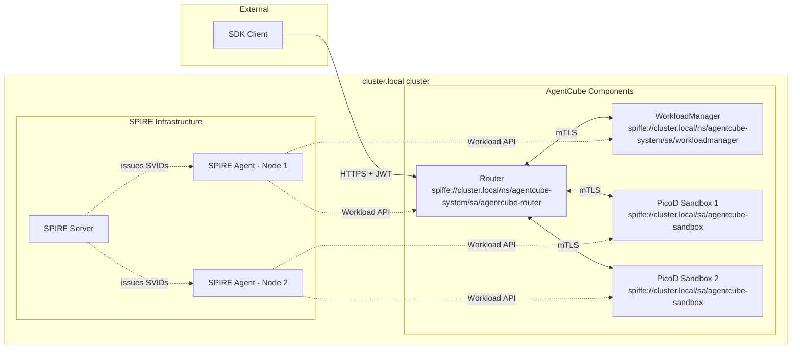
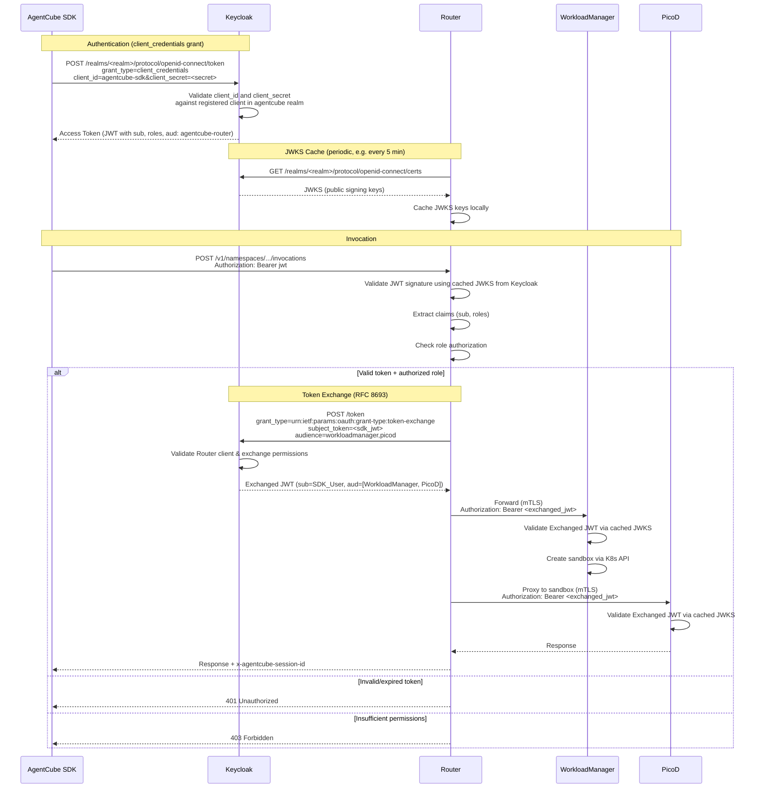
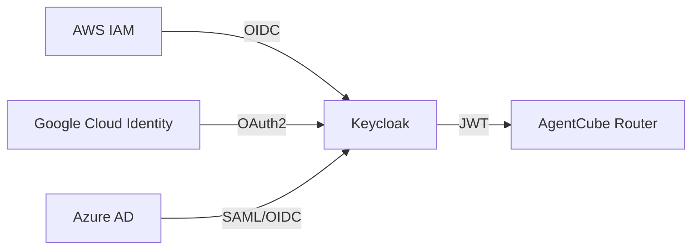

# AgentCube Authentication and Authorization Design

Author: Mahil Patel

## Motivation

AgentCube currently has partial, ad-hoc authentication between its internal components but lacks a unified security model. The existing mechanisms are:

1. **Workload Manager Auth** (`pkg/workloadmanager/auth.go`): Optional Kubernetes TokenReview-based ServiceAccount token validation, gated behind `config.EnableAuth`, plus per-sandbox ownership checks using the extracted user identity (effectively relying on Kubernetes RBAC when using the user-scoped client).
2. **Router → PicoD Auth** (`PicoD-Plain-Authentication-Design`): A custom RSA key-pair scheme where the Router signs JWTs and PicoD verifies them using a public key exposed via the `PICOD_AUTH_PUBLIC_KEY` environment variable. The key pair (`private.pem`, `public.pem`) is stored in the `picod-router-identity` Secret, and the WorkloadManager reads this Secret to inject the public key into PicoD pods. This works for the Router→PicoD channel but leaves other internal channels unauthenticated.
3. **Router → WorkloadManager**: Optional, one-sided authentication. `pkg/router/session_manager.go` can attach a `Authorization: Bearer <serviceaccount token>` header, and WorkloadManager can validate it when `--enable-auth` is enabled. This is not mutual workload identity or a zero-trust model, and when auth is disabled any pod on the cluster network can call the WorkloadManager API.
4. **External Clients → Router**: No authentication. The `handleInvoke` handler in `pkg/router/handlers.go` processes incoming requests without verifying the caller's identity.

These gaps amount to three distinct problems:

- **Internal (machine-to-machine):** Components trust each other implicitly based on network reachability. A compromised or rogue pod on the same network can impersonate any component.
- **External (user-to-platform):** Anyone who can reach the Router endpoint can invoke sandboxes, with no identity verification and no audit trail.
- **Authorization & Isolation:** Even where authentication exists, there is no mechanism to control what an authenticated identity is allowed to do. There are no roles, no permission checks, no namespace-scoped access control, and no resource-level tenant isolation (preventing User A from invoking User B's sandbox).

This proposal addresses all three problems using CNCF industry-standard tooling.

### Goals

- Establish zero-trust, mutually authenticated communication between all AgentCube internal components (Router, WorkloadManager, PicoD) using X.509 mTLS.
- Provide external client/SDK authentication at the Router level via an industry-standard identity provider.
- Implement role-based access control (RBAC) for external users using Keycloak's built-in authorization capabilities.
- Enforce resource-level tenant isolation to guarantee users can only access sandboxes they created or that are shared with their group.
- Keep all new auth features opt-in behind configuration flags so existing deployments are unaffected.
- Minimize per-request latency overhead from authentication and authorization.
- Supersede the existing PicoD-Plain-Authentication key distribution mechanism with automated certificate lifecycle management.

## Use Cases

1. **Zero-trust internal communication**
   A platform team deploys AgentCube into a shared Kubernetes cluster. They need assurance that only legitimate Router pods can call the WorkloadManager, and only legitimate Router/WorkloadManager pods can communicate with PicoD sandboxes - even if other workloads share the same cluster network.

2. **Authenticated SDK access**
   A development team uses the AgentCube Python SDK to run code interpreters. The Router should verify the developer's identity before creating or routing to sandboxes, and reject unauthenticated or unauthorized requests.

3. **Role-based sandbox access control**
   A platform administrator needs to restrict which users can invoke sandboxes versus which users can create or delete AgentRuntime and CodeInterpreter resources. A developer with the `sandbox:invoke` role should be able to run code but not modify runtime definitions.

4. **Enterprise identity integration**
   An organization already uses AWS IAM / Google Cloud Identity / Azure AD to manage developer identities. They want their developers to authenticate with AgentCube using their existing cloud credentials, without creating a separate set of accounts.

---

## Design Details

The design is structured in four layers, ordered by priority:

| Priority | Layer | Problem | Solution |
|---|---|---|---|
| P1 (Urgent) | Internal workload identity | Machine-to-machine trust between Router, WorkloadManager, PicoD | X.509 mTLS (SPIRE recommended, file-based certs also supported) |
| P2 | External user authentication | Client/SDK identity verification at the Router | Keycloak (OIDC/OAuth2) |
| P3 | Authorization | Role-based access control for external users | Keycloak realm roles (JWT claim checking) |
| P4 (Stretch) | Cloud provider federation | Enterprise SSO via cloud IAM | Keycloak identity brokering |

---

## 1. Internal Workload Authentication (X.509 mTLS)

Internal communication between AgentCube components is secured using mutual TLS (mTLS) with X.509 certificates. The mTLS enforcement layer is **certificate-source agnostic** - it works with any valid X.509 cert/key/CA bundle, regardless of how the certificates are provisioned. Two certificate source modes are supported:

| Mode | Certificate Source | Rotation | Best For |
|---|---|---|---|
| **SPIRE** (recommended) | SPIRE Workload API issues short-lived SVIDs automatically | Automatic (default: 1 hour TTL) | Production deployments needing zero-touch certificate management |
| **File-based** | Certs loaded from disk (provisioned by cert-manager, self-signed CA, Let's Encrypt, corporate PKI, etc.) | Manual or delegated to the provisioning tool | Environments where SPIRE is not available, or operators prefer existing PKI infrastructure |

Configuration flags for each component:

```
--mtls-cert-file=<path>          
--mtls-key-file=<path>           
--mtls-ca-file=<path>            
```

The application simply loads the certificates directly from the paths provided via the `mtls-*-file` CLI flags.

These cert/key/CA files can be populated on disk by any mechanism - for example, the SPIFFE Helper sidecar syncing SVIDs to disk, a Kubernetes Secret mounted as a volume (managed by cert-manager), or static files for development. The mTLS enforcement (requiring client certs, verifying peer identity) is identical in all cases.

### 1.1 SPIRE Background

[SPIFFE](https://spiffe.io/) (Secure Production Identity Framework for Everyone) is a CNCF graduated project that provides a standard for service identity. It defines:

- **SPIFFE ID:** A URI-formatted identity, e.g., `spiffe://cluster.local/ns/agentcube-system/sa/agentcube-router`
- **SVID (SPIFFE Verifiable Identity Document):** An X.509 certificate or JWT that proves a workload holds a given SPIFFE ID.

[SPIRE](https://spiffe.io/docs/latest/spire-about/spire-concepts/) is the production implementation of SPIFFE. It has two components:

- **SPIRE Server:** Central signing authority. Manages registration entries (which selectors map to which SPIFFE IDs) and issues SVIDs to agents.
- **SPIRE Agent:** Runs on every node (DaemonSet). Performs workload attestation, verifying process identity by querying the kernel and kubelet, and delivers SVIDs to local workloads via a Unix domain socket (the Workload API).

SPIRE handles the entire certificate lifecycle (issuance, rotation, revocation) automatically. Workloads receive certificates through the Workload API and they are rotated before they expire.

### 1.2 Why Single-Cluster SPIRE

This design uses a single-cluster SPIRE deployment with one SPIRE Server and a set of SPIRE Agents within a single Kubernetes cluster. Multi-cluster SPIRE federation is not included for the following reasons:

- **AgentCube's deployment model is single-cluster.** All internal components (Router, WorkloadManager, PicoD sandboxes) run within the same Kubernetes cluster. There is no cross-cluster RPC to secure today.
- **Federation introduces significant complexity.** Multi-cluster SPIRE requires configuring separate trust domains per cluster, setting up bundle exchange between SPIRE Servers, and managing cross-cluster network connectivity. This overhead is not justified when all workloads share a single trust boundary.
- **Incremental adoption is safer.** Establishing a solid single-cluster identity foundation first allows the team to gain operational experience with SPIRE before taking on the complexity of federation. If AgentCube later evolves to support distributed routing across clusters, SPIRE federation can be layered in without rewriting the core mTLS integration.

### 1.3 Trust Domain and Identity Assignment

All AgentCube components operate under a single trust domain:

```
spiffe://cluster.local
```

Each component receives a unique SPIFFE ID following the Istio-convention format `spiffe://<trust-domain>/ns/<namespace>/sa/<service-account>`, which encodes the workload's Kubernetes namespace and service account directly in the URI path.

SPIRE uses **selectors** to verify workload identity during attestation. When a workload requests its certificate, the SPIRE Agent inspects the workload's Kubernetes metadata (namespace, service account, labels) and matches it against registered selectors. A workload only receives its SVID if all registered selectors match.

| Component | SPIFFE ID | Selectors |
|---|---|---|
| Router | `spiffe://cluster.local/ns/agentcube-system/sa/agentcube-router` | `k8s:ns:agentcube-system`, `k8s:sa:agentcube-router` |
| WorkloadManager | `spiffe://cluster.local/ns/agentcube-system/sa/workloadmanager` | `k8s:ns:agentcube-system`, `k8s:sa:workloadmanager` |
| PicoD (Sandboxes) | `spiffe://cluster.local/sa/agentcube-sandbox` | `k8s:pod-label:app:picod`, `k8s:sa:agentcube-sandbox` |

> **Note:** PicoD cannot use a namespace selector because sandbox pods are created in the namespace specified by the user's request, not in a fixed namespace. To prevent identity spoofing in multi-tenant clusters, PicoD registration requires both the `app:picod` pod label and a dedicated `agentcube-sandbox` ServiceAccount. WorkloadManager creates this ServiceAccount in the target namespace as part of sandbox provisioning. Using a specific ServiceAccount requires RBAC permission, preventing arbitrary workloads from obtaining the PicoD SPIFFE ID.
>
> **Security Hardening:** For multi-tenant clusters, operators are encouraged to deploy a `ValidatingAdmissionPolicy` (or equivalent policy engine rule) that restricts the `app: picod` label to pods created by the WorkloadManager ServiceAccount. This provides defense-in-depth beyond the ServiceAccount selector.

### 1.4 SPIRE Deployment

#### SPIRE Server

Deployed as a `StatefulSet` in `agentcube-system`. The StatefulSet runs two critical containers: the SPIRE Server itself, and the SPIRE Controller Manager sidecar. 
* It is configured to use the **`k8s_psat` Node Attestor** to verify agent node identity via Projected Service Account Tokens.
* The default X.509 **SVID TTL is configured to 1 hour** to limit the blast radius of compromised keys and enforce rapid, transparent auto-renewal.

#### SPIRE Agent

Deployed as a `DaemonSet` (one agent per node). Each agent:
1. Exposes the Workload API socket locally at `/run/spire/sockets/agent.sock`.
2. Uses the native **`k8s` Workload Attestor** to verify workload identity securely by querying the local kubelet for pod metadata (namespaces, labels, service accounts).

#### SPIRE Controller Manager

The [SPIRE Controller Manager](https://github.com/spiffe/spire-controller-manager) watches for `ClusterSPIFFEID` custom resources and automatically syncs registration entries to the SPIRE Server. This makes workload registration fully declarative and is the recommended approach for production deployments.

**Architectural Deployment Details:**
- **Sidecar Pattern:** The Controller Manager must be deployed as a sidecar container operating strictly within the `spire-server` `StatefulSet` pod. This guarantees it has direct, shared-memory-speed filesystem access to the SPIRE Server's private API Domain Socket (`/tmp/spire-server/private/api.sock`).
- **Shared RBAC:** Running as a sidecar implies it natively shares the `spire-server` Kubernetes ServiceAccount. The corresponding `ClusterRole` must amalgamate all required permissions. For defense-in-depth security, RBAC privileges are strictly scoped (for example, explicitly restricting webhook patching by `resourceNames`).
- **Validating Webhook Bootstrap:** The Controller Manager natively enforces CRD schema validation via an internal webhook server. To support a seamless "One-Click" Helm installation workflow where CRDs and the Controller are deployed simultaneously, a blank `ValidatingWebhookConfiguration` explicitly configured with `failurePolicy: Ignore` is pre-provisioned via the Helm chart. This actively bypasses the classic "chicken-and-egg" deployment race condition where Kube-Apiserver attempts to validate freshly submitted `ClusterSPIFFEID` CRDs before the sidecar has even finished booting to inject its own dynamic TLS CA bundle.

**End-to-End Identity Workflow:**
To clarify how Node and Workload registration coordinate in this architecture:
1. **Node Registration (Self-Registration):** The SPIRE Agent boots on a worker node and *automatically self-registers* to the SPIRE Server by presenting its Kubernetes PSAT (Projected Service Account Token) to prove it is a legitimate node.
2. **Workload Registration (Controller):** The cluster admin (or Helm chart) applies `ClusterSPIFFEID` CRDs. The Controller Manager watches these and translates them into registration entries on the SPIRE Server API (e.g., "pods with `app: picod` are allowed to get this SPIFFE ID").
3. **Workload Attestation (Delivery):** When a pod boots, its `spiffe-helper` sidecar connects to the local SPIRE Agent. The Agent queries the Kubelet to verify the pod's labels and ServiceAccount, matches them against the Controller's registered rules, and mints the SVID certificate.

### 1.5 Workload Registration

Registration entries tell the SPIRE Server which workloads should receive which SPIFFE IDs. There are two approaches depending on the environment:

#### Production: ClusterSPIFFEID CRDs (Recommended)

With the SPIRE Controller Manager deployed, registration entries are defined as Kubernetes CRDs. These are managed declaratively alongside other AgentCube manifests and are automatically synced to the SPIRE Server:

```yaml
# Router registration
apiVersion: spire.spiffe.io/v1alpha1
kind: ClusterSPIFFEID
metadata:
  name: agentcube-router
spec:
  spiffeIDTemplate: "spiffe://cluster.local/ns/{{ .PodMeta.Namespace }}/sa/{{ .PodSpec.ServiceAccountName }}"
  podSelector:
    matchLabels:
      app: agentcube-router
  namespaceSelector:
    matchLabels:
      kubernetes.io/metadata.name: agentcube-system
---
# WorkloadManager registration
apiVersion: spire.spiffe.io/v1alpha1
kind: ClusterSPIFFEID
metadata:
  name: workloadmanager
spec:
  spiffeIDTemplate: "spiffe://cluster.local/ns/{{ .PodMeta.Namespace }}/sa/{{ .PodSpec.ServiceAccountName }}"
  podSelector:
    matchLabels:
      app: workloadmanager
  namespaceSelector:
    matchLabels:
      kubernetes.io/metadata.name: agentcube-system
---
# PicoD registration (namespace-agnostic)
apiVersion: spire.spiffe.io/v1alpha1
kind: ClusterSPIFFEID
metadata:
  name: agentcube-sandbox
spec:
  spiffeIDTemplate: "spiffe://cluster.local/sa/{{ .PodSpec.ServiceAccountName }}"
  podSelector:
    matchLabels:
      app: picod
```

#### Development: Manual CLI

For local development (e.g., `kind` clusters), registration entries can be created manually by exec-ing into the SPIRE Server pod:

```bash
kubectl exec -n agentcube-system <spire-server-pod> -- \
  spire-server entry create \
    -spiffeID spiffe://cluster.local/ns/agentcube-system/sa/agentcube-router \
    -parentID spiffe://cluster.local/spire-agent \
    -selector k8s:ns:agentcube-system \
    -selector k8s:sa:agentcube-router

kubectl exec -n agentcube-system <spire-server-pod> -- \
  spire-server entry create \
    -spiffeID spiffe://cluster.local/ns/agentcube-system/sa/workloadmanager \
    -parentID spiffe://cluster.local/spire-agent \
    -selector k8s:ns:agentcube-system \
    -selector k8s:sa:workloadmanager

kubectl exec -n agentcube-system <spire-server-pod> -- \
  spire-server entry create \
    -spiffeID spiffe://cluster.local/sa/agentcube-sandbox \
    -parentID spiffe://cluster.local/spire-agent \
    -selector k8s:pod-label:app:picod \
    -selector k8s:sa:agentcube-sandbox
```

> **Note:** Manual CLI entries are stored in the SPIRE Server's datastore (SQLite by default). They survive restarts if the datastore is backed by persistent storage, but are harder to manage and audit compared to the declarative CRD approach.

#### Attestation Flow (Example: Router)

1. Router process connects to the local SPIRE Agent via `/run/spire/sockets/agent.sock`
2. Agent identifies the calling process via PID and queries the kubelet for pod metadata (namespace, service account, labels)
3. Agent matches the discovered selectors against registration entries fetched from the Server
4. Match found → Agent issues an X.509 SVID with `spiffe://cluster.local/ns/agentcube-system/sa/agentcube-router` as URI SAN
5. Router receives a TLS certificate, private key, and trust bundle - ready to serve and initiate mTLS

> **Latency Considerations for Sandbox Provisioning:**
> For long-lived control plane components (Router, WorkloadManager), attestation and TLS handshake latency is negligible since connections are persistent and handshakes are amortized over thousands of requests. For short-lived PicoD sandboxes, two sources of latency must be considered:
>
> 1. **Attestation latency (~200-500ms):** The `spiffe-helper` sidecar fetches the SVID concurrently with PicoD's own container initialization, so this overlaps with pod startup rather than blocking it. The file-based certificate mode (Section 1.6) eliminates this entirely by pre-provisioning certificates as Kubernetes Secrets.
> 2. **TLS handshake latency (~20-50ms per new connection):** Each new mTLS connection between the Router and a PicoD sandbox requires a full TLS handshake (certificate exchange, chain verification, key negotiation). For Code Interpreters targeting ~100ms bootstrap latency, this overhead is significant.
>
> For latency-critical scenarios (Code Interpreters, agentic RL training loops), the Router→PicoD channel supports **JWT-based authentication** as an alternative to mTLS (see Section 1.10). JWT auth uses plain HTTP with an `Authorization: Bearer` header, eliminating the TLS handshake entirely. Combined with warm pools, this ensures the auth system adds near-zero latency to sandbox invocations.

### 1.6 File-Based Provisioning (cert-manager)

While SPIRE handles identity attestation dynamically, file-based provisioning relies on static Kubernetes Secrets. [cert-manager](https://cert-manager.io/) is the recommended implementation for this mode. It explicitly demonstrates that the architecture is fully certificate-source agnostic.

Administrators declaratively provision SPIFFE-compliant certificates by defining a `Certificate` CRD that explicitly maps the required `uris` field to the Istio-convention SPIFFE ID defined in Section 1.3:

```yaml
apiVersion: cert-manager.io/v1
kind: Certificate
metadata:
  name: agentcube-router-cert
  namespace: agentcube-system
spec:
  secretName: router-mtls-secret
  duration: 2160h # 90 days
  renewBefore: 360h # 15 days
  privateKey:
    algorithm: ECDSA
    size: 256
    rotationPolicy: Always # Critical: Generates a new private key on every renewal for forward secrecy
  usages:
    - server auth
    - client auth
  # Optional: dnsNames are not strictly required for SPIFFE identity verification, 
  # but are included to maintain standard HTTPS service discovery compatibility.
  dnsNames:
    - agentcube-router.agentcube-system.svc.cluster.local
  uris:
    - spiffe://cluster.local/ns/agentcube-system/sa/agentcube-router
  issuerRef:
    # Must be a CA or Vault issuer that natively injects the 'ca.crt' field into the resulting Secret
    name: internal-ca-issuer
    kind: ClusterIssuer
```

cert-manager continuously monitors this CRD, automatically signs the requested certificate using the cluster's internal CA, and manages the resulting `router-mtls-secret` Secret on disk. The administrator simply mounts this Secret into the AgentCube pod and passes the mapped paths directly into the component's CLI flags:

```yaml
      containers:
      - name: router
        args:
        - "--mtls-cert-file=/etc/agentcube/certs/tls.crt"
        - "--mtls-key-file=/etc/agentcube/certs/tls.key"
        - "--mtls-ca-file=/etc/agentcube/certs/ca.crt"
        volumeMounts:
        - name: mtls-certs
          mountPath: "/etc/agentcube/certs"
          readOnly: true
      volumes:
      - name: mtls-certs
        secret:
          secretName: router-mtls-secret
```

This fully satisfies the underlying identity requirements without deploying any SPIRE infrastructure. However, operators should carefully weigh the security tradeoff: file-based `cert-manager` systems generally rely on slower, static renewal cycles (e.g., 90 days), whereas SPIRE natively provides highly dynamic, short-lived SVID rotation (1 hour TTL).

### 1.7 mTLS Integration

Each component needs two changes: configure its server to require client certificates, and configure its clients to present its own certificate while verifying the server's. The mTLS implementation uses Go's standard `crypto/tls` package - no external libraries are required.

Regardless of the certificate source (SPIRE or file-based), the cert/key/CA files end up on disk and the Go code is identical. When using SPIRE, the [SPIFFE Helper](https://github.com/spiffe/spiffe-helper) sidecar writes SVIDs to disk as PEM files, making them consumable by standard TLS configuration.

```go
// Load certificate and key (from any source: SPIRE via spiffe-helper, cert-manager, self-signed, etc.)
cert, err := tls.LoadX509KeyPair(certFile, keyFile)

// Load CA bundle for peer verification
caCert, err := os.ReadFile(caFile)
caPool := x509.NewCertPool()
caPool.AppendCertsFromPEM(caCert)
```

#### Server-Side (WorkloadManager, PicoD)

WorkloadManager and PicoD require incoming connections to present a valid client certificate signed by the trusted CA, **and** explicitly verify the client's SPIFFE ID encoded in the URI SAN field:

```go
serverTLSConfig := &tls.Config{
    // Dynamically load server certificates to handle transparent 1-hour SVID rotation
    GetCertificate: func(*tls.ClientHelloInfo) (*tls.Certificate, error) {
        cert, err := tls.LoadX509KeyPair("cert.pem", "key.pem")
        return &cert, err
    },
    ClientCAs:    caPool,
    ClientAuth:   tls.RequireAndVerifyClientCert,
    VerifyPeerCertificate: func(rawCerts [][]byte, verifiedChains [][]*x509.Certificate) error {
        // The stdlib already verified the chain against our CA pool.
        // verifiedChains[0][0] is the peer certificate.
        peerCert := verifiedChains[0][0]
        
        // Extract SPIFFE ID from URI SANs to verify identity
        for _, uri := range peerCert.URIs {
            if uri.String() == "spiffe://cluster.local/ns/agentcube-system/sa/agentcube-router" {
                return nil // Identity confirmed
            }
        }
        return fmt.Errorf("unauthorized caller: expected Router SPIFFE ID")
    },
}

server := &http.Server{
    TLSConfig: serverTLSConfig,
}
```

#### Client-Side (Router)

The Router presents its own certificate when connecting to WorkloadManager and PicoD, and verifies the server's certificate against the trusted CA **and** its SPIFFE ID:

```go
clientTLSConfig := &tls.Config{
    // Dynamically load client certificates from disk
    GetClientCertificate: func(*tls.CertificateRequestInfo) (*tls.Certificate, error) {
        cert, err := tls.LoadX509KeyPair("cert.pem", "key.pem")
        return &cert, err
    },
    RootCAs:      caPool,
    // When connecting via internal IP/DNS, we must manually verify the URI SAN (SPIFFE ID)
    InsecureSkipVerify: true, 
    VerifyPeerCertificate: func(rawCerts [][]byte, _ [][]*x509.Certificate) error {
        peerCert, err := x509.ParseCertificate(rawCerts[0])
        if err != nil { return err }

        // 1. Manually verify against our CA pool
        opts := x509.VerifyOptions{ Roots: caPool }
        if _, err := peerCert.Verify(opts); err != nil { return err }

        // 2. Verify SPIFFE ID (URI SAN)
        expectedSpiffeID := "spiffe://cluster.local/ns/agentcube-system/sa/workloadmanager" // or picod
        for _, uri := range peerCert.URIs {
            if uri.String() == expectedSpiffeID {
                return nil // Identity confirmed
            }
        }
        return fmt.Errorf("server certificate does not match expected SPIFFE ID")
    },
}

httpClient := &http.Client{
    Transport: &http.Transport{
        TLSClientConfig: clientTLSConfig,
    },
}
```

> **Dynamic Certificate Reloading:** Because SPIRE issues extremely short-lived SVIDs (default 1-hour TTL), the AgentCube components cannot just load their `tls.Certificate` statically at startup. By using the `GetCertificate` and `GetClientCertificate` callbacks, the `crypto/tls` package dynamically reads the updated PEM files directly from disk whenever they are overwritten by the `spiffe-helper` sidecar, guaranteeing zero-downtime continuous rotation without pod restarts.

The cert/key/CA files can be provisioned by any mechanism:
- **SPIRE:** The [SPIFFE Helper](https://github.com/spiffe/spiffe-helper) sidecar fetches SVIDs from the Workload API and writes them to disk as PEM files. Certificates are rotated automatically.
- **cert-manager:** Automatically issues and rotates certificates, stored as Kubernetes Secrets and mounted into pods.
- **Self-signed CA:** Generated manually or via a script for development and testing environments.
- **Let's Encrypt / corporate PKI:** Externally issued certificates placed on disk or in Secrets.

*(Note: WorkloadManager manages PicoD pods via the Kubernetes API, so it does not make direct HTTP requests to PicoD and does not need a PicoD client mTLS configuration.)*

This replaces the existing `PICOD_AUTH_PUBLIC_KEY` environment variable mechanism as the new default. The legacy mechanism is retained behind a flag during transition (see Section 1.10).

### 1.8 Communication Channel Summary

**Before:**

```
SDK → Router:              Plain HTTP, no auth
Router → WorkloadManager:  Plain HTTP/gRPC, no auth
Router → PicoD:            HTTP + custom JWT (PicoD-Plain-Auth)
WorkloadManager → PicoD:   (No direct HTTP calls, managed via K8s API)
```

**After:**

```
SDK → Router:              HTTPS + Keycloak JWT (see Section 2)
Router → WorkloadManager:  mTLS (X.509 certs via SPIRE or file-based)
Router → PicoD:            mTLS + Keycloak JWT (OAuth 2.0 Token Exchange)
WorkloadManager → PicoD:   (No direct HTTP calls, managed via K8s API)
```

### 1.9 Architecture Overview



> **Note:** The architecture diagram above shows a SPIRE-based deployment. When relying entirely on externally provisioned file-based certificates (like cert-manager), the SPIRE Infrastructure components are not deployed; certificates are instead mounted directly into the pods. The mTLS enforcement between AgentCube components remains exactly the same.

### 1.10 Router → PicoD Authentication Modes

The Router→PicoD channel supports two authentication modes, selectable via configuration flags. The choice depends on the deployment's priority - **security hardening** vs. **provisioning latency**:

| | mTLS Mode (X.509) | JWT Mode |
|---|---|---|
| **Mechanism** | Transport-layer mutual TLS | Application-layer `Authorization: Bearer` header |
| **First-connection overhead** | ~20-50ms (TLS handshake) | ~1ms (JWT signature verification) |
| **Certificate provisioning** | SPIRE SVID or file-based (cert-manager) | Router signs JWT; PicoD validates with pre-shared public key |
| **Key rotation** | Automatic (SPIRE 1h TTL or cert-manager) | Automatic (Router key rotation) |
| **Recommended for** | Security-hardened production deployments | Latency-critical scenarios (Code Interpreters, agentic RL) |

> **Note:** Router↔WorkloadManager always uses mTLS regardless of this setting, since both are long-lived components where TLS handshake cost is amortized over thousands of requests.

The existing PicoD-Plain-Auth code path is retained and improved as the **JWT mode** implementation. The `--picod-auth-mode` flag selects between `mtls` (default) and `jwt`.

---

## 2. External User Authentication (Keycloak)

### 2.1 Overview

SPIRE solves internal workload identity but does not address external user authentication. When a developer uses the Python SDK to invoke an AgentRuntime, the Router needs to verify the developer's identity.

[Keycloak](https://www.keycloak.org/) is an open-source IAM solution that provides OIDC/OAuth2 token issuance, user management, and built-in federation for external identity providers. Instead of building a custom JWT issuer and API key store, Keycloak handles user identity as a dedicated service.

### 2.2 Workflow



### 2.3 Keycloak Deployment

Keycloak is deployed as a `Deployment` in `agentcube-system`. By default, a realm named `agentcube` is created during the standard Helm installation. However, all AgentCube components (Router, WorkloadManager) accept the Keycloak Issuer URL and Realm dynamically via configuration flags (e.g., `--keycloak-realm`). This allows administrators to integrate an existing Keycloak cluster, or register and support multiple distinct realms to achieve multi-tenant isolation.

The default `agentcube` realm contains:

- **Clients:**
  - `agentcube-sdk` - Confidential client for SDK access. Supports `client_credentials` grant for service accounts and `authorization_code` for interactive users.
  - `agentcube-admin` - Client for administrative operations.
  - `agentcube-router` - Internal service client. Must be configured with Token Exchange policies allowing it to exchange incoming tokens for downstream internal services.
  - `workloadmanager` - Internal service client acting as a downstream audience for exchanged tokens.
  - `picod` - Internal service client acting as a downstream audience for the agent runtime.

- **Roles:**
  - `sandbox:invoke` - Permission to invoke agent runtimes and code interpreters.
  - `sandbox:manage` - Permission to create/delete AgentRuntime and CodeInterpreter CRDs.
  - `admin` - Full administrative access.

### 2.4 Token Validation

The Router, WorkloadManager, and PicoD all validate Keycloak-issued JWTs using standard OIDC token verification:

```go
type KeycloakConfig struct {
    IssuerURL    string        // e.g., "https://keycloak.agentcube-system.svc:8443"
    Realm        string        // Default: "agentcube"
    Audience     string        // expected audience claim
    JWKSCacheTTL time.Duration // how often to refresh JWKS keys
}

func NewKeycloakValidator(cfg KeycloakConfig) (*KeycloakValidator, error) {
    jwksURL := fmt.Sprintf("%s/realms/%s/protocol/openid-connect/certs",
        cfg.IssuerURL, cfg.Realm)

    // JWKS keys are cached locally - no per-request calls to Keycloak
    keySet := jwk.NewCache(context.Background())
    keySet.Register(jwksURL, jwk.WithRefreshInterval(cfg.JWKSCacheTTL))

    return &KeycloakValidator{
        issuer:   fmt.Sprintf("%s/realms/%s", cfg.IssuerURL, cfg.Realm),
        audience: cfg.Audience,
        keySet:   keySet,
    }, nil
}
```

Individual request validation is a local cryptographic operation. The Router reaches Keycloak only periodically (default: every 5 minutes) to refresh the JWKS key set, so Keycloak availability is not in the hot path.

### 2.5 SDK Changes

The Python SDK will support Keycloak-based authentication:

```python
from agentcube import CodeInterpreterClient

# Service account credentials (for automation / CI)
client = CodeInterpreterClient(
    auth=ServiceAccountAuth(
        keycloak_url="https://keycloak.example.com",
        realm="agentcube",
        client_id="agentcube-sdk",
        client_secret="<secret>",
    )
)

# Pre-obtained token
client = CodeInterpreterClient(
    auth=TokenAuth(access_token="<keycloak-jwt>")
)

# Usage unchanged - auth is transparent
result = client.run_code("python", "print('hello')")
```

Token lifecycle is handled automatically by the SDK, but differs by authentication method:

- **`ServiceAccountAuth` (`client_credentials` grant):** No refresh token is issued by Keycloak for this grant type. When the access token expires, the SDK re-authenticates by repeating the client credentials exchange using the configured `client_id` and `client_secret`.
- **`TokenAuth` (pre-obtained token):** The SDK uses the provided token as-is. The caller is responsible for providing a valid, non-expired token. This supports tokens obtained through any flow, including `authorization_code` (e.g., from a web application or CLI tool that performed the interactive login).

### 2.6 User Identity Propagation (OAuth 2.0 Token Exchange)

With mTLS on the Router→WorkloadManager channel, the Router is the only authenticated caller from WorkloadManager's perspective. Without explicit identity forwarding, all sandbox operations would be attributed to the Router's workload identity, losing the end-user context needed for ownership tracking and audit logging.

To securely pass this identity, AgentCube uses **OAuth 2.0 Token Exchange (RFC 8693)** rather than easily spoofed custom HTTP headers.

**Token Exchange Workflow:**

1. **Router Validates User:** The Router receives and fully validates the `agentcube-sdk` JWT to confirm the identity and permissions of the end-user.
2. **Keycloak Exchange Call:** The Router makes a back-channel `POST /token` request to Keycloak using the `urn:ietf:params:oauth:grant-type:token-exchange` grant type. It presents its own client credentials and passes the incoming user JWT as the `subject_token`, requesting internal downstream services as the audience (e.g., `audience=workloadmanager picod`).
3. **Exchanged Token Issued:** Keycloak validates the Router's permissions to exchange the token and issues a new "downstream" JWT. Crucially, this new JWT cryptographically binds two identities:
    - `sub`: The original end-user (e.g., `user-123`).
    - `act`: The actor (the Router) making the call on the user's behalf.
    - `aud`: The downstream services (`workloadmanager`, `picod`).
4. **Header Injection:** The Router forwards the request over the mTLS channel to both the WorkloadManager and the target Sandbox, injecting `Authorization: Bearer <exchanged_jwt>`.

**Downstream Validation (WorkloadManager & Agent Runtime):**

1. **Verify Caller:** Confirm the mTLS peer is the Router (via its SPIRE/file-based certificate).
2. **Verify JWT:** Validate the exchanged JWT's signature via locally cached JWKS.
3. **Extract Context:** Read the `sub` claim. For the WorkloadManager, this is used for sandbox ownership tracking. For the Agent Runtime, this allows the executing code to know exactly which user triggered it and pass the token to external APIs.
4. **Kubernetes API (WorkloadManager only):** Use WorkloadManager's **own** ServiceAccount for K8s API interactions (not the end user's). The end user is a Keycloak identity, not a Kubernetes ServiceAccount.
5. **No re-authorization:** They do not re-evaluate user roles. The Router has already enforced authorization before forwarding the request.

**Transition from current model:**

Today, when `EnableAuth` is true, the Router forwards the caller's Kubernetes ServiceAccount token and WorkloadManager validates it via TokenReview. With Keycloak and Token Exchange, external users are Keycloak identities, so the TokenReview-based flow is fully replaced by Keycloak JWT validation.

### 2.7 Backward Compatibility

External auth is opt-in via `--enable-external-auth` (default: `false`):

- **Disabled:** Router behaves exactly as today - no authentication required.
- **Enabled:** All invocation endpoints require `Authorization: Bearer <token>`. Health checks (`/health/live`, `/health/ready`) remain unauthenticated.

---

## 3. Authorization (Keycloak RBAC)

### 3.1 Overview

Authentication verifies *who* the user is. Authorization determines *what* that user is allowed to do. This proposal uses Keycloak's realm roles for role-based access control. Keycloak embeds the user's assigned roles directly into the JWT access token, and the Router checks these roles locally from the validated token - no additional call to Keycloak is needed at request time.

### 3.2 Role Hierarchy

Keycloak realm roles are organized in a simple hierarchy:

| Role | Permissions | Inherits |
|---|---|---|
| `sandbox:invoke` | Invoke agent runtimes, invoke code interpreters, list sessions | - |
| `sandbox:manage` | Create/delete AgentRuntime and CodeInterpreter CRDs | `sandbox:invoke` |
| `admin` | Full access, user management, view audit logs | `sandbox:manage` |

> **Note:** Currently, `AgentRuntime` and `CodeInterpreter` CRDs are created via `kubectl` or the AgentCube CLI, both of which interact directly with the Kubernetes API server and are governed by Kubernetes RBAC. The `sandbox:manage` role is defined here as a forward-looking placeholder for when CRD lifecycle operations are exposed through the Router. Until then, only `sandbox:invoke` is actively enforced by the Keycloak authorization middleware.

New users are assigned the `sandbox:invoke` role by default, maintaining backward compatibility with the current behavior where anyone can invoke sandboxes (but now with authentication).

### 3.3 How It Works

Keycloak embeds the user's roles into the JWT access token under the `realm_access.roles` claim. The Router reads these roles directly from the validated token and performs authorization checks locally - no additional call to Keycloak is needed.

Example JWT payload issued by Keycloak:

```json
{
  "sub": "user-123",
  "iss": "https://keycloak.agentcube-system.svc/realms/<realm>",
  "realm_access": {
    "roles": ["sandbox:invoke"]
  },
  "exp": 1893456000
}
```

### 3.4 Router Authorization Middleware

| Endpoint Pattern | Required Role |
|---|---|
| `POST /v1/namespaces/{ns}/agent-runtimes/{name}/invocations/*` | `sandbox:invoke` |
| `POST /v1/namespaces/{ns}/code-interpreters/{name}/invocations/*` | `sandbox:invoke` |
| `GET /health/*` | No auth required |

*(Note: CRD lifecycle operations like creating agent runtimes are handled directly via the Kubernetes API, not the Router's external surface).*

```go
func AuthzMiddleware(requiredRole string) gin.HandlerFunc {
    return func(c *gin.Context) {
        claims, exists := c.Get("jwt_claims")
        if !exists {
            c.AbortWithStatusJSON(401, gin.H{"error": "unauthenticated"})
            return
        }

        userRoles := claims.(*Claims).RealmAccess.Roles
        if !hasRole(userRoles, requiredRole) {
            c.AbortWithStatusJSON(403, gin.H{
                "error": "forbidden",
                "detail": fmt.Sprintf("role '%s' required", requiredRole),
            })
            return
        }

        c.Next()
    }
}
```

### 3.5 Namespace Scoping

For multi-tenant deployments where users should only access sandboxes in specific namespaces, Keycloak's protocol mappers can inject custom claims (e.g., `allowed_namespaces`) into the JWT. The Router would then check the target namespace in the request URL against the user's permitted namespaces from the token claims. This is still a local check from the JWT with no additional calls to Keycloak.

### 3.6 Resource-Level Access Control (Creator/Group Isolation)

While Role-Based Access Control (Section 3.2) determines if a user *can* invoke sandboxes in general, we must also ensure that users cannot invoke specific sandboxes belonging to others unless explicitly shared.

To enforce this resource-level tenant isolation:

1. **Creation Tagging:** When WorkloadManager creates an `AgentRuntime` or `CodeInterpreter`, it reads the `sub` (user ID) and optionally the `groups` claim from the exchanged Keycloak JWT. It applies these as immutable labels on the generated Kubernetes CRDs and Pods (e.g., `agentcube.io/owner: user-123`, `agentcube.io/group: engineering`).
2. **Invocation Enforcement:** Before proxying an invocation request, the Router performs a quick resource lookup against the target sandbox. It compares the caller's JWT claims against the resource's labels:
   - If the caller's `sub` matches the `owner` label $\rightarrow$ **Allow**
   - If the caller's `groups` claim contains the sandbox's `group` label $\rightarrow$ **Allow**
   - Otherwise $\rightarrow$ **Deny (403 Forbidden)**

This guarantees fine-grained tenant isolation, ensuring a compromised token or rogue user cannot interact with another tenant's active sandbox.

---

## 4. Cloud Provider Identity Federation (Stretch Goal)

This layer is not urgent and will only be pursued after Priorities 1, 2, and 3 are stable.

Keycloak natively supports identity brokering - acting as a proxy to external identity providers. Configuration is done entirely within Keycloak with no AgentCube code changes:

- **AWS IAM → Keycloak:** OIDC federation with AWS IAM Identity Center
- **Google Cloud Identity → Keycloak:** Google as OAuth2 identity provider
- **Azure AD → Keycloak:** SAML or OIDC identity provider

From the Router's perspective, nothing changes. It still validates Keycloak JWTs regardless of how the user originally authenticated.



---

## Future Enhancements

### OPA for Authorization

The standard across CNCF projects is to strictly separate authentication and authorization. Projects like Volcano, Istio, and ArgoCD follow the pattern of using tools like Keycloak for authentication and Open Policy Agent (OPA) for authorization. If AgentCube's authorization needs grow beyond what Keycloak RBAC offers, OPA could replace Keycloak's authorization role, keeping Keycloak focused purely on identity and token issuance.

The key advantages of OPA over Keycloak-based RBAC:

- **Decoupled policy evaluation:** Like the Keycloak RBAC approach in Section 3, OPA evaluates policies locally without per-request network calls. Its advantage is richer, more expressive policy logic that is decoupled from the identity provider - policies are evaluated independently of how tokens are issued or roles are assigned.
- **Policy as code:** Rego policies are version-controlled, peer-reviewed, and merged through standard PR workflows, giving full audit history over authorization changes.
- **Expressiveness:** OPA supports context-aware policies beyond simple role checks (e.g., time-based access, request payload inspection, cross-namespace constraints).

The approach for integration:

- Ship a set of standard Rego policies baked into AgentCube that cover common access control patterns out of the box.
- Expose a simplified JSON/YAML configuration interface so users can map roles to permissions without writing Rego directly.
- The Router would call OPA locally for policy evaluation, with Keycloak continuing to handle authentication and token issuance only.
