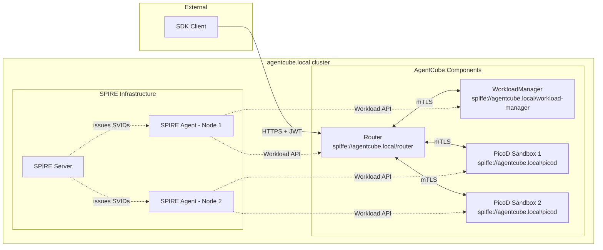
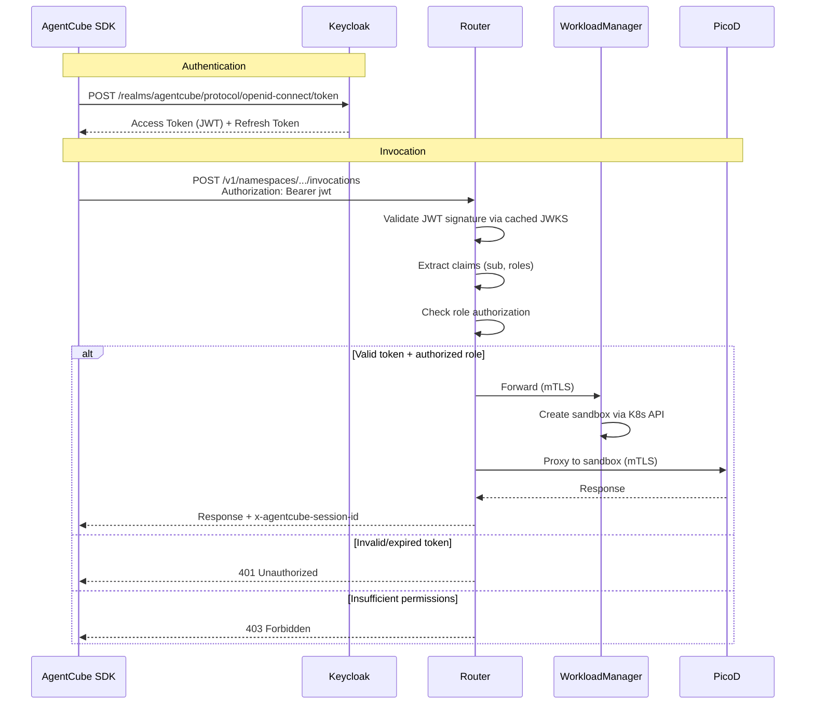
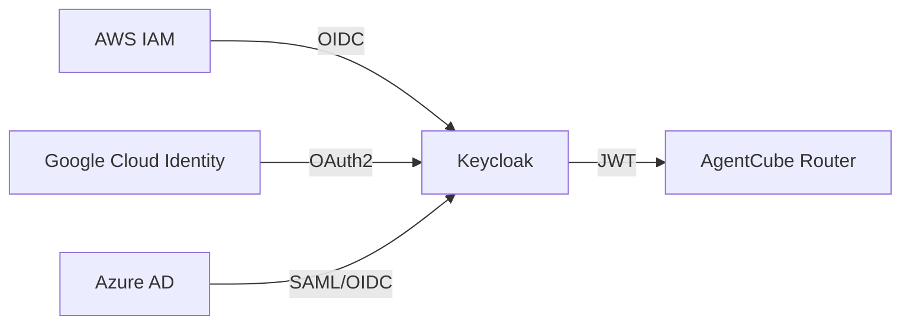

# AgentCube Authentication and Authorization Design

Author: Mahil Patel

## Motivation

AgentCube currently has partial, ad-hoc authentication between its internal components but lacks a unified security model. The existing mechanisms are:

1. **Workload Manager Auth** (`pkg/workloadmanager/auth.go`): Optional Kubernetes TokenReview-based ServiceAccount token validation, gated behind `config.EnableAuth`, plus per-sandbox ownership checks using the extracted user identity (effectively relying on Kubernetes RBAC when using the user-scoped client).
2. **Router → PicoD Auth** (`PicoD-Plain-Authentication-Design`): A custom RSA key-pair scheme where the Router signs JWTs and PicoD verifies them using a public key exposed via the `PICOD_AUTH_PUBLIC_KEY` environment variable. The key pair (`private.pem`, `public.pem`) is stored in the `picod-router-identity` Secret, and the WorkloadManager reads this Secret to inject the public key into PicoD pods. This works for the Router→PicoD channel but leaves other internal channels unauthenticated.
3. **Router → WorkloadManager**: Optional, one-sided authentication. `pkg/router/session_manager.go` can attach a `Authorization: Bearer <serviceaccount token>` header, and WorkloadManager can validate it when `--enable-auth` is enabled. This is not mutual workload identity or a zero-trust model, and when auth is disabled any pod on the cluster network can call the WorkloadManager API.
4. **External Clients → Router**: No authentication. The `handleInvoke` handler in `pkg/router/handlers.go` processes incoming requests without verifying the caller's identity.

These gaps amount to three distinct problems:

- **Internal (machine-to-machine):** Components trust each other implicitly based on network reachability. A compromised or rogue pod on the same network can impersonate any component.
- **External (user-to-platform):** Anyone who can reach the Router endpoint can invoke sandboxes, with no identity verification and no audit trail.
- **Authorization:** Even where authentication exists, there is no mechanism to control what an authenticated identity is allowed to do. There are no roles, no permission checks, and no namespace-scoped access control.

This proposal addresses all three problems using CNCF industry-standard tooling.

### Goals

- Establish zero-trust, mutually authenticated communication between all AgentCube internal components (Router, WorkloadManager, PicoD) using X.509 mTLS.
- Provide external client/SDK authentication at the Router level via an industry-standard identity provider.
- Implement role-based access control (RBAC) for external users using Keycloak's built-in authorization capabilities.
- Keep all new auth features opt-in behind configuration flags so existing deployments are unaffected.
- Minimize per-request latency overhead from authentication and authorization.
- Supersede the existing PicoD-Plain-Authentication key distribution mechanism with automated certificate lifecycle management.

## Use Cases

1. **Zero-trust internal communication**
   A platform team deploys AgentCube into a shared Kubernetes cluster. They need assurance that only legitimate Router pods can call the WorkloadManager, and only legitimate Router/WorkloadManager pods can communicate with PicoD sandboxes - even if other workloads share the same cluster network.

2. **Authenticated SDK access**
   A development team uses the AgentCube Python SDK to run code interpreters. The Router should verify the developer's identity before creating or routing to sandboxes, and reject unauthenticated or unauthorized requests.

3. **Role-based sandbox access control**
   A platform administrator needs to restrict which users can invoke sandboxes versus which users can create or delete AgentRuntime and CodeInterpreter resources. A developer with the `sandbox:invoke` role should be able to run code but not modify runtime definitions.

4. **Enterprise identity integration**
   An organization already uses AWS IAM / Google Cloud Identity / Azure AD to manage developer identities. They want their developers to authenticate with AgentCube using their existing cloud credentials, without creating a separate set of accounts.

---

## Design Details

The design is structured in four layers, ordered by priority:

| Priority | Layer | Problem | Solution |
|---|---|---|---|
| P1 (Urgent) | Internal workload identity | Machine-to-machine trust between Router, WorkloadManager, PicoD | SPIFFE/SPIRE with X.509 mTLS |
| P2 | External user authentication | Client/SDK identity verification at the Router | Keycloak (OIDC/OAuth2) |
| P3 | Authorization | Role-based access control for external users | Keycloak realm roles (JWT claim checking) |
| P4 (Stretch) | Cloud provider federation | Enterprise SSO via cloud IAM | Keycloak identity brokering |

---

## 1. Internal Workload Authentication (SPIRE)

### 1.1 Background

[SPIFFE](https://spiffe.io/) (Secure Production Identity Framework for Everyone) is a CNCF graduated project that provides a standard for service identity. It defines:

- **SPIFFE ID:** A URI-formatted identity, e.g., `spiffe://agentcube.local/router`
- **SVID (SPIFFE Verifiable Identity Document):** An X.509 certificate or JWT that proves a workload holds a given SPIFFE ID.

[SPIRE](https://spiffe.io/docs/latest/spire-about/spire-concepts/) is the production implementation of SPIFFE. It has two components:

- **SPIRE Server:** Central signing authority. Manages registration entries (which selectors map to which SPIFFE IDs) and issues SVIDs to agents.
- **SPIRE Agent:** Runs on every node (DaemonSet). Performs workload attestation, verifying process identity by querying the kernel and kubelet, and delivers SVIDs to local workloads via a Unix domain socket (the Workload API).

SPIRE handles the entire certificate lifecycle (issuance, rotation, revocation) automatically. Workloads never see raw keys on disk; certificates arrive through the Workload API and are rotated before they expire.

<!-- PLACEHOLDER: SPIRE Architecture Diagram -->
<!-- Diagram from https://spiffe.io/docs/latest/spire-about/spire-concepts/ showing
     SPIRE Server at top, SPIRE Agents on each node, workloads connecting to
     agents via the Workload API Unix domain socket. -->

### 1.2 Why Single-Cluster SPIRE

This design uses a single-cluster SPIRE deployment with one SPIRE Server and a set of SPIRE Agents within a single Kubernetes cluster. Multi-cluster SPIRE federation is not included for the following reasons:

- **AgentCube's deployment model is single-cluster.** All internal components (Router, WorkloadManager, PicoD sandboxes) run within the same Kubernetes cluster. There is no cross-cluster RPC to secure today.
- **Federation introduces significant complexity.** Multi-cluster SPIRE requires configuring separate trust domains per cluster, setting up bundle exchange between SPIRE Servers, and managing cross-cluster network connectivity. This overhead is not justified when all workloads share a single trust boundary.
- **Incremental adoption is safer.** Establishing a solid single-cluster identity foundation first allows the team to gain operational experience with SPIRE before taking on the complexity of federation. If AgentCube later evolves to support distributed routing across clusters, SPIRE federation can be layered in without rewriting the core mTLS integration.

### 1.3 Trust Domain and Identity Assignment

All AgentCube components operate under a single trust domain:

```
spiffe://agentcube.local
```

Each component receives a unique SPIFFE ID based on its Kubernetes metadata:

| Component | SPIFFE ID | Selectors |
|---|---|---|
| Router | `spiffe://agentcube.local/router` | `k8s:ns:agentcube-system`, `k8s:sa:agentcube-router` |
| WorkloadManager | `spiffe://agentcube.local/workload-manager` | `k8s:ns:agentcube-system`, `k8s:sa:agentcube-workload-manager` |
| PicoD (Sandboxes) | `spiffe://agentcube.local/picod` | `k8s:pod-label:app:picod` |

> **Note:** PicoD uses only a pod-label selector without a namespace constraint because sandbox pods are created in the namespace specified by the user's request, not in a fixed namespace.

### 1.4 SPIRE Deployment

#### SPIRE Server

Deployed as a `StatefulSet` in `agentcube-system`. Key configuration:

```hcl
server {
    bind_address = "0.0.0.0"
    bind_port    = "8081"
    trust_domain = "agentcube.local"
    data_dir     = "/run/spire/data"

    ca_ttl                = "24h"
    default_x509_svid_ttl = "1h"
}

plugins {
    DataStore "sql" {
        plugin_data {
            database_type     = "sqlite3"
            connection_string = "/run/spire/data/datastore.sqlite3"
        }
    }

    NodeAttestor "k8s_psat" {
        plugin_data {
            clusters = {
                "agentcube-cluster" = {
                    service_account_allow_list = [
                        "agentcube-system:spire-agent"
                    ]
                }
            }
        }
    }

    KeyManager "disk" {
        plugin_data {
            keys_path = "/run/spire/data/keys.json"
        }
    }
}
```

- **Node Attestor `k8s_psat`:** Uses Kubernetes Projected Service Account Tokens to verify agent node identity. This is the recommended attestor for Kubernetes-native deployments.
- **SVID TTL of 1 hour:** Short-lived certificates limit the blast radius of a compromise. SPIRE renews them transparently.
- **SQLite datastore:** Sufficient for single-server deployment. Can be swapped for PostgreSQL in HA setups.

#### SPIRE Agent

Deployed as a `DaemonSet` - one agent per node. Each agent:

1. Attests to the SPIRE Server using its node's Projected Service Account Token
2. Exposes the Workload API at `/run/spire/sockets/agent.sock`
3. Uses the `k8s` workload attestor to verify workload identity by querying the local kubelet for pod metadata

```yaml
apiVersion: apps/v1
kind: DaemonSet
metadata:
  name: spire-agent
  namespace: agentcube-system
spec:
  selector:
    matchLabels:
      app: spire-agent
  template:
    metadata:
      labels:
        app: spire-agent
    spec:
      serviceAccountName: spire-agent
      containers:
        - name: spire-agent
          image: ghcr.io/spiffe/spire-agent:1.12.0
          args: ["-config", "/run/spire/config/agent.conf"]
          volumeMounts:
            - name: spire-agent-socket
              mountPath: /run/spire/sockets
            - name: spire-config
              mountPath: /run/spire/config
      volumes:
        - name: spire-agent-socket
          hostPath:
            path: /run/spire/sockets
            type: DirectoryOrCreate
        - name: spire-config
          configMap:
            name: spire-agent-config
```

### 1.5 Workload Registration

Registration entries are created via the SPIRE Server CLI:

```bash
# Register the Router
spire-server entry create \
    -spiffeID spiffe://agentcube.local/router \
    -parentID spiffe://agentcube.local/spire-agent \
    -selector k8s:ns:agentcube-system \
    -selector k8s:sa:agentcube-router

# Register the WorkloadManager
spire-server entry create \
    -spiffeID spiffe://agentcube.local/workload-manager \
    -parentID spiffe://agentcube.local/spire-agent \
    -selector k8s:ns:agentcube-system \
    -selector k8s:sa:agentcube-workload-manager

# Register PicoD instances (namespace-agnostic, sandboxes can run in any namespace)
spire-server entry create \
    -spiffeID spiffe://agentcube.local/picod \
    -parentID spiffe://agentcube.local/spire-agent \
    -selector k8s:pod-label:app:picod
```

#### Attestation Flow (Example: Router)

1. Router process connects to the local SPIRE Agent via `/run/spire/sockets/agent.sock`
2. Agent identifies the calling process via PID and queries the kubelet for pod metadata (namespace, service account, labels)
3. Agent matches the discovered selectors against registration entries fetched from the Server
4. Match found → Agent issues an X.509 SVID with `spiffe://agentcube.local/router` as URI SAN
5. Router receives a TLS certificate, private key, and trust bundle - ready to serve and initiate mTLS

<!-- PLACEHOLDER: Workload Attestation Flow Diagram -->
<!-- Diagram from https://spiffe.io/docs/latest/spire-about/spire-concepts/#workload-attestation
     showing: workload calls Workload API → agent queries kernel/kubelet →
     agent matches selectors → agent returns SVID -->

### 1.6 mTLS Integration

The `go-spiffe` library (`github.com/spiffe/go-spiffe/v2`) provides helpers that make mTLS integration straightforward. Each component needs two changes: configure its server to require client certificates, and configure its clients to present its own certificate while verifying the server's.

#### Router

The Router serves external clients over HTTPS (secured via Keycloak) and acts as an *outbound client* to internal components. Therefore, it does not need a SPIRE mTLS server configuration, only client configurations:

```go
source, err := workloadapi.NewX509Source(ctx,
    workloadapi.WithClientOptions(
        workloadapi.WithAddr("unix:///run/spire/sockets/agent.sock"),
    ),
)

// Client config for calling WorkloadManager
wmTLSConfig := tlsconfig.MTLSClientConfig(source, source,
    tlsconfig.AuthorizeID(spiffeid.RequireIDFromString("spiffe://agentcube.local/workload-manager")),
)

httpClient := &http.Client{
    Transport: &http.Transport{
        TLSClientConfig: wmTLSConfig,
    },
}

// Client config for proxying to PicoD
picodTLSConfig := tlsconfig.MTLSClientConfig(source, source,
    tlsconfig.AuthorizeID(spiffeid.RequireIDFromString("spiffe://agentcube.local/picod")),
)
```

#### WorkloadManager

Server-side (accepts calls only from Router):

```go
tlsConfig := tlsconfig.MTLSServerConfig(source, source,
    tlsconfig.AuthorizeID(spiffeid.RequireIDFromString("spiffe://agentcube.local/router")),
)
```

*(Note: WorkloadManager manages PicoD pods via the Kubernetes API, so it does not make direct HTTP requests to PicoD and does not need a PicoD client mTLS configuration).*

#### PicoD

Server-side (accepts invocations proxied from the Router):

```go
tlsConfig := tlsconfig.MTLSServerConfig(source, source,
    tlsconfig.AuthorizeID(spiffeid.RequireIDFromString("spiffe://agentcube.local/router")),
)
```

This replaces the existing `PICOD_AUTH_PUBLIC_KEY` environment variable mechanism entirely. Instead of distributing public keys through Secrets, every PicoD instance receives a short-lived certificate from SPIRE and validates callers via the trust bundle.

### 1.7 Communication Channel Summary

**Before:**

```
SDK → Router:              Plain HTTP, no auth
Router → WorkloadManager:  Plain HTTP/gRPC, no auth
Router → PicoD:            HTTP + custom JWT (PicoD-Plain-Auth)
WorkloadManager → PicoD:   (No direct HTTP calls, managed via K8s API)
```

**After:**

```
SDK → Router:              HTTPS + Keycloak JWT (see Section 2)
Router → WorkloadManager:  mTLS (SPIRE SVIDs)
Router → PicoD:            mTLS (SPIRE SVIDs)
WorkloadManager → PicoD:   (No direct HTTP calls, managed via K8s API)
```

### 1.8 Architecture Overview



### 1.9 Impact on Existing PicoD-Plain-Authentication

The SPIRE-based mTLS approach supersedes the PicoD-Plain-Authentication design:

| Current (PicoD-Plain-Auth) | New (SPIRE) |
|---|---|
| Router generates RSA key pair, stores both keys in `picod-router-identity` Secret | SPIRE issues short-lived X.509 SVIDs automatically |
| Public key read from `picod-router-identity` Secret by WorkloadManager | Trust bundle delivered through Workload API socket |
| Bootstrap phase with optimistic locking race between Router replicas | No bootstrap race - each replica independently fetches its SVID |
| `PICOD_AUTH_PUBLIC_KEY` env var injected into PicoD pods | Workload API socket mounted into PicoD pods |
| Manual key rotation (delete Secret, restart Routers) | Automatic rotation by SPIRE (default: 1 hour TTL) |
| Application-layer JWT verification | Transport-layer mTLS verification |

The existing PicoD-Plain-Auth code path will be kept behind a `--legacy-picod-auth` flag during the transition period and marked as deprecated.

---

## 2. External User Authentication (Keycloak)

### 2.1 Overview

SPIRE solves internal workload identity but does not address external user authentication. When a developer uses the Python SDK to invoke an AgentRuntime, the Router needs to verify the developer's identity.

[Keycloak](https://www.keycloak.org/) is an open-source IAM solution that provides OIDC/OAuth2 token issuance, user management, and built-in federation for external identity providers. Instead of building a custom JWT issuer and API key store, Keycloak handles user identity as a dedicated service.

### 2.2 Workflow



### 2.3 Keycloak Deployment

Keycloak is deployed as a `Deployment` in `agentcube-system`. A dedicated realm called `agentcube` is created during installation containing:

- **Clients:**
  - `agentcube-sdk` - Confidential client for SDK access. Supports `client_credentials` grant for service accounts and `authorization_code` for interactive users.
  - `agentcube-admin` - Client for administrative operations.

- **Roles:**
  - `sandbox:invoke` - Permission to invoke agent runtimes and code interpreters.
  - `sandbox:manage` - Permission to create/delete AgentRuntime and CodeInterpreter CRDs.
  - `admin` - Full administrative access.

### 2.4 Router JWT Validation

The Router validates Keycloak-issued JWTs using standard OIDC token verification:

```go
type KeycloakConfig struct {
    IssuerURL    string        // e.g., "https://keycloak.agentcube-system.svc:8443"
    Realm        string        // "agentcube"
    Audience     string        // expected audience claim
    JWKSCacheTTL time.Duration // how often to refresh JWKS keys
}

func NewKeycloakValidator(cfg KeycloakConfig) (*KeycloakValidator, error) {
    jwksURL := fmt.Sprintf("%s/realms/%s/protocol/openid-connect/certs",
        cfg.IssuerURL, cfg.Realm)

    // JWKS keys are cached locally - no per-request calls to Keycloak
    keySet := jwk.NewCache(context.Background())
    keySet.Register(jwksURL, jwk.WithRefreshInterval(cfg.JWKSCacheTTL))

    return &KeycloakValidator{
        issuer:   fmt.Sprintf("%s/realms/%s", cfg.IssuerURL, cfg.Realm),
        audience: cfg.Audience,
        keySet:   keySet,
    }, nil
}
```

Individual request validation is a local cryptographic operation. The Router reaches Keycloak only periodically (default: every 5 minutes) to refresh the JWKS key set, so Keycloak availability is not in the hot path.

### 2.5 SDK Changes

The Python SDK will support Keycloak-based authentication:

```python
from agentcube import CodeInterpreterClient

# Service account credentials (for automation / CI)
client = CodeInterpreterClient(
    auth=ServiceAccountAuth(
        keycloak_url="https://keycloak.example.com",
        realm="agentcube",
        client_id="agentcube-sdk",
        client_secret="<secret>",
    )
)

# Pre-obtained token
client = CodeInterpreterClient(
    auth=TokenAuth(access_token="<keycloak-jwt>")
)

# Usage unchanged - auth is transparent
result = client.run_code("python", "print('hello')")
```

The SDK handles token refresh automatically using the refresh token.

### 2.6 Backward Compatibility

External auth is opt-in via `--enable-external-auth` (default: `false`):

- **Disabled:** Router behaves exactly as today - no authentication required.
- **Enabled:** All invocation endpoints require `Authorization: Bearer <token>`. Health checks (`/health/live`, `/health/ready`) remain unauthenticated.

---

## 3. Authorization (Keycloak RBAC)

### 3.1 Overview

Authentication verifies *who* the user is. Authorization determines *what* that user is allowed to do. This proposal uses Keycloak's realm roles for role-based access control. Keycloak embeds the user's assigned roles directly into the JWT access token, and the Router checks these roles locally from the validated token - no additional call to Keycloak is needed at request time.

### 3.2 Role Hierarchy

Keycloak realm roles are organized in a simple hierarchy:

| Role | Permissions | Inherits |
|---|---|---|
| `sandbox:invoke` | Invoke agent runtimes, invoke code interpreters, list sessions | - |
| `sandbox:manage` | Create/delete AgentRuntime and CodeInterpreter CRDs | `sandbox:invoke` |
| `admin` | Full access, user management, view audit logs | `sandbox:manage` |

New users are assigned the `sandbox:invoke` role by default, maintaining backward compatibility with the current behavior where anyone can invoke sandboxes (but now with authentication).

### 3.3 How It Works

Keycloak embeds the user's roles into the JWT access token under the `realm_access.roles` claim. The Router reads these roles directly from the validated token and performs authorization checks locally - no additional call to Keycloak is needed.

Example JWT payload issued by Keycloak:

```json
{
  "sub": "user-123",
  "iss": "https://keycloak.agentcube-system.svc/realms/agentcube",
  "realm_access": {
    "roles": ["sandbox:invoke"]
  },
  "exp": 1716242600
}
```

### 3.4 Router Authorization Middleware

| Endpoint Pattern | Required Role |
|---|---|
| `POST /v1/namespaces/{ns}/agent-runtimes/{name}/invocations/*` | `sandbox:invoke` |
| `POST /v1/namespaces/{ns}/code-interpreters/{name}/invocations/*` | `sandbox:invoke` |
| `GET /health/*` | No auth required |

*(Note: CRD lifecycle operations like creating agent runtimes are handled directly via the Kubernetes API, not the Router's external surface).*

```go
func AuthzMiddleware(requiredRole string) gin.HandlerFunc {
    return func(c *gin.Context) {
        claims, exists := c.Get("jwt_claims")
        if !exists {
            c.AbortWithStatusJSON(401, gin.H{"error": "unauthenticated"})
            return
        }

        userRoles := claims.(*Claims).RealmAccess.Roles
        if !hasRole(userRoles, requiredRole) {
            c.AbortWithStatusJSON(403, gin.H{
                "error": "forbidden",
                "detail": fmt.Sprintf("role '%s' required", requiredRole),
            })
            return
        }

        c.Next()
    }
}
```

### 3.5 Namespace Scoping

For multi-tenant deployments where users should only access sandboxes in specific namespaces, Keycloak's protocol mappers can inject custom claims (e.g., `allowed_namespaces`) into the JWT. The Router would then check the target namespace in the request URL against the user's permitted namespaces from the token claims. This is still a local check from the JWT with no additional calls to Keycloak.

---

## 4. Cloud Provider Identity Federation (Stretch Goal)

This layer is not urgent and will only be pursued after Priorities 1, 2, and 3 are stable.

Keycloak natively supports identity brokering - acting as a proxy to external identity providers. Configuration is done entirely within Keycloak with no AgentCube code changes:

- **AWS IAM → Keycloak:** OIDC federation with AWS IAM Identity Center
- **Google Cloud Identity → Keycloak:** Google as OAuth2 identity provider
- **Azure AD → Keycloak:** SAML or OIDC identity provider

From the Router's perspective, nothing changes. It still validates Keycloak JWTs regardless of how the user originally authenticated.



---

## Future Enhancements

### OPA for Authorization

The standard across CNCF projects is to strictly separate authentication and authorization. Projects like Volcano, Istio, and ArgoCD follow the pattern of using tools like Keycloak for authentication and Open Policy Agent (OPA) for authorization. If AgentCube's authorization needs grow beyond what Keycloak RBAC offers, OPA could replace Keycloak's authorization role, keeping Keycloak focused purely on identity and token issuance.

The key advantages of OPA over Keycloak-based RBAC:

- **Local evaluation:** OPA runs as a sidecar alongside the Router, so policy checks are local and avoid a network call to Keycloak on every request.
- **Policy as code:** Rego policies are version-controlled, peer-reviewed, and merged through standard PR workflows, giving full audit history over authorization changes.
- **Expressiveness:** OPA supports context-aware policies beyond simple role checks (e.g., time-based access, request payload inspection, cross-namespace constraints).

The approach for integration:

- Ship a set of standard Rego policies baked into AgentCube that cover common access control patterns out of the box.
- Expose a simplified JSON/YAML configuration interface so users can map roles to permissions without writing Rego directly.
- The Router would call OPA locally for policy evaluation, with Keycloak continuing to handle authentication and token issuance only.
