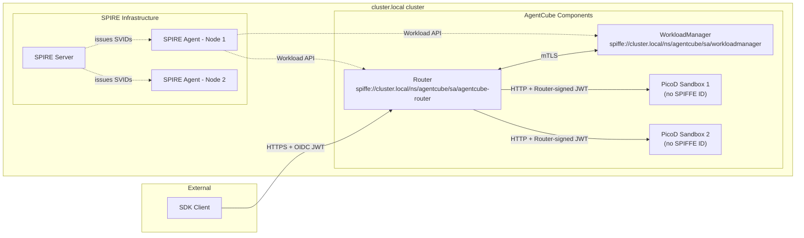
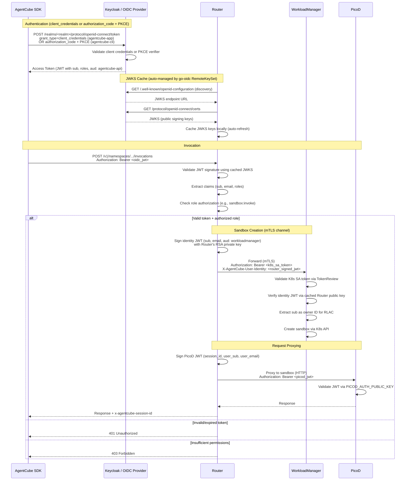
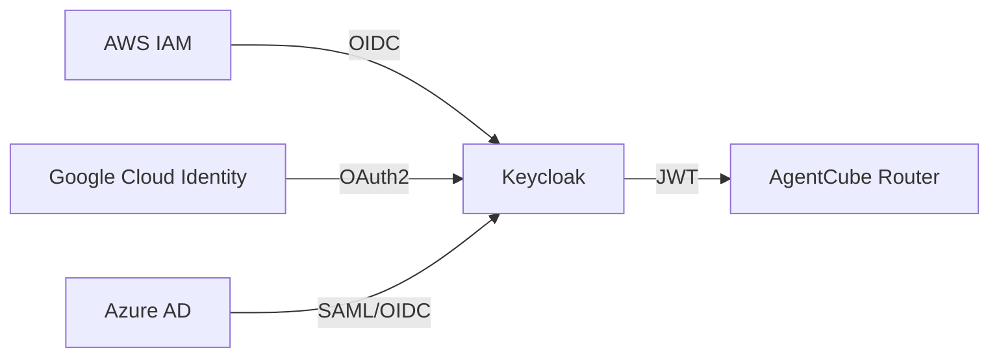

# AgentCube Authentication and Authorization Design

Author: Mahil Patel

## Motivation

AgentCube currently has partial, ad-hoc authentication between its internal components but lacks a unified security model. The existing mechanisms are:

1. **Workload Manager Auth** (`pkg/workloadmanager/auth.go`): Optional Kubernetes TokenReview-based ServiceAccount token validation, gated behind `config.EnableAuth`, plus per-sandbox ownership checks using the extracted user identity (effectively relying on Kubernetes RBAC when using the user-scoped client).
2. **Router → PicoD Auth** (`PicoD-Plain-Authentication-Design`): A custom RSA key-pair scheme where the Router signs JWTs and PicoD verifies them using a public key exposed via the `PICOD_AUTH_PUBLIC_KEY` environment variable. The key pair (`private.pem`, `public.pem`) is stored in the `picod-router-identity` Secret, and the WorkloadManager reads this Secret to inject the public key into PicoD pods. This works for the Router→PicoD channel but leaves other internal channels unauthenticated.
3. **Router → WorkloadManager**: Optional, one-sided authentication. `pkg/router/session_manager.go` can attach a `Authorization: Bearer <serviceaccount token>` header, and WorkloadManager can validate it when `--enable-auth` is enabled. This is not mutual workload identity or a zero-trust model, and when auth is disabled any pod on the cluster network can call the WorkloadManager API.
4. **External Clients → Router**: No authentication. The `handleInvoke` handler in `pkg/router/handlers.go` processes incoming requests without verifying the caller's identity.

These gaps amount to three distinct problems:

- **Internal (machine-to-machine):** Components trust each other implicitly based on network reachability. A compromised or rogue pod on the same network can impersonate any component.
- **External (user-to-platform):** Anyone who can reach the Router endpoint can invoke sandboxes, with no identity verification and no audit trail.
- **Authorization & Isolation:** Even where authentication exists, there is no mechanism to control what an authenticated identity is allowed to do. There are no roles, no permission checks, no namespace-scoped access control, and no resource-level tenant isolation (preventing User A from invoking User B's sandbox).

This proposal addresses all three problems using CNCF industry-standard tooling.

### Goals

- Establish zero-trust, mutually authenticated communication between long-lived AgentCube control-plane components (Router, WorkloadManager) using X.509 mTLS. PicoD sandbox pods continue to use the existing Router-signed JWT mechanism (PicoD-Plain-Auth) over plain HTTP to avoid bootstrap latency for ephemeral workloads.
- Provide external client/SDK authentication at the Router level via a provider-agnostic OIDC integration (Keycloak is the reference deployment).
- Implement role-based access control (RBAC) for external users using realm roles embedded in OIDC JWTs.
- Enforce resource-level tenant isolation to guarantee users can only access sandboxes they own, with an admin role bypass.
- Keep all new auth features opt-in behind configuration flags so existing deployments are unaffected.
- Minimize per-request latency overhead from authentication and authorization.

## Use Cases

1. **Zero-trust internal communication**
   A platform team deploys AgentCube into a shared Kubernetes cluster. They need assurance that only legitimate Router pods can call the WorkloadManager - even if other workloads share the same cluster network. PicoD sandbox pods are authenticated separately via the existing Router-signed JWT mechanism.

2. **Authenticated SDK access**
   A development team uses the AgentCube Python SDK to run code interpreters. The Router should verify the developer's identity before creating or routing to sandboxes, and reject unauthenticated or unauthorized requests.

3. **Role-based sandbox access control**
   A platform administrator needs to restrict which users can invoke sandboxes versus which users can create or delete AgentRuntime and CodeInterpreter resources. A developer with the `sandbox:invoke` role should be able to run code but not modify runtime definitions.

4. **Enterprise identity integration**
   An organization already uses AWS IAM / Google Cloud Identity / Azure AD to manage developer identities. They want their developers to authenticate with AgentCube using their existing cloud credentials, without creating a separate set of accounts.

---

## Design Details

The design is structured in four layers, ordered by priority:

| Priority | Layer | Problem | Solution |
|---|---|---|---|
| P1 | Internal workload identity | Machine-to-machine trust between Router and WorkloadManager | X.509 mTLS (SPIRE recommended, file-based certs also supported) |
| P2 | External user authentication | Client/SDK identity verification at the Router | Keycloak (OIDC/OAuth2) |
| P3 | Authorization | Role-based access control for external users | Keycloak realm roles (JWT claim checking) |
| P4 (Stretch) | Cloud provider federation | Enterprise SSO via cloud IAM | Keycloak identity brokering |

---

## 1. Internal Workload Authentication (X.509 mTLS)

The Router ↔ WorkloadManager control-plane channel is secured using mutual TLS (mTLS) with X.509 certificates. PicoD sandbox pods are **not** part of the mTLS mesh — they continue to use the existing Router-signed JWT mechanism (PicoD-Plain-Auth) over plain HTTP, avoiding the ~200–500ms SVID attestation latency that would be incurred for each ephemeral sandbox pod.

The mTLS enforcement layer is **certificate-source agnostic** - it works with any valid X.509 cert/key/CA bundle, regardless of how the certificates are provisioned. Two certificate source modes are supported:

| Mode | Certificate Source | Rotation | Best For |
|---|---|---|---|
| **SPIRE** (recommended) | SPIRE Workload API issues short-lived SVIDs automatically | Automatic (default: 1 hour TTL) | Production deployments needing zero-touch certificate management |
| **File-based** | Certs loaded from disk (provisioned by cert-manager, self-signed CA, Let's Encrypt, corporate PKI, etc.) | Manual or delegated to the provisioning tool | Environments where SPIRE is not available, or operators prefer existing PKI infrastructure |

Configuration flags for each component:

```
--mtls-cert=<path>          
--mtls-key=<path>           
--mtls-ca=<path>            
```

The application simply loads the certificates directly from the paths provided via the `--mtls-*` CLI flags. All three flags must be specified together; providing a partial set is an error.

These cert/key/CA files can be populated on disk by any mechanism - for example, the SPIFFE Helper sidecar syncing SVIDs to disk, a Kubernetes Secret mounted as a volume (managed by cert-manager), or static files for development. The mTLS enforcement (requiring client certs, verifying peer identity) is identical in all cases.

### 1.1 SPIRE Background

[SPIFFE](https://spiffe.io/) (Secure Production Identity Framework for Everyone) is a CNCF graduated project that provides a standard for service identity. It defines:

- **SPIFFE ID:** A URI-formatted identity, e.g., `spiffe://cluster.local/ns/agentcube/sa/agentcube-router`
- **SVID (SPIFFE Verifiable Identity Document):** An X.509 certificate or JWT that proves a workload holds a given SPIFFE ID.

[SPIRE](https://spiffe.io/docs/latest/spire-about/spire-concepts/) is the production implementation of SPIFFE. It has two components:

- **SPIRE Server:** Central signing authority. Manages registration entries (which selectors map to which SPIFFE IDs) and issues SVIDs to agents.
- **SPIRE Agent:** Runs on every node (DaemonSet). Performs workload attestation, verifying process identity by querying the kernel and kubelet, and delivers SVIDs to local workloads via a Unix domain socket (the Workload API).

SPIRE handles the entire certificate lifecycle (issuance, rotation, revocation) automatically. Workloads receive certificates through the Workload API and they are rotated before they expire.

### 1.2 Why Single-Cluster SPIRE

This design uses a single-cluster SPIRE deployment with one SPIRE Server and a set of SPIRE Agents within a single Kubernetes cluster. Multi-cluster SPIRE federation is not included for the following reasons:

- **AgentCube's deployment model is single-cluster.** All internal components (Router, WorkloadManager, PicoD sandboxes) run within the same Kubernetes cluster. There is no cross-cluster RPC to secure today.
- **Federation introduces significant complexity.** Multi-cluster SPIRE requires configuring separate trust domains per cluster, setting up bundle exchange between SPIRE Servers, and managing cross-cluster network connectivity. This overhead is not justified when all workloads share a single trust boundary.
- **Incremental adoption is safer.** Establishing a solid single-cluster identity foundation first allows the team to gain operational experience with SPIRE before taking on the complexity of federation. If AgentCube later evolves to support distributed routing across clusters, SPIRE federation can be layered in without rewriting the core mTLS integration.

### 1.3 Trust Domain and Identity Assignment

All AgentCube components operate under a single trust domain:

```
spiffe://cluster.local
```

Each component receives a unique SPIFFE ID following the Istio-convention format `spiffe://<trust-domain>/ns/<namespace>/sa/<service-account>`, which encodes the workload's Kubernetes namespace and service account directly in the URI path.

SPIRE uses **selectors** to verify workload identity during attestation. When a workload requests its certificate, the SPIRE Agent inspects the workload's Kubernetes metadata (namespace, service account, labels) and matches it against registered selectors. A workload only receives its SVID if all registered selectors match.

| Component | SPIFFE ID | Selectors |
|---|---|---|
| Router | `spiffe://cluster.local/ns/agentcube/sa/agentcube-router` | `k8s:ns:agentcube`, `k8s:sa:agentcube-router` |
| WorkloadManager | `spiffe://cluster.local/ns/agentcube/sa/workloadmanager` | `k8s:ns:agentcube`, `k8s:sa:workloadmanager` |

> **Note:** The trust domain defaults to `cluster.local` and can be overridden with the `AGENTCUBE_SPIFFE_TRUST_DOMAIN` environment variable. The namespace defaults to `agentcube` and can be overridden with the `AGENTCUBE_NAMESPACE` environment variable. These environment variables allow deployment tooling to match the SPIRE trust domain and Kubernetes namespace without code changes.
>

### 1.4 SPIRE Deployment

#### SPIRE Server

Deployed as a `StatefulSet` in `agentcube`. The StatefulSet runs two critical containers: the SPIRE Server itself, and the SPIRE Controller Manager sidecar. 
* It is configured to use the **`k8s_psat` Node Attestor** to verify agent node identity via Projected Service Account Tokens.
* The default X.509 **SVID TTL is configured to 1 hour** to limit the blast radius of compromised keys and enforce rapid, transparent auto-renewal.

#### SPIRE Agent

Deployed as a `DaemonSet` (one agent per node). Each agent:
1. Exposes the Workload API socket locally at `/run/spire/sockets/agent.sock`.
2. Uses the native **`k8s` Workload Attestor** to verify workload identity securely by querying the local kubelet for pod metadata (namespaces, labels, service accounts).

#### SPIRE Controller Manager

The [SPIRE Controller Manager](https://github.com/spiffe/spire-controller-manager) watches for `ClusterSPIFFEID` custom resources and automatically syncs registration entries to the SPIRE Server. This makes workload registration fully declarative and is the recommended approach for production deployments.

**Architectural Deployment Details:**
- **Sidecar Pattern:** The Controller Manager must be deployed as a sidecar container operating strictly within the `spire-server` `StatefulSet` pod. This guarantees it has direct, shared-memory-speed filesystem access to the SPIRE Server's private API Domain Socket (`/tmp/spire-server/private/api.sock`).
- **Shared RBAC:** Running as a sidecar implies it natively shares the `spire-server` Kubernetes ServiceAccount. The corresponding `ClusterRole` must amalgamate all required permissions. For defense-in-depth security, RBAC privileges are strictly scoped (for example, explicitly restricting webhook patching by `resourceNames`).
- **Validating Webhook Bootstrap:** The Controller Manager natively enforces CRD schema validation via an internal webhook server. To support a seamless "One-Click" Helm installation workflow where CRDs and the Controller are deployed simultaneously, a blank `ValidatingWebhookConfiguration` explicitly configured with `failurePolicy: Ignore` is pre-provisioned via the Helm chart. This actively bypasses the classic "chicken-and-egg" deployment race condition where Kube-Apiserver attempts to validate freshly submitted `ClusterSPIFFEID` CRDs before the sidecar has even finished booting to inject its own dynamic TLS CA bundle.

**End-to-End Identity Workflow:**
To clarify how Node and Workload registration coordinate in this architecture:
1. **Node Registration (Self-Registration):** The SPIRE Agent boots on a worker node and *automatically self-registers* to the SPIRE Server by presenting its Kubernetes PSAT (Projected Service Account Token) to prove it is a legitimate node.
2. **Workload Registration (Controller):** The cluster admin (or Helm chart) applies `ClusterSPIFFEID` CRDs. The Controller Manager watches these and translates them into registration entries on the SPIRE Server API (e.g., "pods with `app: agentcube-router` are allowed to get this SPIFFE ID").
3. **Workload Attestation (Delivery):** When a pod boots, its `spiffe-helper` sidecar connects to the local SPIRE Agent. The Agent queries the Kubelet to verify the pod's labels and ServiceAccount, matches them against the Controller's registered rules, and mints the SVID certificate.

### 1.5 Workload Registration

Registration entries tell the SPIRE Server which workloads should receive which SPIFFE IDs. There are two approaches depending on the environment:

#### Production: ClusterSPIFFEID CRDs (Recommended)

With the SPIRE Controller Manager deployed, registration entries are defined as Kubernetes CRDs. These are managed declaratively alongside other AgentCube manifests and are automatically synced to the SPIRE Server:

```yaml
# Router registration
apiVersion: spire.spiffe.io/v1alpha1
kind: ClusterSPIFFEID
metadata:
  name: agentcube-router
spec:
  spiffeIDTemplate: "spiffe://cluster.local/ns/{{ .PodMeta.Namespace }}/sa/{{ .PodSpec.ServiceAccountName }}"
  podSelector:
    matchLabels:
      app: agentcube-router
  namespaceSelector:
    matchLabels:
      kubernetes.io/metadata.name: agentcube
---
# WorkloadManager registration
apiVersion: spire.spiffe.io/v1alpha1
kind: ClusterSPIFFEID
metadata:
  name: workloadmanager
spec:
  spiffeIDTemplate: "spiffe://cluster.local/ns/{{ .PodMeta.Namespace }}/sa/{{ .PodSpec.ServiceAccountName }}"
  podSelector:
    matchLabels:
      app: workloadmanager
  namespaceSelector:
    matchLabels:
      kubernetes.io/metadata.name: agentcube
```

#### Development: Manual CLI

For local development (e.g., `kind` clusters), registration entries can be created manually by exec-ing into the SPIRE Server pod:

```bash
kubectl exec -n agentcube <spire-server-pod> -- \
  spire-server entry create \
    -spiffeID spiffe://cluster.local/ns/agentcube/sa/agentcube-router \
    -parentID spiffe://cluster.local/spire-agent \
    -selector k8s:ns:agentcube \
    -selector k8s:sa:agentcube-router

kubectl exec -n agentcube <spire-server-pod> -- \
  spire-server entry create \
    -spiffeID spiffe://cluster.local/ns/agentcube/sa/workloadmanager \
    -parentID spiffe://cluster.local/spire-agent \
    -selector k8s:ns:agentcube \
    -selector k8s:sa:workloadmanager
```

> **Note:** Manual CLI entries are stored in the SPIRE Server's datastore (SQLite by default). They survive restarts if the datastore is backed by persistent storage, but are harder to manage and audit compared to the declarative CRD approach.

#### Attestation Flow (Example: Router)

1. Router process connects to the local SPIRE Agent via `/run/spire/sockets/agent.sock`
2. Agent identifies the calling process via PID and queries the kubelet for pod metadata (namespace, service account, labels)
3. Agent matches the discovered selectors against registration entries fetched from the Server
4. Match found → Agent issues an X.509 SVID with `spiffe://cluster.local/ns/agentcube/sa/agentcube-router` as URI SAN
5. Router receives a TLS certificate, private key, and trust bundle - ready to serve and initiate mTLS

> **Latency Considerations for Sandbox Provisioning:**
> For long-lived control plane components (Router, WorkloadManager), attestation and TLS handshake latency is negligible since connections are persistent and handshakes are amortized over thousands of requests. For short-lived PicoD sandboxes, two sources of latency must be considered:
>
> 1. **Attestation latency (~200-500ms):** The `spiffe-helper` sidecar fetches the SVID concurrently with PicoD's own container initialization, so this overlaps with pod startup rather than blocking it. The file-based certificate mode (Section 1.6) eliminates this entirely by pre-provisioning certificates as Kubernetes Secrets.
> 2. **TLS handshake latency (~20-50ms per new connection):** Each new mTLS connection between the Router and a PicoD sandbox requires a full TLS handshake (certificate exchange, chain verification, key negotiation). For Code Interpreters targeting ~100ms bootstrap latency, this overhead is significant.
>
> For latency-critical scenarios (Code Interpreters, agentic RL training loops), the Router→PicoD channel supports **JWT-based authentication** as an alternative to mTLS (see Section 1.10). JWT auth uses plain HTTP with an `Authorization: Bearer` header, eliminating the TLS handshake entirely. Combined with warm pools, this ensures the auth system adds near-zero latency to sandbox invocations.

### 1.6 File-Based Provisioning (cert-manager)

While SPIRE handles identity attestation dynamically, file-based provisioning relies on static Kubernetes Secrets. [cert-manager](https://cert-manager.io/) is the recommended implementation for this mode. It explicitly demonstrates that the architecture is fully certificate-source agnostic.

Administrators declaratively provision SPIFFE-compliant certificates by defining a `Certificate` CRD that explicitly maps the required `uris` field to the Istio-convention SPIFFE ID defined in Section 1.3:

```yaml
apiVersion: cert-manager.io/v1
kind: Certificate
metadata:
  name: agentcube-router-cert
  namespace: agentcube
spec:
  secretName: router-mtls-secret
  duration: 2160h # 90 days
  renewBefore: 360h # 15 days
  privateKey:
    algorithm: ECDSA
    size: 256
    rotationPolicy: Always # Rotate private key on renewal
  usages:
    - server auth
    - client auth
  # Optional dnsNames for service discovery compatibility
  dnsNames:
    - agentcube-router.agentcube.svc.cluster.local
  uris:
    - spiffe://cluster.local/ns/agentcube/sa/agentcube-router
  issuerRef:
    # Issuer that injects ca.crt into the Secret
    name: internal-ca-issuer
    kind: ClusterIssuer
```

cert-manager continuously monitors this CRD, automatically signs the requested certificate using the cluster's internal CA, and manages the resulting `router-mtls-secret` Secret on disk. The administrator simply mounts this Secret into the AgentCube pod and passes the mapped paths directly into the component's CLI flags:

```yaml
      containers:
      - name: router
        args:
        - "--mtls-cert=/etc/agentcube/certs/tls.crt"
        - "--mtls-key=/etc/agentcube/certs/tls.key"
        - "--mtls-ca=/etc/agentcube/certs/ca.crt"
        volumeMounts:
        - name: mtls-certs
          mountPath: "/etc/agentcube/certs"
          readOnly: true
      volumes:
      - name: mtls-certs
        secret:
          secretName: router-mtls-secret
```

This fully satisfies the underlying identity requirements without deploying any SPIRE infrastructure. However, operators should carefully weigh the security tradeoff: file-based `cert-manager` systems generally rely on slower, static renewal cycles (e.g., 90 days), whereas SPIRE natively provides highly dynamic, short-lived SVID rotation (1 hour TTL).

### 1.7 mTLS Integration

The Router and WorkloadManager need two changes: configure WorkloadManager's server to require client certificates, and configure the Router's client to present its own certificate while verifying WorkloadManager's identity. The mTLS implementation uses Go's standard `crypto/tls` package plus an `fsnotify`-based `CertWatcher` for zero-downtime certificate rotation.

Regardless of the certificate source (SPIRE or file-based), the cert/key/CA files end up on disk and the Go code is identical. When using SPIRE, the [SPIFFE Helper](https://github.com/spiffe/spiffe-helper) sidecar writes SVIDs to disk as PEM files, making them consumable by standard TLS configuration.

**Startup Synchronization:** A `WaitForCertificateFiles` utility blocks component startup (with a 30-second timeout) until the `spiffe-helper` sidecar has written the initial SVID files. This handles the race condition where the component process starts before certificates are available.

**Dynamic Certificate Reloading:** A `CertWatcher` watches the certificate directories using `fsnotify` and reloads cert/key pairs and CA bundles when files change on disk, with 200ms debouncing to coalesce rapid writes. It exposes thread-safe `GetCertificate`, `GetClientCertificate`, and `GetCAPool` callbacks for use with `tls.Config`.

#### Server-Side (WorkloadManager)

WorkloadManager requires incoming connections to present a valid client certificate signed by the trusted CA. Authorization is handled at the application layer, not at the TLS level — any client with a valid SPIRE-provisioned certificate is accepted:

```go
// LoadServerConfig returns a tls.Config for mTLS server authentication.
func LoadServerConfig(cfg *Config) (*tls.Config, *CertWatcher, error) {
    watcher, err := NewCertWatcher(cfg.CertFile, cfg.KeyFile, cfg.CAFile)

    tlsCfg := &tls.Config{
        GetCertificate: watcher.GetCertificate,
        ClientAuth:     tls.RequireAnyClientCert, // Require client cert verification
        MinVersion:     tls.VersionTLS13,
        VerifyPeerCertificate: verifyClientCert(watcher), // Verify client cert dynamically
    }
    return tlsCfg, watcher, nil
}

// verifyClientCert verifies the client certificate chain against the dynamic CA pool.
func verifyClientCert(watcher *CertWatcher) func([][]byte, [][]*x509.Certificate) error {
    return func(rawCerts [][]byte, _ [][]*x509.Certificate) error {
        peerCert, err := x509.ParseCertificate(rawCerts[0])
        // ... parse intermediates ...
        opts := x509.VerifyOptions{
            Roots:         watcher.GetCAPool(),
            Intermediates: intermediates,
            KeyUsages:     []x509.ExtKeyUsage{x509.ExtKeyUsageClientAuth},
        }
        _, err = peerCert.Verify(opts)
        return err
    }
}
```

> **Note:** The server-side deliberately does **not** check the client's SPIFFE ID. Using `RequireAnyClientCert` (instead of `RequireAndVerifyClientCert`) allows the CA pool to be rotated dynamically via the `CertWatcher` without restarting the server. SPIFFE ID-based authorization, if needed, can be added at the application layer.

#### Client-Side (Router)

The Router presents its own certificate when connecting to WorkloadManager, and verifies the server's certificate against the trusted CA **and** its SPIFFE ID:

```go
// LoadClientConfig returns a tls.Config for mTLS client verification.
func LoadClientConfig(cfg *Config, expectedServerID string) (*tls.Config, *CertWatcher, error) {
    watcher, err := NewCertWatcher(cfg.CertFile, cfg.KeyFile, cfg.CAFile)

    tlsCfg := &tls.Config{
        GetClientCertificate: watcher.GetClientCertificate,
        MinVersion:           tls.VersionTLS13,
        InsecureSkipVerify:   true, // Skip default verification for manual SPIFFE check
        VerifyPeerCertificate: verifyServerCert(watcher, expectedServerID),
    }
    return tlsCfg, watcher, nil
}

// verifyServerCert verifies the server certificate chain and SPIFFE ID.
func verifyServerCert(watcher *CertWatcher, expectedID string) func([][]byte, [][]*x509.Certificate) error {
    return func(rawCerts [][]byte, _ [][]*x509.Certificate) error {
        peerCert, err := x509.ParseCertificate(rawCerts[0])
        // ... parse intermediates, verify chain against watcher.GetCAPool() ...
        for _, uri := range peerCert.URIs {
            if uri.String() == expectedID {
                return nil // Identity confirmed
            }
        }
        return fmt.Errorf("server certificate SPIFFE ID does not match expected %q", expectedID)
    }
}
```

The cert/key/CA files can be provisioned by any mechanism:
- **SPIRE:** The [SPIFFE Helper](https://github.com/spiffe/spiffe-helper) sidecar fetches SVIDs from the Workload API and writes them to disk as PEM files. Certificates are rotated automatically.
- **cert-manager:** Automatically issues and rotates certificates, stored as Kubernetes Secrets and mounted into pods.
- **Self-signed CA:** Generated manually or via a script for development and testing environments.
- **Let's Encrypt / corporate PKI:** Externally issued certificates placed on disk or in Secrets.

*(Note: WorkloadManager manages PicoD pods via the Kubernetes API, so it does not make direct HTTP requests to PicoD and does not need a PicoD client mTLS configuration.)*

### 1.8 Communication Channel Summary

**Before:**

```
SDK → Router:              Plain HTTP, no auth
Router → WorkloadManager:  Plain HTTP/gRPC, no auth
Router → PicoD:            HTTP + custom JWT (PicoD-Plain-Auth)
WorkloadManager → PicoD:   (No direct HTTP calls, managed via K8s API)
```

**After:**

```
SDK → Router:              HTTPS + OIDC JWT (see Section 2)
Router → WorkloadManager:  mTLS (X.509 certs via SPIRE or file-based) + K8s SA token + identity JWT
Router → PicoD:            HTTP + Router-signed JWT (retained PicoD-Plain-Auth mechanism)
WorkloadManager → PicoD:   (No direct HTTP calls, managed via K8s API)
```

### 1.9 Architecture Overview



> **Note:** The architecture diagram above shows a SPIRE-based deployment. When relying entirely on externally provisioned file-based certificates (like cert-manager), the SPIRE Infrastructure components are not deployed; certificates are instead mounted directly into the pods. The mTLS enforcement between Router and WorkloadManager remains exactly the same. PicoD sandbox pods do not participate in the SPIRE/mTLS mesh and instead use the existing Router-signed JWT authentication mechanism.

### 1.10 Router → PicoD Authentication

The Router→PicoD channel uses the existing **PicoD-Plain-Auth** JWT mechanism. The Router generates a short-lived JWT (5-minute TTL) signed with its RSA private key and includes it in the `Authorization: Bearer` header when proxying requests to PicoD sandboxes. PicoD validates the JWT using the Router's public key, which is injected via the `PICOD_AUTH_PUBLIC_KEY` environment variable by WorkloadManager during sandbox provisioning.

The Router's RSA key pair is stored in the `picod-router-identity` Kubernetes Secret. When external authentication is enabled, the Router also embeds the caller's identity (`user_sub`, `user_email`) as custom claims in the JWT, allowing PicoD to know which user triggered the invocation.

> **Note:** Router↔WorkloadManager always uses mTLS regardless of this setting, since both are long-lived components where TLS handshake cost is amortized over thousands of requests.

---

## 2. External User Authentication (Keycloak)

### 2.1 Overview

SPIRE solves internal workload identity but does not address external user authentication. When a developer uses the Python SDK to invoke an AgentRuntime, the Router needs to verify the developer's identity.

[Keycloak](https://www.keycloak.org/) is an open-source IAM solution that provides OIDC/OAuth2 token issuance, user management, and built-in federation for external identity providers. Instead of building a custom JWT issuer and API key store, Keycloak handles user identity as a dedicated service.

### 2.2 Workflow



### 2.3 Keycloak Deployment

Keycloak is deployed as a `Deployment` (typically in the `agentcube` namespace). By default, a realm named `agentcube` is created during the standard Helm installation. The Router accepts the OIDC issuer URL dynamically via the `--jwt-issuer-url` flag. This allows administrators to integrate an existing Keycloak cluster, use a different OIDC provider (Okta, Auth0, Azure AD), or support multiple distinct realms.

The default `agentcube` realm contains:

- **Clients:**
  - `agentcube-cli` — Public client for interactive SDK and CLI users. Uses `authorization_code` grant with PKCE (S256). Redirect URIs are configurable.
  - `agentcube-app` — Confidential client for server-side M2M automation. Uses `client_credentials` grant.
  - `agentcube-router` — Internal confidential client for the Router service. Used for potential future service-to-service flows.
  - `agentcube-admin` — Confidential client for administrative operations. Has the `admin` role.

  All confidential clients include an audience mapper that injects `aud: "agentcube-api"` into access tokens.

- **Roles:**
  - `sandbox:invoke` — Permission to invoke agent runtimes and code interpreters. Assigned by default to all users.
  - `sandbox:manage` — Permission to create/delete AgentRuntime and CodeInterpreter CRDs. Inherits `sandbox:invoke`.
  - `admin` — Full administrative access. Inherits `sandbox:manage`. Bypasses RLAC ownership checks.

### 2.4 Token Validation

**Only the Router** validates OIDC-issued JWTs. WorkloadManager validates Kubernetes ServiceAccount tokens via TokenReview (unchanged) and Router-signed identity JWTs. PicoD validates Router-signed JWTs via the pre-provisioned public key (unchanged PicoD-Plain-Auth mechanism).

The Router's OIDC validation uses the provider-agnostic `coreos/go-oidc/v3` library, which automatically handles JWKS discovery, caching, and rotation via the standard `.well-known/openid-configuration` endpoint:

```go
type OIDCConfig struct {
    IssuerURL  string // OIDC issuer URL
    Audience   string // Expected audience claim
    RolesClaim string // JSON path to roles array
}

type Claims struct {
    Subject string
    Email   string
    Roles   []string
}

func NewOIDCValidator(ctx context.Context, cfg OIDCConfig) (*OIDCValidator, error) {
    provider, err := gooidc.NewProvider(ctx, cfg.IssuerURL)

    // Extract JWKS URL from the provider's discovery document.
    var providerClaims struct {
        JWKSURL string `json:"jwks_uri"`
    }
    if err := provider.Claims(&providerClaims); err != nil { ... }

    // RemoteKeySet handles JWKS caching and automatic key rotation.
    keySet := gooidc.NewRemoteKeySet(ctx, providerClaims.JWKSURL)

    return &OIDCValidator{
        keySet:     keySet,
        issuer:     cfg.IssuerURL,
        audience:   cfg.Audience,
        rolesClaim: cfg.RolesClaim,
    }, nil
}
```

The `RemoteKeySet` handles JWKS caching and key rotation automatically — no explicit cache TTL configuration is needed. Token validation (`ValidateToken`) manually verifies the signature via `keySet.VerifySignature`, then checks standard claims (issuer, audience, expiry with 30s clock-skew leeway) and extracts roles from the configured claim path. The Keycloak (or any OIDC provider) availability is not in the hot path; individual request validation is a local cryptographic operation.

The `RolesClaim` is configurable via `--jwt-role-claim` and supports dot-notation JSON paths (e.g., `realm_access.roles` for Keycloak, `groups` for Okta). A 30-second clock-skew leeway is included to handle minor time differences between the token issuer and the Router. The algorithm whitelist includes RS, ES, PS families and EdDSA.

### 2.5 SDK Changes

The Python SDK supports provider-agnostic authentication via a pluggable `AuthProvider` protocol:

```python
from agentcube import CodeInterpreterClient, ServiceAccountAuth, TokenAuth

# Service account credentials
client = CodeInterpreterClient(
    auth=ServiceAccountAuth(
        token_url="https://keycloak.example.com/realms/agentcube/protocol/openid-connect/token",
        client_id="agentcube-app",
        client_secret="<secret>",
    )
)

# Pre-obtained token
client = CodeInterpreterClient(
    auth=TokenAuth(token="<oidc-jwt>")
)

# Fall back to in-cluster SA token
client = CodeInterpreterClient()

# Usage is transparent
result = client.run_code("python", "print('hello')")
```

Token lifecycle is handled automatically by the SDK, but differs by authentication method:

- **`ServiceAccountAuth` (`client_credentials` grant):** Accepts a generic `token_url` (not Keycloak-specific). Token is cached in memory with thread-safe locking (`threading.Lock`). Re-authentication occurs 30 seconds before expiry (configurable via `_REFRESH_BUFFER_SECONDS`). Additional `scope`, `headers`, and `timeout` parameters are supported.
- **`TokenAuth` (pre-obtained token):** Wraps a static bearer token. The caller is responsible for providing a valid, non-expired token.
- **Kubernetes SA Fallback:** When no explicit auth is provided, the `ControlPlaneClient` automatically reads the K8s ServiceAccount token from `/var/run/secrets/kubernetes.io/serviceaccount/token` for in-cluster usage.

### 2.6 User Identity Propagation (Router-Signed JWT)

With mTLS on the Router→WorkloadManager channel, the Router is the only authenticated caller from WorkloadManager's perspective. Without explicit identity forwarding, all sandbox operations would be attributed to the Router's workload identity, losing the end-user context needed for ownership tracking and audit logging.

Instead of OAuth 2.0 Token Exchange (which would add additional network roundtrips to Keycloak and place Keycloak in the hot path), the Router signs its own lightweight identity JWTs using the RSA private key stored in the `picod-router-identity` Secret.

**Identity Propagation Workflow:**

1. **Router Validates User:** The Router receives and fully validates the OIDC JWT to confirm the identity and permissions of the end-user.
2. **Router Signs Identity JWT:** The Router creates a short-lived JWT containing:
   - `sub`: The original end-user's subject claim (e.g., `user-123`).
   - `email`: The user's email address.
   - `aud`: `"workloadmanager"` (the intended downstream recipient).
3. **Dual-Header Injection:** The Router sends two headers to WorkloadManager over the mTLS channel:
   - `Authorization: Bearer <k8s_sa_token>` — Router's own Kubernetes ServiceAccount token, validated by WorkloadManager via TokenReview.
   - `X-AgentCube-User-Identity: <router_signed_jwt>` — The Router-signed identity JWT carrying end-user context.

**WorkloadManager Validation:**

1. **Verify Caller:** WorkloadManager validates the K8s SA token in the `Authorization` header via TokenReview (unchanged from existing auth).
2. **Verify Identity JWT:** WorkloadManager verifies the `X-AgentCube-User-Identity` JWT using the Router's public key, which is cached in memory at startup from the `picod-router-identity` Secret (using `InitPublicKeyCache` with exponential backoff).
3. **Extract Owner ID:** The `sub` claim is extracted as the `ownerID` for RLAC sandbox tagging.
4. **Kubernetes API:** WorkloadManager uses its **own** ServiceAccount for K8s API interactions, not the end user's. When `EnableAuth` is true, it creates a user-scoped dynamic client using the forwarded K8s SA token.

**Router → PicoD Propagation:**

For the PicoD channel, the Router creates a separate JWT containing `session_id`, `user_sub`, and `user_email`, and sends it as `Authorization: Bearer <picod_jwt>`. PicoD validates it using `PICOD_AUTH_PUBLIC_KEY`.

### 2.7 Backward Compatibility

External auth is opt-in via the `--jwt-issuer-url` flag. When the flag is unset (empty string), external auth is disabled:

- **Disabled (default):** Router behaves exactly as today — no OIDC authentication required.
- **Enabled (when `--jwt-issuer-url` is set):** All invocation endpoints require `Authorization: Bearer <token>`. Health checks (`/health`) remain unauthenticated. The `--jwt-audience`, `--jwt-role-claim`, and `--jwt-required-role` flags configure additional validation constraints.

---

## 3. Authorization (OIDC RBAC)

### 3.1 Overview

Authentication verifies *who* the user is. Authorization determines *what* that user is allowed to do. This design uses OIDC realm roles (e.g., Keycloak realm roles) for role-based access control. The identity provider embeds the user's assigned roles directly into the JWT access token, and the Router checks these roles locally from the validated token - no additional call to the identity provider is needed at request time.

### 3.2 Role Hierarchy

Keycloak realm roles are organized in a simple hierarchy:

| Role | Permissions | Inherits |
|---|---|---|
| `sandbox:invoke` | Invoke agent runtimes, invoke code interpreters, list sessions | - |
| `sandbox:manage` | Create/delete AgentRuntime and CodeInterpreter CRDs | `sandbox:invoke` |
| `admin` | Full access, user management, view audit logs | `sandbox:manage` |

> **Note:** Currently, `AgentRuntime` and `CodeInterpreter` CRDs are created via `kubectl` or the AgentCube CLI, both of which interact directly with the Kubernetes API server and are governed by Kubernetes RBAC. The `sandbox:manage` role is defined here as a forward-looking placeholder for when CRD lifecycle operations are exposed through the Router. Until then, only `sandbox:invoke` is actively enforced by the Keycloak authorization middleware.

New users are assigned the `sandbox:invoke` role by default, maintaining backward compatibility with the current behavior where anyone can invoke sandboxes (but now with authentication).

### 3.3 How It Works

Keycloak embeds the user's roles into the JWT access token under a configurable claim path (e.g., `realm_access.roles` for Keycloak, `groups` for Okta). The Router reads these roles directly from the validated token using the path configured via `--jwt-role-claim` and performs authorization checks locally - no additional call to the identity provider is needed.

Example JWT payload issued by Keycloak:

```json
{
  "sub": "user-123",
  "email": "user@example.com",
  "iss": "http://keycloak.agentcube.svc:8080/realms/agentcube",
  "aud": "agentcube-api",
  "realm_access": {
    "roles": ["sandbox:invoke"]
  },
  "exp": 1893456000
}
```

### 3.4 Router Authorization Middleware

| Endpoint Pattern | Required Role |
|---|---|
| `POST /v1/namespaces/{ns}/agent-runtimes/{name}/invocations/*` | `sandbox:invoke` |
| `POST /v1/namespaces/{ns}/code-interpreters/{name}/invocations/*` | `sandbox:invoke` |
| `GET /health/*` | No auth required |

*(Note: CRD lifecycle operations like creating agent runtimes are handled directly via the Kubernetes API, not the Router's external surface).*

```go
// requireRole checks OIDC claims for the specified role.
func requireRole(role string) gin.HandlerFunc {
    return func(c *gin.Context) {
        raw, exists := c.Get(contextKeyOIDCClaims)
        if !exists {
            c.AbortWithStatusJSON(401, gin.H{
                "code":    "UNAUTHORIZED",
                "message": "authentication required",
            })
            return
        }

        claims := raw.(*Claims)
        if !slices.Contains(claims.Roles, role) {
            c.AbortWithStatusJSON(403, gin.H{
                "code":    "FORBIDDEN",
                "message": fmt.Sprintf("role '%s' required", role),
            })
            return
        }

        c.Next()
    }
}
```

> **Note:** Claims are stored in the Gin context under a typed constant `contextKeyOIDCClaims`, not a raw string key. The authentication middleware (`oidcAuthMiddleware`) and role middleware (`requireRole`) are both applied as Gin middleware on the `/v1` route group in `server.go`.

### 3.5 Namespace Scoping

For multi-tenant deployments where users should only access sandboxes in specific namespaces, Keycloak's protocol mappers can inject custom claims (e.g., `allowed_namespaces`) into the JWT. The Router would then check the target namespace in the request URL against the user's permitted namespaces from the token claims. This is still a local check from the JWT with no additional calls to Keycloak.

### 3.6 Resource-Level Access Control (Owner Isolation)

While Role-Based Access Control (Section 3.2) determines if a user *can* invoke sandboxes in general, we must also ensure that users cannot invoke specific sandboxes belonging to others.

To enforce this resource-level tenant isolation:

1. **Creation Tagging:** When WorkloadManager creates a Sandbox, it reads the `sub` (user ID) from the Router-signed identity JWT. It applies:
   - An **annotation** `agentcube.io/owner` with the raw user ID (annotations support arbitrary characters, unlike label values).
   - A **label** `agentcube.io/owner-hash` with a SHA-256 hash of the owner ID, truncated to 63 characters (the Kubernetes label value limit). This enables efficient label-selector queries for listing a user's sandboxes.
2. **Store Tracking:** The `OwnerID` is also stored in the sandbox's Redis store entry, allowing the Router to perform ownership checks without Kubernetes API calls.
3. **Invocation Enforcement:** Before proxying an invocation request to an existing sandbox, the Router performs a quick lookup from its in-memory store:
   - If the caller's JWT `sub` matches the sandbox's `OwnerID` → **Allow**
   - If the caller's JWT `Roles` contains `admin` → **Allow** (admin bypass)
   - If the sandbox has no `OwnerID` set → **Deny (403 Forbidden)** (fail-closed)
   - Otherwise → **Deny (403 Forbidden)**

> **Note:** Group-based isolation (e.g., `agentcube.io/group` labels) is intentionally omitted in the current implementation. RLAC is strictly owner-based, with an admin role bypass for platform administrators. Group-based sharing can be added as a future enhancement if needed.

This guarantees fine-grained tenant isolation, ensuring a compromised token or rogue user cannot interact with another tenant's active sandbox.

---

## Future Enhancements

### Cloud Provider Identity Federation (Keycloak Identity Brokering)

Keycloak natively supports identity brokering - acting as a proxy to external identity providers. Configuration is done entirely within Keycloak with no AgentCube code changes:

- **AWS IAM → Keycloak:** OIDC federation with AWS IAM Identity Center
- **Google Cloud Identity → Keycloak:** Google as OAuth2 identity provider
- **Azure AD → Keycloak:** SAML or OIDC identity provider

From the Router's perspective, nothing changes. It still validates Keycloak JWTs regardless of how the user originally authenticated.



### OPA for Authorization

The standard across CNCF projects is to strictly separate authentication and authorization. Projects like Volcano, Istio, and ArgoCD follow the pattern of using tools like Keycloak for authentication and Open Policy Agent (OPA) for authorization. If AgentCube's authorization needs grow beyond what Keycloak RBAC offers, OPA could replace Keycloak's authorization role, keeping Keycloak focused purely on identity and token issuance.

The key advantages of OPA over Keycloak-based RBAC:

- **Decoupled policy evaluation:** Like the Keycloak RBAC approach in Section 3, OPA evaluates policies locally without per-request network calls. Its advantage is richer, more expressive policy logic that is decoupled from the identity provider - policies are evaluated independently of how tokens are issued or roles are assigned.
- **Policy as code:** Rego policies are version-controlled, peer-reviewed, and merged through standard PR workflows, giving full audit history over authorization changes.
- **Expressiveness:** OPA supports context-aware policies beyond simple role checks (e.g., time-based access, request payload inspection, cross-namespace constraints).

The approach for integration:

- Ship a set of standard Rego policies baked into AgentCube that cover common access control patterns out of the box.
- Expose a simplified JSON/YAML configuration interface so users can map roles to permissions without writing Rego directly.
- The Router would call OPA locally for policy evaluation, with Keycloak continuing to handle authentication and token issuance only.
