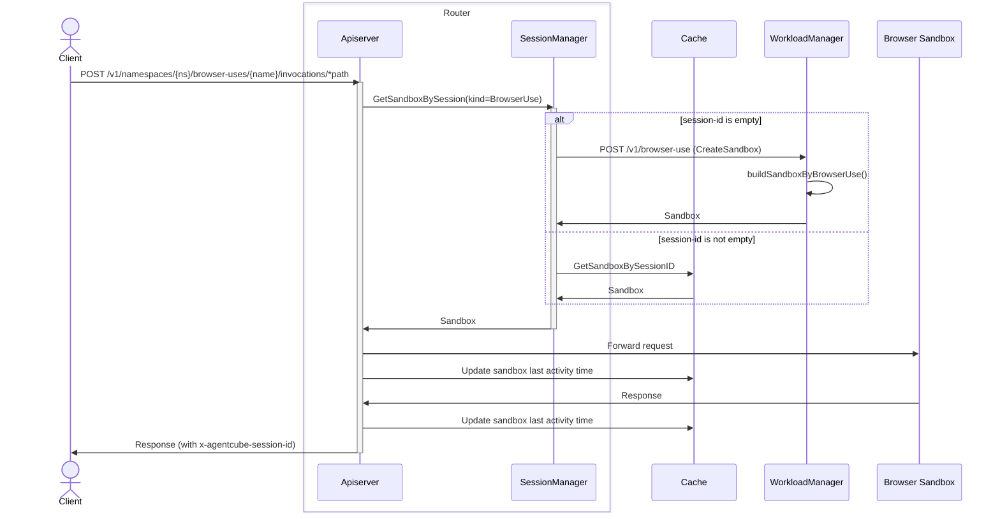

## BrowserUse Scenario Support

### Summary

This proposal introduces a new `BrowserUse` Custom Resource Definition (CRD) as a first-class scenario type in AgentCube, alongside the existing `AgentRuntime` and `CodeInterpreter`. The `BrowserUse` CRD provides a purpose-built declarative API for browser automation workloads — such as those powered by [Playwright MCP](https://github.com/nichochar/playwright-mcp), [browser-use](https://github.com/browser-use/browser-use), or similar browser-in-sandbox tools — giving them dedicated routing, sandbox lifecycle management, and session handling.

### Motivation

Browser automation is one of the most popular agentic AI capabilities. LLM-powered agents increasingly need to interact with live web pages — navigating, clicking, extracting data, and filling forms — all inside isolated, ephemeral sandboxes.

Today, AgentCube users can run browser workloads using the generic `AgentRuntime` CRD (as demonstrated in `example/browser-agent/`). However, this approach has limitations:

1. **No semantic distinction** — The system treats a Playwright MCP sandbox the same as any other agent runtime. Operators cannot filter, monitor, or enforce policies specifically for browser workloads.
2. **No browser-specific defaults** — Users must manually configure ports, resource requests, and pod templates for headless browser environments every time.
3. **No dedicated API surface** — Tooling (SDK, CLI, dashboards) cannot offer browser-specific workflows or documentation without a distinct CRD kind.
4. **Limited extensibility** — Future browser-specific features (VNC preview, screenshot capture, domain allowlists, browser profile management) have no natural home in the generic `AgentRuntime` spec.

#### Goals

- Provide a dedicated `BrowserUse` CRD for declaring browser automation sandbox environments.
- Add end-to-end support across the AgentCube control plane: informer, workload builder, session manager, router, and API routes.
- Maintain consistency with existing CRD patterns (`AgentRuntime`, `CodeInterpreter`) for a uniform developer experience.
- Enable future browser-specific extensions without polluting the generic `AgentRuntime` API surface.

#### Non-Goals

- This proposal does **not** change the `AgentRuntime` or `CodeInterpreter` CRDs.
- It does **not** implement browser-specific features beyond the CRD skeleton (e.g., VNC streaming, screenshot APIs, domain allowlists). Those are future enhancements.
- It does **not** introduce a new controller/operator for `BrowserUse`. The workload manager's existing sandbox creation flow is sufficient.
- It does **not** cover warm-pool support for `BrowserUse` in the initial implementation. This can be added later following the `CodeInterpreter` warm-pool pattern.

### Proposal

#### User Stories

##### Story 1

As an AI agent developer, I want to deploy a Playwright MCP server as a managed browser sandbox through AgentCube, so that my LLM agent can perform web research tasks in an isolated, ephemeral environment with automatic session management and cleanup.

##### Story 2

As a platform operator, I want to distinguish browser automation workloads from generic agent runtimes in monitoring dashboards and resource quota policies, so that I can allocate appropriate resources (higher memory, GPU for rendering) and enforce browser-specific security policies.

##### Story 3

As a developer using the AgentCube Python SDK, I want a `BrowserUseClient` that provides a clean interface for interacting with browser sandboxes, so that I can integrate browser automation into my agent pipeline without manually constructing HTTP requests.

### Design Details

#### Why a Separate CRD?

The rationale mirrors the original decision to separate `CodeInterpreter` from `AgentRuntime` (see [runtime-template-proposal.md](./runtime-template-proposal.md)):

| Concern | AgentRuntime | BrowserUse |
|---------|-------------|------------|
| Pod template | Full `PodSpec` — user specifies everything | Full `PodSpec` — browser workloads need flexibility (sidecar VNC, shared memory, etc.) |
| Default ports | No defaults | Can default to common browser ports (e.g., 8931 for Playwright MCP) |
| Resource profile | Generic | Browser workloads typically need more memory (512Mi–2Gi) and shared memory (`/dev/shm`) |
| Future extensions | Generic agent features | Domain allowlists, VNC preview, screenshot capture, browser profile persistence |
| Monitoring | Mixed with all agents | Dedicated metrics and dashboards for browser workloads |
| Security policies | Generic | Browser sandboxes may need stricter network policies or egress controls |

While the initial `BrowserUseSpec` closely resembles `AgentRuntimeSpec` (both use full `PodSpec` templates), having a separate CRD allows the API to evolve independently as browser-specific features are added.

#### BrowserUse CRD

```go
// BrowserUse defines the desired state of a browser automation runtime environment.
//
// This runtime is designed for running browser automation workloads such as
// Playwright MCP servers, browser-use agents, or similar browser-in-sandbox tools.
// It provides an isolated, ephemeral browser environment per session with
// automatic lifecycle management.
type BrowserUse struct {
    metav1.TypeMeta   `json:",inline"`
    metav1.ObjectMeta `json:"metadata,omitempty"`
    // Spec defines the desired state of the BrowserUse runtime.
    Spec BrowserUseSpec `json:"spec"`
    // Status represents the current state of the BrowserUse runtime.
    Status BrowserUseStatus `json:"status,omitempty"`
}

// BrowserUseSpec describes how to create and manage browser automation sandboxes.
type BrowserUseSpec struct {
    // Ports is a list of ports that the browser runtime will expose.
    // Typically includes the browser automation protocol port (e.g., Playwright MCP on 8931)
    // and optionally a VNC port for visual debugging.
    Ports []TargetPort `json:"ports"` 

    // PodTemplate describes the template that will be used to create a browser sandbox.
    // Browser workloads typically require:
    // - Sufficient shared memory (/dev/shm) for Chromium
    // - Network access for browsing target websites
    // - Optional VNC sidecar for visual debugging
    // +kubebuilder:validation:Required
    Template *SandboxTemplate `json:"podTemplate" protobuf:"bytes,1,opt,name=podTemplate"`

    // SessionTimeout describes the duration after which an inactive browser session
    // will be terminated. Browser sessions are typically longer-lived than code
    // interpreter sessions due to multi-step navigation tasks.
    // +kubebuilder:validation:Required
    // +kubebuilder:default="30m"
    SessionTimeout *metav1.Duration `json:"sessionTimeout,omitempty" protobuf:"bytes,2,opt,name=sessionTimeout"`

    // MaxSessionDuration describes the maximum duration for a browser session.
    // After this duration, the session will be terminated regardless of activity.
    // +kubebuilder:validation:Required
    // +kubebuilder:default="8h"
    MaxSessionDuration *metav1.Duration `json:"maxSessionDuration,omitempty" protobuf:"bytes,3,opt,name=maxSessionDuration"`
}

// BrowserUseStatus represents the observed state of a BrowserUse runtime.
type BrowserUseStatus struct {
    // Conditions represent the latest available observations of the BrowserUse's state.
    // +optional
    Conditions []metav1.Condition `json:"conditions,omitempty"`
}
```

> **Design Note**: The `BrowserUseSpec` reuses `AgentRuntime`'s `SandboxTemplate` (full `PodSpec`) rather than `CodeInterpreter`'s simplified template. Browser workloads often need multi-container pods (browser + VNC sidecar), shared volume mounts, and custom security contexts that are better expressed through a full `PodSpec`.

> **Design Note**: The default `SessionTimeout` is set to `30m` (vs `15m` for AgentRuntime/CodeInterpreter) because browser automation tasks typically involve multi-step navigation workflows that take longer.

#### Example BrowserUse CR

```yaml
apiVersion: runtime.agentcube.volcano.sh/v1alpha1
kind: BrowserUse
metadata:
  name: playwright-mcp
  namespace: default
spec:
  targetPort:
    - pathPrefix: "/"
      port: 8931
      protocol: "HTTP"
  podTemplate:
    labels:
      app: playwright-mcp
    spec:
      containers:
        - name: playwright-mcp
          image: mcr.microsoft.com/playwright/mcp:latest
          imagePullPolicy: IfNotPresent
          args:
            - "--port"
            - "8931"
            - "--host"
            - "0.0.0.0"
          ports:
            - containerPort: 8931
              protocol: TCP
          resources:
            requests:
              cpu: "500m"
              memory: "512Mi"
            limits:
              cpu: "1"
              memory: "1Gi"
  sessionTimeout: "30m"
  maxSessionDuration: "8h"
```

### System Integration

#### Architecture Flow



#### Component Changes

The following table summarizes changes required across AgentCube components:

| Component | File(s) | Change |
|-----------|---------|--------|
| **CRD Types** | `pkg/apis/runtime/v1alpha1/browseruse_types.go` | New `BrowserUse`, `BrowserUseSpec`, `BrowserUseStatus`, `BrowserUseList` types |
| **CRD Types** | `pkg/apis/runtime/v1alpha1/register.go` | Add `BrowserUse` type metadata variables |
| **Common Types** | `pkg/common/types/types.go` | Add `BrowserUseKind = "BrowserUse"` constant |
| **Common Types** | `pkg/common/types/sandbox.go` | Add `BrowserUseKind` to `Validate()` switch |
| **Errors** | `pkg/api/errors.go` | Add `ErrBrowserUseNotFound`, `browserUseResource`, update `workloadResource()` |
| **Informers** | `pkg/workloadmanager/informers.go` | Add `BrowserUseGVR`, `BrowserUseInformer` field, sync in `run()` / `waitForCacheSync()` |
| **Workload Builder** | `pkg/workloadmanager/workload_builder.go` | Add `buildSandboxByBrowserUse()` function |
| **WM Handlers** | `pkg/workloadmanager/handlers.go` | Add `handleBrowserUseCreate()`, add `BrowserUseKind` case in `handleSandboxCreate()` |
| **WM Server** | `pkg/workloadmanager/server.go` | Add `/v1/browser-use` POST and DELETE routes |
| **Router Handlers** | `pkg/router/handlers.go` | Add `handleBrowserUseInvoke()` handler |
| **Router Server** | `pkg/router/server.go` | Add GET/POST routes for `/v1/namespaces/:namespace/browser-uses/:name/invocations/*path` |
| **Session Manager** | `pkg/router/session_manager.go` | Add `BrowserUseKind` case in `createSandbox()` endpoint switch |
| **Code Generation** | `zz_generated.deepcopy.go`, CRD YAML | Auto-generated via `make generate` |

### API Endpoints

#### WorkloadManager Endpoints

| Method | Path | Description |
|--------|------|-------------|
| `POST` | `/v1/browser-use` | Create a new browser sandbox |
| `DELETE` | `/v1/browser-use/sessions/:sessionId` | Delete a browser sandbox by session ID |

**Request Body (POST):**
```json
{
  "kind": "BrowserUse",
  "name": "playwright-mcp",
  "namespace": "default"
}
```

**Response (POST):**
```json
{
  "sessionId": "uuid-string",
  "sandboxId": "k8s-uid",
  "sandboxName": "playwright-mcp-a1b2c3d4",
  "entryPoints": [
    {
      "path": "/",
      "protocol": "HTTP",
      "endpoint": "10.0.0.5:8931"
    }
  ]
}
```

#### Router Endpoints

| Method | Path | Description |
|--------|------|-------------|
| `GET` | `/v1/namespaces/:namespace/browser-uses/:name/invocations/*path` | Invoke browser sandbox (GET) |
| `POST` | `/v1/namespaces/:namespace/browser-uses/:name/invocations/*path` | Invoke browser sandbox (POST) |

**Headers:**
- `x-agentcube-session-id` (optional) — Reuses existing browser session if provided; creates new session if empty.

**Response Headers:**
- `x-agentcube-session-id` — Session ID for subsequent requests.

### Implementation Details

#### buildSandboxByBrowserUse()

The workload builder function follows the same pattern as `buildSandboxByAgentRuntime()`:

```go
func buildSandboxByBrowserUse(namespace string, name string, ifm *Informers) (
    *sandboxv1alpha1.Sandbox, *sandboxEntry, error) {

    browserUseKey := namespace + "/" + name
    runtimeObj, exists, _ := ifm.BrowserUseInformer.GetStore().GetByKey(browserUseKey)
    if !exists {
        return nil, nil, api.ErrBrowserUseNotFound
    }

    // Convert unstructured → BrowserUse
    // Generate sessionID, sandboxName
    // Build sandbox from BrowserUse.Spec.Template (full PodSpec)
    // Return sandbox, sandboxEntry (with ports, sessionID, idleTimeout)
}
```

#### Informer Registration

```go
var BrowserUseGVR = schema.GroupVersionResource{
    Group:    "runtime.agentcube.volcano.sh",
    Version:  "v1alpha1",
    Resource: "browseruses",
}

type Informers struct {
    AgentRuntimeInformer    cache.SharedIndexInformer
    CodeInterpreterInformer cache.SharedIndexInformer
    BrowserUseInformer      cache.SharedIndexInformer  // NEW
    PodInformer             cache.SharedIndexInformer
    informerFactory         informers.SharedInformerFactory
}
```

### Future Extensions

The following features are explicitly out of scope for this proposal but are enabled by having a dedicated `BrowserUse` CRD:

| Feature | Description |
|---------|-------------|
| **VNC Preview** | Expose a VNC port for real-time visual debugging of browser sessions |
| **Screenshot API** | Provide an API endpoint to capture screenshots of the current browser state |
| **Domain Allowlists** | Restrict which domains the browser sandbox can access |
| **Browser Profile Persistence** | Persist browser profiles (cookies, localStorage) across sessions |
| **Warm Pools** | Pre-warm browser sandboxes for reduced startup latency |
| **Resource Presets** | Provide named resource profiles (e.g., "lightweight", "heavy") for common browser workloads |

### Alternatives

#### Alternative 1: Use AgentRuntime with Labels

Instead of a new CRD, users could apply labels (e.g., `scenario: browser-use`) to `AgentRuntime` resources. However, this approach:
- Provides no API-level distinction or validation
- Cannot evolve browser-specific fields independently
- Makes it harder to build browser-specific tooling and dashboards
- Is inconsistent with the existing pattern of having `CodeInterpreter` as a separate CRD

#### Alternative 2: Extend AgentRuntime with a Scenario Field

Add a `scenario` field to `AgentRuntimeSpec` to distinguish browser workloads. However:
- Pollutes the generic `AgentRuntime` API with browser-specific concerns
- Makes validation logic conditional on the scenario value
- Reduces API clarity and discoverability
- Goes against the established pattern in AgentCube of separate CRDs for distinct scenarios

#### Alternative 3: No CRD — Use Only the Existing Example

Continue using the existing `example/browser-agent/` pattern where browser workloads are deployed as plain `AgentRuntime` resources. This is viable for simple cases but does not provide the platform-level support needed for a first-class browser automation experience.

### Test Plan

1. **Unit tests**: Ensure `buildSandboxByBrowserUse()` correctly constructs sandboxes from `BrowserUse` CRs.
2. **Validation tests**: Verify `CreateSandboxRequest.Validate()` accepts `BrowserUseKind`.
3. **Build verification**: Confirm `go build ./...` succeeds with all changes.
4. **CRD generation**: Verify `make generate` produces the expected CRD YAML and deepcopy methods.
5. **Integration tests** (future): Extend E2E tests to cover the BrowserUse lifecycle.
