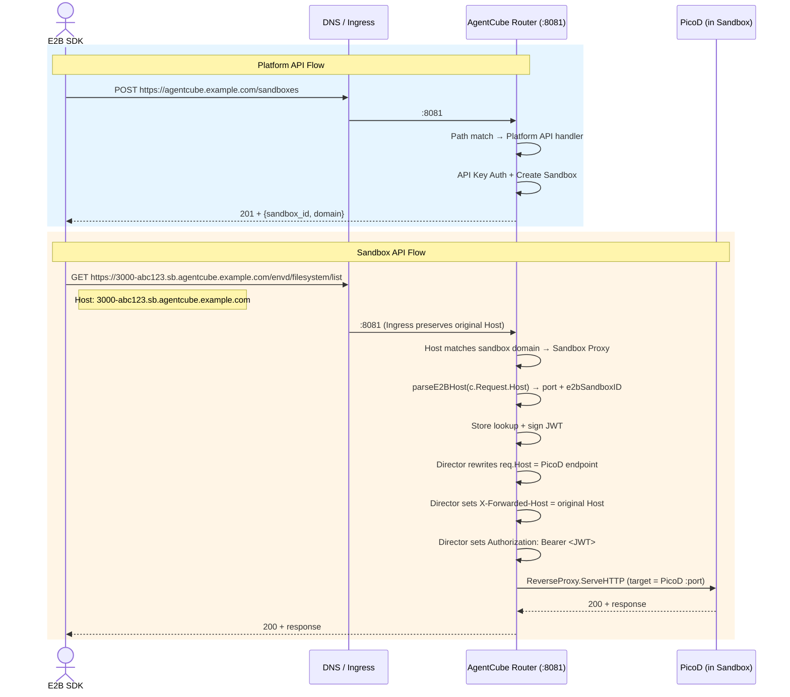
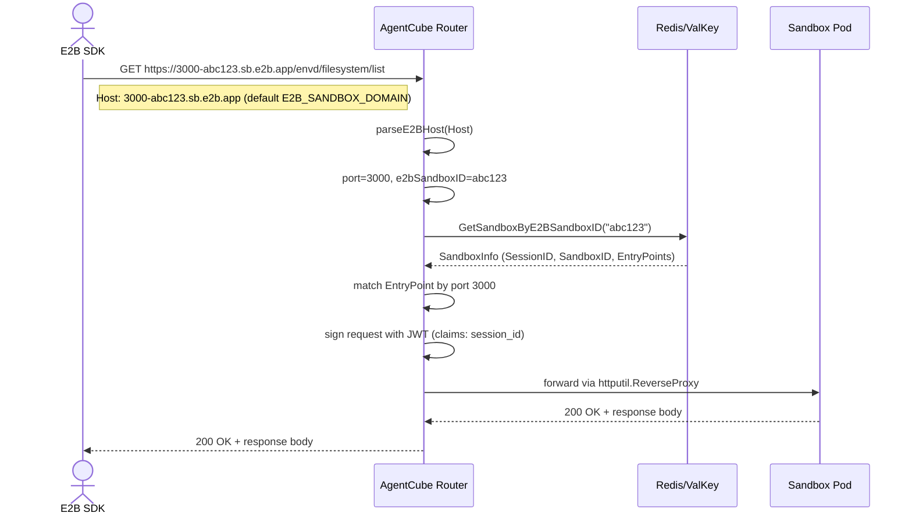
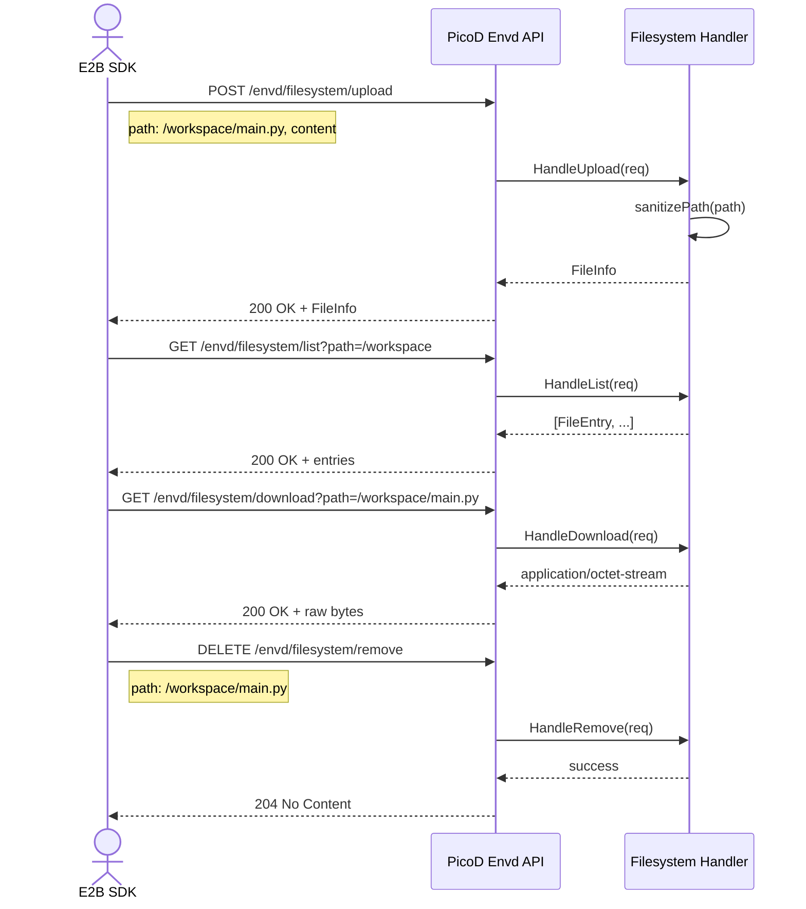
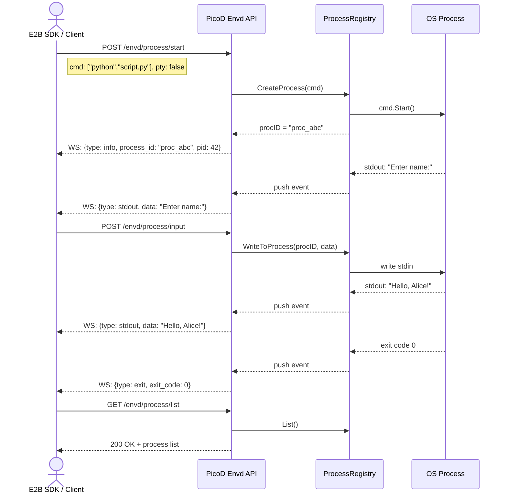

# E2B API Compatible Layer Architecture Design

## 1. Overview

This document describes the architecture design for implementing an E2B API compatible layer in AgentCube. The goal is to provide API compatibility with [E2B](https://e2b.dev/)'s REST API, enabling users to use E2B SDKs and tools with AgentCube as the backend.

### 1.1 Design Goals

- **API Compatibility**: Implement E2B API core endpoints for sandbox lifecycle management
- **Minimal Changes**: Reuse existing AgentCube components (Router, SessionManager, Store)
- **Clean Separation**: E2B API layer as a separate module within the Router
- **Feature Mapping**: Map E2B concepts (template, sandbox) to AgentCube concepts (CodeInterpreter/AgentRuntime, session/sandbox)

### 1.2 Scope

E2B's REST API is architecturally divided into two layers. AgentCube implements compatibility for each layer in a separate component:

| API Layer                  | Deployment                                  | Component                  | Responsibility                                                 |
| -------------------------- | ------------------------------------------- | -------------------------- | -------------------------------------------------------------- |
| **Platform API**           | `https://api.e2b.app`                       | Router (`pkg/router/e2b/`) | Sandbox lifecycle, templates, teams, snapshots, etc.           |
| **Sandbox API / Envd API** | Inside sandbox `{port}-{sandboxID}.e2b.app` | PicoD (`pkg/picod/`)       | In-sandbox filesystem, process management, environment queries |

E2B SDKs (e.g., `e2b-python-sdk`) internally call both layers: Platform API is used to create a sandbox, then Sandbox API is used to execute commands or manipulate files inside the sandbox.

The tables below summarize the current implementation status (referencing the E2B official API documentation at https://e2b.dev/docs/api-reference/):

| Status                 | Meaning                                                                                                            |
| ---------------------- | ------------------------------------------------------------------------------------------------------------------ |
| Covered by this design | Endpoint is fully designed in this document; implementation can proceed directly from the spec.                    |
| Requires future design | Endpoint is acknowledged but not designed in this document; a separate design doc is needed before implementation. |
| Deprecated by E2B      | Officially deprecated by E2B. AgentCube skips these and implements the current non-deprecated versions instead.    |

> **Deprecation Policy**
>
> The E2B official API has deprecated several endpoints (see **Deprecated by E2B** table below). AgentCube does **not** implement deprecated APIs. Where a deprecated endpoint has a newer replacement, the design document targets the latest stable version. The v1 Templates API (`/templates/*`) and the v2 Templates create endpoint (`POST /v2/templates`) are among the deprecated endpoints; AgentCube should align with the current E2B Templates API (v3 where available).

#### Platform API Support Status (Router Layer)

**Covered by this design**

| Category      | API Endpoint                   | Description                               |
| ------------- | ------------------------------ | ----------------------------------------- |
| **Sandboxes** | `POST /sandboxes`              | Create sandbox                            |
|               | `GET /sandboxes`               | List running sandboxes                    |
|               | `GET /sandboxes/{id}`          | Get sandbox details                       |
|               | `GET /v2/sandboxes`            | List running sandboxes (v2)               |
|               | `DELETE /sandboxes/{id}`       | Kill sandbox                              |
|               | `POST /sandboxes/{id}/refresh` | Refresh sandbox TTL (mapped to refreshes) |
|               | `POST /sandboxes/{id}/timeout` | Set sandbox timeout                       |
| **Templates** | `POST /v3/templates`           | Crate Template API.                       |
|               | `GET /templates`               | List current Templates                    |
|               | `GET /templates/{id}`          | Get template details.                     |
|               | `DELETE /templates/{id}`       | Delete specified template.                |
|               | `PATCH /v2/templates/{id}`     | Update template.                          |

**Requires future design**

| Category      | API Endpoint                     | Description                                           |
| ------------- | -------------------------------- | ----------------------------------------------------- |
| **Sandboxes** | `GET /sandboxes/{id}/metrics`    | Get sandbox metrics                                   |
|               | `GET /sandboxes/metrics`         | Batch get sandbox metrics                             |
|               | `POST /sandboxes/{id}/snapshots` | Create snapshot                                       |
|               | `POST /sandboxes/{id}/connect`   | Connect to sandbox (includes resuming paused sandbox) |
|               | `POST /sandboxes/{id}/pause`     | Pause sandbox                                         |
|               | `PUT /sandboxes/{id}/network`    | Update network configuration                          |
| **Snapshots** | `GET /snapshots`                 | List snapshots                                        |
| **Tags**      | `GET /templates/{id}/tags`       | List tags                                             |
|               | `POST /templates/{id}/tags`      | Assign tags                                           |
|               | `DELETE /templates/tags`         | Delete tags                                           |
| **Teams**     | `GET /teams`                     | List teams                                            |
|               | `GET /teams/metrics`             | Get team metrics                                      |
|               | `GET /teams/metrics/max`         | Get maximum metrics                                   |
| **Volumes**   | `GET /volumes`                   | List volumes                                          |
|               | `POST /volumes`                  | Create volume                                         |
|               | `GET /volumes/{id}`              | Get volume info                                       |
|               | `DELETE /volumes/{id}`           | Delete volume                                         |

**Deprecated by E2B**

| Category      | API Endpoint                  | Deprecated Version | Notes                                         |
| ------------- | ----------------------------- | ------------------ | --------------------------------------------- |
| **Sandboxes** | `GET /v2/sandboxes/{id}/logs` | Logs v2            | Use current logging mechanism instead.        |
|               | `POST /sandboxes/{id}/resume` | Resume             | Deprecated; connect flow may replace this.    |
| **Templates** | `POST /templates`             | v1                 | Deprecated; use `POST /v3/templates`.         |
|               | `PATCH /templates/{id}`       | v1                 | Deprecated; use current Templates update API. |
|               | `POST /v2/templates`          | v2                 | Deprecated; use `POST /v3/templates`.         |

**Not applicable to AgentCube**

E2B's Template Build APIs (`/templates/{id}/builds/*`) are explicitly excluded from AgentCube's compatibility scope for the following reasons:

1. **No build capability**: AgentCube uses pre-built container images specified in CRD `spec.image`. There is no Docker build pipeline, build registry, or image compilation step.
2. **Concept mismatch**: E2B's "build" means "compile a Dockerfile into a runnable image." AgentCube's template creation means "register a CRD that references an existing image." These are fundamentally different operations.
3. **E2B deprecation**: The v1/v2 Template Build endpoints are deprecated by E2B. The v3 Templates API does not rely on build simulation.
4. **User experience**: Simulating a `building` → `ready` state transition for a simple CRD creation adds unnecessary complexity and misleading semantics.

| Category      | API Endpoint                                | Reason                                                                   |
| ------------- | ------------------------------------------- | ------------------------------------------------------------------------ |
| **Templates** | `GET /templates/{id}/builds`                | AgentCube uses pre-built container images; no image build process exists |
|               | `GET /templates/{id}/builds/{buildId}`      | No build registry to query                                               |
|               | `POST /templates/{id}/builds`               | No Docker build capability; CRDs reference existing images directly      |
|               | `GET /templates/{id}/builds/{buildId}/logs` | No build process means no build logs                                     |
|               | `GET /templates/{id}/builds/upload`         | No build artifact upload flow                                            |
|               | `POST /templates/{id}/rebuild`              | No rebuild capability; update CRD image reference instead                |

#### Sandbox API / Envd API Support Status (PicoD Layer)

The following APIs run inside the sandbox and are provided by the **PicoD** runtime. The current PicoD already provides basic endpoints; this design document plans the full compatibility roadmap with the E2B envd API.

**Covered by this design**

| Category        | API Endpoint                | Description                 |
| --------------- | --------------------------- | --------------------------- |
| **Filesystem**  | `GET /filesystem/download`  | Download file               |
|                 | `POST /filesystem/upload`   | Upload file                 |
|                 | `GET /filesystem/list`      | List directory              |
|                 | `POST /filesystem/mkdir`    | Create directory            |
|                 | `POST /filesystem/move`     | Move file                   |
|                 | `DELETE /filesystem/remove` | Delete file                 |
|                 | `GET /filesystem/stat`      | Get file status             |
| **Process**     | `POST /process/start`       | Start process (MVP non-PTY) |
|                 | `POST /process/input`       | Send input                  |
|                 | `POST /process/close-stdin` | Close stdin                 |
|                 | `POST /process/signal`      | Send signal                 |
|                 | `GET /process/list`         | List processes              |
| **Environment** | `GET /envd/health`          | Health check (204 response) |
|                 | `GET /envd/env`             | Get environment variables   |

**Requires future design**

| Category        | API Endpoint                           | Description                       |
| --------------- | -------------------------------------- | --------------------------------- |
| **Filesystem**  | `POST /filesystem/compose`             | Compose files                     |
|                 | `GET/POST/DELETE /filesystem/watcher*` | Directory watch                   |
| **Process**     | `POST /process/update`                 | Update process (e.g., resize PTY) |
|                 | `GET /process/connect`                 | Connect to process stream         |
| **Environment** | `GET /envd/stats`                      | Get service stats (cgroup)        |

#### Future Plans

**Platform API (Router) Follow-up Phases**:

- Snapshots API
- Volumes API
- Metrics / Logs API
- Pause / Resume
- Network configuration updates
- Tags / Teams API

**Sandbox API (PicoD) Follow-up Phases**:

- Filesystem watcher and compose
- Process stream-input / connect
- Full PTY terminal support

---

## 2. Overall Architecture

### 2.1 System Architecture Diagram

```
┌─────────────────────────────────────────────────────────────────────────┐
│                              Client/SDK                                 │
│                    (e2b-python-sdk / e2b-js-sdk)                        │
│  ┌─────────────────────────────┐  ┌──────────────────────────────────┐  │
│  │   Platform API Calls        │  │   Sandbox API Calls              │  │
│  │   (api.e2b.app)             │  │   ({port}-{id}.e2b.app)          │  │
│  └─────────────┬───────────────┘  └─────────────┬────────────────────┘  │
└────────────────┼────────────────────────────────┼───────────────────────┘
                 │                                │
                 │ HTTPS                          │ HTTPS / WebSocket
                 ▼                                ▼
┌────────────────────────────────┐   ┌────────────────────────────────────┐
│  AgentCube Router (:8080/:8081)│   │         Sandbox Pod                │
│  ┌──────────────────────────┐  │   │  ┌──────────────────────────────┐  │
│  │  E2B Platform API Layer  │  │   │  │      PicoD Daemon            │  │
│  │  (/sandboxes, /templates)│  │   │  │  ┌──────────────────────┐    │  │
│  │                          │  │   │  │  │ Envd API Layer       │    │  │
│  │  • API Key Auth          │  │   │  │  │ (/envd/*)            │    │  │
│  │  • Sandbox Lifecycle     │  │   │  │  │                      │    │  │
│  │  • Template Management   │  │   │  │  │ • Process Handler    │    │  │
│  └──────┬───────────────────┘  │   │  │  │ • Filesystem Handler │    │  │
│         │                      │   │  │  │ • Environment Handler│    │  │
│  ┌──────▼───────────────────┐  │   │  │  └──────────────────────┘    │  │
│  │  Existing Components     │  │   │  │  ┌──────────────────────┐    │  │
│  │  SessionManager          │  │   │  │  │ Native API Layer     │    │  │
│  │  Store (Redis)           │  │   │  │  │ (/api/*, /health)    │    │  │
│  │  WorkloadMgr Client      │  │   │  │  │                      │    │  │
│  └──────┬───────────────────┘  │   │  │  │ • POST /api/execute  │    │  │
│         │                      │   │  │  │ • POST /api/files    │    │  │
│         ▼                      │   │  │  │ • GET  /health       │    │  │
│  ┌──────────────┐              │   │  │  └──────────────────────┘    │  │
│  │  Kubernetes  │              │   │  │                              │  │
│  │  (create Pod)│              │   │  └──────────────────────────────┘  │
│  └──────────────┘              │   │                                    │
└────────────────────────────────┘   └────────────────────────────────────┘
```

### 2.2 Request Flow

The two primary request flows are:

1. **Platform API** (sandbox creation): Client → Router (`:8081`) → API Key validation → SessionManager → WorkloadManager → Kubernetes (Pod creation) → Store persistence → E2B response.
2. **Sandbox API** (in-sandbox operations): Client → Router (`:8081`) → Host parsing → Store lookup by `e2bSandboxID` → JWT signing → reverse proxy to PicoD.

Other Platform API operations (Get, Delete, Timeout, Refresh) follow the same pattern: API Key validation → Store lookup by `e2bSandboxID` → perform action.

Detailed end-to-end sequence diagrams are provided in §2.3.3.

### 2.3 Access Endpoint Compatibility

The Router runs as a **single process with two listeners** to isolate E2B external traffic from Native internal traffic:

| Listener   | Port    | Traffic                                                                      | Exposure                      |
| ---------- | ------- | ---------------------------------------------------------------------------- | ----------------------------- |
| **Native** | `:8080` | AgentCube Native API (`/v1/namespaces/...`, `/health`)                       | Internal (ClusterIP)          |
| **E2B**    | `:8081` | E2B Platform API (`/sandboxes`, `/templates`) + Sandbox API Proxy (`*.sb.*`) | Public (Ingress/LoadBalancer) |

Both listeners share the same process, SessionManager, Store, and JWT manager, but are bound to different ports so that Kubernetes Service/Ingress can route them independently.

| Endpoint         | Domain Example                         | Listener | Router Handler  | Responsibility                              |
| ---------------- | -------------------------------------- | -------- | --------------- | ------------------------------------------- |
| **Native API**   | `router.internal`                      | `:8080`  | Native handlers | Agent runtime, code interpreter invocations |
| **Platform API** | `agentcube.example.com`                | `:8081`  | E2B handlers    | Sandbox lifecycle, templates, auth          |
| **Sandbox API**  | `3000-abc123.sb.agentcube.example.com` | `:8081`  | Proxy → PicoD   | In-sandbox filesystem, process, env         |

#### 2.3.1 Request Dispatch

**Port is the first-level gate.** The Router creates two `http.Server` instances within the same process:

- **`:8080`** — Native API: routes by URL path (`/v1/namespaces/:namespace/...`, `/health/*`)
- **`:8081`** — E2B API: routes by URL path for Platform API (`/sandboxes`, `/templates`); routes by `Host` for Sandbox API Proxy

**Sandbox API** requests arriving on `:8081` are further dispatched by `Host` matching:

```
3000-abc123.sb.agentcube.example.com → port=3000, e2bSandboxID=abc123
```

Then the Router looks up the sandbox in Store and forwards to PicoD.

#### 2.3.2 Domain Configuration

The Router exposes the sandbox domain as a configuration item:

- `E2B_SANDBOX_DOMAIN`: domain suffix for Sandbox API subdomains (default: `sb.e2b.app`)

When creating a sandbox, the Router returns `sandbox_id` (E2BSandboxID) and `domain` fields. E2B SDKs use these to construct Sandbox API URLs (`{port}-{sandbox_id}.{domain}`).

#### 2.3.3 End-to-End Request Flow



**Key design decisions:**

1. **Dual-listener in single process**: E2B and Native APIs share the same Router process (simplifying deployment) but bind to different ports (enabling network-level isolation).
2. **Port-based traffic isolation**: Native API is not reachable from public Ingress; E2B API can have independent rate limits, WAF rules, and TLS policies.
3. **Path-based Platform routing**: Platform API uses URL path matching; any domain can be configured without Router changes.
4. **Host-based Sandbox routing**: Sandbox API uses Host matching against a configurable domain suffix, maintaining E2B wire compatibility. The `Host` header is handled differently on each segment of the path:
   - **Client → Router**: the original `Host` (`{port}-{e2bSandboxID}.{domain}`) must be preserved end-to-end. 
   - **Router → PicoD**: the `httputil.ReverseProxy` Director rewrites `req.Host` to the in-cluster PicoD endpoint, so TCP dialing, keep-alive pooling, and PicoD's Gin router behave correctly. The original Host is preserved as `X-Forwarded-Host` for downstream visibility, and the Director injects the signed JWT as `Authorization: Bearer <token>`.
5. **Wildcard DNS**: Sandbox API uses a wildcard record so each sandbox gets a subdomain without per-sandbox DNS registration.
6. **Edge TLS termination**: TLS terminates at Ingress/Router; internal forwarding to PicoD uses cleartext HTTP (or mTLS if configured).

---

## 3. Module Design

### 3.1 Module Structure

```
pkg/router/
├── server.go                    # MODIFIED: add :8081 listener (dual-listener); register e2b/ routes
├── handlers.go                  # Existing: AgentCube native handlers; forwardToSandbox / configureProxyDirector reused by e2b/proxy.go
├── session_manager.go           # Existing: Session management (shared with e2b/)
├── jwt.go                       # Existing: JWT signing (shared with e2b/)
├── config.go                    # MODIFIED: add E2B* fields 
│
└── e2b/                         # NEW: E2B compatible API module
    ├── e2b_server.go            # E2B listener (:8081) setup; Platform API routes; NoRoute → proxy.go
    ├── handlers.go              # Platform API HTTP handlers (delegate to shared SessionManager)
    ├── proxy.go                 # Sandbox API proxy (Host → PicoD); reuses pkg/router/handlers.go
    ├── models.go                # E2B API data models
    ├── auth.go                  # API Key authentication (informer-backed cache)
    ├── mapper.go                # E2B ↔ AgentCube model mapping
    ├── resolver.go              # Template ID parsing and kind resolution
    └── id.go                    # E2BSandboxID generation (crypto/rand base62; Store-backed probe + retry)
```

### 3.2 Module Responsibilities

| Module            | Responsibility                                                                     |
| ----------------- | ---------------------------------------------------------------------------------- |
| **e2b_server.go** | E2B listener (`:8081`) setup, Platform API path routes, `engine.NoRoute` dispatch to `proxy.go` for Sandbox API. Receives shared `SessionManager`, `Store` and JWT manager via constructor injection from parent `pkg/router/`. |
| **handlers.go**   | Platform API HTTP handlers (`/sandboxes`, `/templates`). Translates E2B requests via `mapper.go` + `resolver.go`, then delegates to the shared `SessionManager` (from `pkg/router/`) which performs the actual sandbox lifecycle operations. |
| **proxy.go**      | Sandbox API proxy: Host parsing (`parseE2BHost`), Store lookup by `e2bSandboxID`, JWT signing. **Reuses `forwardToSandbox` / `configureProxyDirector` from `pkg/router/handlers.go`** for `req.Host` rewrite, `X-Forwarded-Host` propagation, and `Authorization: Bearer <JWT>` injection (see §2.3.3). |
| **models.go**     | E2B wire-format structs (snake_case JSON)                                          |
| **auth.go**       | API Key validation backed by a `SharedInformerFactory` watching the `e2b-api-keys` Secret and `e2b-api-key-config` ConfigMap (). The informer is bootstrapped once in `e2b_server.go` and shared with all handlers. |
| **mapper.go**     | Request/response model transformation                                              |
| **resolver.go**   | `templateID` parsing, namespace extraction, kind selection                        |
| **id.go**         | `E2BSandboxID` generation. `IDGenerator` wraps a CSPRNG draw with a Store probe (`GetSandboxByE2BSandboxID`) for collision detection, retrying up to 5 times before returning `ErrE2BSandboxIDExhausted`. The persistence layer adds atomic `SET NX` writes as defense-in-depth |

---

## 4. Data Model Mapping

### 4.1 E2B to AgentCube Concept Mapping

| E2B Concept    | AgentCube Concept                  | Notes                                                           |
| -------------- | ---------------------------------- | --------------------------------------------------------------- |
| **Template**   | CodeInterpreter / AgentRuntime CRD | E2B `templateID` maps to AgentCube CRD name                      |
| **Sandbox**    | Session + Sandbox                  | 1:1 mapping between E2B sandbox and AgentCube session           |
| **Sandbox ID** | E2BSandboxID                       | E2B sandbox_id = AgentCube E2BSandboxID (short ID, not K8s UID) |
| **Client ID**  | Deprecated (E2B compat only)       | E2B `client_id` is deprecated. AgentCube uses API Key for identity and access control. `client_id` in responses is a placeholder for SDK compatibility. |
| **Timeout**    | ExpiresAt                          | E2B timeout → calculated expiration time                        |
| **State**      | Pod Status                         | running, paused (paused not supported currently)               |

- **Template**: E2B sandbox can be used for various scenarios — such as agent itself (corresponding to `AgentRuntime`) or agent-triggered tool-use like code execution (corresponding to `CodeInterpreter`). Thus, E2B template maps to either`CodeInterpreter` or `AgentRuntime` CRD, defaulting to `CodeInterpreter`; the desired kind can be specified via the `metadata` field in the sandbox creation request.

- **E2BSandboxID**: E2B-compatible short ID (Base62, 8-12 chars) generated by the Router when a sandbox is created. It is the only ID exposed to E2B clients via the `sandbox_id` field, and it is embedded in Sandbox API subdomains (`{port}-{e2bSandboxID}.sb.{domain}`). Indexed in the Store for reverse lookup by the Sandbox API proxy handler.

- **Namespace**: In the E2B compatibility layer, the sandbox namespace is determined by the API Key mapping. If the API Key has an explicit namespace configured, the sandbox is created in that namespace (physical isolation). If not, the sandbox falls back to `E2B_DEFAULT_NAMESPACE` (logical isolation via Store filtering). The `templateID` field must not contain a namespace prefix in E2B API calls.

#### 4.1.1 API Key Namespace Mapping and Team Resource Partitioning

AgentCube uses an API Key Hash to Namespace mapping to partition resources created through the E2B API across different teams. When a request arrives, the Auth middleware extracts the API Key, computes its SHA-256 Hash, and looks up the corresponding Namespace from the mapping configuration (e.g., a Kubernetes ConfigMap or Secret). If no mapping is found, it falls back to `E2B_DEFAULT_NAMESPACE`.

It is important to note that the current AgentCube infrastructure runs on a single-tenant Kubernetes cluster. Therefore, the Namespace mapping described here is intended as a resource partitioning mechanism for organizing resources by team, rather than strict multi-tenant security isolation. While Kubernetes RBAC and ResourceQuota can be applied per Namespace to enforce boundaries, the underlying cluster and its control plane remain shared, meaning true tenant-level isolation is not guaranteed.

When no explicit mapping is configured, all resources created by unmapped API Keys land in the same default Namespace. In this mode, different teams' resources coexist in a single Namespace and are only differentiated by Store-level `apiKeyHash` filtering. It is recommended to configure API Key Hash to Namespace mappings so that different teams' resources are organized into separate Namespaces, enabling clearer resource ownership, quota control, and operational management.

The namespace resolution and `apiKeyHash` recording logic is implemented in the Create Sandbox handler (see §9.1).

### 4.2 Field Mapping Table

> **Template Dependency:** In the E2B compatibility layer, a `templateID` corresponds to an existing `CodeInterpreter` or `AgentRuntime` CRD in the target Namespace. The CRD acts as the sandbox template, and its `Spec.Template` defines the Pod specification (image, resources, ports, etc.). Before creating a sandbox, the administrator must ensure the corresponding CRD already exists in the target Namespace; otherwise the creation request fails with a not-found error.

#### Sandbox Creation (NewSandbox → CreateSandboxRequest)

| E2B Field       | AgentCube Field         | Mapping Logic                                                                                                                                            |
| --------------- | ----------------------- | -------------------------------------------------------------------------------------------------------------------------------------------------------- |
| `templateID`    | `Name`                  | CRD name of an existing `CodeInterpreter` or `AgentRuntime` in the target Namespace (e.g., `python-3.9`). Namespace is resolved from API Key mapping. |
| `metadata`      | `Annotations` + `Kind`  | General metadata stored as annotations. `metadata["agentcube.kind"] = "AgentRuntime"` overrides default `CodeInterpreter`. See **Kind Selection** below. |
| `timeout`       | `ExpiresAt`             | timeout (seconds) → ExpiresAt = Now + timeout                                                                                                            |
| `envVars`       | `EnvVar` in PodTemplate | Injected into sandbox container                                                                                                                          |
| `secure`        | N/A                     | Secure all system communication with sandbox (not supported currently)                                                                                   |
| `allow_internet_access` | N/A           | Allow sandbox to access the internet (not supported currently)                                                                                           |
| `autoPause`     | N/A                     | Not supported currently (returns error if true)                                                                                                          |
| `autoResume`    | N/A                     | Not supported currently                                                                                                                                  |
| `network`       | N/A                     | Not supported currently                                                                                                                                  |
| `volumeMounts`  | N/A                     | Not supported currently                                                                                                                                  |
| `mcp`           | N/A                     | Not supported currently                                                                                                                                  |

> **Secure Field Note:** The `secure` field is not currently processed by the E2B compatibility layer. AgentCube's default security model relies on the Router automatically signing JWT tokens (RS256) for all proxied requests to PicoD, and PicoD verifying them using the injected public key. This means E2B SDK clients do not need to manage per-sandbox access tokens; authentication is transparently handled by the Router.
>
> **Allow Internet Access Note:** The `allow_internet_access` field is currently ignored. By default, sandbox Pods inherit the network capabilities of the underlying Kubernetes cluster. In a standard cluster configuration, Pods can access external networks unless restricted by Kubernetes NetworkPolicies or CNI-level isolation. Future implementation of this field would require integration with NetworkPolicy or RuntimeClass-specific network controls to enforce egress restrictions per sandbox.

#### Sandbox Response (SandboxInfo → Sandbox)

| AgentCube Field           | E2B Field     | Mapping Logic                                                            |
| ------------------------- | ------------- | ------------------------------------------------------------------------ |
| `E2BSandboxID`            | `sandboxID`   | E2B-compatible short ID (8-12 chars base62)                              |
| `APIKeyHash`              | `clientID`    | Deprecated placeholder. Returns API Key hash for SDK compatibility.      |
| `TemplateID`              | `templateID`  | CRD name (CodeInterpreter / AgentRuntime) that created the sandbox       |
| `Kind`                    | `metadata["agentcube.kind"]` | CRD kind: `"CodeInterpreter"` or `"AgentRuntime"`. Returned in response metadata for E2B SDK compatibility. |
| `Alias`                   | `alias`       | Alias of the template                                                    |
| `CreatedAt`               | `startedAt`   | ISO 8601 format                                                          |
| `ExpiresAt`               | `endAt`       | ISO 8601 format                                                          |
| `EntryPoints`             | `domain`      | First HTTP endpoint address                                              |
| `Status`                  | `state`       | "running" (running) / "paused" (not supported)                           |
| `EnvdVersion`             | `envdVersion` | Version of the envd (PicoD) running in the sandbox                       |
| `EnvdAccessToken`         | `envdAccessToken` | Access token for authenticating envd requests to this sandbox      |
| `TrafficAccessToken`      | `trafficAccessToken` | Token required for accessing sandbox via proxy                  |
| `SandboxNamespace`        | N/A           | Used to locate CRD                                                       |

> **Compatibility-Only Fields Note:** The following fields are present in the E2B Sandbox Response to prevent SDK parsing errors, but are either deprecated by E2B or not yet implemented in AgentCube. Their current return values are:
>
> - **`clientID`**: Returns the `APIKeyHash` (SHA-256 of the API key) as a placeholder. E2B has deprecated this field; it is not used for authentication.
> - **`alias`**: Returns an empty string. AgentCube does not currently support template aliases.
> - **`envdVersion`**: Returns an empty string. AgentCube does not currently track per-sandbox PicoD version information.
> - **`envdAccessToken`**: Returns an empty string. AgentCube's Router transparently signs all requests with JWT (RS256); clients do not need to use this token.
> - **`trafficAccessToken`**: Returns an empty string. The Router handles request proxying and authentication transparently; this token is not used.

#### Kind Selection

E2B's `templateID` concept maps to both `CodeInterpreter` and `AgentRuntime` CRDs in AgentCube. To resolve this ambiguity without changing the E2B wire format, kind selection is driven by the `metadata` field in the sandbox creation request:

| `metadata["agentcube.kind"]` | Selected CRD      | Behavior                                                                         |
| ---------------------------- | ----------------- | -------------------------------------------------------------------------------- |
| Absent or empty              | `CodeInterpreter` | Default kind. Suitable for secure, short-lived code execution (REPL, notebooks). |
| `"AgentRuntime"`             | `AgentRuntime`    | Conversational agent with volume binding and credential mount support.           |
| Any other value              | Error (400)       | Returns `INVALID_KIND` error with supported values list.                         |

**Rationale:**

- **Default to `CodeInterpreter`**: E2B's primary use case is code execution (notebooks, REPLs), which aligns with `CodeInterpreter`'s design for secure, short-lived workloads.
- **Metadata override**: `metadata` is a standard E2B field for arbitrary key-value pairs, making it a natural extension point without breaking API compatibility.
- **Future extensibility**: New CRD kinds can be supported by adding new values to the `agentcube.kind` metadata key without changing the E2B API surface.

**Implementation (`ResolveTemplate`):**

```go
// pkg/router/e2b/template_resolver.go

// NOTE: In the E2B compatibility layer, namespace is resolved from the API Key
// mapping before calling this function; templateID is guaranteed to be a plain
// name without namespace prefix. This function is primarily used by the Native API.
func ResolveTemplate(templateID string, metadata map[string]interface{}) (namespace, name, kind string, err error) {
    namespace, name, err = parseTemplateID(templateID)
    if err != nil {
        return "", "", "", err
    }

    // Default kind is CodeInterpreter
    kind = types.CodeInterpreterKind

    if metadata != nil {
        if v, ok := metadata["agentcube.kind"]; ok {
            if str, ok := v.(string); ok && str != "" {
                switch str {
                case types.CodeInterpreterKind:
                    kind = types.CodeInterpreterKind
                case types.AgentRuntimeKind:
                    kind = types.AgentRuntimeKind
                default:
                    return "", "", "", fmt.Errorf("INVALID_KIND: supported values are %q and %q",
                        types.CodeInterpreterKind, types.AgentRuntimeKind)
                }
            }
        }
    }

    return namespace, name, kind, nil
}
```

### 4.3 Data Model Definitions

> **Wire Format Note:** All E2B API data models use **camelCase** JSON field names (e.g., `templateID`, `envVars`) to maintain compatibility with the E2B API specification. Internal AgentCube Go types also use camelCase (e.g., `TemplateID`, `EnvVars`), so no case translation is required at the Router layer.

#### E2B Models (Go struct definitions)

````go
// pkg/router/e2b/models.go

// Sandbox represents a created sandbox response
type Sandbox struct {
    // Note: clientID is deprecated by E2B. AgentCube returns apiKeyHash as placeholder
    // for SDK compatibility. sandboxID identifies the specific sandbox instance.
    ClientID           string                 `json:"clientID"`
    EnvdVersion        string                 `json:"envdVersion"`
    SandboxID          string                 `json:"sandboxID"`
    TemplateID         string                 `json:"templateID"`
    Alias              string                 `json:"alias,omitempty"`
    Domain             string                 `json:"domain,omitempty"`
    EnvdAccessToken    string                 `json:"envdAccessToken,omitempty"`
    TrafficAccessToken string                 `json:"trafficAccessToken,omitempty"`
    Metadata           map[string]interface{} `json:"metadata,omitempty"` // Includes agentcube.kind for CRD type identification
}

// NewSandbox represents the request to create a sandbox
type NewSandbox struct {
    TemplateID          string                 `json:"templateID"`
    Timeout             int                    `json:"timeout,omitempty"`           // seconds, default: 15
    Metadata            map[string]interface{} `json:"metadata,omitempty"`
    EnvVars             map[string]string      `json:"envVars,omitempty"`
    AutoPause           bool                   `json:"autoPause,omitempty"`
    AllowInternetAccess bool                   `json:"allow_internet_access,omitempty"`
    Secure              bool                   `json:"secure,omitempty"`
    // Fields not supported currently:
    // AutoResume, MCP, Network, VolumeMounts
}

// SandboxDetail represents detailed sandbox info
type SandboxDetail struct {
    Sandbox
    CPUCount           int              `json:"cpuCount"`
    MemoryMB           int              `json:"memoryMB"`
    DiskSizeMB         int              `json:"diskSizeMB"`
    StartedAt          time.Time        `json:"startedAt"`
    EndAt              time.Time        `json:"endAt"`
    State              SandboxState     `json:"state"`
    AllowInternetAccess bool            `json:"allow_internet_access,omitempty"`
    Metadata           map[string]interface{} `json:"metadata,omitempty"`
}

// ListedSandbox represents a sandbox in list response
type ListedSandbox struct {
    ClientID    string       `json:"clientID"`  // Deprecated placeholder, returns apiKeyHash for SDK compatibility
    CPUCount    int          `json:"cpuCount"`
    DiskSizeMB  int          `json:"diskSizeMB"`
    EndAt       time.Time    `json:"endAt"`
    EnvdVersion string       `json:"envdVersion"`
    MemoryMB    int          `json:"memoryMB"`
    SandboxID   string       `json:"sandboxID"`
    StartedAt   time.Time    `json:"startedAt"`
    State       SandboxState `json:"state"`
    TemplateID  string       `json:"templateID"`
    Alias       string       `json:"alias,omitempty"`
    Metadata    map[string]interface{} `json:"metadata,omitempty"`
}

// SandboxState represents sandbox state
type SandboxState string

const (
    SandboxStateRunning SandboxState = "running"
    SandboxStatePaused  SandboxState = "paused"
)

#### AgentCube Internal Model (SandboxInfo)

```go
// pkg/common/types/sandbox.go

type SandboxInfo struct {
    Kind             string              `json:"kind"`
    SandboxID        string              `json:"sandboxId"`        // K8s Pod UID (internal only)
    SandboxNamespace string              `json:"sandboxNamespace"`
    Name             string              `json:"name"`
    TemplateID       string              `json:"templateId"`       // CRD name that created this sandbox (maps to E2B templateID)
    EntryPoints      []SandboxEntryPoint `json:"entryPoints"`
    SessionID        string              `json:"sessionId"`        // UUID v4, primary Store key
    E2BSandboxID     string              `json:"e2bSandboxId"`     // E2B short ID (base62, 8-12 chars)
    APIKeyHash       string              `json:"apiKeyHash"`       // SHA-256 of API key for E2B API filtering
    CreatedAt        time.Time           `json:"createdAt"`
    ExpiresAt        time.Time           `json:"expiresAt"`
    Status           string              `json:"status"`
}

type SandboxEntryPoint struct {
    Path     string `json:"path"`
    Protocol string `json:"protocol"`
    Endpoint string `json:"endpoint"`
}
````

> **Note on `E2BSandboxID`:** This field is populated by the E2B compatibility layer in the Router when a sandbox is created via `POST /sandboxes`. It is stored in Redis/ValKey alongside other sandbox fields and indexed for reverse lookup by the Router's Sandbox API proxy handler.

```
// TimeoutRequest represents timeout update request
type TimeoutRequest struct {
Timeout int `json:"timeout"` // seconds
}

// RefreshRequest represents refresh request
type RefreshRequest struct {
Timeout int `json:"timeout,omitempty"` // seconds to add
}

// E2BError represents error response
type E2BError struct {
Code int `json:"code"`
Message string `json:"message"`
}

````

---

## 5. API Routing Design

### 5.1 Route Table

| Method | Path                        | Handler          | Auth    | Description                      |
| ------ | --------------------------- | ---------------- | ------- | -------------------------------- |
| POST   | `/sandboxes`                | `CreateSandbox`  | API Key | Create new sandbox from template |
| GET    | `/sandboxes`                | `ListSandboxes`  | API Key | List all running sandboxes       |
| GET    | `/v2/sandboxes`             | `ListSandboxesV2`| API Key | List running sandboxes (v2)      |
| GET    | `/sandboxes/{id}`           | `GetSandbox`     | API Key | Get sandbox by ID                |
| DELETE | `/sandboxes/{id}`           | `DeleteSandbox`  | API Key | Kill/delete sandbox              |
| POST   | `/sandboxes/{id}/timeout`   | `SetTimeout`     | API Key | Set sandbox timeout              |
| POST   | `/sandboxes/{id}/refreshes` | `RefreshSandbox` | API Key | Refresh sandbox TTL              |
| POST   | `/v3/templates`             | `CreateTemplate` | API Key | Create new template (v3)         |
| GET    | `/templates`                | `ListTemplates`  | API Key | List all templates               |
| GET    | `/templates/{id}`           | `GetTemplate`    | API Key | Get template by ID               |
| DELETE | `/templates/{id}`           | `DeleteTemplate` | API Key | Delete template                  |
| PATCH  | `/v2/templates/{id}`        | `UpdateTemplate` | API Key | Update template (v2)             |

### 5.2 Templates API

The Templates API provides CRUD operations for managing templates. In AgentCube, templates map directly to existing CRDs (`CodeInterpreter` and `AgentRuntime`).
AgentCube implements only the Template CRUD endpoints that map to direct CRD operations.

#### 5.2.1 API Specification

**Endpoint Summary:**

| Method | Path              | Description        |
| ------ | ----------------- | ------------------ |
| POST   | `/v3/templates`   | Create template (v3) |
| GET    | `/templates`      | List templates     |
| GET    | `/templates/{id}` | Get template by ID |
| DELETE | `/templates/{id}` | Delete template    |
| PATCH  | `/v2/templates/{id}` | Update template (v2) |

**Template Data Model:**

```go
type Template struct {
    TemplateID   string        `json:"templateID"`
    Name         string        `json:"name"`
    Description  string        `json:"description,omitempty"`
    Aliases      []string      `json:"aliases,omitempty"`
    CreatedAt    time.Time     `json:"createdAt"`
    UpdatedAt    time.Time     `json:"updatedAt"`
    Public       bool          `json:"public"`
    State        TemplateState `json:"state"`
    StartCommand string        `json:"startCommand,omitempty"`
    EnvdVersion  string        `json:"envdVersion,omitempty"`
    MemoryMB     int           `json:"memoryMB,omitempty"`
    VCPUCount    int           `json:"vcpuCount,omitempty"`
}

type TemplateState string

const (
    TemplateStateReady TemplateState = "ready"
    TemplateStateError TemplateState = "error"
)
````

#### 5.2.2 Mapping to AgentCube CRDs

| E2B Field      | CRD Field                                          | Mapping Logic                |
| -------------- | -------------------------------------------------- | ---------------------------- |
| `templateID`   | `metadata.name`                                    | E2B `templateID` is a bare CRD name (e.g., `python-3.9`); namespace is resolved from the API Key mapping. Internally the Router queries the CRD as `namespace/name`.|
| `name`         | `metadata.annotations["e2b.template/name"]`        | Stored as annotation         |
| `description`  | `metadata.annotations["e2b.template/description"]` | Stored as annotation         |
| `aliases`      | `metadata.annotations["e2b.template/aliases"]`     | JSON array as annotation     |
| `public`       | `metadata.labels["e2b.template/public"]`           | "true" or "false"            |
| `state`        | CRD status conditions                              | Derived from CRD status      |
| `startCommand` | `spec.command`                                     | Mapped to container command  |
| `memoryMB`     | `spec.resources.memory`                            | Resource limits              |
| `vcpuCount`    | `spec.resources.cpu`                               | Resource limits              |

### 5.3 Route Registration

```go
// pkg/router/e2b/e2b_server.go

func (s *E2BServer) SetupRoutes(engine *gin.Engine) {
    // E2B API routes
    e2b := engine.Group("/")

    // Authentication middleware
    e2b.Use(s.apiKeyMiddleware())

    // Sandbox routes
    e2b.POST("/sandboxes", s.handleCreateSandbox)
    e2b.GET("/sandboxes", s.handleListSandboxes)
    e2b.GET("/v2/sandboxes", s.handleListSandboxesV2)
    e2b.GET("/sandboxes/:id", s.handleGetSandbox)
    e2b.DELETE("/sandboxes/:id", s.handleDeleteSandbox)
    e2b.POST("/sandboxes/:id/timeout", s.handleSetTimeout)
    e2b.POST("/sandboxes/:id/refreshes", s.handleRefreshSandbox)

    // Template routes
    s.setupTemplateRoutes(e2b)
}
```

### 5.4 E2B Sandbox API Proxy Routing

E2B SDKs issue Sandbox API calls to `{port}-{sandbox_id}.{domain}` (e.g., `3000-abc123.e2b.dev`). In AgentCube, these requests are routed through the **same Router** that handles Platform API calls, using a **subdomain wildcard** approach.

#### 5.4.1 Subdomain Wildcard Design

All Sandbox API traffic is directed to a wildcard DNS record pointing at the Router:

```
*.sb.{router-domain} → AgentCube Router IP
```

When an E2B SDK makes a request to `3000-abc123.sb.e2b.app` (the default `E2B_SANDBOX_DOMAIN`), the Router extracts `port` and `e2bSandboxID` from the Host header.

#### 5.4.2 Host Parsing Rules

```
Host: {port}-{e2bSandboxID}.{E2B_SANDBOX_DOMAIN}

Example (default): 3000-abc123def.sb.e2b.app
```

> **Configurable Domain:** The domain suffix is **not hardcoded**. It is read from the `E2B_SANDBOX_DOMAIN` environment variable at Router startup (default: `sb.e2b.app`). The examples below use the default value for illustration only.

**Extraction Algorithm:**

```go
func parseE2BHost(host string, domainSuffix string) (port int, e2bSandboxID string, err error) {
    // Strip suffix (domainSuffix comes from s.config.E2BSandboxDomain)
    prefix := strings.TrimSuffix(host, "."+domainSuffix)
    parts := strings.SplitN(prefix, "-", 2)
    if len(parts) != 2 {
        return 0, "", fmt.Errorf("invalid e2b host format")
    }
    port, err = strconv.Atoi(parts[0])
    if err != nil {
        return 0, "", fmt.Errorf("invalid port: %w", err)
    }
    e2bSandboxID = parts[1]
    return port, e2bSandboxID, nil
}
```

**Edge Cases:**

| Scenario                                      | Behavior                       |
| --------------------------------------------- | ------------------------------ |
| Missing port (e.g., `abc123.sb.e2b.app`)      | Default port `80`              |
| Missing e2bSandboxID                          | Return `400 Bad Request`       |
| Non-numeric port                              | Return `400 Bad Request`       |
| e2bSandboxID not found in Store               | Return `404 sandbox not found` |

#### 5.4.3 Request Flow



**Key differences from native AgentCube routing:**

| Aspect                 | Native AgentCube                                        | E2B Sandbox API                          |
| ---------------------- | ------------------------------------------------------- | ---------------------------------------- |
| Request identification | `x-agentcube-session-id` header + path params           | `Host` header subdomain                  |
| Sandbox lookup         | `GetSandboxBySession(sessionID, namespace, name, kind)` | `GetSandboxByE2BSandboxID(e2bSandboxID)` |
| Lookup behavior        | Create if not found (implicit)                          | 404 if not found (explicit)              |
| Upstream selection     | Match by `EntryPoints.Path` prefix                      | Match by `EntryPoints.Port`              |
| JWT signing            | Same (`jwtManager.GenerateToken`)                       | Same (`jwtManager.GenerateToken`)        |

#### 5.4.4 Router Implementation Sketch

```go
// pkg/router/e2b_proxy.go

func (s *Server) handleE2BSandboxProxy(c *gin.Context) {
    port, e2bSandboxID, err := parseE2BHost(c.Request.Host)
    if err != nil {
        c.JSON(http.StatusBadRequest, gin.H{"error": err.Error()})
        return
    }

    // Look up sandbox by E2B short ID — pure query mode, no implicit creation
    sandbox, err := s.storeClient.GetSandboxByE2BSandboxID(c.Request.Context(), e2bSandboxID)
    if err != nil {
        c.JSON(http.StatusNotFound, gin.H{"error": "sandbox not found"})
        return
    }

    // Find matching entrypoint by port
    var targetURL *url.URL
    for _, ep := range sandbox.EntryPoints {
        if ep.Port == port {
            targetURL = buildURL(ep.Protocol, ep.Endpoint)
            break
        }
    }
    if targetURL == nil {
        c.JSON(http.StatusNotFound, gin.H{"error": "port not found for sandbox"})
        return
    }

    // Reuse existing forwardToSandbox logic
    s.forwardToSandbox(c, sandbox, c.Request.URL.Path)
}
```

---

## 6. Authentication & Authorization

### 6.1 API Key Lifecycle Management

This section describes the complete lifecycle of an API Key in AgentCube's E2B implementation, from generation to destruction.

#### 6.1.1 Lifecycle Overview

```
┌───────────────────────────────────────────────────────────────────────┐
│                        API KEY LIFECYCLE                              │
├───────────────────────────────────────────────────────────────────────┤
│                                                                       │
│   ┌──────────┐     ┌──────────┐     ┌──────────┐     ┌──────────┐     │
│   │ Generate │────►│  Store   │────►│ Validate │────►│ Destroy  │     │
│   │          │     │ (K8s     │     │ (Runtime │     │ (Manual/ │     │
│   │          │     │ Secret)  │     │ Request) │     │ Expire)  │     │
│   └────┬─────┘     └────┬─────┘     └────┬─────┘     └────┬─────┘     │
│        │                │                │                │           │
│        │                │                │                │           │
│   Admin/Cluster     Kubernetes        Router API     Admin/Cluster    │
│   Operator          Secret Store      Middleware     Operator         │
│                                                             │         │
│                                                             ▼         │
│                                                      ┌──────────────┐ │
│                                                      │   Revoked    │ │
│                                                      │   Expired    │ │
│                                                      └──────────────┘ │
└───────────────────────────────────────────────────────────────────────┘
```

#### 6.1.2 Phase 1: Generation (Creation)

| Aspect      | Description                                                          |
| ----------- | -------------------------------------------------------------------- |
| **Trigger** | Administrator or automated provisioning script creates a new API key |
| **Actor**   | Cluster Administrator, DevOps Engineer, or CI/CD pipeline            |
| **Process** | Generate cryptographically secure random key (32-64 bytes)           |
| **Mapping** | Associate key hash with `namespace` via ConfigMap and `status` via Secret. `client_id` is deprecated and ignored. |
| **Tools**   | `agentcube-cli apikey` (primary), `kubectl` (advanced)               |

**Design Principle:** The raw API Key is displayed **exactly once** during generation and is **never persisted** in any cluster storage. Only the SHA-256 hash is stored.

**Primary Method: CLI Tool**

```bash
# Create a new API Key mapped to a specific namespace (Tier 2: Physical Isolation)
agentcube-cli apikey create --namespace team-ml

# Output:
# API Key: e2b_sk_live_xxxxxxxxxxxxxxxxxxxxxxxxxxxxxxxx
# Hash:    a1b2c3d4e5f6789...
# Namespace: team-ml
# Status:  valid
# 
# WARNING: This is the only time the raw API Key is displayed.
#          Store it securely — it cannot be retrieved later.

# Create a new API Key without explicit namespace (Tier 1: Logical Isolation)
agentcube-cli apikey create

# Output:
# API Key: e2b_sk_live_yyyyyyyyyyyyyyyyyyyyyyyyyyyyyyyy
# Hash:    f0e9d8c7b6a5948...
# Namespace: (default: e2b-default)
# Status:  valid
```

**What the CLI does internally:**

1. Generate a cryptographically secure random key (CSPRNG, 32+ bytes)
2. Compute SHA-256 hash of the key
3. Write `hash → "valid"` to Secret `e2b-api-keys` (status storage)
4. Write `hash → namespace` to ConfigMap `e2b-api-key-config` (mapping storage)
5. Display the raw key **once** to the operator
6. Discard the raw key from memory

**Advanced: Manual kubectl (for automation)**

```bash
# Step 1: Generate key and hash
API_KEY=$(openssl rand -base64 32)
KEY_HASH=$(echo -n "$API_KEY" | sha256sum | cut -d' ' -f1)

# Step 2: Store status in Secret
kubectl patch secret e2b-api-keys -n agentcube-system \
  --type='merge' \
  -p="{\"stringData\":{\"$KEY_HASH\":\"valid\"}}"

# Step 3: Store namespace mapping in ConfigMap
kubectl patch configmap e2b-api-key-config -n agentcube-system \
  --type='merge' \
  -p="{\"data\":{\"$KEY_HASH\":\"team-ml\"}}"

# Step 4: Securely deliver the raw API_KEY to the consumer
# (e.g., sealed secret, vault injection, CI/CD secret)
```

#### 6.1.3 API Key Storage and Validation

**Dual-Resource Storage Model**

To support fine-grained permission management, API Key metadata is split across two Kubernetes resources in the `agentcube-system` namespace:

| Resource | Purpose | Content | Writable By |
|----------|---------|---------|-------------|
| **Secret** `e2b-api-keys` | Status storage | `hash → status` (`valid` / `revoked` / `expired`) | Admin / CLI tool |
| **ConfigMap** `e2b-api-key-config` | Namespace mapping | `hash → namespace` + `defaultNamespace` | Admin / CLI tool |

> **Key Design Note:** The SHA-256 hash of the API key is used as the data key in both resources because Kubernetes requires keys to match `[-._a-zA-Z0-9]+`. Raw API keys or base64-encoded values may contain characters like `+`, `/`, or `=` which are invalid. The Router validates requests by computing `sha256(provided_key)` and looking up the hash in the cache.

> **SECURITY PRINCIPLE:** The raw API Key is **never** persisted in any cluster storage (Secret, ConfigMap, etcd, logs, or audit trails). Only its SHA-256 hash is stored. If a user loses the raw key, it must be revoked and a new key issued.

> **SECURITY WARNING:** Kubernetes Secrets are base64-encoded, not encrypted. Although only SHA-256 hashes are stored, key status and namespace mappings remain sensitive metadata. Production environments MUST enable etcd encryption at rest.

**Runtime Validation**

On each request the Router computes `sha256(X-API-Key)`, looks up the hash in its informer-backed in-memory cache, and rejects the request if the entry is missing or status is not `valid`. Valid entries inject `namespace` and `api_key_hash` into the Gin context for downstream handlers.

```go
func (s *E2BServer) apiKeyMiddleware() gin.HandlerFunc {
    return func(c *gin.Context) {
        entry, ok := s.apiKeyCache[sha256(c.GetHeader("X-API-Key"))]
        if !ok || entry.Status != "valid" {
            respondWithError(c, 401, "invalid or revoked api key")
            c.Abort()
            return
        }
        c.Set("namespace", entry.Namespace)
        c.Set("api_key_hash", entry.Hash)
        c.Next()
    }
}
```

The cache is populated by K8s informers (real-time updates) with a 5-minute periodic fallback refresh. Invalid keys hit the local cache only, preventing K8s API amplification under brute-force attacks.

**Namespace Resolution Order:**

1. Compute `hash = sha256(provided_key)`
2. Look up `secret.Data[hash]` → must be `"valid"`
3. Look up `configMap.Data[hash]` → if found, use as namespace
4. If not found in ConfigMap, use `configMap.Data["defaultNamespace"]`
5. If `defaultNamespace` is empty, use `E2B_DEFAULT_NAMESPACE` from Router config

#### 6.1.4 Phase 4: Destruction (Revocation/Expiration)

| Aspect          | Description                                                         |
| --------------- | ------------------------------------------------------------------- |
| **Trigger**     | Manual revocation, key rotation policy, or security incident        |
| **Actor**       | Cluster Administrator or automated rotation system                  |
| **Methods**     | Delete from K8s Secret, update with new mapping, or rotate all keys |
| **Propagation** | In-memory cache invalidates on next reload (TTL-based)              |
| **Audit**       | Kubernetes audit logs record Secret modifications                   |

Revocation updates the Secret status to `revoked`. The Router's informer detects the change and removes the key from its local cache. Requests with the revoked key then receive 401. A 5-minute TTL provides graceful fallback if informer events are missed.

**Revocation Commands:**

```bash
# Primary method: CLI tool (updates Secret status, preserves ConfigMap for audit)
agentcube-cli apikey revoke a1b2c3d4e5f6789...

# Advanced: Manual kubectl (update Secret status to "revoked")
KEY_HASH=$(echo -n "$API_KEY" | sha256sum | cut -d' ' -f1)
kubectl patch secret e2b-api-keys -n agentcube-system \
  --type='merge' \
  -p="{\"stringData\":{\"$KEY_HASH\":\"revoked\"}}"

# Optional: Remove namespace mapping from ConfigMap after grace period
kubectl patch configmap e2b-api-key-config -n agentcube-system \
  --type='json' \
  -p="[{\"op\": \"remove\", \"path\": \"/data/$KEY_HASH\"}]"

# Force cache reload (restart Router)
kubectl rollout restart deployment/agentcube-router -n agentcube-system
```

**Grace-Period Revocation vs. Immediate Revocation:**

| Mode | Behavior | Use Case |
|------|----------|----------|
| **Grace-period** (default) | Status set to `revoked`, but entry kept in ConfigMap for 24h. Existing sandboxes continue running but new operations are rejected. | Planned rotation, avoiding disruption to active sessions |
| **Immediate** | Status set to `revoked` AND ConfigMap entry deleted immediately. All sandboxes become inaccessible. | Security incident, key compromise |

The CLI tool defaults to grace-period revocation. Use `--immediate` flag for security incidents.

#### 6.1.5 Lifecycle State Summary

| State         | Location                   | Persistence                | Accessibility         | Duration         |
| ------------- | -------------------------- | -------------------------- | --------------------- | ---------------- |
| **Generated** | Admin workstation          | Temporary (before storage) | Administrator only    | Minutes          |
| **Stored**    | Kubernetes Secret + ConfigMap (etcd) | Persistent       | Router ServiceAccount | Until deleted    |
| **Cached**    | Router memory (in-process) | Ephemeral                  | Router threads        | 5 min TTL        |
| **Validated** | Request context            | Request-scoped             | Handler chain         | Request duration |
| **Destroyed** | Tombstone (audit log)      | Archived                   | Auditors              | Permanent        |

#### 6.1.6 Security Considerations

1. **Key Generation**: Use cryptographically secure random number generators (CSPRNG)
2. **Storage Security**: Enable etcd encryption at rest for Kubernetes Secrets
3. **Network Security**: All API Key transmissions over TLS 1.3
4. **Rotation Policy**: Implement regular key rotation (e.g., 90 days)
5. **Audit Logging**: Monitor Secret and ConfigMap access and modification events
6. **Least Privilege**: Router only needs read access to both API Key Secret and ConfigMap
7. **No Raw Key Persistence**: Raw API Keys are never stored in cluster storage; only SHA-256 hashes are persisted

### 6.2 Permission Management and RBAC Design

This section defines the Kubernetes RBAC roles and permissions governing access to API Key resources. The design follows the principle of **least privilege**: each component and user role receives only the permissions necessary for its function.

#### 6.2.1 Resource Permission Matrix

| Resource | Namespace | Router (Read) | CLI / Admin (Write) | Regular User |
|----------|-----------|---------------|---------------------|--------------|
| **Secret** `e2b-api-keys` | `agentcube-system` | ✓ (get, list, watch) | ✓ (get, list, create, update, patch, delete) | ✗ |
| **ConfigMap** `e2b-api-key-config` | `agentcube-system` | ✓ (get, list, watch) | ✓ (get, list, create, update, patch, delete) | ✗ |
| **Router Deployment** | `agentcube-system` | N/A (owns it) | ✓ (get, list, update, patch) | ✗ |

#### 6.2.2 Router ServiceAccount

The Router runs under a dedicated ServiceAccount with read-only access to API Key resources. It does not require write access because all API Key mutations are performed by administrators via the CLI tool.

```yaml
apiVersion: v1
kind: ServiceAccount
metadata:
  name: agentcube-router
  namespace: agentcube-system
---
apiVersion: rbac.authorization.k8s.io/v1
kind: Role
metadata:
  name: agentcube-router-e2b-keys
  namespace: agentcube-system
rules:
  - apiGroups: [""]
    resources: ["secrets"]
    resourceNames: ["e2b-api-keys"]
    verbs: ["get", "list", "watch"]
  - apiGroups: [""]
    resources: ["configmaps"]
    resourceNames: ["e2b-api-key-config"]
    verbs: ["get", "list", "watch"]
---
apiVersion: rbac.authorization.k8s.io/v1
kind: RoleBinding
metadata:
  name: agentcube-router-e2b-keys
  namespace: agentcube-system
roleRef:
  apiGroup: rbac.authorization.k8s.io
  kind: Role
  name: agentcube-router-e2b-keys
subjects:
  - kind: ServiceAccount
    name: agentcube-router
    namespace: agentcube-system
```

#### 6.2.3 Administrator / CLI Role

Administrators and the CLI tool require full read-write access to both API Key resources. In production, this Role should be bound to a small, tightly controlled group of users or service accounts.

```yaml
apiVersion: rbac.authorization.k8s.io/v1
kind: Role
metadata:
  name: agentcube-e2b-admin
  namespace: agentcube-system
rules:
  - apiGroups: [""]
    resources: ["secrets"]
    resourceNames: ["e2b-api-keys"]
    verbs: ["get", "list", "create", "update", "patch", "delete"]
  - apiGroups: [""]
    resources: ["configmaps"]
    resourceNames: ["e2b-api-key-config"]
    verbs: ["get", "list", "create", "update", "patch", "delete"]
---
apiVersion: rbac.authorization.k8s.io/v1
kind: RoleBinding
metadata:
  name: agentcube-e2b-admin
  namespace: agentcube-system
roleRef:
  apiGroup: rbac.authorization.k8s.io
  kind: Role
  name: agentcube-e2b-admin
subjects:
  - kind: Group
    name: agentcube-admins
    apiGroup: rbac.authorization.k8s.io
```

#### 6.2.4 Operator Role (Revocation Only)

For operational scenarios where a security operator needs to revoke keys but should not alter namespace mappings, a restricted Role can be defined:

```yaml
apiVersion: rbac.authorization.k8s.io/v1
kind: Role
metadata:
  name: agentcube-e2b-revoker
  namespace: agentcube-system
rules:
  - apiGroups: [""]
    resources: ["secrets"]
    resourceNames: ["e2b-api-keys"]
    verbs: ["get", "list", "update", "patch"]
  - apiGroups: [""]
    resources: ["configmaps"]
    resourceNames: ["e2b-api-key-config"]
    verbs: ["get", "list"]
```

| Role | Can Create Keys | Can Revoke Keys | Can Change Namespaces | Can Read Keys |
|------|----------------|----------------|----------------------|---------------|
| **Router** | ✗ | ✗ | ✗ | ✓ (read-only) |
| **Revoker** | ✗ | ✓ (patch Secret status) | ✗ | ✓ (read-only) |
| **Admin** | ✓ | ✓ | ✓ | ✓ (full access) |

#### 6.2.5 CLI Tool Authentication

The `agentcube-cli apikey` commands run with the privileges of the executing user. The CLI does not embed credentials; it relies on the user's existing `kubeconfig` (or equivalent cluster credentials). This means:

- The CLI inherits the user's Kubernetes permissions
- No additional service account or token management is required for the CLI itself
- Audit logs attribute actions to the actual user, not a shared service account

```bash
# CLI checks permissions before attempting writes
agentcube-cli apikey create --namespace team-ml
# If the user lacks write access to Secret/ConfigMap, the CLI fails fast
# with a clear RBAC error message.
```

#### 6.2.6 Audit and Compliance

All API Key operations are captured in Kubernetes audit logs:

| Operation | Audit Log Source | Identifiable Fields |
|-----------|-----------------|---------------------|
| Key creation | Secret create, ConfigMap create | user, timestamp, hash, namespace mapping |
| Key revocation | Secret patch | user, timestamp, hash, old/new status |
| Key deletion | Secret delete, ConfigMap delete | user, timestamp, hash |
| Key usage (validation) | No K8s API call (cache hit) | Not in K8s audit; use Router application logs |

For environments requiring enhanced audit trails, enable Kubernetes audit logging with a policy that captures all Secret and ConfigMap mutations in the `agentcube-system` namespace.

#### 6.2.7 Summary

AgentCube's E2B API permission model is built on Kubernetes-native RBAC:

1. **Router is read-only**: The Router ServiceAccount can only read API Key resources. It cannot create, modify, or delete keys.
2. **Admin CLI is write-capable**: The CLI tool performs mutations using the administrator's own Kubernetes credentials.
3. **Separation of duties**: The Secret + ConfigMap split enables roles like "revoker" that can disable keys without changing namespace mappings.
4. **No raw key persistence**: Raw API Keys exist only transiently during generation and are immediately discarded.
5. **Full auditability**: All administrative actions leave traces in Kubernetes audit logs.

---

## 7. Sandbox Lifecycle

AgentCube sandboxes transition through three states: **Creating** (Pod pending), **Running** (Pod ready and not expired), and **Deleted** (Pod terminated or TTL expired). E2B `running` maps to AgentCube "Pod Running + Not Expired"; E2B `paused` is not supported and returns an error.

| Operation | API Endpoint | State Transition | Action |
|-----------|-------------|------------------|--------|
| **Create** | POST /sandboxes | Template → Creating → Running | Create Pod via WorkloadManager; store SandboxInfo in Store |
| **Get** | GET /sandboxes/{id} | — (query) | Retrieve SandboxInfo from Store |
| **Delete** | DELETE /sandboxes/{id} | Running → Deleted | Delete Pod via WorkloadManager; remove from Store |
| **Timeout** | POST /sandboxes/{id}/timeout | Running (update ExpiresAt) | Update ExpiresAt in Store |
| **Refresh** | POST /sandboxes/{id}/refreshes | Running (extend TTL) | Extend ExpiresAt by requested TTL |
| **List v2** | GET /v2/sandboxes | — (query) | List sandboxes with pagination/filtering |

---

## 8. Error Handling

All errors follow the E2B format `{"code": <HTTP status>, "message": "<description>"}`. The Router uses typed `E2BErrorCode` constants and a `respondWithError` helper to ensure consistent formatting; `mapAgentCubeError` translates internal errors to E2B codes.

| HTTP Status | E2B Error Message | AgentCube Error | Scenario |
|-------------|-------------------|-----------------|----------|
| 400 | `invalid request` | Validation error | Missing required fields |
| 400 | `template not found` | ErrCodeInterpreterNotFound | Template does not exist |
| 400 | `auto_pause not supported` | — | Feature not supported |
| 401 | `unauthorized` | Missing API Key | No X-API-Key header |
| 401 | `invalid api key` | Invalid API Key | API key validation failed |
| 404 | `sandbox not found` | SessionNotFound | Invalid sandbox ID |
| 409 | `sandbox already exists` | — | Conflict (rare) |
| 500 | `internal server error` | Any unexpected error | Server error |
| 503 | `service unavailable` | Upstream unavailable | WorkloadManager down |

---

## 9. Core Implementation Logic

### 9.1 Create Sandbox Flow

The create handler performs the following steps:

1. Resolve namespace from API Key (set by auth middleware); reject if empty.
2. Use `templateID` as the CRD name; call `SessionManager.GetSandboxBySession` with empty session ID to trigger creation.
3. Generate a collision-free `E2BSandboxID` via `IDGenerator.Generate` (12-char base62, CSPRNG, Store probe + bounded retry).
4. Persist `E2BSandboxID` and `apiKeyHash` via `Store.UpdateSandbox`.
5. If `timeout` is specified, call `Store.UpdateSandboxTTL` to set both `ExpiresAt` and the expiry sorted set.
6. Map `SandboxInfo` to E2B `Sandbox` response and return `201 Created`.

**ID Generation:**

| Parameter | Value |
|-----------|-------|
| Alphabet | Base62 (`0-9A-Za-z`) |
| Length | 12 |
| Keyspace | ~3.2e21 |
| Max retries | 5 |

**Two-layer collision defense:**

1. **Application probe** — `Generate` queries `GetSandboxByE2BSandboxID` after each draw. `ErrNotFound` means the ID is free; otherwise retry up to 5 times.
2. **Persistence atomicity** — the reverse-lookup key `e2bID:{id} → sessionID` is written with `SET NX`. On conflict the Store returns `ErrIDConflict`; the handler regenerates the ID once and retries.

### 9.2 List Sandboxes

`GET /sandboxes` uses a secondary Redis Set index (`set:sandboxes:apikey:{hash}`) to avoid full-scan filtering. The handler queries the index for the caller's `apiKeyHash`, loads each `SandboxInfo`, and maps to `ListedSandbox`.

### 9.3 Store Interface Additions

The Store layer adds three methods for the E2B module:

| Method | Purpose |
|--------|---------|
| `GetSandboxByE2BSandboxID(ctx, id)` | Reverse lookup by short ID; returns `ErrNotFound` for collision detection |
| `ListSandboxesByAPIKeyHash(ctx, hash)` | List sandboxes owned by an API Key via secondary index |
| `UpdateSandboxTTL(ctx, sessionID, expiresAt)` | Update both sandbox object and expiry sorted set atomically |

**TTL update method comparison:**

| Method | Updates Object | Updates Expiry Index | Use Case |
|--------|---------------|----------------------|----------|
| `UpdateSandbox` | ✓ | ✗ | General field updates (not TTL) |
| `UpdateSandboxTTL` | ✓ | ✓ | TTL/expiration changes |
| `StoreSandbox` | ✓ | ✓ | Initial creation |

### 9.4 Ownership Verification

All single-sandbox operations (`GET`, `DELETE`, etc.) verify that the requesting API Key owns the target sandbox by comparing `sandbox.APIKeyHash` with the request context value. On mismatch the handler returns **404 Not Found** (not 403) to prevent sandbox ID enumeration attacks — this matches E2B's official API semantics.

When a sandbox is deleted, the secondary index entry must be removed atomically alongside the sandbox hash and expiry sorted set.

---

## 10. Configuration

The following environment variables configure the E2B compatibility layer in the Router. All are read at startup and mapped to the `Config` struct in `pkg/router/config.go`.

| Category | Variable | Default | Description |
|----------|----------|---------|-------------|
| **Feature** | `ENABLE_E2B_API` | `true` | Enable E2B compatible API endpoints (§2.3) |
| **Listener** | `E2B_PORT` | `8081` | E2B listener port (Platform API + Sandbox API Proxy) (§2.3.1) |
| **Auth** | `E2B_API_KEY_SECRET` | `e2b-api-keys` | K8s Secret name for API key status (`valid`/`revoked`/`expired`) (§6.1.3) |
| **Auth** | `E2B_API_KEY_CONFIGMAP` | `e2b-api-key-config` | K8s ConfigMap name for API key namespace mapping + `defaultNamespace` (§6.1.3) |
| **Sandbox** | `E2B_DEFAULT_TTL` | `900` | Default sandbox TTL in seconds (§4.2, §9.1) |
| **Sandbox** | `E2B_DEFAULT_NAMESPACE` | `e2b-default` | Fallback namespace for API Keys without explicit mapping (§4.1.1) |
| **Sandbox** | `E2B_SANDBOX_DOMAIN` | `sb.e2b.app` | Domain suffix for Sandbox API subdomains (`{port}-{id}.{domain}`) (§2.3.2, §5.4) |

---

## 11. Sandbox API / Envd API Design (PicoD Layer)

This section describes the design for extending PicoD with an E2B envd-compatible API layer. These endpoints run **inside each sandbox** and are called by E2B SDKs after a sandbox is created via the Platform API.

> **Context Transition:** Chapters 3~10 covered the Router's E2B Platform API implementation (sandbox lifecycle, templates, routing, auth). This chapter shifts focus to the **PicoD Sandbox API** (Envd API) — the in-sandbox layer that handles filesystem, process, and environment operations once a sandbox is running.

### 11.1 Architecture

#### 11.1.1 PicoD Internal Architecture

```
+-----------------------------------------------------------------------------+
|                         Sandbox Pod (agent-sandbox)                         |
|  +----------------------------------------------------------------+         |
|  |                         PicoD Daemon                           |         |
|  |  +-------------------+  +-------------------+  +-------------+ |         |
|  |  |  Envd API Layer   |  |  Native API Layer |  |  Process    | |         |
|  |  |  (/envd/*)        |  |  (/api/*, /health)|  |  Manager    | |         |
|  |  +---------+---------+  +---------+---------+  +------+------+ |         |
|  |            |                      |                   |        |         |
|  |  +---------v---------+  +---------v---------+  +-----v------+  |         |
|  |  | Filesystem Handler|  | Execute Handler   |  | PTY/Exec   |  |         |
|  |  | Process Handler   |  | Files Handler     |  | Process    |  |         |
|  |  | Environment Hdlr  |  | Health Handler    |  | Registry   |  |         |
|  |  +-------------------+  +-------------------+  +------------+  |         |
|  +----------------------------------------------------------------+         |
+-----------------------------------------------------------------------------+
```

### 11.2 Route Registration

New envd-compatible endpoints are registered under `/envd/*` to avoid collision with existing native endpoints (`/api/*`, `/health`):

```go
// pkg/picod/server.go

func (s *Server) setupEnvdRoutes(engine *gin.Engine) {
    envd := engine.Group("/envd")
    envd.Use(s.authManager.AuthMiddleware())
    {
        // Filesystem
        envd.POST("/filesystem/upload", s.EnvdUploadHandler)
        envd.GET("/filesystem/download", s.EnvdDownloadHandler)
        envd.GET("/filesystem/list", s.EnvdListHandler)
        envd.POST("/filesystem/mkdir", s.EnvdMkdirHandler)
        envd.POST("/filesystem/move", s.EnvdMoveHandler)
        envd.DELETE("/filesystem/remove", s.EnvdRemoveHandler)
        envd.GET("/filesystem/stat", s.EnvdStatHandler)
        envd.POST("/filesystem/compose", s.EnvdComposeHandler)

        // Process
        envd.POST("/process/start", s.EnvdProcessStartHandler)
        envd.POST("/process/input", s.EnvdProcessInputHandler)
        envd.POST("/process/close-stdin", s.EnvdProcessCloseStdinHandler)
        envd.POST("/process/signal", s.EnvdProcessSignalHandler)
        envd.POST("/process/update", s.EnvdProcessUpdateHandler)
        envd.GET("/process/list", s.EnvdProcessListHandler)

        // Environment
        envd.GET("/env", s.EnvdEnvHandler)
        envd.GET("/stats", s.EnvdStatsHandler)
    }

    // Health check (no auth)
    engine.GET("/envd/health", s.EnvdHealthHandler)
}
```

### 11.3 Filesystem API

For full request/response schemas and behavior details, refer to the [E2B Filesystem API documentation](https://e2b.dev/docs/api-reference/filesystem/download-a-file).

The following endpoints are planned for PicoD. Key implementation notes specific to AgentCube are listed below.

**Covered by this design**

| Method   | Path                        | Description                   | AgentCube Notes                                                                                                         |
| -------- | --------------------------- | ----------------------------- | ----------------------------------------------------------------------------------------------------------------------- |
| `POST`   | `/envd/filesystem/upload`   | Upload a file                 | Supports `multipart/form-data` (same as native `/api/files`) and JSON Base64. Parent directories created automatically. |
| `GET`    | `/envd/filesystem/download` | Download a file               | Returns `application/octet-stream`. Uses query parameter `?path=...`.                                                   |
| `GET`    | `/envd/filesystem/list`     | List directory entries        | Follows E2B response schema (`entries` array with `name`, `type`, `size`, `mode`, `modified`).                          |
| `POST`   | `/envd/filesystem/mkdir`    | Create directory              | Supports `parents: true` for recursive creation.                                                                        |
| `POST`   | `/envd/filesystem/move`     | Move/rename file or directory | —                                                                                                                       |
| `DELETE` | `/envd/filesystem/remove`   | Remove file or directory      | Returns `204 No Content` on success.                                                                                    |
| `GET`    | `/envd/filesystem/stat`     | Get file metadata             | —                                                                                                                       |

**Typical flow sequence diagram:**



**Requires future design**

| Method | Path                       | Description       | AgentCube Notes                             |
| ------ | -------------------------- | ----------------- | ------------------------------------------- |
| `POST` | `/envd/filesystem/compose` | Concatenate files | Source files are deleted after composition. |

### 11.4 Process API

For full request/response schemas and behavior details, refer to the [E2B Process API documentation](https://e2b.dev/docs/api-reference/process/start).

PicoD's current execution model is **fully synchronous** (`POST /api/execute` blocks until exit). The E2B Process API is **asynchronous and streaming-oriented**, requiring a `ProcessRegistry`, WebSocket/SSE transport, persistent stdin pipes, and PTY support. The MVP drops PTY support and focuses on the non-PTY async path, which covers the most common E2B SDK use case (`sandbox.commands.run()`).

**MVP scope:**

| Endpoint                         | Status                 | Rationale                                                                                       |
| -------------------------------- | ---------------------- | ----------------------------------------------------------------------------------------------- |
| `POST /envd/process/start`       | Covered by this design | Core requirement; `cmd`, `env`, `cwd`, `timeout` fields reuse existing `ExecuteRequest` parsing |
| `POST /envd/process/input`       | Covered by this design | Needed for any interactive script that reads stdin after start                                  |
| `POST /envd/process/close-stdin` | Covered by this design | Lightweight companion to `input`; signals EOF for non-PTY pipes                                 |
| `POST /envd/process/signal`      | Covered by this design | `exec.Cmd` already supports `.Signal()`; only needs Registry integration                        |
| `GET /envd/process/list`         | Covered by this design | Simple Registry traversal                                                                       |
| `POST /envd/process/update`      | Requires future design | Depends on PTY infrastructure (terminal resize)                                                 |

MVP architecture changes: **ProcessRegistry** (in-memory map with mutex), **WebSocket transport** (primary) with SSE fallback, **non-blocking execution** (`cmd.Start()` + background goroutines pushing `ProcessEvent` structs), and **persistent stdin** (kept open for `/process/input`).

**MVP sequence diagram:**



**Future capabilities** (post-MVP): PTY mode (`creack/pty`), terminal resize (`TIOCSWINSZ`), process reconnect (`/process/connect`), resource limits, and binary WebSocket frames.

### 11.5 Environment API

For full request/response schemas and behavior details, refer to the [E2B Envd API documentation](https://e2b.dev/docs/api-reference/envd/check-the-health-of-the-service).

**Covered by this design**

| Method | Path           | Description               | AgentCube Notes                                                                   |
| ------ | -------------- | ------------------------- | --------------------------------------------------------------------------------- |
| `GET`  | `/envd/health` | Health check              | No authentication required. Returns `204 No Content` on success (E2B convention). |
| `GET`  | `/envd/env`    | Get environment variables | —                                                                                 |

**Requires future design**

| Method | Path          | Description                    | AgentCube Notes                                                                                                                      |
| ------ | ------------- | ------------------------------ | ------------------------------------------------------------------------------------------------------------------------------------ |
| `GET`  | `/envd/stats` | Get sandbox runtime statistics | CPU/Memory from cgroup v2; disk via `syscall.Statfs`; network from `/proc/net/dev`. Degrades gracefully if cgroup v2 is unavailable. |

### 11.6 Data Models

| Model | Key Fields | Notes |
|-------|-----------|-------|
| **ProcessState** | `running`, `exited`, `killed`, `starting` | Enum string |
| **ManagedProcess** | `process_id`, `pid`, `cmd`, `cwd`, `env`, `state`, `exit_code`, `pty`, `started_at`, `exited_at` | Internal: `stdin/stdout/stderr` pipes, `ptyFile`, `listeners` channels |
| **ProcessEvent** | `type` (stdout/stderr/exit/info/error), `data`, `exit_code`, `timestamp` | Pushed over WebSocket |
| **FileEntry** | `name`, `type`, `size`, `mode`, `modified` | Directory listing item |
| **FileInfo** | `name`, `path`, `type`, `size`, `mode`, `modified` | File metadata |
| **SandboxStats** | `cpu_percent`, `memory_used_mb`, `memory_total_mb`, `disk_used_mb`, `disk_total_mb`, `network_rx_bytes`, `network_tx_bytes`, `uptime_seconds` | Sourced from cgroup v2 / `/proc` |

### 11.7 Key Design Decisions

#### 11.7.1 Streaming Protocol

E2B's envd uses **Connect protocol** (gRPC over HTTP/2 with streaming). PicoD uses **WebSocket** as the primary streaming transport with **Server-Sent Events (SSE)** as an HTTP/1.1 fallback:

| Transport | Use Case                                        | Implementation                            |
| --------- | ----------------------------------------------- | ----------------------------------------- |
| WebSocket | Primary for `process/start`, `process/connect`  | `gorilla/websocket` or `nhooyr/websocket` |
| SSE       | Fallback for clients without WebSocket support  | `c.Stream()` with `text/event-stream`     |
| HTTP      | One-shot APIs (filesystem, process input, etc.) | Standard Gin handlers                     |

#### 11.7.2 Process Lifecycle & Runtime

PicoD maintains an in-memory **ProcessRegistry** (`map[string]*ManagedProcess` guarded by `sync.RWMutex`). Entries are automatically cleaned up after exit + stream drain; a background goroutine periodically reaps orphaned entries. A per-sandbox process limit (e.g., 100) prevents resource exhaustion.

**PTY mode** (`pty: true`): uses `github.com/creack/pty` for pseudo-terminal allocation. The PTY master fd handles both read and write; terminal resize is sent via `POST /envd/process/update`. `close-stdin` is not applicable in PTY mode (send `Ctrl+D` / `0x04` via input instead).

**Workspace jail**: all filesystem operations use the existing `sanitizePath()` function to ensure paths remain within the configured workspace directory.

**Stats collection** (`/envd/stats`): CPU/Memory from cgroup v2 (`/sys/fs/cgroup/*`), disk via `syscall.Statfs`, network from `/proc/net/dev`, uptime from `time.Since(startTime)`. Degrades gracefully if cgroup v2 is unavailable.

### 11.8 Relationship with Existing PicoD API

| Native Endpoint        | Envd Equivalent                 | Relationship                                                                                                                               |
| ---------------------- | ------------------------------- | ------------------------------------------------------------------------------------------------------------------------------------------ |
| `POST /api/execute`    | —                               | Synchronous execution. Retained as-is for AgentCube SDK. Not related to the async Process API.                                             |
| `POST /api/files`      | `POST /envd/filesystem/upload`  | Both upload files; Envd endpoint follows E2B schema exactly                                                                                |
| `GET /api/files`       | `GET /envd/filesystem/list`     | Both list files; Envd endpoint follows E2B response schema                                                                                 |
| `GET /api/files/*path` | `GET /envd/filesystem/download` | Both download files; Envd endpoint uses query parameter instead of path parameter                                                          |
| `GET /health`          | `GET /envd/health`              | Both health checks; Envd endpoint returns 204 on success (E2B convention)                                                                  |
| —                      | `POST /envd/process/start`      | **New async + streaming execution subsystem**. No native equivalent; introduces ProcessRegistry, WebSocket/SSE streaming, and PTY support. |

**Decision**: Keep both sets of endpoints. Native endpoints are used by AgentCube's own SDK; Envd endpoints enable E2B SDK compatibility. The E2B Process API is a new capability, not a retrofit of the existing synchronous execution model.

---

## 12. References

1. [E2B API Documentation](https://e2b.dev/docs)
2. [E2B Python SDK](https://github.com/e2b-dev/e2b/tree/main/packages/python-sdk)
3. [AgentCube Router Proposal](router-proposal.md)
4. [AgentCube PicoD Proposal](picod-proposal.md)
