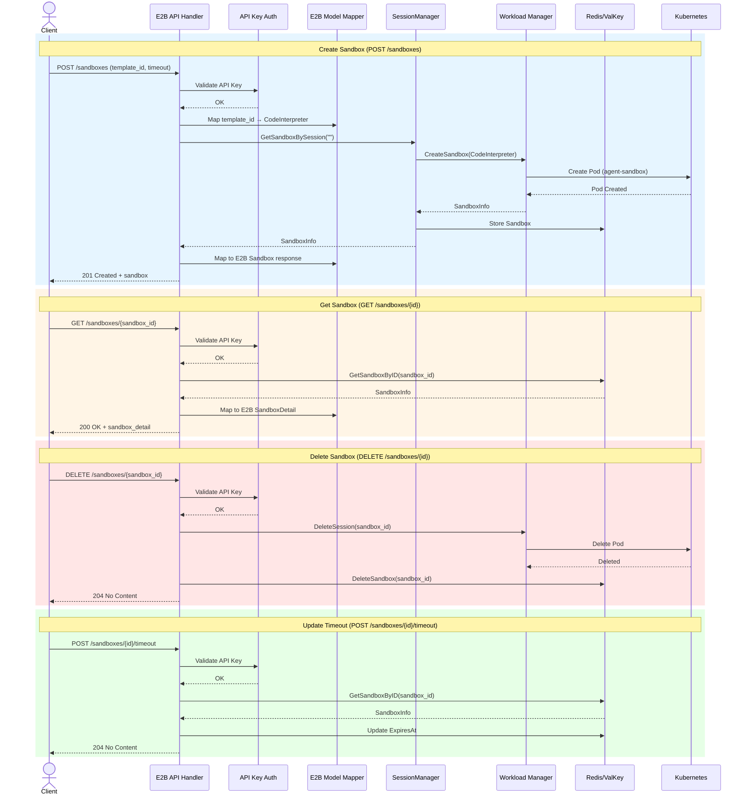

# E2B API Compatible Layer Architecture Design

## 1. Overview

This document describes the architecture design for implementing an E2B API compatible layer in AgentCube. The goal is to provide API compatibility with [E2B](https://e2b.dev/)'s REST API, enabling users to use E2B SDKs and tools with AgentCube as the backend.

### 1.1 Design Goals

- **API Compatibility**: Implement E2B API core endpoints for sandbox lifecycle management
- **Minimal Changes**: Reuse existing AgentCube components (Router, SessionManager, Store)
- **Clean Separation**: E2B API layer as a separate module within the Router
- **Feature Mapping**: Map E2B concepts (template, sandbox) to AgentCube concepts (CodeInterpreter/AgentRuntime, session/sandbox)

### 1.2 Scope

**In Scope (Phase 1):**

- Core sandbox lifecycle: POST/GET/DELETE `/sandboxes`
- Sandbox timeout management: POST `/sandboxes/{id}/timeout`
- Sandbox refresh: POST `/sandboxes/{id}/refreshes`
- API Key authentication
- Templates API (`/templates/*`)

**Out of Scope (Future Phases):**

- Snapshots API (`/snapshots/*`)
- Volumes API (`/volumes/*`)
- Metrics API (`/sandboxes/{id}/metrics`)
- Logs API (`/sandboxes/{id}/logs`)
- Pause/Resume functionality

---

## 2. Overall Architecture

### 2.1 System Architecture Diagram

```
┌─────────────────────────────────────────────────────────────────────────────┐
│                              Client/SDK                                     │
│                    (e2b-python-sdk / e2b-js-sdk)                            │
└─────────────────────┬───────────────────────────────────────────────────────┘
                      │ E2B API Requests
                      ▼
┌─────────────────────────────────────────────────────────────────────────────┐
│                           AgentCube Router                                  │
│  ┌─────────────────────────────────────────────────────────────────────┐   │
│  │                    E2B Compatible API Layer                          │   │
│  │  ┌─────────────┐  ┌─────────────┐  ┌─────────────┐  ┌────────────┐ │   │
│  │  │   Handlers  │  │   Models    │  │    Auth     │  │ Middleware │ │   │
│  │  │             │  │             │  │             │  │            │ │   │
│  │  │ • POST /sand│  │ • Sandbox   │  │ • API Key   │  │ • Logging  │ │   │
│  │  │ • GET  /sand│  │ • NewSandbox│  │   Validate  │  │ • Recovery │ │   │
│  │  │ • DEL  /sand│  │ • Error     │  │             │  │ • Timeout  │ │   │
│  │  │ • timeout   │  │ • ListedSb  │  │             │  │ • CORS     │ │   │
│  │  │ • refresh   │  │             │  │             │  │            │ │   │
│  │  └─────────────┘  └─────────────┘  └─────────────┘  └────────────┘ │   │
│  └─────────────────────────────────────────────────────────────────────┘   │
│                                    │                                        │
│  ┌─────────────────────────────────▼─────────────────────────────────────┐   │
│  │                    Existing AgentCube Components                       │   │
│  │                                                                        │   │
│  │   ┌───────────────┐    ┌───────────────┐    ┌───────────────┐        │   │
│  │   │ SessionManager│◄──►│  Store (Redis)│◄──►│  WorkloadMgr  │        │   │
│  │   │               │    │               │    │   Client      │        │   │
│  │   └───────────────┘    └───────────────┘    └───────────────┘        │   │
│  │          │                                                          │   │
│  │          ▼                                                          │   │
│  │   ┌───────────────┐                                                 │   │
│  │   │  JWT Manager  │                                                 │   │
│  │   │  (signing)    │                                                 │   │
│  │   └───────────────┘                                                 │   │
│  └─────────────────────────────────────────────────────────────────────┘   │
│                                    │                                        │
└────────────────────────────────────┼────────────────────────────────────────┘
                                     │
                                     ▼
┌─────────────────────────────────────────────────────────────────────────────┐
│                              Kubernetes                                     │
│  ┌───────────────┐  ┌───────────────┐  ┌───────────────┐                   │
│  │   CodeInter-  │  │  AgentRuntime │  │  agent-sandbox│                   │
│  │   preter CRD  │  │     CRD       │  │   (microVM)   │                   │
│  └───────────────┘  └───────────────┘  └───────┬───────┘                   │
└─────────────────────────────────────────────────┼───────────────────────────┘
                                                  │
                                                  ▼
                                        ┌───────────────────┐
                                        │      PicoD        │
                                        │   (sandbox runtime)│
                                        └───────────────────┘
```

### 2.2 Request Flow



---

## 3. Module Design

### 3.1 Module Structure

```
pkg/router/
├── server.go                    # Existing: Main server setup
├── handlers.go                  # Existing: AgentCube native handlers
├── session_manager.go           # Existing: Session management
├── jwt.go                       # Existing: JWT signing
├── config.go                    # Existing: Server configuration
│
└── e2b/                         # NEW: E2B compatible API module
    ├── e2b_server.go            # E2B server setup and route registration
    ├── handlers.go              # E2B HTTP handlers
    ├── models.go                # E2B API data models (request/response)
    ├── auth.go                  # API Key authentication
    ├── mapper.go                # E2B ↔ AgentCube model mapping
    ├── errors.go                # E2B error response formatting
    └── client/                  # Workload Manager client for E2B
        └── workload_client.go
```

### 3.2 Module Responsibilities

| Module            | Responsibility                       | Key Components                                                                 |
| ----------------- | ------------------------------------ | ------------------------------------------------------------------------------ |
| **e2b_server.go** | Route registration, middleware setup | `RegisterE2BRoutes()`, setup E2B router group                                  |
| **handlers.go**   | HTTP request handlers                | `CreateSandbox`, `GetSandbox`, `DeleteSandbox`, `SetTimeout`, `RefreshSandbox` |
| **models.go**     | E2B API data structures              | `Sandbox`, `NewSandbox`, `SandboxDetail`, `ListedSandbox`, `Error`             |
| **auth.go**       | API Key authentication               | `APIKeyMiddleware`, `ValidateAPIKey`                                           |
| **mapper.go**     | Model transformation                 | `ToE2BSandbox`, `FromE2BNewSandbox`, `MapTemplateToCRD`                        |
| **errors.go**     | Error response formatting            | `E2BError`, error code mapping                                                 |
| **client/**       | Workload Manager communication       | `CreateSandbox`, `DeleteSandbox`, `ListSandboxes`                              |

---

## 4. Data Model Mapping

### 4.1 E2B to AgentCube Concept Mapping

| E2B Concept    | AgentCube Concept                  | Notes                                                 |
| -------------- | ---------------------------------- | ----------------------------------------------------- |
| **Template**   | CodeInterpreter / AgentRuntime CRD | E2B template_id maps to AgentCube CRD name            |
| **Sandbox**    | Session + Sandbox                  | 1:1 mapping between E2B sandbox and AgentCube session |
| **Sandbox ID** | SessionID                          | E2B sandbox_id = AgentCube session_id                 |
| **Client ID**  | Namespace + User Identity          | Maps to K8s namespace or user identifier              |
| **Timeout**    | ExpiresAt                          | E2B timeout → calculated expiration time              |
| **State**      | Pod Status                         | running, paused (paused not supported in Phase 1)     |

#### 4.1.1 Multi-Tenancy and Isolation Model

AgentCube implements a more sophisticated isolation model compared to the native E2B implementation, providing finer-grained resource segregation capabilities.

**E2B Native Isolation Model:**

In the native E2B architecture, `Client ID` serves as the primary and sole isolation boundary:

```
Client A (client-id: "acme-corp")
├── Sandbox 1 (template: python-3.9)
├── Sandbox 2 (template: nodejs-18)
└── Sandbox 3 (template: ubuntu-22.04)
     ↑ All sandboxes share the same isolation boundary
```

**AgentCube Enhanced Isolation Model:**

AgentCube introduces a hierarchical isolation model with Kubernetes Namespace as the primary isolation boundary, while preserving Client ID for API compatibility:

```
Client A (client-id: "acme-corp")
├── Namespace: "team-ml"                    ← Primary isolation boundary
│   ├── Sandbox 1 (template: team-ml/gpu-large)
│   └── Sandbox 2 (template: team-ml/pytorch)
├── Namespace: "team-backend"               ← Separate isolation unit
│   ├── Sandbox 3 (template: team-backend/go-1.21)
│   └── Sandbox 4 (template: team-backend/redis)
└── Namespace: "team-frontend"              ← Another isolation unit
    └── Sandbox 5 (template: team-frontend/node-18)
```

**Key Advantages of AgentCube's Isolation Model:**

| Feature                                | E2B Native     | AgentCube                     | Benefit                                                   |
| -------------------------------------- | -------------- | ----------------------------- | --------------------------------------------------------- |
| **Primary Isolation**                  | Client ID      | **Namespace**                 | Finer-grained resource segregation                        |
| **Secondary Isolation**                | None           | **Client ID** (API Key level) | Authentication & audit                                    |
| **Multi-tenancy within Single Client** | Not supported  | **Supported**                 | Single enterprise can isolate by team/project/environment |
| **Resource Quotas**                    | Per Client     | **Per Namespace**             | More granular resource control                            |
| **Network Policies**                   | Limited        | **Full K8s NetworkPolicy**    | Inter-namespace traffic control                           |
| **RBAC**                               | Simple API Key | **Full K8s RBAC**             | Fine-grained access control                               |

**Template ID Format for Namespace Isolation:**

The `template_id` field supports namespace scoping using the format `{namespace}/{name}`:

```go
// Template ID with explicit namespace
templateID := "team-ml/gpu-large"      // Uses "team-ml" namespace
templateID := "team-backend/go"        // Uses "team-backend" namespace
templateID := "default/python"         // Uses "default" namespace

// Template ID without namespace (backward compatible)
templateID := "python-3.9"             // Defaults to "default" namespace
```

**Implementation Details:**

When creating a sandbox, the namespace is extracted from the template_id:

```go
func (s *Server) handleCreateSandbox(c *gin.Context) {
    // Client ID from API Key (for E2B compatibility)
    clientID := c.GetString("client_id")

    // Parse namespace from template_id for resource isolation
    namespace, name := parseTemplateID(req.TemplateID)
    // e.g., "team-ml/gpu-large" -> namespace="team-ml", name="gpu-large"

    // Create sandbox in specific namespace
    sandbox, err := s.sessionManager.GetSandboxBySession(..., namespace, ...)
}
```

**Use Cases:**

1. **Enterprise Multi-Team Isolation**
   - Single enterprise with one API Key (Client ID)
   - Different teams use different namespaces for complete resource isolation
   - Each namespace can have independent resource quotas and policies

2. **Environment Segregation**
   - Same client can deploy to `prod`, `staging`, and `dev` namespaces
   - Production workloads are isolated from development experiments
   - Different resource limits per environment

3. **Project-Based Isolation**
   - Consulting companies can isolate client projects by namespace
   - Each client's sandboxes are completely segregated
   - Simplified billing and resource tracking per project

4. **Security Zones**
   - Sensitive workloads in isolated namespaces with strict network policies
   - Public-facing services in separate namespaces
   - Compliance requirements enforced per namespace

**Summary:**

AgentCube's isolation model provides **two-layer isolation**:

- **Namespace Layer**: Primary isolation for resource segregation (more granular than E2B)
- **Client ID Layer**: API-level identification for compatibility and audit

This enables enterprise scenarios where a single Client ID can manage multiple isolated environments, something not possible with native E2B's single-layer Client ID isolation.

### 4.2 Field Mapping Table

#### Sandbox Creation (NewSandbox → CreateSandboxRequest)

| E2B Field       | AgentCube Field         | Mapping Logic                                                                                                                                   |
| --------------- | ----------------------- | ----------------------------------------------------------------------------------------------------------------------------------------------- |
| `template_id`   | `Name` + `Kind`         | template_id format: `{namespace}/{name}` or `{name}` (default namespace: "default"). Kind inferred from CRD type or defaults to CodeInterpreter |
| `timeout`       | `ExpiresAt`             | timeout (seconds) → ExpiresAt = Now + timeout                                                                                                   |
| `metadata`      | `Annotations`           | Stored in sandbox annotations                                                                                                                   |
| `env_vars`      | `EnvVar` in PodTemplate | Injected into sandbox container                                                                                                                 |
| `auto_pause`    | N/A                     | Not supported in Phase 1 (returns error if true)                                                                                                |
| `network`       | N/A                     | Not supported in Phase 1                                                                                                                        |
| `volume_mounts` | N/A                     | Not supported in Phase 1                                                                                                                        |

#### Sandbox Response (SandboxInfo → Sandbox)

| AgentCube Field           | E2B Field     | Mapping Logic                                                            |
| ------------------------- | ------------- | ------------------------------------------------------------------------ |
| `SessionID`               | `sandbox_id`  | Sandbox instance ID (direct mapping)                                     |
| `ClientID` (from API key) | `client_id`   | Client identifier extracted from API key mapping (`namespace:client_id`) |
| `Name`                    | `template_id` | CRD name that created the sandbox                                        |
| `CreatedAt`               | `started_at`  | ISO 8601 format                                                          |
| `ExpiresAt`               | `end_at`      | ISO 8601 format                                                          |
| `EntryPoints`             | `domain`      | First HTTP endpoint address                                              |
| `Status`                  | `state`       | "running" (running) / "paused" (not supported)                           |
| `SandboxNamespace`        | N/A           | Used to locate CRD                                                       |

### 4.3 Data Model Definitions

> **Wire Format Note:** All E2B API data models use **snake_case** JSON field names (e.g., `template_id`, `env_vars`) to maintain compatibility with the E2B API specification. This differs from AgentCube's internal Go types which typically use camelCase (e.g., `TemplateID`, `EnvVars`). The E2B Router layer handles this translation to ensure API compatibility while maintaining consistency with existing AgentCube code conventions.

#### E2B Models (Go struct definitions)

```go
// pkg/router/e2b/models.go

// Sandbox represents a created sandbox response
type Sandbox struct {
    // Note: client_id identifies the API key owner (from namespace:client_id mapping)
    // sandbox_id identifies the specific sandbox instance (unique per sandbox)
    ClientID           string    `json:"client_id"`
    EnvdVersion        string    `json:"envd_version"`
    SandboxID          string    `json:"sandbox_id"`
    TemplateID         string    `json:"template_id"`
    Alias              string    `json:"alias,omitempty"`
    Domain             string    `json:"domain,omitempty"`
    EnvdAccessToken    string    `json:"envd_access_token,omitempty"`
    TrafficAccessToken string    `json:"traffic_access_token,omitempty"`
}

// NewSandbox represents the request to create a sandbox
type NewSandbox struct {
    TemplateID          string                 `json:"template_id"`
    Timeout             int                    `json:"timeout,omitempty"`           // seconds, default: 15
    Metadata            map[string]interface{} `json:"metadata,omitempty"`
    EnvVars             map[string]string      `json:"env_vars,omitempty"`
    AutoPause           bool                   `json:"auto_pause,omitempty"`
    AllowInternetAccess bool                   `json:"allow_internet_access,omitempty"`
    Secure              bool                   `json:"secure,omitempty"`
    // Fields not supported in Phase 1:
    // AutoResume, MCP, Network, VolumeMounts
}

// SandboxDetail represents detailed sandbox info
type SandboxDetail struct {
    Sandbox
    CPUCount           int              `json:"cpu_count"`
    MemoryMB           int              `json:"memory_mb"`
    DiskSizeMB         int              `json:"disk_size_mb"`
    StartedAt          time.Time        `json:"started_at"`
    EndAt              time.Time        `json:"end_at"`
    State              SandboxState     `json:"state"`
    AllowInternetAccess bool            `json:"allow_internet_access,omitempty"`
    Metadata           map[string]interface{} `json:"metadata,omitempty"`
}

// ListedSandbox represents a sandbox in list response
type ListedSandbox struct {
    ClientID    string       `json:"client_id"`
    CPUCount    int          `json:"cpu_count"`
    DiskSizeMB  int          `json:"disk_size_mb"`
    EndAt       time.Time    `json:"end_at"`
    EnvdVersion string       `json:"envd_version"`
    MemoryMB    int          `json:"memory_mb"`
    SandboxID   string       `json:"sandbox_id"`
    StartedAt   time.Time    `json:"started_at"`
    State       SandboxState `json:"state"`
    TemplateID  string       `json:"template_id"`
    Alias       string       `json:"alias,omitempty"`
    Metadata    map[string]interface{} `json:"metadata,omitempty"`
}

// SandboxState represents sandbox state
type SandboxState string

const (
    SandboxStateRunning SandboxState = "running"
    SandboxStatePaused  SandboxState = "paused"
)

// TimeoutRequest represents timeout update request
type TimeoutRequest struct {
    Timeout int `json:"timeout"` // seconds
}

// RefreshRequest represents refresh request
type RefreshRequest struct {
    Timeout int `json:"timeout,omitempty"` // seconds to add
}

// E2BError represents error response
type E2BError struct {
    Code    int    `json:"code"`
    Message string `json:"message"`
}
```

---

## 5. API Routing Design

### 5.1 Route Table

| Method | Path                        | Handler          | Auth    | Description                      |
| ------ | --------------------------- | ---------------- | ------- | -------------------------------- |
| POST   | `/sandboxes`                | `CreateSandbox`  | API Key | Create new sandbox from template |
| GET    | `/sandboxes`                | `ListSandboxes`  | API Key | List all running sandboxes       |
| GET    | `/sandboxes/{id}`           | `GetSandbox`     | API Key | Get sandbox by ID                |
| DELETE | `/sandboxes/{id}`           | `DeleteSandbox`  | API Key | Kill/delete sandbox              |
| POST   | `/sandboxes/{id}/timeout`   | `SetTimeout`     | API Key | Set sandbox timeout              |
| POST   | `/sandboxes/{id}/refreshes` | `RefreshSandbox` | API Key | Refresh sandbox TTL              |

### 5.2 Templates API

The Templates API provides CRUD operations for managing templates, which map to AgentCube's existing CRD model (`CodeInterpreter` and `AgentRuntime`).

#### 5.2.1 Overview

**Design Goals:**

- **E2B API Compatibility**: Implement all E2B Templates API endpoints
- **CRD Mapping**: Map E2B templates to AgentCube's `CodeInterpreter` and `AgentRuntime` CRDs
- **Build Simulation**: Simulate E2B build process using CRD status conditions

**Scope:**

- All Templates API endpoints (CRUD + builds)
- Template state management via CRD status
- Template alias support via annotations
- Public/private template visibility via labels

**Out of Scope:**

- Actual Docker image building (AgentCube uses container images directly)
- Template versioning beyond build ID tracking

#### 5.2.2 API Specification

**Endpoint Summary:**

| Method | Path                               | Description                                     |
| ------ | ---------------------------------- | ----------------------------------------------- |
| GET    | `/templates`                       | List all templates (with pagination, filtering) |
| GET    | `/templates/{id}`                  | Get template by ID                              |
| POST   | `/templates`                       | Create new template                             |
| PATCH  | `/templates/{id}`                  | Update template                                 |
| DELETE | `/templates/{id}`                  | Delete template                                 |
| GET    | `/templates/{id}/builds`           | List template builds                            |
| GET    | `/templates/{id}/builds/{buildId}` | Get build status                                |
| POST   | `/templates/{id}/builds`           | Build template                                  |

**Template Data Model:**

```go
type Template struct {
    TemplateID   string            `json:"template_id"`
    Name         string            `json:"name"`
    Description  string            `json:"description,omitempty"`
    Aliases      []string          `json:"aliases,omitempty"`
    CreatedAt    time.Time         `json:"created_at"`
    UpdatedAt    time.Time         `json:"updated_at"`
    Public       bool              `json:"public"`
    State        TemplateState     `json:"state"`
    BuildID      string            `json:"build_id,omitempty"`
    Dockerfile   string            `json:"dockerfile,omitempty"`
    StartCommand string            `json:"start_command,omitempty"`
    EnvdVersion  string            `json:"envd_version,omitempty"`
    MemoryMB     int               `json:"memory_mb,omitempty"`
    VCPUCount    int               `json:"vcpu_count,omitempty"`
}

type TemplateState string

const (
    TemplateStateReady    TemplateState = "ready"
    TemplateStateBuilding TemplateState = "building"
    TemplateStateError    TemplateState = "error"
)
```

#### 5.2.3 Mapping to AgentCube CRDs

**E2B Template → CodeInterpreter/AgentRuntime CRD:**

| E2B Field      | CRD Field                                          | Mapping Logic                               |
| -------------- | -------------------------------------------------- | ------------------------------------------- |
| `templateID`   | `metadata.name` + `metadata.namespace`             | Format: `{namespace}/{name}`                |
| `name`         | `metadata.annotations["e2b.template/name"]`        | Stored as annotation                        |
| `description`  | `metadata.annotations["e2b.template/description"]` | Stored as annotation                        |
| `aliases`      | `metadata.annotations["e2b.template/aliases"]`     | JSON array as annotation                    |
| `public`       | `metadata.labels["e2b.template/public"]`           | "true" or "false"                           |
| `state`        | CRD status conditions                              | Derived from CRD status                     |
| `dockerfile`   | N/A                                                | Stored but not used (AgentCube uses images) |
| `startCommand` | `spec.command`                                     | Mapped to container command                 |
| `memoryMB`     | `spec.resources.memory`                            | Resource limits                             |
| `vcpuCount`    | `spec.resources.cpu`                               | Resource limits                             |

**Build Process Simulation:**

Since AgentCube uses pre-built container images, the "build" process is simulated:

```
Create Template → Initial State: "building" → Validate Image → State: "ready"
```

The build status is tracked in the CRD status conditions:

- `BuildInProgress`: Set during template creation
- `BuildCompleted`: Set when template is ready for use
- `BuildFailed`: Set if validation fails

#### 5.2.4 Implementation Details

**Route Registration:**

```go
// pkg/router/e2b/templates_handlers.go

func (s *E2BServer) setupTemplateRoutes(e2b *gin.RouterGroup) {
    // Template CRUD
    e2b.GET("/templates", s.handleListTemplates)
    e2b.GET("/templates/:id", s.handleGetTemplate)
    e2b.POST("/templates", s.handleCreateTemplate)
    e2b.PATCH("/templates/:id", s.handleUpdateTemplate)
    e2b.DELETE("/templates/:id", s.handleDeleteTemplate)

    // Build operations
    e2b.GET("/templates/:id/builds", s.handleListTemplateBuilds)
    e2b.GET("/templates/:id/builds/:buildId", s.handleGetBuildStatus)
    e2b.POST("/templates/:id/builds", s.handleBuildTemplate)
}
```

**Template Resolution:**

```go
// pkg/router/e2b/templates.go

func ResolveTemplate(templateID string) (*TemplateConfig, error) {
    parts := strings.Split(templateID, "/")
    if len(parts) == 2 {
        return &TemplateConfig{
            Kind:      types.CodeInterpreterKind,
            Namespace: parts[0],
            Name:      parts[1],
        }, nil
    }

    // Default namespace lookup
    return &TemplateConfig{
        Kind:      types.CodeInterpreterKind,
        Namespace: "default",
        Name:      templateID,
    }, nil
}
```

For complete Templates API implementation details, see the source code in `pkg/router/e2b/`.

### 5.3 Route Registration

```go
// pkg/router/e2b/e2b_server.go

func (s *E2BServer) SetupRoutes(engine *gin.Engine) {
    // E2B API routes
    e2b := engine.Group("/")

    // Authentication middleware
    e2b.Use(s.apiKeyMiddleware())

    // Sandbox routes
    e2b.POST("/sandboxes", s.handleCreateSandbox)
    e2b.GET("/sandboxes", s.handleListSandboxes)
    e2b.GET("/sandboxes/:id", s.handleGetSandbox)
    e2b.DELETE("/sandboxes/:id", s.handleDeleteSandbox)
    e2b.POST("/sandboxes/:id/timeout", s.handleSetTimeout)
    e2b.POST("/sandboxes/:id/refreshes", s.handleRefreshSandbox)

    // Template routes
    s.setupTemplateRoutes(e2b)
}
```

---

## 6. Authentication & Authorization

### 6.1 API Key Lifecycle Management

This section describes the complete lifecycle of an API Key in AgentCube's E2B implementation, from generation to destruction.

#### 6.1.1 Lifecycle Overview

```
┌─────────────────────────────────────────────────────────────────────────────────┐
│                        API KEY LIFECYCLE                                        │
├─────────────────────────────────────────────────────────────────────────────────┤
│                                                                                 │
│   ┌──────────┐     ┌──────────┐     ┌──────────┐     ┌──────────┐            │
│   │ Generate │────►│  Store   │────►│ Validate │────►│ Destroy  │            │
│   │          │     │ (K8s     │     │ (Runtime │     │ (Manual/ │            │
│   │          │     │ Secret)  │     │ Request) │     │ Expire)  │            │
│   └────┬─────┘     └────┬─────┘     └────┬─────┘     └────┬─────┘            │
│        │                │                │                │                   │
│        │                │                │                │                   │
│   Admin/Cluster     Kubernetes        Router API     Admin/Cluster            │
│   Operator          Secret Store      Middleware     Operator                │
│                                                             │                   │
│                                                             ▼                   │
│                                                      ┌──────────────┐          │
│                                                      │   Revoked    │          │
│                                                      │   Expired    │          │
│                                                      └──────────────┘          │
└─────────────────────────────────────────────────────────────────────────────────┘
```

#### 6.1.2 Phase 1: Generation (Creation)

| Aspect      | Description                                                          |
| ----------- | -------------------------------------------------------------------- |
| **Trigger** | Administrator or automated provisioning script creates a new API key |
| **Actor**   | Cluster Administrator, DevOps Engineer, or CI/CD pipeline            |
| **Process** | Generate cryptographically secure random key (32-64 bytes)           |
| **Mapping** | Associate key with `namespace:client_id` pair                        |
| **Tools**   | `openssl rand`, `kubectl create secret`, AgentCube CLI (future)      |

```bash
# Example: Generate and store API key
API_KEY=$(openssl rand -base64 32)
CLIENT_ID="team-ml"
NAMESPACE="production"

# Use SHA-256 hash of API key as the Secret data key (safe for K8s key naming)
KEY_HASH=$(echo -n "$API_KEY" | sha256sum | cut -d' ' -f1)

# Store in Secret using .stringData (kubectl handles base64 encoding)
kubectl patch secret e2b-api-keys -n agentcube-system \
  --type='merge' \
  -p="{\"stringData\":{\"$KEY_HASH\":\"$NAMESPACE:$CLIENT_ID\"}}"
```

#### 6.1.3 API Key Storage and Validation

**Storage Backend**

| Aspect             | Description                                                                                       |
| ------------------ | ------------------------------------------------------------------------------------------------- |
| **Backend**        | Kubernetes Secret (Phase 1) / External Vault (Future)                                             |
| **Location**       | `agentcube-system` namespace (or configurable)                                                    |
| **Format**         | `sha256(api_key) (hex): namespace:client_id` (Kubernetes stores values base64-encoded in `.data`) |
| **Access Control** | RBAC restricts Secret read to Router ServiceAccount                                               |
| **Encryption**     | Requires explicit etcd encryption at rest                                                         |

> **Key Design Note:** The SHA-256 hash of the API key is used as the Secret data key because Kubernetes requires keys to match `[-._a-zA-Z0-9]+`. Raw API keys or base64-encoded values may contain characters like `+`, `/`, or `=` which are invalid. The Router validates requests by computing `sha256(provided_key)` and looking up the hash in the cache.

> **SECURITY WARNING:** By default, Kubernetes Secrets use base64 encoding only (NOT encryption). Production environments MUST enable etcd encryption at rest or use external secret management (HashiCorp Vault, AWS Secrets Manager, etc.)

**Validation Architecture**

The Router uses a **background refresh strategy** with Kubernetes informers to maintain a local cache of API keys:

```
┌─────────────────────────────────────────────────────────────────────────┐
│                    API KEY VALIDATION ARCHITECTURE                      │
├─────────────────────────────────────────────────────────────────────────┤
│                                                                         │
│   ┌──────────────┐     Watch Changes      ┌──────────────────┐         │
│   │  K8s Secret  │───────────────────────►│  Router Cache    │         │
│   │  (e2b-api-   │    (Informer Events)   │  (In-Memory)     │         │
│   │   keys)      │                        └────────┬─────────┘         │
│   └──────────────┘                                 │                   │
│          ▲                                         │ 1. Check cache    │
│          │ Periodic Refresh                         │ 2. Rate limit on  │
│          └──────────────────────────────────────────│    miss           │
│                                                   │                   │
│   Client Request                                  ▼                   │
│        │                                ┌──────────────────┐          │
│        │ X-API-Key: <key>               │  Validation      │          │
│        └───────────────────────────────►│  Result          │          │
│                                         │                  │          │
│                                         │  Valid ──► 200   │          │
│                                         │  Invalid ─► 401  │          │
│                                         └──────────────────┘          │
│                                                                         │
└─────────────────────────────────────────────────────────────────────────┘
```

**Key Design Characteristics:**

| Characteristic           | Implementation                                                           |
| ------------------------ | ------------------------------------------------------------------------ |
| **Cache Update**         | Real-time via K8s informer events (add/update/delete)                    |
| **Fallback Refresh**     | Periodic background refresh (5 min interval)                             |
| **Invalid Key Handling** | Served from cache only; no API reload for invalid keys                   |
| **Availability**         | Local cache serves requests even when K8s API is temporarily unavailable |

**Benefits over On-Demand Loading:**

| Issue                      | On-Demand Design                        | Background Refresh Design                                   |
| -------------------------- | --------------------------------------- | ----------------------------------------------------------- |
| **K8s API Load**           | Reloads from Secret on every cache miss | Zero API calls for validation (reads from local cache only) |
| **Brute-force Protection** | Each invalid key triggers K8s API call  | Invalid keys hit local cache only; no amplification         |
| **Propagation Delay**      | Up to 5 min TTL for invalidation        | Immediate update via informer events                        |
| **Availability**           | K8s API unavailable = auth failures     | Local cache continues serving                               |

#### 6.1.4 Phase 4: Destruction (Revocation/Expiration)

| Aspect          | Description                                                         |
| --------------- | ------------------------------------------------------------------- |
| **Trigger**     | Manual revocation, key rotation policy, or security incident        |
| **Actor**       | Cluster Administrator or automated rotation system                  |
| **Methods**     | Delete from K8s Secret, update with new mapping, or rotate all keys |
| **Propagation** | In-memory cache invalidates on next reload (TTL-based)              |
| **Audit**       | Kubernetes audit logs record Secret modifications                   |

```
┌─────────────────────────────────────────────────────────────────────────┐
│                    API KEY DESTRUCTION FLOW                             │
├─────────────────────────────────────────────────────────────────────────┤
│                                                                         │
│   Admin/Operator                                                        │
│        │                                                                │
│        │ kubectl patch / delete                                         │
│        ▼                                                                │
│   ┌──────────────────┐                                                  │
│   │  K8s Secret      │                                                  │
│   │  (e2b-api-keys)  │──────────────────────┐                          │
│   └──────────────────┘                      │                          │
│                                             │ 1. Key removed           │
│                                             │    from etcd             │
│                                             ▼                          │
│   ┌──────────────────┐    2. Cache TTL    ┌──────────────────┐        │
│   │  Active Requests │    expires (5min)   │  Router Cache    │        │
│   │  (with old key)  │◄───────────────────│  Invalidated     │        │
│   └────────┬─────────┘                     └──────────────────┘        │
│            │                                                           │
│            │ 3. New requests                                            │
│            ▼                                                            │
│   ┌──────────────────┐                                                  │
│   │  Validation      │                                                  │
│   │  Fails           │─────► 401 Unauthorized                           │
│   │  (Key not found) │                                                  │
│   └──────────────────┘                                                  │
│                                                                         │
│   Revocation Methods:                                                   │
│   ┌────────────────┬────────────────┬────────────────┐                 │
│   │ Single Key     │ Bulk Rotate    │ Emergency      │                 │
│   │ Delete         │ All Keys       │ Revoke All     │                 │
│   ├────────────────┼────────────────┼────────────────┤                 │
│   │ Remove one     │ Generate new   │ Delete entire  │                 │
│   │ key-value pair │ key set        │ Secret         │                 │
│   │ from Secret    │ Update Secret  │ Immediate      │                 │
│   └────────────────┴────────────────┴────────────────┘                 │
│                                                                         │
└─────────────────────────────────────────────────────────────────────────┘
```

**Revocation Commands:**

```bash
# Method 1: Remove specific API key (use SHA-256 hash of the key)
KEY_HASH=$(echo -n "$API_KEY" | sha256sum | cut -d' ' -f1)
kubectl patch secret e2b-api-keys -n agentcube-system \
  --type='json' \
  -p="[{\"op\": \"remove\", \"path\": \"/data/$KEY_HASH\"}]"

# Method 2: Complete key rotation (revoke all, issue new)
kubectl delete secret e2b-api-keys -n agentcube-system
kubectl apply -f new-api-keys-secret.yaml

# Method 3: Force cache reload (restart Router)
kubectl rollout restart deployment/agentcube-router -n agentcube-system
```

#### 6.1.5 Lifecycle State Summary

| State         | Location                   | Persistence                | Accessibility         | Duration         |
| ------------- | -------------------------- | -------------------------- | --------------------- | ---------------- |
| **Generated** | Admin workstation          | Temporary (before storage) | Administrator only    | Minutes          |
| **Stored**    | Kubernetes Secret (etcd)   | Persistent                 | Router ServiceAccount | Until deleted    |
| **Cached**    | Router memory (in-process) | Ephemeral                  | Router threads        | 5 min TTL        |
| **Validated** | Request context            | Request-scoped             | Handler chain         | Request duration |
| **Destroyed** | Tombstone (audit log)      | Archived                   | Auditors              | Permanent        |

#### 6.1.6 Security Considerations

1. **Key Generation**: Use cryptographically secure random number generators (CSPRNG)
2. **Storage Security**: Enable etcd encryption at rest for Kubernetes Secrets
3. **Network Security**: All API Key transmissions over TLS 1.3
4. **Rotation Policy**: Implement regular key rotation (e.g., 90 days)
5. **Audit Logging**: Monitor Secret access and modification events
6. **Least Privilege**: Router only needs read access to API Key Secret

### 6.2 API Key to Namespace Mapping

```yaml
# API Key Secret Structure
apiVersion: v1
kind: Secret
metadata:
  name: e2b-api-keys
  namespace: agentcube-system
type: Opaque
data:
  # NOTE: Only values in .data are base64-encoded by Kubernetes.
  # Keys must be valid DNS subdomain names (matching [-._a-zA-Z0-9]+).
  # Here we use sha256(api_key) in hex as the key (safe format).
  # key: hex(sha256(api_key)) → value: base64(namespace:client_id)
  "a1b2c3d4e5f6789...": "ZGVmYXVsdDpjbGllbnQx" # hash(api_key_123) → default:client1
  "f0e9d8c7b6a5948...": "ZGVmYXVsdDpjbGllbnQy" # hash(api_key_456) → default:client2
```

---

## 7. Sandbox Lifecycle State Machine

### 7.1 State Definitions

```
┌─────────────┐     Create      ┌─────────────┐
│  Template   │ ───────────────►│  Creating   │
│   (CRD)     │                 │   (Pod)     │
└─────────────┘                 └──────┬──────┘
                                       │
                                       │ Pod Running
                                       ▼
┌─────────────┐    Timeout/Delete   ┌─────────────┐
│   Deleted   │ ◄────────────────── │   Running   │
│             │                     │  (Active)   │
└─────────────┘                     └──────┬──────┘
                                           │
                                           │ TTL Refresh
                                           ▼
                                    ┌─────────────┐
                                    │   Refresh   │
                                    │  (TTL ext)  │
                                    └─────────────┘
```

### 7.2 State Mapping

| E2B State | AgentCube State           | Description                                  |
| --------- | ------------------------- | -------------------------------------------- |
| `running` | Pod Running + Not Expired | Sandbox is active and can accept requests    |
| `paused`  | N/A                       | **Not supported in Phase 1** - returns error |

### 7.3 Lifecycle Operations

| Operation   | Trigger                        | Action                                            |
| ----------- | ------------------------------ | ------------------------------------------------- |
| **Create**  | POST /sandboxes                | Create Pod via WorkloadManager, store in Redis    |
| **Get**     | GET /sandboxes/{id}            | Retrieve from Redis/Store                         |
| **Delete**  | DELETE /sandboxes/{id}         | Delete Pod via WorkloadManager, remove from Redis |
| **Timeout** | POST /sandboxes/{id}/timeout   | Update ExpiresAt in Redis                         |
| **Refresh** | POST /sandboxes/{id}/refreshes | Extend ExpiresAt by TTL                           |

---

## 8. Error Handling & Error Code Mapping

### 8.1 E2B Error Response Format

```json
{
  "code": 400,
  "message": "Invalid template ID"
}
```

### 8.2 Error Code Mapping

| HTTP Status | E2B Error Message          | AgentCube Error            | Scenario                  |
| ----------- | -------------------------- | -------------------------- | ------------------------- |
| 400         | `invalid request`          | Validation error           | Missing required fields   |
| 400         | `template not found`       | ErrCodeInterpreterNotFound | Template doesn't exist    |
| 400         | `auto_pause not supported` | -                          | Feature not in Phase 1    |
| 401         | `unauthorized`             | Missing API Key            | No X-API-Key header       |
| 401         | `invalid api key`          | Invalid API Key            | API key validation failed |
| 404         | `sandbox not found`        | SessionNotFound            | Invalid sandbox ID        |
| 409         | `sandbox already exists`   | -                          | Conflict (rare)           |
| 500         | `internal server error`    | Any unexpected error       | Server error              |
| 503         | `service unavailable`      | Upstream unavailable       | WorkloadManager down      |

### 8.3 Error Handler Implementation

```go
// pkg/router/e2b/errors.go

type E2BErrorCode int

const (
    ErrInvalidRequest     E2BErrorCode = 400
    ErrUnauthorized       E2BErrorCode = 401
    ErrNotFound           E2BErrorCode = 404
    ErrConflict           E2BErrorCode = 409
    ErrInternal           E2BErrorCode = 500
    ErrServiceUnavailable E2BErrorCode = 503
)

func (s *E2BServer) respondWithError(c *gin.Context, code E2BErrorCode, message string) {
    c.JSON(int(code), E2BError{
        Code:    int(code),
        Message: message,
    })
}

func (s *E2BServer) mapAgentCubeError(err error) (E2BErrorCode, string) {
    if apierrors.IsNotFound(err) {
        return ErrNotFound, "sandbox not found"
    }
    if apierrors.IsUnauthorized(err) {
        return ErrUnauthorized, "unauthorized"
    }
    // ... more mappings
    return ErrInternal, "internal server error"
}
```

---

## 9. Implementation Details

### 9.1 Create Sandbox Handler

```go
func (s *E2BServer) handleCreateSandbox(c *gin.Context) {
    var req NewSandbox
    if err := c.ShouldBindJSON(&req); err != nil {
        s.respondWithError(c, ErrInvalidRequest, "invalid request body")
        return
    }

    // Validate unsupported features
    if req.AutoPause {
        s.respondWithError(c, ErrInvalidRequest, "auto_pause not supported")
        return
    }

    // Parse template_id to namespace/name
    namespace, name := s.parseTemplateID(req.TemplateID)

    // Get client ID from context
    clientID := c.GetString("client_id")

    // Create sandbox via SessionManager
    sandbox, err := s.sessionManager.GetSandboxBySession(
        c.Request.Context(),
        "", // empty session ID = create new
        namespace,
        name,
        types.CodeInterpreterKind,
    )
    if err != nil {
        code, msg := s.mapAgentCubeError(err)
        s.respondWithError(c, code, msg)
        return
    }

    // Set timeout if specified
    if req.Timeout > 0 {
        expiresAt := time.Now().Add(time.Duration(req.Timeout) * time.Second)
        sandbox.ExpiresAt = expiresAt
        // Use UpdateSandboxTTL to update both the sandbox object and the expiry
        // sorted set used for garbage collection. Do NOT use UpdateSandbox for
        // TTL changes as it won't update the expiry index.
        if err := s.store.UpdateSandboxTTL(c.Request.Context(), sandbox.SessionID, expiresAt); err != nil {
            klog.Errorf("failed to update sandbox timeout: %v", err)
        }
    }

    // Map to E2B response
    response := s.mapper.ToE2BSandbox(sandbox, clientID)
    c.JSON(http.StatusCreated, response)
}
```

### 9.2 List Sandboxes Handler

```go
func (s *E2BServer) handleListSandboxes(c *gin.Context) {
    clientID := c.GetString("client_id")

    // Query store for all sandboxes belonging to client
    sandboxes, err := s.store.ListSandboxesByClient(c.Request.Context(), clientID)
    if err != nil {
        s.respondWithError(c, ErrInternal, "failed to list sandboxes")
        return
    }

    // Map to E2B ListedSandbox
    response := make([]ListedSandbox, 0, len(sandboxes))
    for _, sb := range sandboxes {
        response = append(response, s.mapper.ToE2BListedSandbox(sb))
    }

    c.JSON(http.StatusOK, response)
}
```

### 9.3 Store Interface Extension

```go
// pkg/store/interface.go - Additions

type Store interface {
    // ... existing methods ...

    // GetSandboxByID gets sandbox by sandbox ID (for E2B API)
    GetSandboxByID(ctx context.Context, sandboxID string) (*types.SandboxInfo, error)

    // ListSandboxesByClient lists all sandboxes for a client
    ListSandboxesByClient(ctx context.Context, clientID string) ([]*types.SandboxInfo, error)

    // UpdateSandboxTTL updates sandbox expiration time
    // This method updates both the sandbox object's ExpiresAt field AND the expiry
    // sorted set used for garbage collection. Use this instead of UpdateSandbox when
    // only modifying the TTL/expiration time.
    UpdateSandboxTTL(ctx context.Context, sandboxID string, expiresAt time.Time) error
}
```

### 9.4 UpdateSandboxTTL Design

`UpdateSandbox` does not update the expiry sorted set used for garbage collection. For TTL changes, use `UpdateSandboxTTL` which updates both the sandbox object and the expiry index.

```go
// pkg/store/interface.go

type Store interface {
    // ... existing methods ...

    // UpdateSandboxTTL updates sandbox expiration time and expiry index atomically
    UpdateSandboxTTL(ctx context.Context, sandboxID string, expiresAt time.Time) error
}
```

**Implementation Notes:**

- Use Redis Pipeline to update both the sandbox object and the global `session:expiry` sorted set atomically
- The expiry index is global (not per-user) to align with the existing store implementation

**Method Comparison:**

| Method             | Updates Object | Updates Expiry Index | Use Case                        |
| ------------------ | -------------- | -------------------- | ------------------------------- |
| `UpdateSandbox`    | ✓              | ✗                    | General field updates (NOT TTL) |
| `UpdateSandboxTTL` | ✓              | ✓                    | TTL/expiration changes          |
| `StoreSandbox`     | ✓              | ✓                    | Initial creation                |

---

## 10. Configuration

### 10.1 E2B Configuration Options

```go
// pkg/router/config.go - Additions

type Config struct {
    // ... existing fields ...

    // E2B API configuration
    EnableE2BAPI    bool   `env:"ENABLE_E2B_API" default:"true"`
    E2BAPIKeySecret string `env:"E2B_API_KEY_SECRET" default:"e2b-api-keys"`
    E2BDefaultTTL   int    `env:"E2B_DEFAULT_TTL" default:"900"` // 15 minutes in seconds
}
```

### 10.2 Environment Variables

| Variable             | Default        | Description                             |
| -------------------- | -------------- | --------------------------------------- |
| `ENABLE_E2B_API`     | `true`         | Enable E2B compatible API endpoints     |
| `E2B_API_KEY_SECRET` | `e2b-api-keys` | Kubernetes Secret name for API keys     |
| `E2B_DEFAULT_TTL`    | `900`          | Default sandbox TTL in seconds (15 min) |

---

## 11. Testing Strategy

### 11.1 Unit Tests

- Model mapping tests
- Authentication middleware tests
- Error response formatting tests

### 11.2 Integration Tests

- End-to-end sandbox lifecycle (create → get → delete)
- Timeout and refresh operations
- API key authentication flow

### 11.3 E2B SDK Compatibility Tests

```python
# test_e2b_compatibility.py
from e2b_code_interpreter import Sandbox

# Should work with AgentCube E2B API
sandbox = Sandbox.create(
    api_key="test-key",
    template_id="default/code-interpreter",
    timeout=300
)

# Execute code
result = sandbox.run_code("print('Hello from AgentCube!')")
print(result.text)

# Cleanup
sandbox.close()
```

---

## 12. Future Enhancements

### Phase 2 Features

- Metrics API (`/sandboxes/{id}/metrics`)
- Logs streaming API
- Volume mounts support

### Phase 3 Features

- Pause/Resume functionality
- Snapshot support (requires checkpoint capabilities)
- Network configuration
- Environment variables support

### Performance Optimizations

- Sandbox caching
- Connection pooling for E2B requests
- Bulk operations support

---

## 13. References

1. [E2B API Documentation](https://e2b.dev/docs)
2. [E2B Python SDK](https://github.com/e2b-dev/e2b/tree/main/packages/python-sdk)
3. [AgentCube Router Proposal](router-proposal.md)
