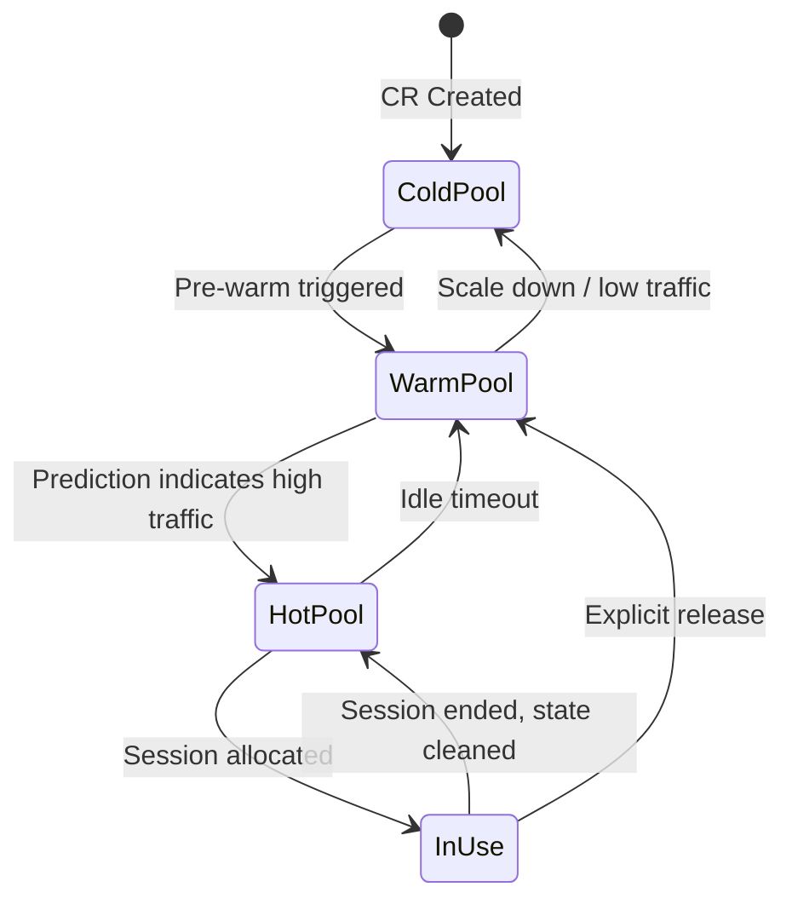

# Enhanced Warm Pool Design

## Motivation

The current warm pool implementation has several limitations:

1. **Static Pool Size**: `WarmPoolSize` is statically configured, cannot adapt to traffic patterns
2. **Single-Level Pool**: Only one warm pool level, no differentiation between ready-to-use and quick-start states
3. **No Sandbox Reuse**: Sandboxes are destroyed after session ends, causing cold-start latency for new sessions

This proposal introduces three enhancements to address these issues.

## Goals

1. **Dynamic Pool Sizing**: Automatically adjust warm pool size based on historical traffic patterns
2. **Multi-Level Warm Pool**: Implement Hot/Warm/Cold pool hierarchy for optimized resource usage
3. **Sandbox Reuse**: Reuse sandboxes across sessions by cleaning state instead of destroying

## Non-Goals

- Machine learning-based traffic prediction (can be added later)
- Cross-namespace pool sharing
- GPU resource pooling (future work)

---

## 1. Multi-Level Warm Pool

### Concept

```
┌─────────────────────────────────────────────────────────────┐
│                     Cold Pool (Infinite)                    │
│  - Only stores configuration (CodeInterpreter/AgentRuntime) │
│  - No actual resources allocated                            │
│  - On-demand creation                                       │
└─────────────────────────────────────────────────────────────┘
                           ▲
                           │ Scale up on demand
                           │
┌─────────────────────────────────────────────────────────────┐
│                    Warm Pool (10-20 sandboxes)              │
│  - Image pulled, container created but paused               │
│  - Fast startup (~1-2 seconds)                              │
│  - Uses SandboxTemplate + SandboxWarmPool CRDs              │
└─────────────────────────────────────────────────────────────┘
                           ▲
                           │ Pre-warm based on prediction
                           │
┌─────────────────────────────────────────────────────────────┐
│                     Hot Pool (3-5 sandboxes)                │
│  - Fully started, ready to serve immediately               │
│  - Zero cold-start latency                                  │
│  - New type: SandboxHotPool CRD                             │
└─────────────────────────────────────────────────────────────┘
```

### API Design

#### SandboxHotPool CRD

```yaml
apiVersion: extensions.agent.x-k8s.io/v1alpha1
kind: SandboxHotPool
metadata:
  name: my-codeinterpreter
  namespace: default
spec:
  # Minimum hot sandboxes (always ready)
  minReplicas: 3
  # Maximum hot sandboxes
  maxReplicas: 10
  # Reference to SandboxTemplate
  templateRef:
    name: my-codeinterpreter
  # TTL for hot sandboxes (return to warm pool after)
  idleTimeout: 5m
status:
  # Current ready sandboxes
  readyReplicas: 5
  # Current allocated sandboxes
  allocatedReplicas: 2
  # Available for immediate use
  availableReplicas: 3
```

### Pool Transition Flow



### Implementation

1. **Hot Pool Controller**: New controller in `pkg/workloadmanager/hotpool_controller.go`
   - Maintains a pool of ready sandboxes
   - Monitors pool size and creates/destroys as needed
   - Integrates with traffic predictor

2. **Pool Manager**: New component in `pkg/workloadmanager/pool_manager.go`
   - Manages transitions between Hot/Warm/Cold pools
   - Provides unified interface for sandbox allocation
   - Handles pool overflow/underflow

---

## 2. Dynamic Warm Pool Sizing

### Traffic Prediction

Based on historical data, predict future demand:

```go
type TrafficPredictor struct {
    // Historical data store
    historyStore HistoryStore
    // Prediction window
    predictionWindow time.Duration
    // Minimum samples for prediction
    minSamples int
}

type TrafficSample struct {
    Timestamp   time.Time
    RequestCount int64
    SessionCount int64
}

type PredictionResult struct {
    // Predicted sessions needed in next window
    PredictedSessions int64
    // Confidence level (0-1)
    Confidence float64
    // Recommended pool size
    RecommendedSize int32
}
```

### Prediction Algorithm

Simple moving average with time-of-day patterns:

```
Predicted(t) = BaseLoad(t) + PeriodicPattern(t) + Trend(t)

Where:
- BaseLoad: Average load over last N hours
- PeriodicPattern: Time-of-day adjustment based on historical patterns
- Trend: Linear trend from recent data
```

### Configuration

```yaml
apiVersion: runtime.agentcube.volcano.sh/v1alpha1
kind: CodeInterpreter
metadata:
  name: my-interpreter
spec:
  warmPool:
    # Enable dynamic sizing
    dynamicSizing:
      enabled: true
      # Minimum pool size
      minSize: 5
      # Maximum pool size
      maxSize: 50
      # Prediction window
      predictionWindow: 30m
      # Scale-up cooldown
      scaleUpCooldown: 5m
      # Scale-down cooldown  
      scaleDownCooldown: 15m
      # Safety margin (predict * 1.2)
      safetyMargin: 1.2
    # Or static size (mutually exclusive)
    # staticSize: 10
```

### Implementation

1. **Traffic Collector**: Collect and store traffic metrics
   - Integrated into Router for request counting
   - Persists to Redis with TTL

2. **Traffic Predictor**: Analyze and predict
   - Runs periodically (every 5 minutes)
   - Outputs recommended pool sizes

3. **Pool Autoscaler**: Apply predictions
   - Updates WarmPool and HotPool sizes
   - Respects cooldown periods
   - Gradual scale-up/down

---

## 3. Sandbox Reuse Strategy

### Concept

Instead of destroying sandboxes after session ends, clean their state and return to pool:

```
Session End → State Cleanup → Return to Hot Pool
                  │
                  ├── Clear /workspace directory
                  ├── Reset environment variables
                  ├── Kill user processes
                  └── Clear network state
```

### Benefits

1. **Zero Cold-Start**: Reused sandboxes are immediately available
2. **Resource Efficiency**: Avoid repeated container creation/destruction
3. **Better Performance**: Cached images, warmed up connections

### State Cleanup Protocol

Picod (inside sandbox) exposes cleanup endpoint:

```go
// POST /internal/cleanup
type CleanupRequest struct {
    // Clear all user files
    ClearWorkspace bool
    // Kill all user processes
    KillProcesses bool
    // Reset environment
    ResetEnv bool
    // Clear network connections
    ClearNetwork bool
}

type CleanupResponse struct {
    Success bool
    Message string
    Duration time.Duration
}
```

### Implementation

1. **Session End Handler**: In workload manager
   ```go
   func (s *Server) handleSessionEnd(sessionID string) error {
       // 1. Get sandbox info
       sandbox := s.store.GetSandbox(sessionID)
       
       // 2. Call cleanup endpoint on picod
       err := s.picodClient.Cleanup(sandbox.Endpoint)
       if err != nil {
           // Fallback: destroy sandbox
           return s.destroySandbox(sandbox)
       }
       
       // 3. Mark sandbox as available in hot pool
       s.poolManager.ReturnToHotPool(sandbox)
       
       // 4. Update store
       s.store.MarkSandboxAvailable(sessionID)
       
       return nil
   }
   ```

2. **Pool Allocation**: Modified sandbox creation
   ```go
   func (s *Server) allocateSandbox(kind, namespace, name string) (*Sandbox, error) {
       // 1. Try hot pool first
       if sandbox := s.hotPool.Get(namespace, name); sandbox != nil {
           return sandbox, nil
       }
       
       // 2. Try warm pool
       if sandbox := s.warmPool.Get(namespace, name); sandbox != nil {
           return sandbox, nil
       }
       
       // 3. Create new (cold pool)
       return s.createSandbox(kind, namespace, name)
   }
   ```

3. **Picod Cleanup Implementation**: In `pkg/picod/cleanup.go`
   - Implements cleanup endpoint
   - Secure process termination
   - Workspace sanitization

### Security Considerations

1. **State Isolation**: Ensure complete cleanup between sessions
2. **Resource Limits**: Prevent cleanup from consuming excessive resources
3. **Timeout**: Maximum cleanup duration (30 seconds)
4. **Audit Logging**: Log all cleanup operations

---

## Architecture Overview

```
┌────────────────────────────────────────────────────────────────────┐
│                         Router                                       │
│  ┌─────────────┐  ┌──────────────┐  ┌─────────────────────────┐    │
│  │Traffic Collec│  │Session Manager│  │Request Forwarder       │    │
│  └─────────────┘  └──────────────┘  └─────────────────────────┘    │
└────────────────────────────────────────────────────────────────────┘
                                │
                                ▼
┌────────────────────────────────────────────────────────────────────┐
│                      Workload Manager                               │
│  ┌──────────────┐  ┌──────────────┐  ┌──────────────────────────┐ │
│  │ Pool Manager │  │Traffic Predic│  │  Sandbox Reuse Manager   │ │
│  │              │◄─┤   tor        │  │                          │ │
│  └──────────────┘  └──────────────┘  └──────────────────────────┘ │
│        │                                                    │       │
│        ▼                                                    ▼       │
│  ┌──────────────┐  ┌──────────────┐  ┌──────────────────────────┐ │
│  │  Hot Pool    │  │  Warm Pool   │  │  Garbage Collector       │ │
│  │  Controller  │  │  Controller  │  │  (cleanup fallback)      │ │
│  └──────────────┘  └──────────────┘  └──────────────────────────┘ │
└────────────────────────────────────────────────────────────────────┘
                                │
                                ▼
┌────────────────────────────────────────────────────────────────────┐
│                      Kubernetes API                                 │
│  ┌──────────────┐  ┌──────────────┐  ┌──────────────────────────┐ │
│  │SandboxHotPool│  │SandboxWarmPol│  │  SandboxTemplate         │ │
│  │     CRD      │  │     CRD      │  │         CRD              │ │
│  └──────────────┘  └──────────────┘  └──────────────────────────┘ │
└────────────────────────────────────────────────────────────────────┘
```

## Implementation Plan

### Phase 1: Sandbox Reuse (Week 1-2)
1. Add cleanup endpoint to Picod
2. Implement SessionEndHandler in workload manager
3. Modify sandbox allocation to check hot pool first
4. Add configuration flags

### Phase 2: Multi-Level Pool (Week 3-4)
1. Define SandboxHotPool CRD
2. Implement HotPoolController
3. Create PoolManager for unified pool access
4. Update CodeInterpreter API to support multi-level configuration

### Phase 3: Dynamic Sizing (Week 5-6)
1. Implement traffic collector in Router
2. Create TrafficPredictor with simple algorithm
3. Implement PoolAutoscaler
4. Add monitoring and alerting

## Metrics and Monitoring

New metrics exposed:

```
# Hot Pool metrics
agentcube_hot_pool_size{namespace, name}
agentcube_hot_pool_available{namespace, name}
agentcube_hot_pool_hit_rate{namespace, name}

# Warm Pool metrics  
agentcube_warm_pool_size{namespace, name}
agentcube_warm_pool_hit_rate{namespace, name}

# Reuse metrics
agentcube_sandbox_reuse_total{namespace, name}
agentcube_sandbox_reuse_failed_total{namespace, name}
agentcube_sandbox_cleanup_duration_seconds{namespace, name}

# Prediction metrics
agentcube_prediction_sessions{namespace, name}
agentcube_prediction_confidence{namespace, name}
agentcube_pool_size_adjustment{namespace, name}
```

## Configuration Examples

### Minimal (reuse only)
```yaml
apiVersion: runtime.agentcube.volcano.sh/v1alpha1
kind: CodeInterpreter
metadata:
  name: my-interpreter
spec:
  warmPool:
    staticSize: 10
  reuse:
    enabled: true
```

### Full featured
```yaml
apiVersion: runtime.agentcube.volcano.sh/v1alpha1
kind: CodeInterpreter
metadata:
  name: my-interpreter
spec:
  warmPool:
    dynamicSizing:
      enabled: true
      minSize: 5
      maxSize: 50
      predictionWindow: 30m
  hotPool:
    enabled: true
    minSize: 3
    maxSize: 10
    idleTimeout: 5m
  reuse:
    enabled: true
    cleanupTimeout: 30s
    maxReuseCount: 100  # Destroy after N reuses
```
