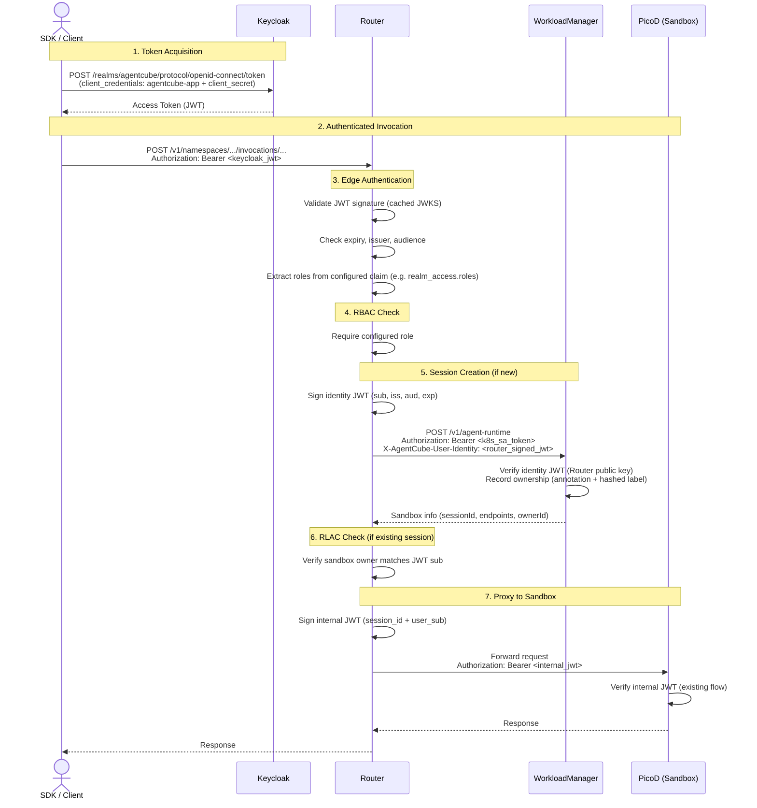

# Keycloak Integration Design

Author: Mahil Patel

## Motivation

AgentCube currently has no mechanism to authenticate external callers, anyone who can reach the Router endpoint can invoke agent runtimes and code interpreters without proving their identity. This proposal adds external authentication and authorization using Keycloak as the identity provider, covering OIDC token validation at the Router, role-based access control (RBAC), resource-level access control (RLAC), identity forwarding to downstream services, and Python SDK auth support. Keycloak is deployed as a separate addon chart, and the core chart enables auth when `router.jwt.issuerUrl` is set, so existing deployments are unaffected.

## Architecture

### Auth layers

| Layer | Purpose | Mechanism | Status |
|-------|---------|-----------|--------|
| Internal (transport) | Machine identity between components | mTLS with SPIRE/file-based certificates | Existing |
| Internal (application) | Bind Router to PicoD sessions | Router-signed JWT with session claims | Existing |
| **External (authentication)** | **Prove human/SDK caller identity** | **Keycloak OIDC JWT validation** | **This proposal** |
| **External (authorization)** | **Enforce access rules** | **RBAC (realm roles) + RLAC (owner labels)** | **This proposal** |

### End-to-end request flow



### Key decisions

**JWKS-based offline validation.** The Router fetches Keycloak's public signing keys via OIDC discovery at startup. The `go-oidc` library caches and auto-rotates these keys - no per-request call to Keycloak.

**Forwarding user identity via signed tokens, not plain headers.** The Router embeds the user's `sub` claim into existing channels:
- For PicoD: added as a `user_sub` claim in the Router-signed internal JWT (allows the agent runtime to trace actions back to a specific human user for logging, context, and downstream internal AuthZ).
- For WorkloadManager: the Router creates and signs a **new, short-lived internal JWT** (containing just the user's ID) and sends it in the `X-AgentCube-User-Identity` header. We do not pass the original Keycloak token, keeping WM decoupled from the external IDP.

WorkloadManager and PicoD know they can trust this user identity because the internal JWT is cryptographically signed by the Router's private key. They verify the signature using the Router's public key (which is distributed via the `picod-router-identity` Kubernetes Secret). This guarantees the user identity was actually verified by the Router and prevents anyone from spoofing a fake identity header.

## Detailed Design

### 1. Keycloak Helm Deployment

Keycloak is deployed as a **separate addon chart** (`manifests/charts/addons/keycloak/`), independent of the core AgentCube chart. This keeps the core chart provider-agnostic - it only needs an OIDC issuer URL, which works with Keycloak, Okta, Auth0, or any OIDC-compliant provider. The addon chart **bootstraps** the initial realm, clients, and roles — it is not a declarative management tool. After first startup, realm changes must be made via the Keycloak Admin API or Admin Console.

The Deployment runs the official `quay.io/keycloak/keycloak` image and supports two modes:

- **Dev mode** (`keycloak.devMode: true`, default): Runs `start-dev` with an embedded H2 database. Suitable for local development and testing. (Replicas must be 1).
- **Production mode** (`keycloak.devMode: false`): Runs `start` and requires an external database, an external Secret for credentials, and a public hostname. For production HA, you can increase `replicas` in the addon chart values (which requires an external database), though for complex enterprise setups we recommend the [Keycloak Operator](https://www.keycloak.org/operator/installation).

The Deployment uses `--import-realm` to load the realm configuration from a mounted Secret (`keycloak-realm-config`) on first startup. The `--import-realm` flag automatically skips existing realms - subsequent restarts do not overwrite the realm, so Helm value changes to the realm JSON will not take effect on an existing database. The pod runs as non-root with all capabilities dropped.

The Service exposes Keycloak on port 8080 (configurable) as a ClusterIP service.

#### Realm Configuration

The realm JSON defines a role hierarchy where each higher role inherits the ones below:

```
admin
  └── sandbox:manage       (create/delete AgentRuntime and CodeInterpreter CRDs)
        └── sandbox:invoke  (invoke agent runtimes and code interpreters)
```

`sandbox:invoke` is assigned to the default realm role, so every new user gets it automatically.

**OAuth2 Clients:**

| Client ID | Type | Who uses it | Purpose |
|-----------|------|-------------|---------|
| `agentcube-app` | Confidential (`client_credentials`) | External backend services, CI jobs, automation scripts, and SDK users that can safely store a client secret | Main machine-to-machine client for calling AgentCube APIs. Tokens from this client receive `sandbox:invoke` and are used by `ServiceAccountAuth` in the Python SDK. |
| `agentcube-cli` | Public (`authorization_code` + PKCE) | Human users authenticating from a CLI, browser, or other installed app where a client secret cannot be safely stored | Interactive login client. It uses PKCE(Proof Key for Code Exchange) instead of a client secret and is intended for future browser/device/CLI login flows. |
| `agentcube-router` | Confidential (`client_credentials`) | The AgentCube Router service itself | Internal service identity reserved for Router-to-control-plane or token-exchange flows. It is separate from user-facing clients so Router credentials can be rotated and scoped independently. |
| `agentcube-admin` | Confidential (`client_credentials`) | Trusted operators or automation that performs administrative tasks | Administrative machine-to-machine client. Tokens receive the `admin` role, which inherits lower roles and can bypass ownership checks for admin workflows. |

Confidential client secrets can be provided securely via an existing Kubernetes Secret (`keycloak.clients.existingSecret`) to prevent leaking them in Helm values. They are injected into the Keycloak pod as environment variables and securely substituted into the realm JSON during import. The `agentcube-cli` client is a **public client** (no secret) that uses authorization code with PKCE for interactive flows, following RFC 8252 (OAuth 2.0 for Native Apps). The confidential clients are used only where a secret can be stored securely, and each client ID is separated by trust boundary so service, internal Router, and admin credentials can be scoped and rotated independently.

All clients include a **hardcoded audience protocol mapper** (`oidc-audience-mapper`) that injects `agentcube-api` into the access token's `aud` claim. The Router validates `aud = "agentcube-api"`. This follows OAuth2 convention — the audience identifies the resource server (the Router API), not the client that requested the token.

For production mode, the chart includes validation guards that fail the render if required values like `existingSecret`, `database.vendor`, or `proxy.hostname` are missing.

### 2. OIDC Token Validation (Router)

The Router uses the `coreos/go-oidc` library to validate incoming JWTs. This is the standard OIDC library in the Go ecosystem - Kubernetes itself uses it.

**New file: `pkg/router/oidc.go`**

```go
type OIDCConfig struct {
    IssuerURL  string // e.g. "http://keycloak.agentcube-system.svc:8080/realms/agentcube"
    Audience   string // expected "aud" claim, e.g. "agentcube-api"
    RolesClaim string // dot-separated path to roles array, e.g. "realm_access.roles"
}

type Claims struct {
    Subject string   // from standard "sub" claim
    Email   string   // from standard "email" claim
    Roles   []string // extracted from the configured RolesClaim path
}
```

Roles are extracted dynamically from the JWT using the configured `RolesClaim` path. For example, `realm_access.roles` means: parse the JWT payload as JSON, navigate into the `realm_access` object, then read the `roles` array. This makes the middleware work with any OIDC provider:

| Provider | `--jwt-role-claim` value |
|----------|---------------------------|
| Keycloak | `realm_access.roles` (default) |
| Auth0 | `https://myapp.com/roles` |
| Okta | `groups` |
| Azure AD | `roles` |

The `OIDCValidator` uses `go-oidc` for JWKS discovery and key caching (`oidc.NewProvider()`), but validates the token as an **OAuth2 access token**, not an ID token. Keycloak's `client_credentials` grant returns an access token, and while Keycloak issues these as signed JWTs using the same keys, the audience semantics differ from ID tokens. `ValidateToken` verifies the JWT signature against cached JWKS keys, then explicitly checks `iss`, `exp`, `nbf`, `aud`, and extracts roles from the configured claim path — all locally, no per-request call to Keycloak.

### 3. Authentication Middleware (Router)

**New file: `pkg/router/auth.go`**

Two gin middleware functions :

- **`oidcAuthMiddleware()`** - extracts the Bearer token, validates it via the OIDC validator, stores Claims in context. No-op when auth is disabled.
- **`requireRole(role)`** - checks the extracted roles list (from the configured claim path) for the required role. Returns 403 if missing.

Applied to the `/v1` route group:

```go
v1 := s.engine.Group("/v1")
v1.Use(s.oidcAuthMiddleware())          // validate JWT
if s.oidcValidator != nil {
    // Require configured role
    v1.Use(requireRole(s.config.JWTRequiredRole))  
}
v1.Use(s.concurrencyLimitMiddleware())  // existing
```

Health endpoints skip authentication - they must remain accessible for Kubernetes probes.

### 4. Identity Forwarding

#### Router → PicoD

The Router already signs an internal JWT for each proxied request. When external auth is enabled, the caller's `sub` claim is embedded in this JWT:

```go
claims := map[string]interface{}{
    "session_id": sandbox.SessionID,
}
if oidcClaims := extractClaims(c); oidcClaims != nil {
    claims["user_sub"] = oidcClaims.Subject
}
```

PicoD doesn't need any changes - the extra claim is simply available if it ever needs to read it.

#### Router → WorkloadManager

The `createSandbox` method in `session_manager.go` signs a short-lived identity JWT using the Router's existing private key (the same `picod-router-identity` key from the PicoD auth design) and sends it as a header:

```go
identityClaims := map[string]interface{}{
    "sub": claims.Subject,
    "iss": "agentcube-router",
    "aud": "workloadmanager",
    "exp": time.Now().Add(30 * time.Second).Unix(),
}
identityToken, _ := s.jwtManager.GenerateToken(identityClaims)
req.Header.Set("X-AgentCube-User-Identity", identityToken)
```

WM verifies this JWT using the Router's public key from the `picod-router-identity` Secret. This provides cryptographic proof of the user identity without depending on mTLS — the identity is trustworthy regardless of transport security configuration. WM continues to authenticate the Router itself via the existing K8s SA token.

### 5. RLAC - Resource-Level Access Control

RLAC ensures users can only interact with sandboxes they created.

**Ownership tagging (WorkloadManager):** When WM creates a sandbox, it verifies the `X-AgentCube-User-Identity` JWT, extracts the `sub` claim, and records ownership in two ways:

```go
Annotations: map[string]string{
    "agentcube.io/owner": userID,  // raw sub from verified identity JWT
}
Labels: map[string]string{
    "agentcube.io/owner-hash": sha256Short(userID),  // first 63 chars of hex SHA-256
}
```

The raw `sub` is stored in an annotation (no length/charset restrictions) and in Redis (`SandboxInfo.OwnerID`) for authoritative ownership checks. The hashed label is used only for Kubernetes label-based selection if needed. Keycloak UUIDs (36 chars) would fit as labels directly, but federated or pairwise subject identifiers can exceed the 63-character Kubernetes label limit, so we hash defensively.

The owner ID is returned in the create sandbox response so the Router can persist it in its Redis cache.

**Ownership verification (Router):** Before proxying to an existing sandbox, the Router checks if the caller owns it. When auth is enabled, the check is **fail-closed** — if the owner is missing (legacy sandbox, cache issue, WM bug), access is denied rather than silently allowed:

```go
if s.oidcValidator != nil {
    claims := extractClaims(c)
    if claims != nil {
        // Admin role bypasses RLAC ownership checks
        if slices.Contains(claims.Roles, "admin") {
		    return true
	    }
        
        if sandbox.OwnerID == "" {
            c.JSON(http.StatusForbidden, gin.H{"error": "sandbox has no owner record"})
            return
        }
        if sandbox.OwnerID != claims.Subject {
            c.JSON(http.StatusForbidden, gin.H{"error": "you do not own this sandbox"})
            return
        }
    }
}
```

This check is skipped when external auth is disabled. Sandboxes created before auth was enabled will be inaccessible once auth is turned on, which is the intended behavior.

### 6. Python SDK Auth

The Python SDK currently supports an explicit `auth_token` string or reading a K8s service account token from a file. Neither supports `client_credentials` flow or token refresh.

We add a pluggable auth provider pattern:

**New file: `sdk-python/agentcube/auth.py`**

```python
@runtime_checkable
class AuthProvider(Protocol):
    def get_token(self) -> str: ...

class ServiceAccountAuth:
    """Authenticates using OAuth2 client_credentials grant against Keycloak."""
    def __init__(self, token_url: str, client_id: str, client_secret: str): ...
    def get_token(self) -> str:
        # Returns cached token, refreshes 30s before expiry
        ...

class TokenAuth:
    """Wraps a pre-obtained token. No refresh support."""
    def __init__(self, token: str): ...
    def get_token(self) -> str: ...
```

The existing clients (`ControlPlaneClient`, Data Plane clients, high-level clients) are updated to accept an `auth` parameter. The `auth_token` string parameter is kept for backward compatibility. Each request calls `self._auth.get_token()` to get a fresh token. `ServiceAccountAuth` is used with the `agentcube-app` client (confidential, `client_credentials`). For interactive CLI flows, a separate `DeviceCodeAuth` or browser-based flow using the public `agentcube-cli` client can be added later.

### 7. Helm Wiring and CLI Flags

The core AgentCube chart has provider-agnostic OIDC configuration under `router.jwt`. When `router.jwt.issuerUrl` is set, the Router Deployment template passes additional args:

```yaml
{{- if .Values.router.jwt.issuerUrl }}
- {{ printf "--jwt-issuer-url=%s" .Values.router.jwt.issuerUrl | quote }}
- {{ printf "--jwt-audience=%s" .Values.router.jwt.audience | quote }}
- {{ printf "--jwt-role-claim=%s" .Values.router.jwt.roleClaim | quote }}
- {{ printf "--jwt-required-role=%s" .Values.router.jwt.requiredRole | quote }}
{{- end }}
```

When using the Keycloak addon chart, the user sets the issuer URL to point at the in-cluster Keycloak service:

```bash
# 1. Deploy the Keycloak addon
helm install keycloak manifests/charts/addons/keycloak -n agentcube-system \
  --set admin.username=admin --set admin.password=admin \
  --set clients.app.secret=my-app-secret \
  --set clients.router.secret=my-router-secret \
  --set clients.admin.secret=my-admin-secret

# 2. Deploy AgentCube with OIDC pointed at the addon
helm install agentcube manifests/charts/base -n agentcube-system \
  --set router.jwt.issuerUrl=http://keycloak.agentcube-system.svc:8080/realms/agentcube \
  --set router.jwt.roleClaim=realm_access.roles \
  --set router.jwt.requiredRole=sandbox:invoke
```

Four new flags in `cmd/router/main.go`:

| Flag | Default | Description |
|------|---------|-------------|
| `--jwt-issuer-url` | `""` | OIDC provider issuer URL |
| `--jwt-audience` | `"agentcube-api"` | Expected JWT audience claim |
| `--jwt-role-claim` | `""` | REQUIRED if issuer is set. Dot-separated path to the roles array in the JWT (e.g. `realm_access.roles` for Keycloak, `groups` for Okta). |
| `--jwt-required-role` | `""` | REQUIRED if issuer is set. The role required to access the API endpoints (e.g. `sandbox:invoke` - Note: this is just an example, though our Keycloak addon creates this role automatically). |

External authentication is automatically enabled when `--jwt-issuer-url` is provided. The Router will validate tokens against this issuer.

## Testing

**Unit Tests:**
- `pkg/router/oidc_test.go` - OIDC validator tests using `httptest` as a fake JWKS server.
- `pkg/router/auth_test.go` - middleware tests: missing header, invalid token, valid token, role checks.
- WorkloadManager owner label tests - verify labels are applied during sandbox creation.
- Python SDK auth tests - `ServiceAccountAuth` token refresh, `TokenAuth` static token, backward compatibility.

**E2E Tests:**

The E2E suite (`test/e2e/`) will be extended to deploy Keycloak in the Kind cluster:

1. Preload the Keycloak image into Kind
2. Deploy with the Keycloak addon and set `router.jwt.issuerUrl` in the base chart
3. Obtain a real token via `client_credentials` grant
4. Test cases: no token → 401, invalid token → 401, valid token → success, RLAC ownership → 403
