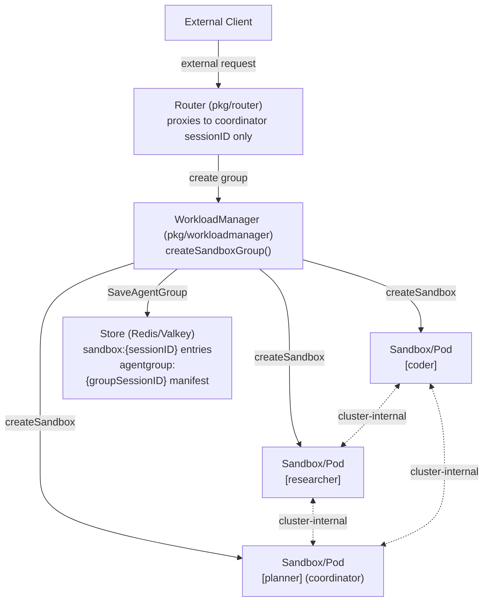
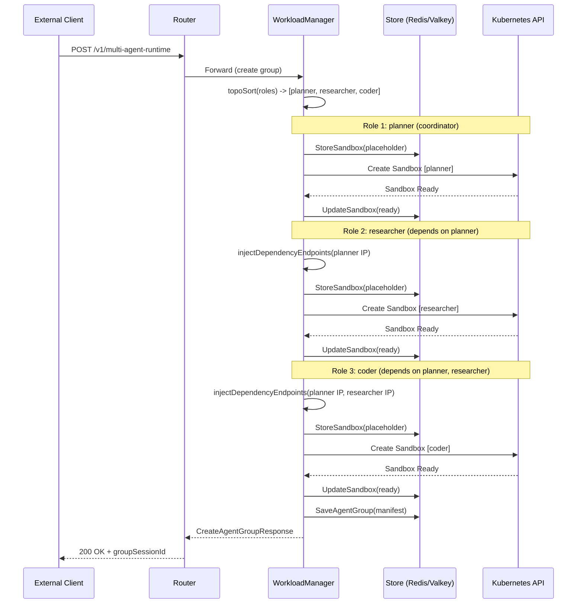

# Multi-Agent Runtime: Design Proposal

Author: Abhinav Singh

> **Status:** Draft  
> **Target Version:** AgentCube v0.x  
> **Relates to:** Issue [#301](https://github.com/volcano-sh/agentcube/issues/301)

---

## Table of Contents

1. [Overview](#overview)
2. [Motivation](#motivation)
3. [Goals and Non-Goals](#goals-and-non-goals)
4. [Use Cases](#use-cases)
5. [Design](#design)
   - [Architecture](#architecture)
   - [CRD Specification](#crd-specification)
   - [Key Design Decisions](#key-design-decisions)
   - [Store Layout](#store-layout)
   - [Core Implementation](#core-implementation-createsandboxgroup)
   - [Topological Sort and Cycle Detection](#topological-sort-and-cycle-detection)
6. [API](#api)
   - [New Endpoints](#new-endpoints)
   - [Request and Response Types](#request-and-response-types)
   - [Store Interface Additions](#store-interface-additions)
   - [CRD Types](#crd-types)
   - [SandboxInfo Extensions](#sandboxinfo-extensions)
7. [Controller: MultiAgentRuntimeReconciler](#controller-multiagentrimereconciler)
8. [Garbage Collection](#garbage-collection)
9. [Router Integration](#router-integration)
10. [SDK Integration](#sdk-integration)
11. [Backward Compatibility](#backward-compatibility)
12. [File Change Map](#file-change-map)
13. [Implementation Plan](#implementation-plan)
14. [What Stays Unchanged](#what-stays-unchanged)
15. [Alternatives Considered](#alternatives-considered)
16. [Future Enhancements](#future-enhancements)

---

## Overview

This document proposes `MultiAgentRuntime`, a new custom resource for the AgentCube project. It introduces a declarative orchestration layer that allows users to define a group of collaborating `AgentRuntime` roles as a single unit with unified lifecycle management.

Each role references an existing `AgentRuntime` CRD by name. The system manages startup ordering, dependency endpoint injection, per-role warm pools, failure handling, and garbage collection for the entire group atomically.

The design is intentionally additive: it reuses the existing transactional sandbox creation pipeline (`createSandbox`, `rollbackSandboxCreation`, `WatchSandboxOnce`, and the store interface) without modification. The multi-agent layer sits above these primitives as a pure composition layer.

---

## Motivation

Complex AI workloads increasingly require multiple specialized agents working together. The existing `example/pcap-analyzer/` already demonstrates this pattern: a planner agent coordinates with a code-interpreter agent to analyze network packet captures. Today, achieving this requires users to:

1. Create each agent sandbox independently via separate API calls.
2. Discover endpoints and wire inter-agent communication by hand.
3. Manage lifecycle (idle timeout, TTL, cleanup) for each sandbox individually.
4. Implement custom rollback logic if any sandbox fails to start.

This manual approach is fragile and does not scale. A single client disconnect mid-creation can leave a partially created group with no cleanup path. There is no first-class notion of a "group" in the store, so GC cannot reason about group-level lifecycle. Warm pools are unavailable at the group level. Three-agent or DAG-structured topologies require custom application-level orchestration code.

`MultiAgentRuntime` addresses all of these gaps by promoting the group from an informal convention to a first-class API object with full lifecycle management.

> **Note:** The existing single-agent `AgentRuntime` and `CodeInterpreter` creation flows are not modified by this proposal. `MultiAgentRuntime` is a pure composition layer that calls the same `createSandbox()` pipeline for each role.

---

## Goals and Non-Goals

### Goals

- Provide a single CRD to declare a group of collaborating `AgentRuntime` roles and their relationships.
- Support atomic creation and rollback: failure of any role undoes all previously created sandboxes.
- Support topological startup ordering via a `dependencies[]` field with cycle detection.
- Support per-role warm pools using the existing `SandboxTemplate` + `SandboxWarmPool` + `SandboxClaim` machinery.
- Provide a `/topology` endpoint so the coordinator can discover worker endpoints at runtime.
- Support a `BestEffort` startup policy for cases where some workers are optional.
- Extend GC to clean up group manifests alongside member sandboxes.
- Add a `MultiAgentRuntimeReconciler` for post-creation self-healing.

### Non-Goals

- Cross-namespace groups. All roles must be in the same namespace as the `MultiAgentRuntime` resource.
- Cross-cluster groups. All sandboxes are created in the same Kubernetes cluster.
- Runtime re-configuration of group topology (e.g., adding or removing roles after creation).
- Built-in inter-agent message passing or shared memory. Agents communicate over cluster-internal networking using injected endpoints; the transport layer is the application's responsibility.
- Multi-tenancy isolation between groups. Namespace-level RBAC from the existing `AgentRuntime` applies.

---

## Use Cases

1. **Research team with planner + code-interpreter**
   A research team deploys a planner agent that breaks complex queries into steps and a code-interpreter agent that executes generated code. Today, the `example/pcap-analyzer/` demonstrates this pattern with manual orchestration. With `MultiAgentRuntime`, the team declares both agents as roles with `dependencies: [planner]` on the code-interpreter, and the system handles startup ordering, endpoint injection, and unified cleanup.

2. **Fan-out analysis pipeline**
   A security team runs a coordinator agent that fans out to three parallel analysis agents (network, filesystem, process). Each analyzer runs independently with no inter-dependencies. The coordinator discovers all worker endpoints via the `/topology` endpoint and dispatches tasks. `MultiAgentRuntime` with `startupPolicy: BestEffort` allows the pipeline to operate in degraded mode if one analyzer fails to start.

3. **DAG-structured data processing**
   A data engineering team chains agents in a DAG: an ingestion agent feeds a transformation agent, which feeds both a validation agent and a storage agent. Dependencies ensure each stage starts only after its predecessors are ready. Endpoint injection eliminates manual service discovery.

4. **Latency-sensitive warm pool deployment**
   A production API team needs sub-second group creation for a coordinator + two workers. By setting `warmPoolSize: 3` on each role, pre-warmed sandboxes are claimed via `SandboxClaim` at group creation time, reducing cold-start latency from minutes to near-zero.

---

## Design

### Architecture



The coordinator is the only role exposed externally through the Router. All inter-agent traffic flows over cluster-internal pod IPs, never touching the Router proxy. This keeps inter-agent latency low and does not require any changes to the Router's proxy logic.

### CRD Specification

```yaml
apiVersion: runtime.agentcube.volcano.sh/v1alpha1
kind: MultiAgentRuntime
metadata:
  name: research-team
  namespace: default
spec:
  # startupPolicy controls failure semantics during group creation.
  # Atomic (default): any role failure rolls back all previously created sandboxes.
  # BestEffort: coordinator must succeed; worker failures are recorded in the group manifest.
  startupPolicy: Atomic
  roles:
    - name: planner
      runtimeRef: planner-agent   # name of an existing AgentRuntime CRD in this namespace
      isCoordinator: true         # exactly one role must be marked as coordinator
      warmPoolSize: 2
    - name: researcher
      runtimeRef: researcher-agent
      warmPoolSize: 3
      dependencies: [planner]     # planner must be ready before researcher is created
    - name: coder
      runtimeRef: coder-agent
      dependencies: [planner, researcher]
  sessionTimeout: 15m
  maxSessionDuration: 8h
```

> **Example mapping:** The `example/pcap-analyzer/` pattern maps directly onto this spec: `planner` references the planner `AgentRuntime`, and the code-interpreter maps to a worker role with `dependencies: [planner]`. The manual orchestration code in `pcap_analyzer.py` is replaced entirely by this declarative CRD.

### Key Design Decisions

#### Reference-based role definitions

Each role's `runtimeRef` points to an existing `AgentRuntime` CRD in the same namespace. `MultiAgentRuntime` does not inline a pod spec, security context, resource requirements, or image. All of these are already defined and validated in the referenced `AgentRuntime`. This means updating an agent's image or resource limits in the `AgentRuntime` automatically applies to every group that references it, with no duplication.

This decision mirrors the pattern used by `CodeInterpreter`, which also separates the "what" (container spec in the CRD) from the lifecycle management concerns.

#### Flat role list with dependency DAG

Roles are declared in a flat `roles[]` list. Each role optionally declares `dependencies[]` referencing other roles by name. This represents an arbitrary directed acyclic graph (DAG): linear pipelines, fan-out/fan-in, swarms (no dependencies), and peer topologies are all expressible without any structural change to the API.

At creation time, `topoSort()` runs Kahn's algorithm over the dependency graph. Roles with no remaining dependencies are created first. Dependency endpoints are injected into each subsequent role before its sandbox is created. If a cycle is detected, the request is rejected immediately with an error message identifying the involved roles.

#### Coordinator designation

Exactly one role must have `isCoordinator: true`. This is enforced at request time; zero or multiple coordinators result in a validation error. The coordinator's session ID is the only one registered with the Router for external traffic. All other roles are cluster-internal.

The coordinator concept is intentionally separate from the orchestrator concept. A coordinator is simply the external entrypoint; it does not need to control other agents. This supports gateway-style topologies where the coordinator routes requests but does not plan or execute.

#### Per-role warm pools

Each role may set `warmPoolSize`. When greater than zero, the `MultiAgentRuntimeReconciler` creates a `SandboxTemplate` + `SandboxWarmPool` pair for that role, using `controllerutil.SetControllerReference` to bind them to the `MultiAgentRuntime`. At group creation time, warm roles are provisioned via `SandboxClaim` rather than direct `Sandbox` creation, reducing cold-start latency from approximately 2 minutes per role to near-zero.

This reuses the exact same `SandboxTemplate`/`SandboxWarmPool`/`SandboxClaim` machinery already implemented in `CodeInterpreterReconciler`, with no changes to that machinery.

#### Startup policies

**`Atomic` (default):** All roles must succeed. If any role fails, the deferred rollback function in `createSandboxGroup()` calls `rollbackSandboxCreation()` for every previously created sandbox. The call returns an error. This is the correct default for production workloads where a partial group is worse than no group.

**`BestEffort`:** The coordinator must succeed. Worker failures are recorded in the group manifest with `status: "failed"`, and the call returns successfully with partial topology information. The response signals which roles are unavailable. This is appropriate for workloads where some workers are optional or can be retried asynchronously.

In both policies, coordinator failure always causes full rollback and an error return, regardless of how many workers succeeded.

#### Dependency endpoint injection

Before a dependent role's sandbox is created, the verified pod IPs of its dependencies are injected as environment variables into the pod template. To ensure compatibility with standard shell naming conventions, any hyphens or non-alphanumeric characters in the role name are replaced by underscores. 

The naming convention is:

```
AGENTCUBE_DEP_{ROLE_NAME_SANITISED_UPPER}_ENDPOINT = {podIP}:{port}
```

**Port Resolution Rule:**
* If the dependency's `AgentRuntime` CRD defines a single port, that port is used.
* If it defines multiple ports, the system first looks for a port named `http` or `default`. If no such port is found, it falls back to the first port in the ports list.

For a role with `dependencies: [my-planner]` (where the planner exposes `8080` as the first port), the dependent pod receives:

```
AGENTCUBE_DEP_MY_PLANNER_ENDPOINT = 10.0.0.4:8080
```

Injection happens in-memory inside `createSandboxGroup()` by mutating the pod template before it is passed to `buildSandboxByAgentRuntime()`. The referenced `AgentRuntime` CRD object in the informer cache is never written.

### Store Layout

Individual sandbox store entries gain two new fields that associate them with their parent group:

```
sandbox:{sessionID-planner}    -> SandboxInfo{ ..., GroupSessionID: "grp-xxx", Role: "planner" }
sandbox:{sessionID-researcher} -> SandboxInfo{ ..., GroupSessionID: "grp-xxx", Role: "researcher" }
sandbox:{sessionID-coder}      -> SandboxInfo{ ..., GroupSessionID: "grp-xxx", Role: "coder" }
```

A separate group manifest key stores aggregated role metadata:

```
agentgroup:{grp-xxx} -> AgentGroupManifest{
    GroupSessionID: "grp-xxx",
    CreatedAt: ...,
    Roles: [
        { Name: "planner",    SessionID: "...", Endpoint: "10.0.0.4:8080", Status: "ready" },
        { Name: "researcher", SessionID: "...", Endpoint: "10.0.0.5:8080", Status: "ready" },
        { Name: "coder",      SessionID: "...", Endpoint: "10.0.0.6:8080", Status: "failed" }
    ]
}
```

> **Backward compatibility:** Standalone sandboxes (those not belonging to any group) have empty `GroupSessionID` and `Role` fields. All existing store queries over `sandbox:` keys are unaffected. The `omitempty` JSON tag ensures these fields are absent from serialized standalone entries, so existing store consumers that unmarshal `SandboxInfo` do not break.

### Core Implementation: `createSandboxGroup()`

```go
func (s *Server) createSandboxGroup(
    ctx context.Context,
    mar *runtimev1alpha1.MultiAgentRuntime,
    dynamicClient dynamic.Interface,
) (*types.CreateAgentGroupResponse, error) {

    groupSessionID := "grp-" + uuid.New().String()
    var created []createdRole

    needGroupRollback := true
    defer func() {
        if !needGroupRollback {
            return
        }
        for _, c := range created {
            // rollbackSandboxCreation is called as-is (no changes to the function).
            s.rollbackSandboxCreation(dynamicClient, c.sandbox, nil, c.sessionID)
        }
    }()

    orderedRoles, err := topoSort(mar.Spec.Roles)
    if err != nil {
        return nil, err // descriptive cycle error
    }

    for _, role := range orderedRoles {
        // buildSandboxByAgentRuntime is called as-is (no changes to the function).
        sandbox, sandboxEntry, err := buildSandboxByAgentRuntime(
            mar.Namespace, role.RuntimeRef, s.informers,
        )
        if err != nil {
            return nil, fmt.Errorf("role %s: build sandbox: %w", role.Name, err)
        }
        sandboxEntry.GroupSessionID = groupSessionID
        sandboxEntry.Role = role.Name

        if len(role.Dependencies) > 0 {
            injectDependencyEndpoints(&sandbox.Spec.PodTemplate, role.Dependencies, created)
        }

        // Watch and create sandbox in a closure to prevent watcher resource accumulation from defer in a loop
        resp, err := func() (*types.CreateAgentResponse, error) {
            resultChan := s.sandboxController.WatchSandboxOnce(ctx, sandbox.Namespace, sandbox.Name)
            defer s.sandboxController.UnWatchSandbox(sandbox.Namespace, sandbox.Name)
            return s.createSandbox(ctx, dynamicClient, sandbox, nil, sandboxEntry, resultChan)
        }()
        if err != nil {
            if mar.Spec.StartupPolicy == StartupPolicyBestEffort && !role.IsCoordinator {
                klog.Warningf("group %s: role %s failed (BestEffort policy): %v", groupSessionID, role.Name, err)
                recordRoleFailure(groupSessionID, role.Name)
                continue
            }
            return nil, fmt.Errorf("role %s: %w", role.Name, err)
        }

        created = append(created, createdRole{
            name:      role.Name,
            resp:      resp,
            sandbox:   sandbox,
            sessionID: sandboxEntry.SessionID,
        })
    }

    manifest := buildGroupManifest(groupSessionID, mar.Spec.Roles, created)
    if err := s.storeClient.SaveAgentGroup(ctx, groupSessionID, manifest); err != nil {
        return nil, fmt.Errorf("save group manifest: %w", err)
    }

    needGroupRollback = false
    return buildGroupResponse(groupSessionID, created), nil
}
```

**Key properties:**

- The deferred rollback calls the existing `rollbackSandboxCreation()` function, without modification, for every sandbox in `created`.
- Roles are created in topological order. A dependency's endpoint is guaranteed to be in `created` before the dependent role's sandbox is built.
- `buildSandboxByAgentRuntime()`, `createSandbox()`, `WatchSandboxOnce()`, and `rollbackSandboxCreation()` are all called as-is.
- The `needGroupRollback` flag is only cleared after `SaveAgentGroup` succeeds. A store failure after all sandboxes are created will roll back the Kubernetes resources, maintaining consistency between the cluster state and the store.

The following sequence diagram illustrates the creation flow for a 3-role group under `Atomic` policy:



### Topological Sort and Cycle Detection

```go
func topoSort(roles []RoleSpec) ([]RoleSpec, error) {
    inDegree := make(map[string]int)
    adj      := make(map[string][]string)
    roleMap  := make(map[string]RoleSpec)

    for _, r := range roles {
        roleMap[r.Name] = r
        if _, exists := inDegree[r.Name]; !exists {
            inDegree[r.Name] = 0
        }
        for _, dep := range r.Dependencies {
            adj[dep] = append(adj[dep], r.Name)
            inDegree[r.Name]++
        }
    }

    var queue []string
    for name, deg := range inDegree {
        if deg == 0 {
            queue = append(queue, name)
        }
    }

    var sorted []RoleSpec
    for len(queue) > 0 {
        name := queue[0]
        queue = queue[1:]
        sorted = append(sorted, roleMap[name])
        for _, neighbor := range adj[name] {
            inDegree[neighbor]--
            if inDegree[neighbor] == 0 {
                queue = append(queue, neighbor)
            }
        }
    }

    if len(sorted) != len(roles) {
        // Check for missing dependencies first to provide a better error message.
        for _, r := range roles {
            for _, dep := range r.Dependencies {
                if _, exists := roleMap[dep]; !exists {
                    return nil, fmt.Errorf("role %s depends on non-existent role %s", r.Name, dep)
                }
            }
        }
        // Identify and name the roles involved in the cycle for the error message.
        var cycled []string
        for name, deg := range inDegree {
            if deg > 0 {
                cycled = append(cycled, name)
            }
        }
        sort.Strings(cycled)
        return nil, fmt.Errorf("dependency cycle detected among roles: %v", cycled)
    }
    return sorted, nil
}
```

The algorithm is Kahn's BFS-based topological sort, O(V+E). Cycle detection is derived from the invariant that Kahn's algorithm only produces a complete ordering when no cycle exists. If `len(sorted) < len(roles)`, the roles with remaining in-degree are in a cycle. Their names are included in the error message to aid debugging.

---

## API

### New Endpoints

| Method | Path | Description |
|--------|------|-------------|
| `POST` | `/v1/multi-agent-runtime` | Create a new agent group. Returns group session ID and coordinator entrypoints. |
| `DELETE` | `/v1/multi-agent-runtime/sessions/:groupSessionId` | Delete all sandboxes in the group and remove the group manifest from the store. |
| `GET` | `/v1/multi-agent-runtime/groups/:groupSessionId/topology` | Return the group manifest including all role endpoints and statuses. Intended for use by the coordinator at startup to discover worker endpoints. |

### Request and Response Types

#### Create Group Request

```go
type CreateAgentGroupRequest struct {
    Kind      string `json:"kind"`      // "MultiAgentRuntime"
    Name      string `json:"name"`      // MultiAgentRuntime CRD name
    Namespace string `json:"namespace"`
}
```

#### Create Group Response

```go
type CreateAgentGroupResponse struct {
    GroupSessionID string                   `json:"groupSessionId"`
    Roles          []AgentGroupRoleResponse `json:"roles"`
}

type AgentGroupRoleResponse struct {
    Name      string `json:"name"`
    SessionID string `json:"sessionId"`
    Endpoint  string `json:"endpoint"`
    Status    string `json:"status"` // "ready" | "failed"
}
```

#### Group Manifest (stored in Redis/Valkey)

```go
type AgentGroupManifest struct {
    GroupSessionID string           `json:"groupSessionId"`
    Roles          []AgentGroupRole `json:"roles"`
    CreatedAt      time.Time        `json:"createdAt"`
}

type AgentGroupRole struct {
    Name      string `json:"name"`
    SessionID string `json:"sessionId"`
    Endpoint  string `json:"endpoint"`
    Status    string `json:"status"` // "ready" | "failed"
}
```

### Store Interface Additions

Four new methods are added to the `Store` interface in `pkg/store/interface.go`. All existing methods are unchanged.

```go
// SaveAgentGroup persists a group manifest keyed by groupSessionID.
// Key format: agentgroup:{groupSessionID}
SaveAgentGroup(ctx context.Context, groupSessionID string, manifest *types.AgentGroupManifest) error

// GetAgentGroup retrieves a group manifest by groupSessionID.
// Returns ErrNotFound if the key does not exist.
GetAgentGroup(ctx context.Context, groupSessionID string) (*types.AgentGroupManifest, error)

// DeleteAgentGroup removes a group manifest by groupSessionID.
DeleteAgentGroup(ctx context.Context, groupSessionID string) error

// UpdateAgentGroupRoleStatus atomically updates the status and endpoint of a specific role
// within a group manifest. Used by the reconciler during self-healing.
UpdateAgentGroupRoleStatus(ctx context.Context, groupSessionID, roleName, status, endpoint string) error
```

Both `store_redis.go` and `store_valkey.go` implement these methods using the key prefix `agentgroup:`. 

> **Store Implementation Note:** To prevent race conditions in a distributed environment during concurrent updates, the store backends (Redis/Valkey) implement group manifests using a **Redis Hash** (`HSET agentgroup:{groupSessionID}`) instead of a raw JSON string.
> 
> The hash fields map directly to roles and their metadata (e.g., `HSET agentgroup:{groupSessionID} role:{roleName} <json>`), allowing atomic field-level updates without rewriting the full manifest JSON, avoiding read-modify-write races.

### CRD Types

```go
// MultiAgentRuntime defines a group of collaborating AgentRuntime roles with
// unified lifecycle management.
//
// +genclient
// +k8s:deepcopy-gen:interfaces=k8s.io/apimachinery/pkg/runtime.Object
// +kubebuilder:object:root=true
// +kubebuilder:subresource:status
// +kubebuilder:resource:scope=Namespaced
// +kubebuilder:printcolumn:name="Ready",type="boolean",JSONPath=".status.ready"
// +kubebuilder:printcolumn:name="Policy",type="string",JSONPath=".spec.startupPolicy"
// +kubebuilder:printcolumn:name="Age",type="date",JSONPath=".metadata.creationTimestamp"
type MultiAgentRuntime struct {
    metav1.TypeMeta   `json:",inline"`
    metav1.ObjectMeta `json:"metadata,omitempty"`
    Spec              MultiAgentRuntimeSpec   `json:"spec"`
    Status            MultiAgentRuntimeStatus `json:"status,omitempty"`
}

type MultiAgentRuntimeSpec struct {
    // StartupPolicy controls failure behavior during group creation.
    // +kubebuilder:default="Atomic"
    // +kubebuilder:validation:Enum=Atomic;BestEffort
    StartupPolicy StartupPolicyType `json:"startupPolicy,omitempty"`

    // Roles defines the set of agent roles in this group.
    // At least one role must be present, and exactly one must have IsCoordinator=true.
    // +kubebuilder:validation:MinItems=1
    Roles []RoleSpec `json:"roles"`

    // SessionTimeout is the idle timeout applied to all sandboxes in the group.
    // Defaults to 15m.
    // +kubebuilder:default="15m"
    SessionTimeout *metav1.Duration `json:"sessionTimeout,omitempty"`

    // MaxSessionDuration is the absolute TTL for all sandboxes in the group.
    // Defaults to 8h.
    // +kubebuilder:default="8h"
    MaxSessionDuration *metav1.Duration `json:"maxSessionDuration,omitempty"`
}

type RoleSpec struct {
    // Name is the unique identifier for this role within the group.
    // +kubebuilder:validation:MinLength=1
    Name string `json:"name"`

    // RuntimeRef is the name of an existing AgentRuntime CRD in the same namespace.
    // +kubebuilder:validation:MinLength=1
    RuntimeRef string `json:"runtimeRef"`

    // IsCoordinator marks this role as the external entrypoint for the group.
    // Exactly one role must be marked as coordinator.
    // +optional
    IsCoordinator bool `json:"isCoordinator,omitempty"`

    // WarmPoolSize specifies the number of pre-warmed sandboxes for this role.
    // When set, the reconciler creates a SandboxTemplate + SandboxWarmPool for this role.
    // +optional
    // +kubebuilder:validation:Minimum=0
    WarmPoolSize *int32 `json:"warmPoolSize,omitempty"`

    // Dependencies lists the names of roles that must be ready before this role is created.
    // Circular dependencies are rejected at request time.
    // +optional
    Dependencies []string `json:"dependencies,omitempty"`
}

type StartupPolicyType string

const (
    // StartupPolicyAtomic rolls back all created sandboxes if any role fails.
    StartupPolicyAtomic     StartupPolicyType = "Atomic"
    // StartupPolicyBestEffort allows worker failures; coordinator failure still rolls back everything.
    StartupPolicyBestEffort StartupPolicyType = "BestEffort"
)

type MultiAgentRuntimeStatus struct {
    // Conditions reflect the current state of the MultiAgentRuntime.
    // Standard conditions: Ready, Degraded, Failed.
    Conditions []metav1.Condition `json:"conditions,omitempty"`

    // Ready is true when all required roles are running and healthy.
    Ready bool `json:"ready,omitempty"`
}
```

### SandboxInfo Extensions

Two fields are added to `SandboxInfo` in `pkg/common/types/sandbox.go`. Both fields are empty for standalone sandboxes, preserving full backward compatibility.

```go
type SandboxInfo struct {
    // ... existing fields unchanged ...

    // GroupSessionID associates this sandbox with a MultiAgentRuntime group.
    // Empty string for standalone (non-group) sandboxes.
    GroupSessionID string `json:"groupSessionId,omitempty"`

    // Role identifies this sandbox's role within its group.
    // Empty string for standalone sandboxes.
    Role string `json:"role,omitempty"`
}
```

---

## Controller: `MultiAgentRuntimeReconciler`

A new `MultiAgentRuntimeReconciler` in `pkg/workloadmanager/multiagent_controller.go` manages the lifecycle of `MultiAgentRuntime` resources. It is registered with the existing `controller-runtime` manager already wired in `cmd/workload-manager/main.go` alongside `CodeInterpreterReconciler`.

The reconciler uses `GenerationChangedPredicate` to avoid reconcile loops triggered by status-only updates, consistent with `CodeInterpreterReconciler`.

### Warm Pool Management (Phase 2)

For each role with `warmPoolSize > 0`, the reconciler ensures a `SandboxTemplate` and `SandboxWarmPool` exist with the correct spec. Both resources are created with `controllerutil.SetControllerReference` pointing to the `MultiAgentRuntime`, so they are garbage collected when the `MultiAgentRuntime` is deleted. If the `warmPoolSize` changes, the reconciler updates the `SandboxWarmPool` spec in place.

### Self-Healing (Phase 4)

The reconciler watches for `Sandbox` objects whose `GroupSessionID` matches a known group. On pod failure:

- **`Atomic` policy**: the reconciler calls `handleDeleteAgentGroup()` to tear down all remaining sandboxes and delete the group manifest. It sets a `Failed` condition on the `MultiAgentRuntimeStatus`.
- **`BestEffort` policy**: the reconciler attempts to create a replacement sandbox for the failed role. On success, it calls `UpdateAgentGroupRoleStatus()` with the new endpoint. On repeated failure, it sets a `Degraded` condition.

### Status Conditions

| Condition | Meaning |
|-----------|---------|
| `Ready=True` | All roles are running and healthy |
| `Ready=False, reason=Creating` | Group creation is in progress |
| `Degraded=True` | One or more workers failed (BestEffort policy only) |
| `Failed=True` | Group has been torn down due to a critical failure |

---

## Garbage Collection

The existing GC in `pkg/workloadmanager/garbage_collection.go` is extended with group awareness. When the GC deletes a sandbox that has a non-empty `GroupSessionID`:

1. It calls `GetAgentGroup()` to retrieve the group manifest.
2. It removes the deleted role from the manifest.
3. If no roles remain in the manifest, it calls `DeleteAgentGroup()` to remove the `agentgroup:` key from the store.
4. If other roles remain, it calls `SaveAgentGroup()` with the updated manifest.

This ensures that group manifests do not accumulate indefinitely in the store after their member sandboxes expire. The existing idle-timeout and TTL logic for individual sandboxes is not modified. Group membership is an additional cleanup concern layered on top of existing GC, not a replacement.

---

## Router Integration

`pkg/router/session_manager.go` is extended with a `MultiAgentRuntimeKind` case in the endpoint resolution switch:

```go
case types.MultiAgentRuntimeKind:
    endpoint = m.workloadMgrAddr + "/v1/multi-agent-runtime"
```

The Router tracks only the coordinator's session ID for external request routing. Worker endpoints are stored in the group manifest and are internal-only. No changes are required to the Router's proxy logic.

> **Note:** The Router does not need to know that a session belongs to a group. It proxies requests to the coordinator's sandbox exactly as it would proxy requests to any standalone `AgentRuntime` sandbox. The group abstraction is fully transparent to the Router.

---

## SDK Integration

The Python SDK exposes a `MultiAgentRuntimeClient` that wraps the three new HTTP endpoints:

```python
from agentcube import MultiAgentRuntimeClient

client = MultiAgentRuntimeClient(
    base_url="https://router.example.com",
    # auth=...,  # same auth options as existing clients
)

# Create a group
group = client.create_group(
    name="research-team",
    namespace="default",
)
print(f"Group created: {group.group_session_id}")
print(f"Coordinator endpoint: {group.roles[0].endpoint}")

# Discover worker topology (coordinator calls this at startup)
topology = client.get_topology(group.group_session_id)
for role in topology.roles:
    print(f"  {role.name}: {role.endpoint} ({role.status})")

# Delete the group
client.delete_group(group.group_session_id)
```

Token lifecycle, retry logic, and error handling follow the same patterns as the existing `CodeInterpreterClient`.

---

## Backward Compatibility

This feature is fully backward compatible. No existing behavior changes unless the user creates a `MultiAgentRuntime` resource:

| Concern | Impact |
|---------|--------|
| Existing `AgentRuntime` creation flow | Unchanged. `createSandbox()` is called as-is. |
| Existing `CodeInterpreter` creation flow | Unchanged. |
| Existing store schema | Two new `omitempty` fields (`GroupSessionID`, `Role`) added to `SandboxInfo`. Existing entries deserialize with zero values. No migration required. |
| Existing GC logic | Unchanged for standalone sandboxes. Group cleanup is additive. |
| Existing Router proxy | Unchanged. Group awareness is limited to the endpoint switch. |
| Store key namespace | New `agentgroup:` prefix does not collide with existing `sandbox:` prefix. |
| API surface | Three new endpoints under `/v1/multi-agent-runtime`. No changes to existing endpoints. |

---

## File Change Map

### New Files

| File | Description |
|------|-------------|
| `pkg/apis/runtime/v1alpha1/multiagentruntime_types.go` | CRD types with kubebuilder markers |
| `pkg/workloadmanager/multiagent_controller.go` | `MultiAgentRuntimeReconciler` |
| `pkg/workloadmanager/multiagent_controller_test.go` | Reconciler unit tests |
| `sdk-python/agentcube/multi_agent.py` | `MultiAgentRuntimeClient` for the Python SDK |
| `sdk-python/examples/multi_agent_usage.py` | End-to-end usage example |
| `test/e2e/multi_agent_runtime.yaml` | E2E test fixtures |
| `docs/design/multi-agent-runtime-proposal.md` | This document |
| `manifests/charts/base/crds/runtime.agentcube.volcano.sh_multiagentruntimes.yaml` | Auto-generated by `make gen-crd` |

### Modified Files

| File | Change |
|------|--------|
| `pkg/apis/runtime/v1alpha1/register.go` | Add `MultiAgentRuntimeKind`, `MultiAgentRuntimeListKind`, `MultiAgentRuntimeGroupVersionKind` |
| `pkg/apis/runtime/v1alpha1/zz_generated.deepcopy.go` | Regenerated by `make generate` |
| `pkg/common/types/types.go` | Add `MultiAgentRuntimeKind` constant |
| `pkg/common/types/sandbox.go` | Add `GroupSessionID`, `Role` to `SandboxInfo`; add `AgentGroupManifest`, `AgentGroupRole`, group request/response types |
| `pkg/api/errors.go` | Add `ErrMultiAgentRuntimeNotFound`; add `multiAgentRuntimeResource` in `workloadResource()` switch |
| `pkg/workloadmanager/informers.go` | Add `MultiAgentRuntimeGVR`; add informer wiring and cache sync |
| `pkg/workloadmanager/workload_builder.go` | Add `GroupSessionID`, `Role` fields to `sandboxEntry` struct |
| `pkg/workloadmanager/sandbox_helper.go` | Propagate `GroupSessionID` and `Role` in `buildSandboxPlaceHolder()` and `buildSandboxInfo()` |
| `pkg/workloadmanager/handlers.go` | Add `handleMultiAgentRuntimeCreate`, `createSandboxGroup`, `handleDeleteAgentGroup`, `handleGetGroupTopology` |
| `pkg/workloadmanager/handlers_test.go` | Add group creation and rollback test cases |
| `pkg/workloadmanager/server.go` | Add 3 new routes under `/v1/multi-agent-runtime` |
| `pkg/workloadmanager/garbage_collection.go` | Group manifest cleanup when last member sandbox is GC'd |
| `pkg/store/interface.go` | Add `SaveAgentGroup`, `GetAgentGroup`, `DeleteAgentGroup`, `UpdateAgentGroupRoleStatus` |
| `pkg/store/store_redis.go` | Implement all 4 group methods |
| `pkg/store/store_redis_test.go` | Group CRUD tests |
| `pkg/store/store_valkey.go` | Implement all 4 group methods |
| `pkg/store/store_valkey_test.go` | Group CRUD tests |
| `pkg/router/session_manager.go` | Add `MultiAgentRuntimeKind` case in endpoint switch |
| `cmd/workload-manager/main.go` | Phase 1: HTTP routes; Phase 4: reconciler wiring |
| `sdk-python/agentcube/__init__.py` | Export `MultiAgentRuntimeClient` |
| `test/e2e/e2e_test.go` | Add `TestMultiAgentRuntimeCreate`, `TestMultiAgentRuntimeRollback` |

---

## Implementation Plan

### Phase 1 - Core Foundation (Weeks 1-4)

Deliverables that satisfy the mentorship expected outcomes on their own.

- Define `MultiAgentRuntime` CRD types with kubebuilder markers; run `make generate` + `make gen-crd`.
- Implement `createSandboxGroup()` with `Atomic` rollback (no `BestEffort` yet).
- Add `GroupSessionID` + `Role` to `SandboxInfo`; propagate through `buildSandboxPlaceHolder()` + `buildSandboxInfo()`.
- Implement all 4 store methods in `store_redis.go` + `store_valkey.go` with full unit test coverage.
- Add `MultiAgentRuntimeKind` to Router endpoint switch.
- Extend GC to clean up `agentgroup:` manifest keys when last member sandbox is deleted.
- Unit tests: `createSandboxGroup()` with atomic rollback on partial failure, store CRUD, coordinator validation, cycle detection.
- E2E test: kind cluster (same setup as existing E2E), create a 3-role group, verify all sandboxes running, delete group, verify cleanup.
- User guide: YAML example + `kubectl` workflow.

### Phase 2 - Warm Pools Per Role (Weeks 5-6)

- Implement `warmPoolSize` field handling in `MultiAgentRuntimeReconciler`.
- Reconciler creates `SandboxTemplate` + `SandboxWarmPool` per warm role with owner references.
- Group creation uses `SandboxClaim` for warm roles, cold `Sandbox` creation for others.
- Add E2E test comparing cold-start vs warm-start group creation latency.

### Phase 3 - DAG Startup and Topology (Weeks 7-8)

- Implement `dependencies[]` field: `topoSort()` + `injectDependencyEndpoints()`.
- Add `GET /v1/multi-agent-runtime/groups/:groupSessionId/topology` endpoint.
- Add `get_topology()` to Python SDK `MultiAgentRuntimeClient`.
- E2E test: verify dependency endpoint env vars are present in dependent pod environment.

### Phase 4 - StartupPolicy and Self-Healing (Weeks 9-11)

- Implement `BestEffort` startup policy in `createSandboxGroup()`.
- Implement `MultiAgentRuntimeReconciler` self-healing:
  - `Atomic`: tear down entire group on worker pod crash.
  - `BestEffort`: attempt role restart, update group manifest with new endpoint.
- Add per-role status conditions to `MultiAgentRuntimeStatus`.
- Wire reconciler into `cmd/workload-manager/main.go`.

### Phase 5 - Observability and Documentation (Week 12)

- Add Prometheus metrics:
  - `agentcube_group_creation_duration_seconds` (histogram)
  - `agentcube_group_role_failures_total` (counter, labels: `role`, `policy`)
  - `agentcube_active_groups` (gauge)
- Finalize design document, API reference, and troubleshooting guide.

---

## What Stays Unchanged

The following functions and components are called as-is with zero modifications:

| Component | Location | Used By |
|-----------|----------|---------|
| `createSandbox()` | `pkg/workloadmanager/handlers.go` | Called per-role inside `createSandboxGroup()` |
| `rollbackSandboxCreation()` | `pkg/workloadmanager/handlers.go` | Called in deferred rollback |
| `buildSandboxByAgentRuntime()` | `pkg/workloadmanager/workload_builder.go` | Called per-role to build sandbox spec |
| `WatchSandboxOnce()` / `UnWatchSandbox()` | `pkg/workloadmanager/sandbox_controller.go` | Called per-role for readiness watching |
| All `AgentRuntime` + `CodeInterpreter` creation flows | Various | Not touched |
| All existing store methods | `pkg/store/` | Not touched |
| GC idle-timeout + TTL logic for standalone sandboxes | `pkg/workloadmanager/garbage_collection.go` | Not touched |
| Router proxy logic for `AgentRuntime` + `CodeInterpreter` | `pkg/router/` | Not touched |

---

## Alternatives Considered

### Inline pod spec in `MultiAgentRuntime`

An early design embedded a full pod spec within each role definition, similar to how `CodeInterpreter` defines its own container template. This was rejected for three reasons:

1. It duplicates the security context, resource requirements, image configuration, and environment variables already defined and validated in the referenced `AgentRuntime`.
2. Changes to an agent's configuration require updates in two places (the `AgentRuntime` CRD and every `MultiAgentRuntime` that embeds it), creating a maintenance burden that grows with the number of groups.
3. Admission validation for pod specs would need to be duplicated in the `MultiAgentRuntime` webhook, diverging from the single source of truth already established by `AgentRuntime`.

The `runtimeRef` approach provides clean separation of concerns: `AgentRuntime` owns the workload definition; `MultiAgentRuntime` owns the topology and lifecycle policy.

### Hardcoded orchestrator/workers split

An alternative used a two-level structure with a single `orchestrator` field and a `workers[]` list, similar to Ray's head-node/worker-node model or Kubeflow's launcher/worker distinction. This was rejected because:

1. It restricts valid topologies to star patterns. DAG pipelines, mesh topologies, and peer-to-peer swarms cannot be expressed.
2. It conflates "coordinator" (external entrypoint) with "orchestrator" (controls other agents). These are separate concerns: a gateway-style coordinator does not plan or dispatch tasks to workers.
3. The flat `roles[]` list with optional `dependencies[]` is strictly more expressive. The overhead is a single topological sort (O(V+E)), which is negligible for the group sizes this feature targets (2-10 roles).

### Separate control plane service

A design was considered where a dedicated `multi-agent-controller` deployment managed group lifecycle independently from the workload manager. This was rejected because:

1. It introduces an additional deployment, service, RBAC configuration, and operational surface for cluster administrators.
2. The workload manager already has the store client, informer cache, dynamic Kubernetes client, and sandbox controller necessary for group management. Replicating these in a separate service introduces duplication and divergence risk.
3. Inter-service communication between the new controller and the workload manager would add latency, a new failure mode, and the complexity of defining an internal API between the two.
4. The `MultiAgentRuntimeReconciler` integrates naturally into the existing `controller-runtime` manager already wired in `cmd/workload-manager/main.go`, following the same pattern as `CodeInterpreterReconciler`. No new binary is required.

---

## Future Enhancements

The following items are explicitly out of scope for this proposal but are noted as natural extensions:

### Dynamic role scaling

Allow the `MultiAgentRuntime` spec to be updated after creation to add or remove worker roles. This would require the reconciler to diff the desired state against the group manifest and create/delete sandboxes accordingly. The current design's flat `roles[]` list and group manifest structure are compatible with this extension.

### Cross-namespace groups

Allow roles to reference `AgentRuntime` CRDs in different namespaces. This requires namespace-scoped RBAC checks during group creation and cross-namespace informer watches. The `runtimeRef` field would be extended to `namespace/name` format.

### Group-level metrics and logging

Aggregate per-role Prometheus metrics into group-level dashboards. Correlate logs across all roles in a group using the `GroupSessionID` as a trace identifier. The `GroupSessionID` is already propagated to all sandbox entries in the store, so log correlation is achievable without schema changes.

### Inter-agent communication primitives

Provide optional shared volumes or message queues between roles. This is explicitly a non-goal of the current design (agents communicate via injected endpoints over cluster networking), but it could be layered on top of the group abstraction if demand emerges.

### Integration with AgentCube auth layer

When the authentication proposal (see `docs/design/auth-proposal.md`) is implemented, `MultiAgentRuntime` group creation requests will be subject to the same Keycloak JWT validation and RBAC checks. The `sandbox:invoke` role would be extended to cover group creation, or a new `group:create` role introduced. No changes to the `MultiAgentRuntime` design are needed because the auth middleware sits in front of all workload manager endpoints.