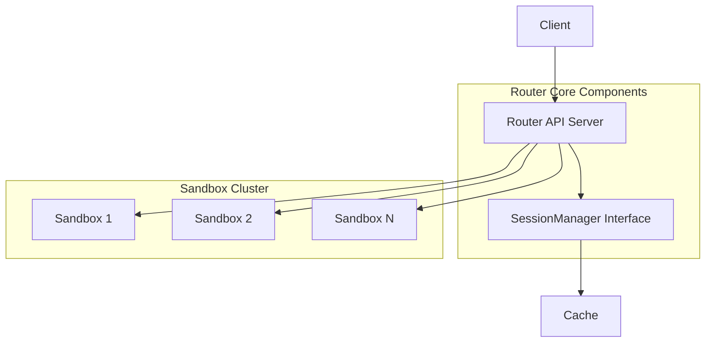
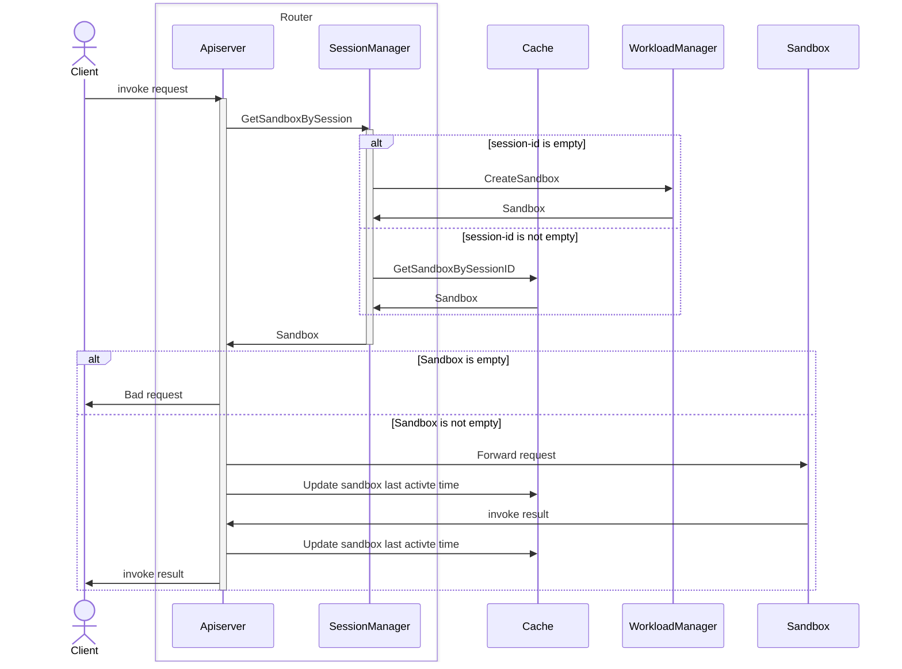

# Router Submodule Design Document

## 1. Overview

Agent-router is a high-performance proxy that receives user HTTP requests and forwards them to the corresponding Sandbox. It acts as a reverse proxy and gateway, focusing on efficient request routing while delegating session and sandbox creating to the SessionManager component.

**Key Responsibilities:**

- HTTP request routing and forwarding
- Connection pooling and concurrency control
- Integration with external cache for session activity tracking

## 2. Architecture Design

### 2.1 Overall Architecture Flow



### 2.2 Request Routing Flow



## 3. Detailed Design

### 3.1 API Endpoints

The Router uses the Gin framework to provide HTTP services with the following endpoints:

#### Invocation Endpoints (With Concurrency Limiting)

1. **Agent Runtime Invocation**
   ```
   POST /v1/namespaces/{namespace}/agent-runtimes/{name}/invocations/*path
   ```
   - Headers: `x-agentcube-session-id` (optional, creates new session if empty)
   - Forwards request to AgentRuntime sandbox
   - Response includes `x-agentcube-session-id` header

2. **Code Interpreter Invocation**
   ```
   POST /v1/namespaces/{namespace}/code-interpreters/{name}/invocations/*path
   ```
   - Headers: `x-agentcube-session-id` (optional, creates new session if empty)
   - Forwards request to CodeInterpreter sandbox
   - Response includes `x-agentcube-session-id` header

#### Health Check Endpoints (No Authentication, No Concurrency Limit)

1. **Liveness Probe**
   ```
   GET /health/live
   ```
   Returns: `{"status": "alive"}`

2. **Readiness Probe**
   ```
   GET /health/ready
   ```
   Returns: `{"status": "ready"}` if SessionManager is available
   Returns: `503 Service Unavailable` if SessionManager is not available

### 3.4 Request Handling Flow

**Invocation Request Processing:**

1. **Extract Session ID**: Read `x-agentcube-session-id` from request header
2. **Get Sandbox Info**: Call `SessionManager.GetSandboxBySession()`
   - If session ID is empty: Creates new sandbox via Workload Manager
   - If session ID exists: Retrieves sandbox from Redis
3. **Select Endpoint**: Match request path with sandbox entry points
   - Finds entry point with matching path prefix
   - Falls back to first entry point if no match
   - Adds protocol prefix if not present (e.g., `http://`)
4. **Update Activity**: Record session activity in Redis (before and after forwarding)
5. **Forward Request**: Use reverse proxy to forward to sandbox
   - Preserves original request method, headers, and body
   - Sets `X-Forwarded-Host` and `X-Forwarded-Proto` headers
   - Uses connection pooling for efficiency
6. **Return Response**: Forward sandbox response to client
   - Always includes `x-agentcube-session-id` in response header
   - Preserves original response status and body

**Error Handling:**
- Invalid session ID → `400 Bad Request`
- No entry points → `404 Not Found`
- Invalid endpoint → `500 Internal Server Error`
- Connection refused → `502 Bad Gateway` (SANDBOX_UNREACHABLE)
- Timeout → `504 Gateway Timeout` (SANDBOX_TIMEOUT)
- Server overload → `429 Too Many Requests` (SERVER_OVERLOADED)

### 3.5 Concurrency Control

**Semaphore-Based Limiting:**
- Uses buffered channel as semaphore to limit concurrent requests
- Default limit: 1000 concurrent requests
- Applied only to invocation endpoints (not health checks)
- Returns `429 Too Many Requests` when limit exceeded

**Connection Pooling:**
- Reusable HTTP transport for all reverse proxy operations
- Configurable idle connections and connections per host
- HTTP/2 support enabled by default
- No idle connection timeout (persistent connections)

## 4. HTTP Response Handling

### 4.1 Success Responses

| Status Code | Scenario | Response Headers | Response Body |
|-------------|----------|------------------|---------------|
| 200 OK | Request processed successfully | `x-agentcube-session-id: <session-id>` | Original response from Sandbox |
| 201 Created | Resource created successfully | `x-agentcube-session-id: <session-id>` | Created resource information |
| 202 Accepted | Async request accepted | `x-agentcube-session-id: <session-id>` | Task status information |

### 4.2 Client Error Responses

| Status Code | Scenario | Response Body Example |
|-------------|----------|----------------------|
| 400 Bad Request | Invalid session ID | `{"error": "Invalid session id <session-id>", "code": "BadRequest"}` |
| 404 Not Found | No entry points found for sandbox | `{"error": "no entry points found for sandbox", "code": "Service not found"}` |
| 429 Too Many Requests | Server overloaded (concurrent request limit exceeded) | `{"error": "server overloaded, please try again later", "code": "SERVER_OVERLOADED"}` |

### 4.3 Server Error Responses

| Status Code | Scenario | Response Body Example |
|-------------|----------|----------------------|
| 500 Internal Server Error | Invalid endpoint | `{"error": "internal server error", "code": "INTERNAL_ERROR"}` |
| 502 Bad Gateway | Sandbox connection failed | `{"error": "sandbox unreachable", "code": "SANDBOX_UNREACHABLE"}` |
| 503 Service Unavailable | SessionManager unavailable | `{"error": "session manager not available", "status": "not ready"}` |
| 504 Gateway Timeout | Sandbox response timeout | `{"error": "sandbox timeout", "code": "SANDBOX_TIMEOUT"}` |
