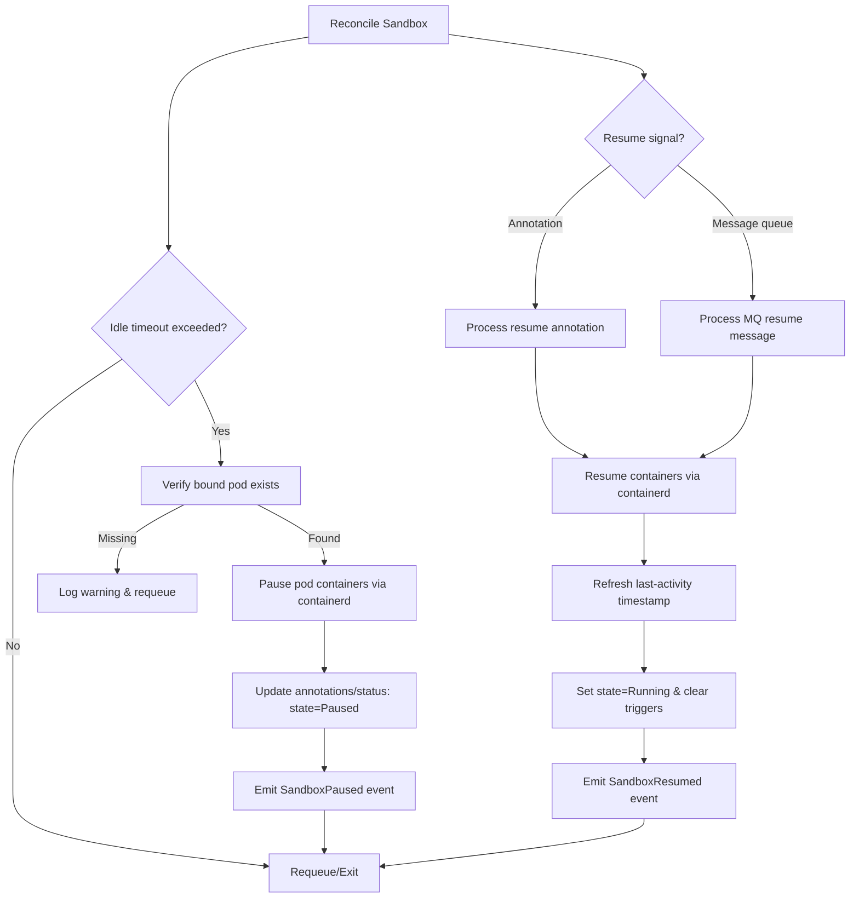

## Sandbox Pod Idle Pause Lifecycle

### Summary

This proposal introduces idle-aware lifecycle management for AgentCube Sandboxes. Instead of deleting the Sandbox CRD and its bound pod when the `last-activity-time` annotation expires, the controller will pause the sandbox pod’s containers via the containerd API and resume them on demand. The change reduces cluster resource consumption, preserves user state, and shortens time-to-first-byte when developers return to their sandboxes. The work covers the pause logic, resume triggers (annotation-based and message-queue driven), observability, and testing strategy.

### Motivation

#### Goals

- Automatically pause sandbox pods whose `last-activity-time` annotation exceeds a configurable idle timeout.
- Resume paused sandbox pods when user activity resumes via annotation or message-queue signals.
- Ensure the sandbox lifecycle remains transparent to users and external systems (status reporting, API responses).
- Provide metrics, events, and audit logs for pause/resume operations.

#### Non-Goals

- Changing the existing Sandbox CRD schema beyond new annotations or status fields required for pause/resume bookkeeping.
- Supporting alternative container runtimes beyond containerd in this iteration.
- Implementing persistent volume snapshotting or memory checkpoint/restore.

### Proposal

#### User Stories (Optional)

##### Story 1

As a developer using AgentCube, when my sandbox is idle overnight it is paused automatically, freeing cluster resources, but when I return the environment resumes within seconds and my previous processes and files are intact.

##### Story 2

As an administrator, I can monitor how many sandboxes are paused, trigger resume operations programmatically, and audit pause/resume events for compliance.

#### Notes/Constraints/Caveats (Optional)

- Pods with multiple containers must pause/resume all workload containers; init and ephemeral containers remain unchanged.
- Containerd pause/resume capability must be enabled on worker nodes; sandbox pods scheduled to runtimes lacking pause support will fall back to deletion or remain running (configurable fallback).
- Pausing terminates network sockets; clients must handle reconnect semantics after resume.
- Sandboxes relying on in-memory timers or background jobs may experience delayed execution until resume.

#### Risks and Mitigations

- **Unsupported container runtime**: Detect runtime class during reconciliation and surface clear events; provide opt-out annotation to disable pausing.
- **Resume signal loss**: Store resume intent in etcd-backed annotations or durable message queues; include retry/backoff logic.
- **Controller restarts mid-operation**: Persist pause/resume state in Sandbox status to ensure idempotent reconciliation.
- **User experience regressions**: Gate rollout behind feature flag and collect metrics before enabling cluster-wide.

### Design Details

#### Pausing and Resuming via containerd

This section describes how the controller talks to containerd to pause and resume the sandbox pod’s containers. We assume Kubernetes is configured with containerd as the CRI implementation (`containerd-shim-runc-v2` or equivalent) and that pause/resume is enabled on the worker nodes.

##### High-level flow

- For each `Sandbox` CRD, there is a bound pod (the sandbox pod) created by the apiserver.
- The controller (`AgentdReconciler`) periodically reconciles the `Sandbox` and checks the idle timeout based on `last-activity-time`.
- When the sandbox is idle, the controller pauses all containers in the sandbox pod using containerd and marks the sandbox as `Paused`.
- When a resume signal is detected (annotation or message queue), the controller resumes the containers using containerd and marks the sandbox as `Running`.

##### Locating the pod and containers

1. Given a `Sandbox` object, the controller finds the bound pod by label or name (existing binding logic in apiserver).
2. For the pod, the controller lists all **workload containers**:
  - `spec.containers[*]` are candidates for pause/resume.
  - Init containers and ephemeral containers are **not** paused or resumed; they have already completed or are temporary.
3. For each workload container, the controller resolves the container runtime ID from the pod status (`status.containerStatuses[*].containerID`). This ID is of the form `containerd://<container-id>`.

##### Using containerd to pause

The controller runs on the node or has access to containerd via its Unix socket (e.g. `/run/containerd/containerd.sock`). We rely on the official Go client for containerd.

1. Establish a containerd client:
  - `client, err := containerd.New("/run/containerd/containerd.sock")`.
  - Use a short timeout context (e.g. 5–10 seconds) to avoid blocking reconciles.
2. For each workload container:
  - Strip the `containerd://` prefix from `containerID`.
  - Look up the corresponding task with `client.LoadTask(ctx, containerID)`.
  - If the task state is already `Paused`, skip.
  - Call `task.Pause(ctx)`.
3. If any container fails to pause:
  - Record a `Paused` condition with `status=False` and a reason (e.g. `ContainerdPauseError`).
  - Emit a Kubernetes event on the `Sandbox` and the pod.
  - Optionally retry with backoff; give up after a small number of attempts to keep reconciliation bounded.
4. Once all containers are paused:
  - Set `sandbox.lifecycle.volcano.sh/state=Paused`.
  - Set `sandbox.lifecycle.volcano.sh/last-paused-at=<now RFC3339>`.
  - Expose the paused state via apiserver and SDKs.

##### Using containerd to resume

Resuming is symmetrical to pausing.

1. Establish the same containerd client as above.
2. For each workload container in the sandbox pod:
  - Resolve and strip the containerd container ID.
  - Load the container task.
  - If the task state is `Running`, skip.
  - Call `task.Resume(ctx)`.
3. Handle errors similarly to pause:
  - Record a `ResumePending` or `Paused` condition with appropriate reason.
  - Emit events and logs.
4. After successful resume of all containers:
  - Set `sandbox.lifecycle.volcano.sh/state=Running`.
  - Set `sandbox.lifecycle.volcano.sh/last-resumed-at=<now>`.
  - Refresh `last-activity-time` to `now` to avoid immediate re-pause.
  - Clear any outstanding resume triggers (annotations, MQ markers).

##### Idempotency and failure handling

- The pause and resume operations must be idempotent:
  - Calling pause on an already paused container must be a no-op.
  - Calling resume on a running container must be a no-op.
- The controller reconciler drives desired state from annotations and status, not from one-shot RPC calls.
- If the controller restarts in the middle of pause or resume, the next reconcile evaluates:
  - The current `state` annotation (`Running|Paused|Resuming|Error`).
  - The actual containerd task states.
  - Any outstanding resume triggers.
- The controller then converges to the desired state (e.g. `Paused` or `Running`) without double-pausing or double-resuming.

##### Interaction with Kubernetes primitives

- We keep the pod **Running** from Kubernetes’ perspective; we do not delete the pod or set its phase to `Succeeded` or `Failed`.
- Liveness and readiness probes may fail while the container is paused; operators can:
  - Disable liveness probes for sandbox workloads, or
  - Use readiness-only probes and accept that a paused sandbox is `NotReady`.
- Network connections are dropped when a container is paused; clients are expected to reconnect after resume.

##### Security and configuration

- The controller needs sufficient permissions to talk to the containerd socket. There are two deployment options:
  - Run the controller as a DaemonSet on each node with hostPath mount of `/run/containerd/containerd.sock`.
  - Or, delegate pause/resume to a lightweight node-side agent that exposes a narrow gRPC API to the cluster-wide controller.
- This proposal focuses on the direct containerd socket approach for simplicity; a follow-up can introduce the node agent if needed.

#### Implementation Plan

1. Extend `AgentdReconciler` to replace delete-on-expire with a `PauseSandbox(sandbox)` workflow built on containerd APIs.
2. Introduce a `SandboxLifecycle` helper that:
  - Verifies pod binding and locates container IDs from pod status.
  - Uses the containerd Go client to pause/resume containers.
  - Updates annotations/status fields (`sandbox.lifecycle.volcano.sh/state`, timestamps, error messages).
3. Implement resume triggers (see next section):
  - **Annotation path**: Users (or apiserver) set `sandbox.lifecycle.volcano.sh/resume-requested-at`; reconciler resumes and clears annotation.
  - **Message queue path**: Integrate with a concrete MQ to emit durable resume requests into the controller queue.
4. Add feature flags and configuration knobs: idle timeout, pause enablement, containerd socket path, per-namespace opt-out, fallback behavior (delete vs keep running).
5. Update apiserver and SDKs to surface paused state and expose a `/sandboxes/{id}:resume` API.
6. Ship metrics/events/logging and document operational playbooks.
7. Add end-to-end tests that validate containerd pause/resume against a real or fake runtime.

#### API / CRD Changes

- New annotations:
  - `sandbox.lifecycle.volcano.sh/state`: `Running|Paused|Resuming|Error`.
  - `sandbox.lifecycle.volcano.sh/resume-requested-at`: RFC3339 timestamp.
  - `sandbox.lifecycle.volcano.sh/last-paused-at`, `sandbox.lifecycle.volcano.sh/last-resumed-at` (optional audit).
- Sandbox status additions:
  - `status.conditions` entries for `Paused` and `ResumePending`.
- Optional: extend apiserver REST/SDK to POST `/sandboxes/{id}:resume`.

#### Resume signaling via annotations and message queue

There are two ways to request that a paused sandbox be resumed: via annotations on the `Sandbox` resource, and via messages sent to a message queue.

##### Annotation-based resume

The annotation path is the simplest and is always enabled.

- To request a resume, a client (user, SDK, or apiserver) sets:
  - `sandbox.lifecycle.volcano.sh/resume-requested-at=<now RFC3339>`.
- On reconciliation:
  - If the sandbox `state=Paused` and `resume-requested-at` is set, the controller transitions the state to `Resuming` and calls the containerd resume workflow.
  - After successful resume, the controller:
    - Clears `resume-requested-at`.
    - Sets `state=Running`.
    - Updates `last-resumed-at` and `last-activity-time`.
  - If resume fails, the controller sets `state=Error` and records the reason.

This path is ideal for synchronous APIs (e.g. HTTP `POST /sandboxes/{id}:resume`) and for operators using `kubectl annotate`.

##### Message-queue-based resume

For asynchronous and cross-cluster resume triggers (e.g. from SaaS control planes or CI systems), we introduce a message queue consumer that translates messages into resume intents in the Kubernetes cluster.

###### Message queue choice

We propose using **plain NATS** (core NATS server with durable subscriptions) as the concrete message queue for the first implementation.

Rationale:

- **Simplicity and footprint**: NATS is a single small binary and easy to run as a Kubernetes StatefulSet. It has fewer moving parts than Kafka or RabbitMQ.
- **Cloud-native and Kubernetes-friendly**: There are mature Helm charts and operators; it integrates well with Kubernetes RBAC and multi-tenant setups.
- **At-least-once delivery via durable subscriptions**: While we are not using JetStream, NATS durable subscriptions and manual acknowledgements give us at-least-once behavior for consumers that stay connected. Combined with idempotent handling on the controller side, this is sufficient for resume signals.
- **Low latency and high fanout**: Fits interactive developer workflows where resume should feel instantaneous.
- **Mature Go client**: AgentCube is predominantly Go; NATS has a first-class Go client, reducing integration friction.

The MQ layer is kept pluggable so that other backends (e.g. Kafka, RabbitMQ, or a different NATS deployment model) can be added later.

###### Message schema

We define a simple JSON payload for resume messages:

- Subject: `agentcube.sandbox.resume` (NATS subject)
- Payload:
  - `sandboxNamespace` (string, required)
  - `sandboxName` (string, required)
  - `requestedBy` (string, optional, user or system ID)
  - `reason` (string, optional, free-form)
  - `requestedAt` (string, RFC3339, optional; default: server time)
  - `traceID` (string, optional, for correlating logs and traces)

Example JSON:

```json
{
  "sandboxNamespace": "user-a",
  "sandboxName": "sandbox-123",
  "requestedBy": "web-frontend",
  "reason": "user-opened-ide-tab",
  "requestedAt": "2025-11-21T09:15:00Z",
  "traceID": "abc123"
}
```

###### MQ consumer and controller integration

1. A dedicated `ResumeConsumer` process (can be part of the agentd binary) connects to the NATS server.
2. It subscribes to the `agentcube.sandbox.resume` subject using a **durable subscription** (queue group or durable name) so that resumes are processed even if there are multiple replicas.
3. For each message:
   - Validate and parse the payload.
   - Use the Kubernetes client to fetch the referenced `Sandbox`.
   - If the sandbox is already `Running`, ACK and ignore.
   - If the sandbox is `Paused` (or `Error` but resumable), set or update:
     - `sandbox.lifecycle.volcano.sh/resume-requested-at=<requestedAt or now>`.
     - Optionally, `sandbox.lifecycle.volcano.sh/resume-requested-by=<requestedBy>`.
   - Persist the annotation update; on success, ACK the NATS message.
   - On transient errors (e.g. API server throttling), do not ACK so that NATS redelivers, and/or explicitly resubscribe with backoff.
4. The normal Kubernetes reconciliation loop picks up the changed annotation and executes the containerd resume workflow described earlier.

This design deliberately keeps the MQ consumer stateless and idempotent; the source of truth for desired state remains the `Sandbox` object in etcd.

###### Ordering, duplicates, and failure modes

- **Duplicates**: At-least-once delivery (via durable subscription and reconnect behavior) means the same resume intent may be delivered multiple times. We handle this by making annotations idempotent: setting `resume-requested-at` to the latest timestamp is safe even if resume is already in progress or completed.
- **Ordering**: If multiple resume requests arrive, we only care about the most recent one. NATS preserves ordering per subject, but the controller logic does not rely on strict ordering.
- **Lost messages**: For long consumer outages, plain NATS does not guarantee persistence. To mitigate this, we:
  - Treat the MQ as a **hint** and store the true desired state in the `Sandbox` object.
  - Allow callers to fall back to the annotation-based resume path if a message might have been lost.
  - Document that environments requiring strong durability can swap in a persistent MQ (e.g. Kafka) behind the same interface.
- **Back-pressure**: If the Kubernetes API becomes slow, the consumer can slow its processing rate and rely on NATS’ internal buffering and flow control.
- **Security**: NATS can be configured with TLS and token-based or NKey authentication. The consumer uses a dedicated NATS account/creds with access only to the required subjects.

###### Alternatives considered for MQ

- **Kafka**: Excellent for high-throughput event streams, but heavier to operate, with more complex configuration and higher resource usage. For our relatively low-volume, latency-sensitive resume events, this is overkill.
- **RabbitMQ**: Feature-rich AMQP broker, but operationally more complex and less cloud-native than NATS; clustering and observability are more involved.
- **Cloud provider queues (SQS, Pub/Sub, etc.)**: Great for managed environments but would tie AgentCube to specific cloud vendors and complicate on-premise deployments.

Given AgentCube’s focus on Kubernetes-first, multi-environment deployment, plain NATS offers a good balance of simplicity, performance, and operational cost for this relatively low-volume control-plane signal.

#### Control Flow



#### Observability

- Metrics (Prometheus):
  - `agentcube_sandbox_pause_total{result}`
  - `agentcube_sandbox_resume_total{trigger}`
  - `agentcube_sandbox_paused_gauge`
- Events on Sandbox and Pod resources for pause/resume.
- Structured logs with sandbox ID, namespace, and reason.
- Optional tracing span around containerd operations.

#### Test Plan

- **Unit tests**: Fake containerd client verifying pause/resume sequencing and error handling in reconciler.
- **Integration tests**: envtest-based controller suite ensuring annotations/status transitions.
- **e2e tests**: Deploy sandbox, simulate activity heartbeat, wait for pause, ensure resume via both annotation and MQ trigger.
- **Stress tests**: Batch pause/resume to gauge controller throughput and node impact.

### Alternatives

- **Keep deletion-based reclaim**: Simpler but forces cold boot and data loss; fails goal of quick resume.
- **Scale pod replicas to zero**: Works with workloads managed by Deployments, but Sandbox pods are singleton objects bound to CRD; scaling is not applicable.
- **Rely on runtime class features (e.g., Kata VM suspend)**: Adds dependencies on specific runtime configurations and hardware, reducing portability.
