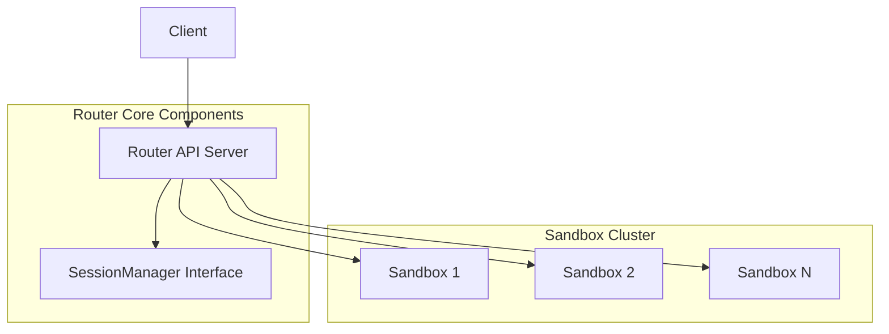
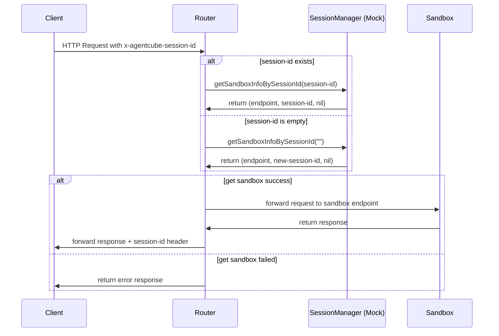
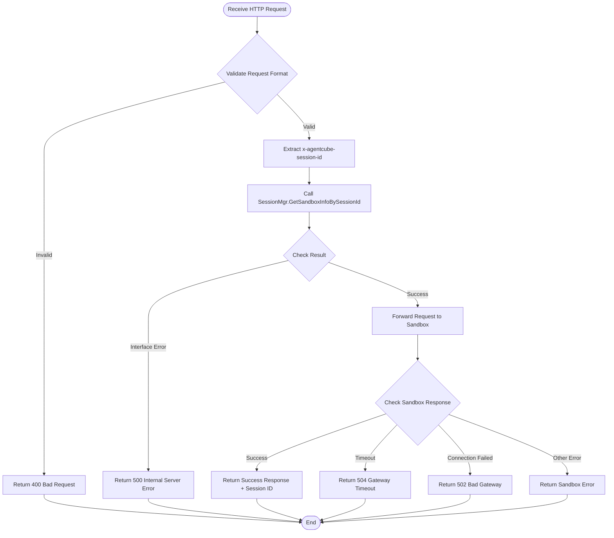
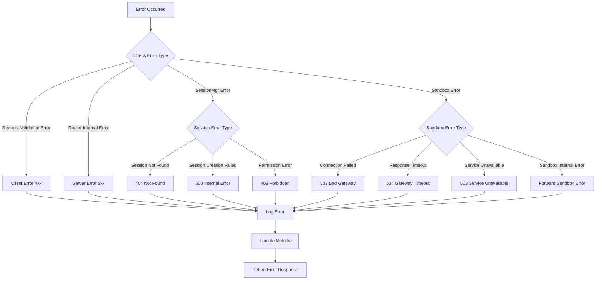
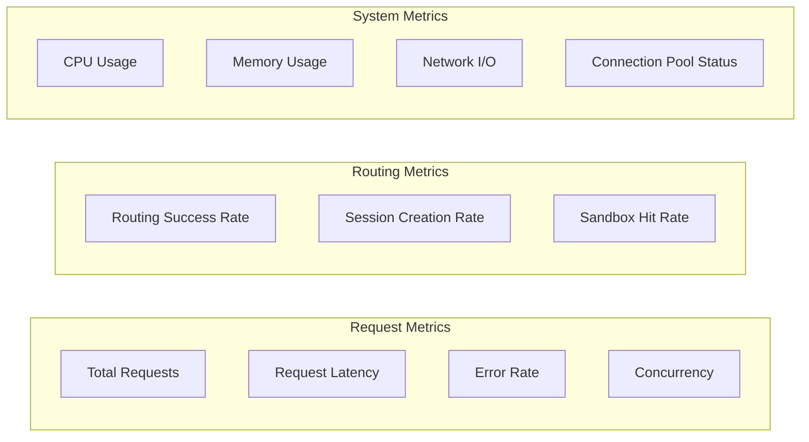
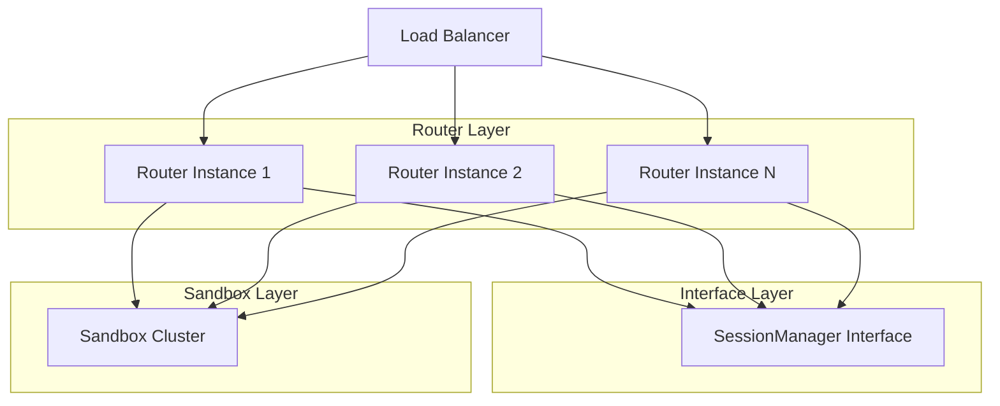

# Router Submodule Design Document

## 1. Overview

Router apiserver is responsible for receiving user HTTP requests and forwarding them to the corresponding Sandbox. Router focuses on high-performance request routing, while session and sandbox management is handled by SessionManager.

## 2. Architecture Design

### 2.1 Overall Architecture Flow



### 2.2 Request Routing Flow



## 3. Detailed Design

### 3.1 SessionManager Interface Definition

Router obtains Sandbox information through the SessionManager interface, which can be implemented with Mock:

```go
type SessionManager interface {
    // Get sandbox information based on session-id
    // When sessionId is empty, create a new session
    GetSandboxInfoBySessionId(sessionId string) (endpoint string, newSessionId string, err error)
}

// Mock implementation example
type MockSessionManager struct {
    sandboxEndpoints []string
    currentIndex     int
}

func (m *MockSessionManager) GetSandboxInfoBySessionId(sessionId string) (string, string, error) {
    if sessionId == "" {
        sessionId = generateNewSessionId()
    }
    
    // Simple round-robin sandbox selection
    endpoint := m.sandboxEndpoints[m.currentIndex%len(m.sandboxEndpoints)]
    m.currentIndex++
    
    return endpoint, sessionId, nil
}
```

### 3.2 Supported Request Types

Uses Gin framework to provide HTTP Server services, handling two types of requests:

1. **Agent Invoke Requests**
   ```
   <frontend-url>:<frontend-port>/v1/namespaces/{agentNamespace}/agent-runtimes/{agentName}/invocations/<agent specific path>
   ```

2. **Code Interpreter Invoke Requests**
   ```
   <frontend-url>:<frontend-port>/v1/namespaces/{namespace}/code-interpreters/{name}/invocations/<code interpreter specific path>
   ```

### 3.3 Request Processing Flow



### 3.4 Core Requirements

1. **High-Performance Routing**: Fast routing to corresponding sandbox based on session-id
2. **Session Integration**: Seamless collaboration with SessionManager, supporting dynamic sandbox creation
3. **Long Connection Support**: Support for long-running requests such as code execution and file operations
4. **Simple Design**: Focus on core routing functionality, avoid over-engineering
5. **Graceful Shutdown**: Reference E2B's graceful shutdown process to ensure no request loss

### 3.5 Design Goals

- **High Performance**: Millisecond-level routing latency, support for high concurrency
- **High Availability**: Stateless design, support for horizontal scaling
- **Observability**: Complete monitoring, logging, and tracing system

## 4. HTTP Response Handling

### 4.1 Success Responses

| Status Code | Scenario | Response Headers | Response Body |
|-------------|----------|------------------|---------------|
| 200 OK | Request processed successfully | `x-agentcube-session-id: <session-id>` | Original response from Sandbox |
| 201 Created | Resource created successfully | `x-agentcube-session-id: <session-id>` | Created resource information |
| 202 Accepted | Async request accepted | `x-agentcube-session-id: <session-id>` | Task status information |

### 4.2 Client Error Responses

| Status Code | Scenario | Response Body Example |
|-------------|----------|----------------------|
| 400 Bad Request | Invalid request format, invalid parameters | `{"error": "invalid request format", "code": "INVALID_REQUEST"}` |
| 401 Unauthorized | Authentication failed | `{"error": "authentication required", "code": "AUTH_REQUIRED"}` |
| 403 Forbidden | Insufficient permissions | `{"error": "insufficient permissions", "code": "PERMISSION_DENIED"}` |
| 404 Not Found | Session or resource not found | `{"error": "session not found", "code": "SESSION_NOT_FOUND"}` |
| 409 Conflict | Resource conflict | `{"error": "resource conflict", "code": "RESOURCE_CONFLICT"}` |
| 429 Too Many Requests | Rate limit exceeded | `{"error": "rate limit exceeded", "code": "RATE_LIMIT_EXCEEDED"}` |

### 4.3 Server Error Responses

| Status Code | Scenario | Response Body Example |
|-------------|----------|----------------------|
| 500 Internal Server Error | Router internal error | `{"error": "internal server error", "code": "INTERNAL_ERROR"}` |
| 502 Bad Gateway | Sandbox connection failed | `{"error": "sandbox unreachable", "code": "SANDBOX_UNREACHABLE"}` |
| 503 Service Unavailable | Sandbox unavailable or overloaded | `{"error": "sandbox unavailable", "code": "SANDBOX_UNAVAILABLE"}` |
| 504 Gateway Timeout | Sandbox response timeout | `{"error": "sandbox timeout", "code": "SANDBOX_TIMEOUT"}` |

### 4.4 Error Handling Flow



## 5. Performance and Monitoring

### 5.1 Performance Metrics

- **Routing Latency**: Target < 5ms (P99)
- **Throughput**: Target > 10,000 RPS
- **Concurrent Connections**: Support > 50,000 concurrent connections
- **Memory Usage**: < 1GB (steady state)

### 5.2 Monitoring Metrics



### 5.3 Logging

- **Access Logs**: Record all HTTP requests
- **Error Logs**: Record all errors and exceptions
- **Performance Logs**: Record key performance metrics
- **Audit Logs**: Record important operations and state changes

## 6. Deployment and Operations

### 6.1 Deployment Architecture



### 6.2 Configuration Management

- **Environment Configuration**: Support for multi-environment configuration (dev/staging/prod)
- **Dynamic Configuration**: Support for runtime configuration updates
- **Configuration Validation**: Validate configuration integrity at startup

### 6.3 Health Checks

- **Liveness Check**: `/health/live`
- **Readiness Check**: `/health/ready`
- **Dependency Check**: Verify connectivity to SessionManager and Sandbox
