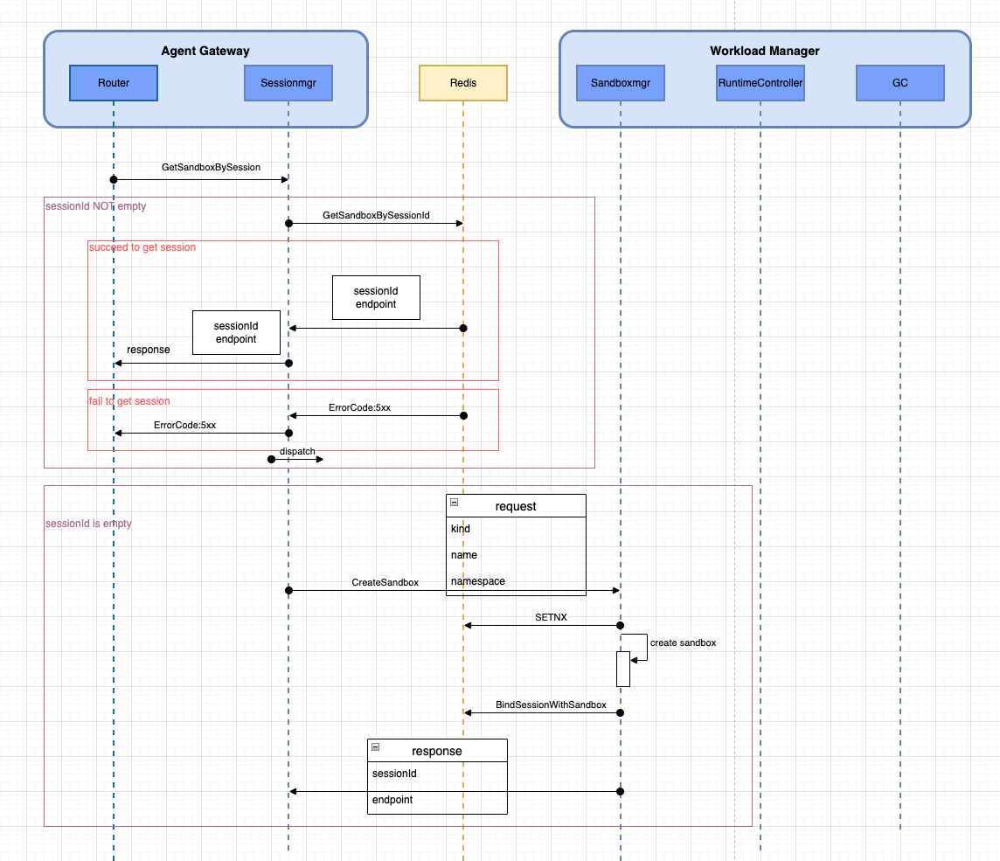

Here’s an English version you can drop straight into your repo as a design doc (Markdown-ready).

---

# Session Manager Design

## 1. Background & Responsibilities

### 1.1 Scenario

The upstream layer (public API gateway / UI) only knows an optional `sessionID`.

When the Router receives a request, the **only** internal entrypoint it calls is:

```go
sessionMgr.GetSandboxBySession(...)
```

The Router and `sessionMgr` run in the same process and talk via function calls.

`sessionMgr` must:

* If `sessionID` is **non-empty**:
  Look up `sessionID` → `Sandbox` → `endpoint` from Redis.
* If `sessionID` is **empty**:
  Create a new sandbox and return the newly created `sessionID` and `endpoint`.

### 1.2 Component Responsibilities

#### Router

* Pass through the upstream `sessionID` (may be empty) and agent metadata (`kind` / `name` / `namespace`, etc.).
* Call `sessionMgr.GetSandboxBySession` and use the returned `endpoint` to forward subsequent traffic.

#### sessionMgr

* Expose a single interface to the Router: `GetSandboxBySession`.
* Decide whether the `sessionID` is empty or not:

    * **Non-empty**:

        * Read Redis only, via `redisClient.GetSandboxBySessionID`, to fetch the `Sandbox`.
    * **Empty**:

        * Call `sandboxMgr` via HTTP API to create a new sandbox.
* Does **not** write to Redis and does **not** manage TTL / locks; it is **read-only** on Redis.
* Normalize and wrap errors so Router can map them to appropriate HTTP `4xx` / `5xx` responses.

#### sandboxMgr

* Expose an HTTP API to `sessionMgr` to create sandboxes.
* Responsibilities:

    * Create the sandbox (via `RuntimeController`, etc.).
    * Write the `sessionID` → `sandbox` mapping to Redis using:

        * `SetSessionLockIfAbsent`
        * `BindSessionWithSandbox`
        * `DeleteSessionBySandboxIDTx`
    * Return both `sessionID` and sandbox data back to `sessionMgr`.

#### Redis

* Store the `sessionID -> Sandbox` mapping with TTL.
* Provide a Redis client. In this design, `sessionMgr` uses Redis only through `GetSandboxBySessionID`.

### 1.3 Sequence Diagram



---

## 2. API Design

### 2.1 Router ➜ sessionMgr

```go
// Interface exposed to the Router.
type Manager interface {
    GetSandboxBySession(ctx context.Context, req *GetSandboxBySessionRequest) (*GetSandboxBySessionResponse, error)
}

// Request from Router.
type GetSandboxBySessionRequest struct {
    // SessionID passed from upstream; may be empty.
    SessionID string

    // Metadata used when a new sandbox needs to be created.
    Kind      string // agent type, e.g. "code-interpreter"
    Name      string // logical agent or business name, used for logging and sandbox naming
    Namespace string // k8s namespace / business namespace

    // Optional extension fields: tenant/user/resource/model/etc.
    // TenantID string
    // ...
}

// Response to Router.
type GetSandboxBySessionResponse struct {
    SessionID string // always non-empty; if the original SessionID was empty, this is the newly created one
    Endpoint  string // sandbox endpoint (e.g. "http://ip:port" or a gRPC address)
}
```

**Notes:**

* When `SessionID` is **empty**, `response.SessionID` is a **new** session ID; the Router must carry it in subsequent requests.
* When `SessionID` is **non-empty**, if the session exists, `sessionMgr` returns the **same** `SessionID` and its corresponding `Endpoint`.

### 2.2 sessionMgr ➜ Redis

`sessionMgr` uses a **read-only** subset of the Redis client:

```go
type RedisClient interface {
    GetSandboxBySessionID(ctx context.Context, sessionID string) (*Sandbox, error)
}

// Sandbox structure stored in Redis (recommended to be defined in a shared module).
type Sandbox struct {
    ID       string // sandboxID
    Endpoint string // actual endpoint to send traffic to
    // additional metadata...
}
```

**Error contract (recommended):**

* `GetSandboxBySessionID` finds a record:
  `(*Sandbox, nil)`
* Not found:
  `(nil, ErrSessionNotFound)` — this should be a wrapped, domain-level error, not a raw Redis driver error.
* Other Redis errors:
  `(nil, error)`.

### 2.3 sessionMgr ➜ sandboxMgr (HTTP API)

We recommend a simple REST API for creating sandboxes.

* **URL**: `POST /v1/sandboxes`
* **Request body (JSON)**:

```jsonc
{
  "kind": "code-interpreter",
  "name": "agent-session",       // optional
  "namespace": "agent-runtime"   // required
  // "tenant_id": "...",
  // "resource": {...}
}
```

> Note: `sessionID` is **not** included here. `sandboxMgr` generates a new session + sandbox and is responsible for writing them to Redis.

* **Response body (JSON)**:

```jsonc
{
  "session_id": "xxxx-xxxx",
  "sandbox": {
    "id": "sandbox-123",
    "endpoint": "http://10.0.0.1:8080"
  }
}
```

* **Go types**:

```go
type CreateSandboxRequest struct {
    Kind      string `json:"kind"`
    Name      string `json:"name,omitempty"`
    Namespace string `json:"namespace"`
}

type CreateSandboxResponse struct {
    SessionID string   `json:"session_id"`
    Sandbox   *Sandbox `json:"sandbox"`
}
```

* **HTTP client interface inside sessionMgr**:

```go
type SandboxManagerClient interface {
    CreateSandbox(ctx context.Context, req *CreateSandboxRequest) (*CreateSandboxResponse, error)
}
```

---

## 3. Core Flow

### 3.1 Overall Flow (`GetSandboxBySession`)

```text
Router -> sessionMgr.GetSandboxBySession(req)
          |
          |-- if req.SessionID != "" --> "existing session" path
          |
          |-- else                   --> "create new sandbox" path
```

### 3.2 Non-empty sessionID Path

1. **Input validation**

    * Optionally validate the `SessionID` format (length / regex). If invalid, return a 4xx-style error (e.g. `ErrInvalidSessionID`).

2. **Lookup in Redis**

    * Call `redisClient.GetSandboxBySessionID(ctx, sessionID)`.

   Three possible outcomes:

    1. **Sandbox found**

       ```go
       GetSandboxBySessionResponse{
           SessionID: sessionID,
           Endpoint:  sb.Endpoint,
       }
       ```

    2. **Not found (`ErrSessionNotFound`)**

        * Indicates the session is expired or invalid.
        * Recommended handling:

            * Return a domain error `ErrSessionNotFound`.
            * Router maps this to an HTTP `4xx` (e.g. `404` / `410`).
            * Do **not** auto-recreate the sandbox here, because:

                * Writing Redis is the responsibility of `sandboxMgr`.
                * The “create new sandbox” logic is explicitly triggered only when `sessionID` is empty.

    3. **Redis connection or internal error**

        * Return `ErrInternal` (or wrap the underlying error) and let the Router map to HTTP `5xx`.

3. **Logging & Metrics**

    * Success:

        * `log.Info("get sandbox by session success", "sessionID", sid, "endpoint", ep)`
        * Counter: `sessionmgr_get_by_session_success_total`
    * Not found:

        * `log.Warn("session not found", "sessionID", sid)`
        * Counter: `sessionmgr_session_not_found_total`
    * Redis failure:

        * `log.Error("get sandbox by session failed", "sessionID", sid, "err", err)`
        * Counter: `sessionmgr_redis_error_total`
        * Histogram: `sessionmgr_get_by_session_latency_seconds` (for both success and failure)

### 3.3 Empty sessionID ➜ Create Sandbox Path

1. **Input validation**

    * Ensure `Kind` and `Namespace` are non-empty.
    * Optionally validate / truncate `Name` if it is overly long (this typically does not affect core functionality).

2. **Build sandbox creation request**

   ```go
   CreateSandboxRequest{
       Kind:      req.Kind,
       Name:      req.Name,
       Namespace: req.Namespace,
   }
   ```

3. **Call sandboxMgr HTTP API**

    * Attach a context timeout (e.g. 2–5 seconds; make it configurable).
    * Retry strategy (depends on idempotency; see §5.2):

        * If `sandboxMgr.CreateSandbox` is **idempotent** (recommended), you can safely retry on transient errors (network glitches, HTTP 5xx).
        * If idempotency is not guaranteed yet, avoid retries here and let callers handle retries at a higher level.

4. **sandboxMgr internals (high-level, to align protocol)**

    * Generate a new `sessionID`.
    * Use Redis to store the mapping:

        * `SetSessionLockIfAbsent(sessionID, ttl)`
          to avoid concurrent creation for the same session (for entirely new session IDs this is mostly a safeguard; it becomes more important when rebuilding mappings for existing sessions).
        * Create the sandbox (via k8s, etc.).
        * `BindSessionWithSandbox(sessionID, sb, ttl)`
          to write the session ↔ sandbox mapping.
    * Return `CreateSandboxResponse{SessionID, Sandbox}`.

5. **sessionMgr handling**

    * **On success**:

        * Extract `resp.SessionID` and `resp.Sandbox.Endpoint`.
        * Return:

          ```go
          GetSandboxBySessionResponse{
              SessionID: resp.SessionID,
              Endpoint:  resp.Sandbox.Endpoint,
          }
          ```

    * **Business errors from sandboxMgr** (e.g. insufficient resources):

        * Map to a domain error such as `ErrCreateSandboxFailed` and let Router map it to HTTP `5xx`.

    * **HTTP connectivity / timeout errors**:

        * Log the error.
        * Return `ErrUpstreamUnavailable` and let Router map it to HTTP `503`.

6. **Logging & Metrics**

    * Success:

        * Counter: `sessionmgr_create_sandbox_success_total`
    * Failure:

        * Counter: `sessionmgr_create_sandbox_error_total`
    * Latency:

        * Histogram: `sessionmgr_create_sandbox_latency_seconds`

---

## 4. Error Types & HTTP Mapping

Inside `sessionMgr`, define a set of domain errors:

```go
var (
    ErrInvalidSessionID     = errors.New("invalid sessionID")
    ErrSessionNotFound      = errors.New("session not found")
    ErrRedisInternal        = errors.New("redis internal error")
    ErrCreateSandboxFailed  = errors.New("create sandbox failed")
    ErrUpstreamUnavailable  = errors.New("sandbox manager unavailable")
)
```

Router maps these errors to HTTP status codes:

| Error                    | Suggested HTTP Status | Meaning                              |
| ------------------------ | --------------------- | ------------------------------------ |
| `ErrInvalidSessionID`    | 400                   | Invalid session ID format            |
| `ErrSessionNotFound`     | 404 / 410             | Session does not exist / has expired |
| `ErrRedisInternal`       | 500                   | Internal storage error               |
| `ErrCreateSandboxFailed` | 500                   | Failed to create sandbox             |
| `ErrUpstreamUnavailable` | 503                   | Upstream `sandboxMgr` unavailable    |
| `nil`                    | 200                   | Success                              |

In practice you may want a richer error type (e.g. with `Code` and `Message` fields) so Router can handle them uniformly.

---

## 5. Concurrency & Consistency

### 5.1 sessionMgr

* **Reading from Redis**
  Reads are side-effect-free; there is no consistency problem from concurrent reads.

* **Creating sandboxes**
  With the current design, “create sandbox” is triggered only when `sessionID` is empty. In that case, every call creates a **new** session, so there is no contention on a specific `sessionID`.

  If you introduce a requirement like “only one sandbox per user / conversation,” you have two options:

    1. Introduce an **application-level session ID** upstream and have `sessionMgr` acquire a lock before calling `sandboxMgr`.
    2. Push deduplication logic down into `sandboxMgr` using existing primitives like `SetSessionLockIfAbsent`.

### 5.2 Idempotency & Retries

`sessionMgr` does not hold any persistent state itself; it is effectively a stateless façade around Redis and `sandboxMgr`. Therefore, whether retries are safe mainly depends on the idempotency of `sandboxMgr.CreateSandbox`:

* If `sandboxMgr` uses a logical key such as `(tenantID, conversationID)` as an idempotency key, then even if `sessionMgr` retries multiple times, `sandboxMgr` can return the same `sessionID` and `sandbox`.
* In the current version, it is acceptable to define the behavior as:

    * `CreateSandbox` may create multiple sandboxes if network retries happen.
    * Given that the main workload is interactive, this is acceptable for now.

Later optimization can introduce explicit idempotency keys and/or distributed locks in `sandboxMgr` to avoid duplicate sandbox creation.

---

This captures the core responsibilities, APIs, and flows of `sessionMgr` in a form that should be understandable and reviewable by the open-source community.
